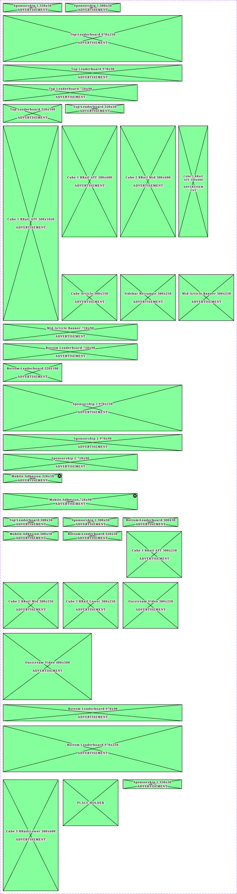

# Ad Blocks

> Ad slot placeholders, one variant per production ad unit and size. Each is a fixed-size green box with a 2px border, X diagonals and a centered "<unit> <size> / ADVERTISEMENT" label. In production the slot is a Google Publisher Tag container sized to the creative; the box only reserves the space in designs.



## Figma references

- File: [WordPress Elements](https://www.figma.com/design/b1iZxkFwtAYq9rElmnCAzd/) (`b1iZxkFwtAYq9rElmnCAzd`), page **Ads and Sponsored**
- Component set: [`517:4304`](https://www.figma.com/design/b1iZxkFwtAYq9rElmnCAzd/?node-id=517-4304), key `5da625d2f68424f0047851c324cef05324a2964c`
- Base drawing (not a component): "Advertizment Template" frame [`496:7892`](https://www.figma.com/design/b1iZxkFwtAYq9rElmnCAzd/?node-id=496-7892), 720×320, "built to resize based on enclosing container".
- RevContent (`506:3865`, same page) is **not** in this export.

## Properties

| Property | Type | Default | Options |
|---|---|---|---|
| Device | VARIANT | All | Desktop, Mobile, All |
| Name | VARIANT | Sponsorship 1 320x50 | 37 values (see table below) |

## Ad units

One row per variant, grouped by unit. Breakpoints come from real template instances (homepage templates and the Masthead / TOP ZONE / Upcoming Events variants the ad sits in). Production slot names come from the template layer names and the Ads page labels.

| Unit | Size | Device | Production slot | Breakpoints | Where it is used | Figma node | Key | Preview |
|---|---|---|---|---|---|---|---|---|
| Sponsorship 1 | 320×50 | All | sponsorship_1 | 1100, 1280 | in Masthead / Device=XL-Desktop (≥1040px), State=Default, Page=SectionFront ×1<br>in Masthead / Device=XL-Desktop (≥1040px), State=Default, Page=Obituaries ×1<br>in Masthead / Device=XL-Desktop (≥1040px), State=Default, Page=Article ×1<br>in Masthead / Device=XL-Desktop (≥1040px), State=Default, Page=Home ×1 | [`526:8814`](https://www.figma.com/design/b1iZxkFwtAYq9rElmnCAzd/?node-id=526-8814) | `3982391c9218…` | [png](previews/ad-blocks--all-sponsorship-1-320x50.png) |
| Sponsorship 1 | 300×50 | All | sponsorship_1 | 340, 360, 768, 1024, 1100, 1280 | in ObitMastHead / Device=Desktop, View=Default, Subscriber=Standard, Page=SectionFront ×2<br>in Masthead / Device=MD-TabletV (640–799px), State=Default, Page=Obituaries ×2<br>in Masthead / Device=XS-Fold (≤639px · built 340px), State=AdFree, Page=Obituaries ×2<br>in ObitMastHead / Device=TabletH, View=Default, Subscriber=Standard, Page=SectionFront ×2<br>in Masthead / Device=LG-TabletH (800–1039px), State=AdFree, Page=Obituaries ×2<br>in Masthead / Device=SM-Mobile (≤639px · built 360px), State=Default, Page=Obituaries ×2<br>in Masthead / Device=LG-TabletH (800–1039px), State=Default, Page=Obituaries ×2<br>in Masthead / Device=XS-Fold (≤639px · built 340px), State=Default, Page=Obituaries ×2<br>in ObitMastHead / Device=Desktop, View=Default, Subscriber=Adfree, Page=SectionFront ×2<br>in Masthead / Device=XL-Desktop (≥1040px), State=AdFree, Page=Obituaries ×2<br>in Masthead / Device=SM-Mobile (≤639px · built 360px), State=AdFree, Page=Obituaries ×2<br>in ObitMastHead / Device=TabletH, View=Default, Subscriber=Adfree, Page=SectionFront ×2<br>in Masthead / Device=MD-TabletV (640–799px), State=AdFree, Page=Obituaries ×2<br>in Masthead / Device=XL-Desktop (≥1040px), State=Default, Page=Obituaries ×1<br>in ObitMastHead / Device=TabletV, View=Default, Subscriber=Standard, Page=SectionFront ×2 | [`526:8809`](https://www.figma.com/design/b1iZxkFwtAYq9rElmnCAzd/?node-id=526-8809) | `ef0320392ac0…` | [png](previews/ad-blocks--all-sponsorship-1-300x50.png) |
| Top Leaderboard | 970×250 | Desktop | top_leaderboard | 1024, 1100, 1280 | Section Front ▸ Section Front Template/Desktop ×1<br>Section Front ▸ Home Page Sections ×1<br>in Masthead / Device=XL-Desktop (≥1040px), State=Default, Page=Article ×1<br>in Masthead / Device=XL-Desktop (≥1040px), State=Default, Page=SectionFront ×1<br>in Masthead / Device=XL-Desktop (≥1040px), State=Default, Page=Home ×1<br>in Masthead / Device=LG-TabletH (800–1039px), State=Default, Page=Article ×1<br>in Masthead / Device=LG-TabletH (800–1039px), State=Default, Page=SectionFront ×1<br>in Masthead / Device=LG-TabletH (800–1039px), State=Default, Page=Home ×1 | [`517:4303`](https://www.figma.com/design/b1iZxkFwtAYq9rElmnCAzd/?node-id=517-4303) | `9610b12c42d7…` | [png](previews/ad-blocks--desktop-top-leaderboard-970x250.png) |
| Top Leaderboard | 970×90 | Desktop | top_leaderboard | — | **unused** | [`1207:17444`](https://www.figma.com/design/b1iZxkFwtAYq9rElmnCAzd/?node-id=1207-17444) | `891300c75aa9…` | [png](previews/ad-blocks--desktop-top-leaderboard-970x90.png) |
| Top Leaderboard | 728×90 | All | top_leaderboard | 768 | in Masthead / Device=MD-TabletV (640–799px), State=Default, Page=SectionFront ×1<br>in Masthead / Device=MD-TabletV (640–799px), State=Default, Page=Home ×1<br>in Masthead / Device=MD-TabletV (640–799px), State=Default, Page=Article ×1<br>Ads and Sponsored ▸ (page top level) ×1 | [`517:10300`](https://www.figma.com/design/b1iZxkFwtAYq9rElmnCAzd/?node-id=517-10300) | `e7923a2f1968…` | [png](previews/ad-blocks--all-top-leaderboard-728x90.png) |
| Top Leaderboard | 320×100 | Mobile | top_leaderboard | 340 | in Masthead / Device=XS-Fold (≤639px · built 340px), State=Default, Page=Home ×1<br>in Masthead / Device=XS-Fold (≤639px · built 340px), State=Default, Page=Article ×1<br>in Masthead / Device=XS-Fold (≤639px · built 340px), State=Default, Page=SectionFront ×1 | [`1216:17586`](https://www.figma.com/design/b1iZxkFwtAYq9rElmnCAzd/?node-id=1216-17586) | `b5182b886290…` | [png](previews/ad-blocks--mobile-top-leaderboard-320x100.png) |
| Top Leaderboard | 320×50 | Mobile | top_leaderboard | 360 | in Masthead / Device=SM-Mobile (≤639px · built 360px), State=Default, Page=SectionFront ×1<br>in Masthead / Device=SM-Mobile (≤639px · built 360px), State=Default, Page=Article ×1<br>in Masthead / Device=SM-Mobile (≤639px · built 360px), State=Default, Page=Home ×1 | [`517:10290`](https://www.figma.com/design/b1iZxkFwtAYq9rElmnCAzd/?node-id=517-10290) | `8f2c9c43afaf…` | [png](previews/ad-blocks--mobile-top-leaderboard-320x50.png) |
| Top Leaderboard | 300×50 | Mobile | top_leaderboard | — | **unused** | [`3536:36814`](https://www.figma.com/design/b1iZxkFwtAYq9rElmnCAzd/?node-id=3536-36814) | `c43ec403e9df…` | [png](previews/ad-blocks--mobile-top-leaderboard-300x50.png) |
| Sponsorship 2 | 970×250 | Desktop | sponsorship_2 (also sponsorship_3 / sponsorship_4) | 1024, 1100, 1280 | Homepage ▸ Desktop HomePage ×3<br>Homepage ▸ 1100 HomePage ×3<br>Homepage ▸ 1024 HomePage ×3 | [`530:2621`](https://www.figma.com/design/b1iZxkFwtAYq9rElmnCAzd/?node-id=530-2621) | `916ce5952bf7…` | [png](previews/ad-blocks--desktop-sponsorship-2-970x250.png) |
| Sponsorship 2 | 970×90 | Desktop | sponsorship_2 (also sponsorship_3 / sponsorship_4) | — | **unused** | [`530:2626`](https://www.figma.com/design/b1iZxkFwtAYq9rElmnCAzd/?node-id=530-2626) | `5908cbaef03e…` | [png](previews/ad-blocks--desktop-sponsorship-2-970x90.png) |
| Sponsorship 2 | 728×90 | All | sponsorship_2 (also sponsorship_3 / sponsorship_4) | 768 | Homepage ▸ 768 HomePage ×3 | [`530:2631`](https://www.figma.com/design/b1iZxkFwtAYq9rElmnCAzd/?node-id=530-2631) | `1b73ab6f8896…` | [png](previews/ad-blocks--all-sponsorship-2-728x90.png) |
| Sponsorship 2 | 320×50 | All | sponsorship_2 (also sponsorship_3 / sponsorship_4) | 340, 360 | Homepage ▸ Mobile HomePage ×3<br>Homepage ▸ 340 HomePage ×3 | [`3382:44806`](https://www.figma.com/design/b1iZxkFwtAYq9rElmnCAzd/?node-id=3382-44806) | `d24c5b8f9b46…` | [png](previews/ad-blocks--all-sponsorship-2-320x50.png) |
| Sponsorship 2 | 300×50 | Mobile | sponsorship_2 (also sponsorship_3 / sponsorship_4) | — | **unused** | [`3536:36819`](https://www.figma.com/design/b1iZxkFwtAYq9rElmnCAzd/?node-id=3536-36819) | `39945da5bb59…` | [png](previews/ad-blocks--mobile-sponsorship-2-300x50.png) |
| Cube 1 RRail ATF | 300×1050 | Desktop | cube1_rrail_atf | 1024, 1100, 1280 | in TOP ZONE Block / Device=1100 ×1<br>in TOP ZONE Block / Device=Desktop ×1<br>in TOP ZONE Block / Device=1024 ×1 | [`530:2611`](https://www.figma.com/design/b1iZxkFwtAYq9rElmnCAzd/?node-id=530-2611) | `c690f9dc8fd6…` | [png](previews/ad-blocks--desktop-cube-1-rrail-atf-300x1050.png) |
| Cube 1 RRail ATF | 300×600 | All | cube1_rrail_atf | — | Article Page ▸ Article Page Template/Desktop ×4 | [`527:2551`](https://www.figma.com/design/b1iZxkFwtAYq9rElmnCAzd/?node-id=527-2551) | `4a5355a17c3a…` | [png](previews/ad-blocks--all-cube-1-rrail-atf-300x600.png) |
| Cube 1 RRail ATF | 300×250 | All | cube1_rrail_atf | 340, 360, 768 | in TOP ZONE Block / Device=Tablet ×1<br>in TOP ZONE Block / Device=Mobile ×1 | [`3536:36839`](https://www.figma.com/design/b1iZxkFwtAYq9rElmnCAzd/?node-id=3536-36839) | `9955f49b4034…` | [png](previews/ad-blocks--all-cube-1-rrail-atf-300x250.png) |
| Cube 1 RRail ATF | 160×600 | All | cube1_rrail_atf | — | **unused** | [`530:2651`](https://www.figma.com/design/b1iZxkFwtAYq9rElmnCAzd/?node-id=530-2651) | `62c117b6a623…` | [png](previews/ad-blocks--all-cube-1-rrail-atf-160x600.png) |
| Cube 2 RRail Mid | 300×600 | Desktop | cube2_rrail_mid | 1024, 1100, 1280 | Section Front ▸ Home Page Sections ×2<br>Homepage ▸ Desktop HomePage ×1<br>Homepage ▸ 1024 HomePage ×1<br>Homepage ▸ 1100 HomePage ×1<br>Section Front ▸ Section Front Template/Desktop ×2<br>Section Front ▸ Section Front Templates ×1 | [`527:2400`](https://www.figma.com/design/b1iZxkFwtAYq9rElmnCAzd/?node-id=527-2400) | `477cd3854746…` | [png](previews/ad-blocks--desktop-cube-2-rrail-mid-300x600.png) |
| Cube 2 RRail Mid | 300×250 | All | cube2_rrail_mid | 340, 360, 768 | Homepage ▸ 768 HomePage ×1<br>Homepage ▸ Mobile HomePage ×1<br>Homepage ▸ 340 HomePage ×1 | [`3536:36844`](https://www.figma.com/design/b1iZxkFwtAYq9rElmnCAzd/?node-id=3536-36844) | `93c1592fd5bb…` | [png](previews/ad-blocks--all-cube-2-rrail-mid-300x250.png) |
| Cube 3 RRail Lower | 300×600 | All | cube3_rrail_lower | 1024, 1100, 1280 | Homepage ▸ Desktop HomePage ×1<br>Homepage ▸ 1024 HomePage ×1<br>Homepage ▸ 1100 HomePage ×1 | [`3382:44811`](https://www.figma.com/design/b1iZxkFwtAYq9rElmnCAzd/?node-id=3382-44811) | `a1e1d99a1062…` | [png](previews/ad-blocks--all-cube-3-rrail-lower-300x600.png) |
| Cube 3 RRail Lower | 300×250 | All | cube3_rrail_lower | 340, 360, 768 | Homepage ▸ 768 HomePage ×1<br>Homepage ▸ Mobile HomePage ×1<br>Homepage ▸ 340 HomePage ×1 | [`3536:36849`](https://www.figma.com/design/b1iZxkFwtAYq9rElmnCAzd/?node-id=3536-36849) | `886f54877eef…` | [png](previews/ad-blocks--all-cube-3-rrail-lower-300x250.png) |
| Cube Article | 300×250 | All | cube_article | — | **unused** | [`527:2495`](https://www.figma.com/design/b1iZxkFwtAYq9rElmnCAzd/?node-id=527-2495) | `0f353809c294…` | [png](previews/ad-blocks--all-cube-article-300x250.png) |
| Sidebar Rectangle | 300×250 | All | — (generic 300x250; also the CitySpark ad inside Upcoming Events) | 340, 360, 768, 1024, 1100, 1280 | Section Front ▸ Section Front Template/Desktop ×7<br>Section Front ▸ Home Page Sections ×2<br>in Upcoming Events Block / Device=Tablet ×1<br>in Upcoming Events Block / Device=Mobile ×1<br>in Upcoming Events Block / Device=1024 ×1<br>in Upcoming Events Block / Device=Desktop ×1<br>in Upcoming Events Block / Device=1100 ×1 | [`527:2405`](https://www.figma.com/design/b1iZxkFwtAYq9rElmnCAzd/?node-id=527-2405) | `4113d02b728c…` | [png](previews/ad-blocks--all-sidebar-rectangle-300x250.png) |
| Outstream Video | 480×360 | Desktop | outstream_video | — | **unused** | [`3536:36859`](https://www.figma.com/design/b1iZxkFwtAYq9rElmnCAzd/?node-id=3536-36859) | `efc348c0641c…` | [png](previews/ad-blocks--desktop-outstream-video-480x360.png) |
| Outstream Video | 300×250 | Mobile | outstream_video | — | **unused** | [`3536:36854`](https://www.figma.com/design/b1iZxkFwtAYq9rElmnCAzd/?node-id=3536-36854) | `8a40b11399e2…` | [png](previews/ad-blocks--mobile-outstream-video-300x250.png) |
| Mid-Article Banner | 728×90 | Desktop | — (no matching article slot found; see Status open item 8b) | — | Section Front ▸ Section Front Template/Desktop ×2<br>Section Front ▸ Home Page Sections ×2 | [`517:10324`](https://www.figma.com/design/b1iZxkFwtAYq9rElmnCAzd/?node-id=517-10324) | `9b533094430a…` | [png](previews/ad-blocks--desktop-mid-article-banner-728x90.png) |
| Mid-Article Banner | 300×250 | Mobile | — (no matching article slot found; see Status open item 8b) | — | **unused** | [`517:10329`](https://www.figma.com/design/b1iZxkFwtAYq9rElmnCAzd/?node-id=517-10329) | `70d16b3f67f7…` | [png](previews/ad-blocks--mobile-mid-article-banner-300x250.png) |
| Bottom Leaderboard | 970×250 | Desktop | bottom_leaderboard | 1024, 1100, 1280 | Homepage ▸ Desktop HomePage ×1<br>Homepage ▸ 1100 HomePage ×1<br>Homepage ▸ 1024 HomePage ×1 | [`3536:36869`](https://www.figma.com/design/b1iZxkFwtAYq9rElmnCAzd/?node-id=3536-36869) | `2616656aca59…` | [png](previews/ad-blocks--desktop-bottom-leaderboard-970x250.png) |
| Bottom Leaderboard | 970×90 | Desktop | bottom_leaderboard | — | **unused** | [`3536:36864`](https://www.figma.com/design/b1iZxkFwtAYq9rElmnCAzd/?node-id=3536-36864) | `3adbf835ff0a…` | [png](previews/ad-blocks--desktop-bottom-leaderboard-970x90.png) |
| Bottom Leaderboard | 728×90 | Desktop | bottom_leaderboard | 768 | Homepage ▸ 768 HomePage ×1 | [`517:10337`](https://www.figma.com/design/b1iZxkFwtAYq9rElmnCAzd/?node-id=517-10337) | `b4876a8d968c…` | [png](previews/ad-blocks--desktop-bottom-leaderboard-728x90.png) |
| Bottom Leaderboard | 320×100 | Mobile | bottom_leaderboard | 340, 360 | Homepage ▸ Mobile HomePage ×1<br>Homepage ▸ 340 HomePage ×1 | [`517:10342`](https://www.figma.com/design/b1iZxkFwtAYq9rElmnCAzd/?node-id=517-10342) | `6a35aaefd588…` | [png](previews/ad-blocks--mobile-bottom-leaderboard-320x100.png) |
| Bottom Leaderboard | 320×50 | Mobile | bottom_leaderboard | — | **unused** | [`3536:36834`](https://www.figma.com/design/b1iZxkFwtAYq9rElmnCAzd/?node-id=3536-36834) | `9c83fea12f76…` | [png](previews/ad-blocks--mobile-bottom-leaderboard-320x50.png) |
| Bottom Leaderboard | 300×50 | Mobile | bottom_leaderboard | — | **unused** | [`3536:36824`](https://www.figma.com/design/b1iZxkFwtAYq9rElmnCAzd/?node-id=3536-36824) | `095f223fc8ef…` | [png](previews/ad-blocks--mobile-bottom-leaderboard-300x50.png) |
| Mobile Adhesion (with close ×) | 728×90 | All | mobile_adhesion (sticky, dismissible) | 768 | Homepage ▸ 768 HomePage ×1<br>Ads and Sponsored ▸ TEMP_PREVIEW ×1 | [`3434:55897`](https://www.figma.com/design/b1iZxkFwtAYq9rElmnCAzd/?node-id=3434-55897) | `0e08167131d0…` | [png](previews/ad-blocks--all-mobile-adhesion-728x90.png) |
| Mobile Adhesion (with close ×) | 320×50 | Mobile | mobile_adhesion (sticky, dismissible) | 340, 360 | Homepage ▸ Mobile HomePage ×1<br>Homepage ▸ 340 HomePage ×1 | [`3432:55710`](https://www.figma.com/design/b1iZxkFwtAYq9rElmnCAzd/?node-id=3432-55710) | `f76a77d2efef…` | [png](previews/ad-blocks--mobile-mobile-adhesion-320x50.png) |
| Mobile Adhesion | 300×50 | Mobile | mobile_adhesion (sticky, dismissible) | — | **unused** | [`3536:36829`](https://www.figma.com/design/b1iZxkFwtAYq9rElmnCAzd/?node-id=3536-36829) | `3f5c3c1ef0f3…` | [png](previews/ad-blocks--mobile-mobile-adhesion-300x50.png) |
| PLACE HOLDER | 300×250 | All | — (not an ad unit) | — | **unused** | [`3473:51691`](https://www.figma.com/design/b1iZxkFwtAYq9rElmnCAzd/?node-id=3473-51691) | `245a3d68f36b…` | [png](previews/ad-blocks--all-place-holder.png) |

## Breakpoints

| Key | Viewport | Homepage template | Ad units placed (homepage templates and nested components) |
|---|---|---|---|
| 340 | ≤639px (XS-Fold, built 340) | 340 HomePage | Sponsorship 1 300x50, Top Leaderboard 320x100, Sponsorship 2 320x50, Cube 1 RRail ATF 300x250, Cube 2 RRail Mid 300x250, Cube 3 RRail Lower 300x250, Sidebar Rectangle 300x250, Bottom Leaderboard 320x100, Mobile Adhesion 320x50 |
| 360 | ≤639px (SM-Mobile, built 360) | Mobile HomePage | Sponsorship 1 300x50, Top Leaderboard 320x50, Sponsorship 2 320x50, Cube 1 RRail ATF 300x250, Cube 2 RRail Mid 300x250, Cube 3 RRail Lower 300x250, Sidebar Rectangle 300x250, Bottom Leaderboard 320x100, Mobile Adhesion 320x50 |
| 768 | 640–799px (MD-TabletV) | 768 HomePage | Sponsorship 1 300x50, Top Leaderboard 728x90, Sponsorship 2 728x90, Cube 1 RRail ATF 300x250, Cube 2 RRail Mid 300x250, Cube 3 RRail Lower 300x250, Sidebar Rectangle 300x250, Bottom Leaderboard 728x90, Mobile Adhesion 728x90 |
| 1024 | 800–1039px (LG-TabletH, built 1009) | 1024 HomePage | Sponsorship 1 300x50, Top Leaderboard 970x250, Sponsorship 2 970x250, Cube 1 RRail ATF 300x1050, Cube 2 RRail Mid 300x600, Cube 3 RRail Lower 300x600, Sidebar Rectangle 300x250, Bottom Leaderboard 970x250 |
| 1100 | ≥1040px (XL-Desktop, built 1085) | 1100 HomePage | Sponsorship 1 320x50, Sponsorship 1 300x50, Top Leaderboard 970x250, Sponsorship 2 970x250, Cube 1 RRail ATF 300x1050, Cube 2 RRail Mid 300x600, Cube 3 RRail Lower 300x600, Sidebar Rectangle 300x250, Bottom Leaderboard 970x250 |
| 1280 | ≥1040px (XL-Desktop, built 1280) | Desktop HomePage | Sponsorship 1 320x50, Sponsorship 1 300x50, Top Leaderboard 970x250, Sponsorship 2 970x250, Cube 1 RRail ATF 300x1050, Cube 2 RRail Mid 300x600, Cube 3 RRail Lower 300x600, Sidebar Rectangle 300x250, Bottom Leaderboard 970x250 |

## Homepage slot map

From the homepage template layer names (each ad frame names its production slot and position).

| Breakpoint | Unit | Layer (slot and position) |
|---|---|---|
| 340 | Bottom Leaderboard 320x100 | Ad: Bottom Leaderboard 320x100 (bottom_leaderboard — after Upcoming Events) |
| 340 | Mobile Adhesion 320x50 | FullWidth Ad Frame (mobile_adhesion, 320x50) |
| 340 | Sponsorship 2 320x50 | Ad: Sponsorship 2 320x50 (sponsorship_2 — after TOP ZONE) |
| 340 | Sponsorship 2 320x50 | Ad: Sponsorship 2 320x50 (sponsorship_3 — after Cube 2) |
| 340 | Sponsorship 2 320x50 | Ad: Sponsorship 2 320x50 (sponsorship_4 — before Photos) |
| 360 | Bottom Leaderboard 320x100 | Ad: Bottom Leaderboard 320x100 (bottom_leaderboard — after Upcoming Events) |
| 360 | Mobile Adhesion 320x50 | FullWidth Ad Frame (mobile_adhesion, 320x50) |
| 360 | Sponsorship 2 320x50 | Ad: Sponsorship 2 320x50 (sponsorship_2 — after TOP ZONE) |
| 360 | Sponsorship 2 320x50 | Ad: Sponsorship 2 320x50 (sponsorship_3 — after Cube 2) |
| 360 | Sponsorship 2 320x50 | Ad: Sponsorship 2 320x50 (sponsorship_4 — before Photos) |
| 768 | Bottom Leaderboard 728x90 | Ad: Bottom Leaderboard 728x90 (bottom_leaderboard — after Upcoming Events) |
| 768 | Cube 2 RRail Mid 300x250 | Ad: Cube 2 RRail Mid 300x250 (cube2_rrail_mid — after Most Popular) |
| 768 | Cube 3 RRail Lower 300x250 | Ad: Cube 3 RRail Lower 300x250 (cube3_rrail_lower — after Photos) |
| 768 | Mobile Adhesion 728x90 | FullWidth Ad Frame (mobile_adhesion, 728x90) |
| 768 | Sponsorship 2 728x90 | Ad: Sponsorship 2 728x90 (sponsorship_2 — after TOP ZONE) |
| 768 | Sponsorship 2 728x90 | Ad: Sponsorship 2 728x90 (sponsorship_3 — after Cube 2) |
| 768 | Sponsorship 2 728x90 | Ad: Sponsorship 2 728x90 (sponsorship_4 — before Photos) |
| 1024 | Bottom Leaderboard 970x250 | Ad: Bottom Leaderboard 970x250 (bottom_leaderboard — after Business..Best Reviews stack) |
| 1024 | Cube 2 RRail Mid 300x600 | Blueconic (Most Popular) + Ad (NEW — 1024 landing-three-one, right after TOP ZONE) |
| 1024 | Cube 3 RRail Lower 300x600 | Photos + Ad (NEW — 1024 landing-three-one) |
| 1024 | Sponsorship 2 970x250 | Ad: Sponsorship 2 970x250 (sponsorship_2 — TOP ZONE trailing ad) |
| 1024 | Sponsorship 2 970x250 | Ad: Sponsorship 2 970x250 (sponsorship_3 — before Crime and Public Safety) |
| 1024 | Sponsorship 2 970x250 | Ad: Sponsorship 2 970x250 (sponsorship_4 — before Photos) |
| 1100 | Bottom Leaderboard 970x250 | Ad: Bottom Leaderboard 970x250 (bottom_leaderboard — after Business..Best Reviews stack) |
| 1100 | Cube 2 RRail Mid 300x600 | Most Popular + Ad (1100, Tier 4 — landing-three-one, 731/314 split) |
| 1100 | Sponsorship 2 970x250 | Ad: Sponsorship 2 970x250 (sponsorship_2 — TOP ZONE trailing ad) |
| 1100 | Sponsorship 2 970x250 | Ad: Sponsorship 2 970x250 (sponsorship_3 — before Crime and Public Safety) |
| 1100 | Sponsorship 2 970x250 | Ad: Sponsorship 2 970x250 (sponsorship_4 — before Photos) |
| 1280 | Bottom Leaderboard 970x250 | FullWidth Ad Frame (bottom_leaderboard, Bottom Leaderboard 970x250) |
| 1280 | Cube 2 RRail Mid 300x600 | Most Popular + Ad (1280 landing-three-one, right after sponsorship_2) |
| 1280 | Cube 3 RRail Lower 300x600 | Photos + Ad (1280 landing-three-one, right after sponsorship_4) |
| 1280 | Sponsorship 2 970x250 | FullWidth Ad Frame (sponsorship_2, 970x250) |
| 1280 | Sponsorship 2 970x250 | FullWidth Ad Frame (sponsorship_3, 970x250) |
| 1280 | Sponsorship 2 970x250 | FullWidth Ad Frame (sponsorship_4, 970x250) |

Also placed by components (not template layers): the Masthead carries Top Leaderboard at every width (970x250 at 1024 and up, 728x90 at 768, 320x50 at 360, 320x100 at 340) and Sponsorship 1 (320x50 in the XL-Desktop Masthead, 300x50 in the Obituaries mastheads and ObitMastHead); TOP ZONE Block carries the Cube 1 RRail ATF (300x1050 at 1024 / 1100 / 1280, 300x250 at Mobile / Tablet); Upcoming Events Block carries Sidebar Rectangle 300x250 (CitySpark).

## Responsive rules

- An ad slot never scales. Each width gets its own fixed-size unit; pick the variant listed for that breakpoint.
- Full-width slots (Top / Bottom Leaderboard, Sponsorship 2) step down 970×250 → 728×90 → 320×50 (or 320×100) as the viewport narrows; the 970×90 and 300×50 sizes are in the Ad Team's map for the same slots but aren't placed in any template yet.
- At 1024 / 1100 / 1280 the right-rail cubes are 300×600 (Cube 2 / 3) or 300×1050 (Cube 1, in TOP ZONE Block) inside a 384px ad column (`landing-three-one`). At 340 / 360 / 768 the same slots become 300×250.
- Mobile Adhesion is a sticky bottom overlay (320×50 at ≤639, 728×90 at 768) with a 20px close button 4px from the top-right corner. It's not in the page flow.
- Center the unit horizontally in its slot; the slot keeps the unit's height so the page doesn't jump when the creative loads.

## Anatomy

```
Ad Blocks / <variant>        COMPONENT  W×H, vertical auto-layout, gap 8, centered, clips content
├── Union                    BOOLEAN_OPERATION (UNION) of two full-size diagonal vectors → the X
│   ├── Vector 1             top-left → bottom-right, 2px stroke
│   └── Vector 2             top-right → bottom-left, 2px stroke
├── <Unit Size> ADVERTISEMENT TEXT  "<Unit Size>\n\nADVERTISEMENT" (short units: one line break)
└── (Mobile Adhesion 320x50 / 728x90 only)
    ├── Close Button BG      ELLIPSE 20×20 at top-right (x = W−24, y = 4)
    ├── X Line 1             LINE 14.1, rotated −45°, 2px white
    └── X Line 2             LINE 14.1, rotated 45°, 2px white
```

## Size & layout

| Property | Value |
|---|---|
| Size | fixed, exactly the IAB size in the variant name |
| Layout | vertical auto-layout, gap 8, padding 0, centered on both axes |
| Border | 2px inside, `color/gray/min` (#141414) |
| Corner radius | 0 |
| Clip content | yes |

## Typography

| Text | Font | Size | Weight | Line height | Letter spacing | Color | Type token |
|---|---|---|---|---|---|---|---|
| Label (all but 160×600) | Noto Serif | 16 | Bold | auto | 10% | `color/gray/min` #141414, 3px outside stroke `color/gray/600` #F1EFEB as a halo | `font/family/noto-serif`, `font/size/16`, `font/style/bold` |
| Label (Cube 1 RRail ATF 160x600) | Noto Serif | 14 | Bold | auto | 10% | same | `font/family/noto-serif`, `font/style/bold` (14 not bound) |

## Color & effects

| Use | Value | Token |
|---|---|---|
| Box fill | #85FF9B | — (placeholder green, unbound) |
| Border, X diagonals, label | #141414 | `color/gray/min` |
| Label halo | #F1EFEB | `color/gray/600` |
| Close button circle | #141414 | — (unbound) |
| Close button × | #FFFFFF | — (unbound) |

No effects.

## Production references

- Slot names: `sponsorship_1`, `sponsorship_2` / `_3` / `_4`, `top_leaderboard`, `bottom_leaderboard`, `mobile_adhesion`, `cube1_rrail_atf`, `cube2_rrail_mid`, `cube3_rrail_lower`, `cube_article`, `outstream_video`.
- Layout classes in the template layer names: `landing-three-one` (content + 384px ad column at ≥800px).
- Sizes per width were read live from OC Register's GPT setup at 360, 768, 1024 and 1280 (2026-10-02). Article-page units (outstream_video 480×360 / 300×250, cube_article 300×250) were seen on OC Register articles.

## Known issues

- 14 variants have no instances anywhere in WordPress Elements: Top Leaderboard 970x90, Top Leaderboard 300x50, Sponsorship 2 970x90, Sponsorship 2 300x50, Cube 1 RRail ATF 160x600, Cube Article 300x250, Outstream Video 480x360, Outstream Video 300x250, Mid-Article Banner 300x250, Bottom Leaderboard 970x90, Bottom Leaderboard 320x50, Bottom Leaderboard 300x50, Mobile Adhesion 300x50, PLACE HOLDER. The 300x50 / 970x90 sizes and Bottom Leaderboard 320x50 come from the Ad Team's map (added 2026-10-02) but aren't placed in any template; the article-page units (Cube Article, Outstream Video, Mid-Article Banner 300x250) wait for the article-page pass.
- `Device=All, Name=Mobile Adhesion 728x90`: its description was copied from Top Leaderboard 728x90 (talks about the top-of-page leaderboard). It should describe the sticky mobile_adhesion unit at 768.
- Mobile Adhesion variants without the close (×) button that the other adhesion variants have: Mobile Adhesion 300x50.
- `Device=All, Name=Cube 1 RRail ATF 160x600`: the label is 14px (not bound to a size token) instead of 16px, and still wraps mid-word ("ADVERTISEM / ENT") in the 160px box.
- The green fill (`#85FF9B`) is not bound to a variable, and neither are the close button's colors (`#141414` circle, `#FFFFFF` ×). The border, diagonals and label are bound to `color/gray/min`; the label halo to `color/gray/600`.
- `PLACE HOLDER` (300x250, Device=All) isn't an ad unit and has no instances; it's a generic stand-in.
- Device values are loose: some `Device=All` units only appear at one width (e.g. Sponsorship 1 320x50 only in the XL-Desktop Masthead), and `Top Leaderboard 970x250` (Device=Desktop) is also used in the LG-TabletH (1024) Masthead. Use the per-variant breakpoints below, not the Device value, to pick a unit.
- Ads and Sponsored page housekeeping (not part of the component): the size-label column next to the set (`Frame 11705`) still says "Footer Banner" and "Floating Anchor" (renamed Bottom Leaderboard / Mobile Adhesion on 2026-10-02) and has no labels for the 12 newer variants; a loose `Ad Blocks` instance (`3383:46993`) and a `TEMP_PREVIEW` frame sit on the page.
- `Mid-Article Banner` has no matching production slot (Status open item 8b); its only uses are in the Section Front templates.

## Rendering steps

1. Find the slot for the page and breakpoint in the tables above and take that variant's width and height.
2. Render a block-level container exactly that size (`ad-blocks.html` has one `<section>` per variant). In production, this is the GPT ad container; leave it empty and let the ad script fill it.
3. In mock-ups, draw the placeholder: green fill, 2px `color/gray/min` border, X diagonals and the centered label.
4. Mobile Adhesion: position it fixed to the bottom of the viewport, centered, with the close button.
