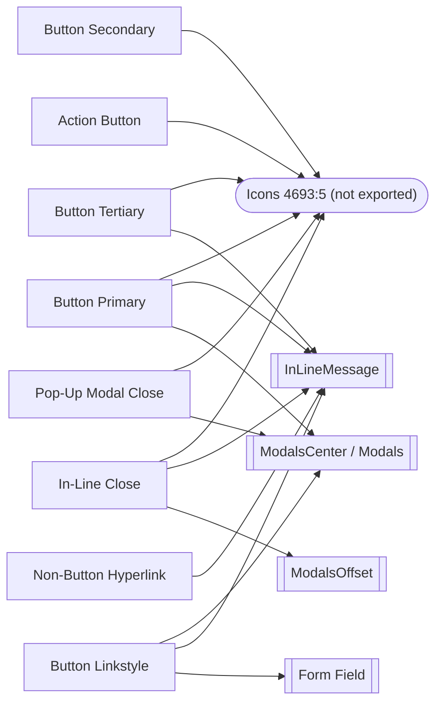

# Buttons and links: MNG Design System export

> **2026-10-02 Figma fixes (not yet re-exported).** Karl's review of the findings below was applied in Figma on 2026-10-02: CTA buttons are 40px tall (8px top/bottom padding, grows only when the label wraps), CTA icons are 16px, every focus ring is a bound `color/gray/black` frame drawn outside the button so it never changes the button's size, the In-Line Close ring has 4px corners and a 1px offset, and the sets and properties were renamed (see the Figma set name column). The per-component `.md`, `.json`, `.html` and PNG files still show the 2026-10-01 state until the next export.

**Updated 2026-10-01** to cover all 8 button and link families on the **Buttons | 2026.09.30** page. The earlier export (2026-09-24) covered only Primary, Secondary and Tertiary; this one replaces it.

This is a portable, AI-readable spec export from the **MNG Design System** Figma file (`jFHYqhZbJjvWQmDI4myCsd`), page [Buttons | 2026.09.30](https://www.figma.com/design/jFHYqhZbJjvWQmDI4myCsd/?node-id=1079-34282). It holds 8 component sets with 96 variants in total. Design (Figma) is the source of truth. Values here are design values, not production values.

## How an agent should use this folder

1. Read `index.json` first. It lists the 8 components in order, with paths to every file.
2. For context (description, the verbatim Figma spec text, where it's used, known issues), read the component's `.md`.
3. For exact data (hex and token per layer, sizes, per-variant layer trees, usage counts), read the `.json` twin (`schema: mng-design-system/component-spec@1`).
4. To see the structure rendered, open the `.html` skeleton. It has one `<section>` per variant and uses `tokens.css`. Compare it with the PNGs in `previews/`: one per variant at 2×, plus `<slug>--documentation.png`, the whole Figma documentation frame at 0.5×.
5. Always use the color **tokens** (`var(--color-theme-primary)` and so on), never the hex. Theme colors change per site.

## Components (build order)

| # | Component | Figma set name | Node | Variants | Breakpoints | Instances in file | Built from | Built into |
|---|---|---|---|---|---|---|---|---|
| 01 | [Button Primary](components/01-button-primary/button-primary.md) | Button Primary | `5328:15928` | 24 | Desktop, Mobile | 105 | Icons | InLineMessage, ModalsCenter, Modals |
| 02 | [Button Secondary](components/02-button-secondary/button-secondary.md) | Button Secondary | `5333:16013` | 24 | Desktop, Mobile | 4 | Icons | — |
| 03 | [Button Tertiary](components/03-button-tertiary/button-tertiary.md) | Button Tertiary | `5333:16089` | 24 | Desktop, Mobile | 18 | Icons | InLineMessage |
| 04 | [Action Button](components/04-action-button/action-button.md) | Action Button | `7075:6357` | 4 | single size | 4 | Icons | — |
| 05 | [Button Linkstyle](components/05-button-linkstyle/button-linkstyle.md) | Button Linkstyle | `5428:3953` | 8 | single size | 71 | — | Modals, ModalsCenter, InLineMessage, Form Field |
| 06 | [Pop-Up Modal Close](components/06-pop-up-modal-close/pop-up-modal-close.md) | Button Modal Close (was Button ModalClose) | `5335:16196` | 4 | single size | 26 | Icons | Modals, ModalsCenter |
| 07 | [In-Line Close](components/07-in-line-close/in-line-close.md) | Button In-Line Close (was Button PanelClose) | `5335:16200` | 4 | single size | 100 | Icons | InLineMessage, ModalsOffset |
| 08 | [Non-Button Hyperlink](components/08-non-button-hyperlink/non-button-hyperlink.md) | Hyperlink (was nonButton Hyperlink) | `6282:5568` | 4 | single size | 8 | — | InLineMessage |

All 8 are leaf components: none is built from another one in this export. The only dependency is the shared **Icons** set (`4693:5`), which isn't in this export. The icons used are `new-tab`, `content_copy` and `close`. Instance counts cover this file only. Library instances in WordPress Elements and Reader Dashboard v2.0 aren't counted.



## States (shared by all families)

Every family has the same four states, from the page's "Button Interactions" note:

- **Default:** resting appearance.
- **Hover:** pointer over the button. The fill or border changes to the family's hover token.
- **Pressed:** mouse down or tap. It's currently the same as Hover everywhere, because no pressed token exists yet.
- **InFocus:** keyboard focus. A focus ring is added around the Default look. The ring is 2px black on every family except Non-Button Hyperlink, which uses a teal ring.

## Breakpoints

Only the three CTA families (Primary, Secondary, Tertiary) have a `Breakpoint` property:

| Value | Viewport (export convention) | Behavior |
|---|---|---|
| Desktop | ≥640px (768, 1024, 1100 and 1280 templates) | The button hugs its label and icon. Gap in a row or stack is 16px. |
| Mobile | ≤639px (340 XS-Fold and 360 SM-Mobile templates) | The button fills the container with an 8px side margin. Stacked gap is 8px. |

The other five families are a single size at every viewport.

## Tokens summary

Every color is bound to one of **9 variables** (see `tokens.json` and `tokens.css`): `color/theme/primary` #007580, `primary-dark` #0A5962, `primary-light` #00838F, `color/gray/max` #FFFFFF, `gray/600` #F1EFEB, `gray/500` #CCCAC7, `gray/400` #A7A6A3, `gray/min` #141414 and `gray/black` #000000. Since 2026-10-02 there are no unbound colors (the Mobile InFocus rings on Secondary and Tertiary were the last ones).

Type: Noto Sans only. CTA buttons use Bold 16px Title Case. Action Button uses Bold 12px. Linkstyle uses Regular 16px. Hyperlink uses Regular 16.5px, which is off the scale.

## Notable findings

Resolved in Figma on 2026-10-02 (Karl's review):

- **Pop-Up Modal Close InFocus:** the design was right (InFocus keeps the Default gray fill and border); the spec text was wrong and now says so.
- **CTA heights:** Primary, Secondary and Tertiary are 40px in every state. Padding is 8px top/bottom (`spacing/100`) and 16px left/right (`spacing/200`), with a 40px min-height so a wrapped label can grow. Action Button (32px) and Linkstyle (38px) stay compact on purpose (Karl, 2026-10-02).
- **Icons:** 16px on Primary, Secondary, Tertiary and Action Button; 12px on Modal Close and In-Line Close.
- **Focus rings:** every ring is a `Focus Ring` frame, absolutely positioned 1px outside the element with a 2px outside stroke bound to `color/gray/black`. It never changes the component's size or pushes neighbours, so InFocus variants are now the same size as Default (Modal Close 32×32, Action Button 95×32, Linkstyle unchanged, CTAs 40px).
- **In-Line Close InFocus ring:** 4px corners (`radius/sm`, matching the Hover/Pressed box), 1px offset outside the 40px hit area.
- **Naming:** `Button ModalClose` → `Button Modal Close`, `Button PanelClose` → `Button In-Line Close`, `nonButton Hyperlink` → `Hyperlink`. All variant properties are capitalized (`State`, `Style`, `Icon`, `Breakpoint`), as are their values (`Default`, `Left`, `Right`, `Stacked`, `1 Row`). `Action Button` keeps its name so it doesn't collide with the separate `Button Action` set.

Still open:

- **Hyperlink** is 16.5px, has a teal focus ring and keeps a leftover dashed underline in InFocus. Figma already flags all three.
- **Low adoption:** most Hover, Pressed, InFocus, Mobile and icon variants appear only in their documentation frame, or nowhere. The stacked Linkstyle variants and the Action Button aren't used anywhere yet.
- **Fixed since the 2026-09-24 export:** the Button Tertiary InFocus grid swap, and the Desktop focus-ring bindings on Secondary and Tertiary.

Each component's `.md` has the full list under **Known issues**.

## Folder layout

```
mng-buttons-export/
  README.md  index.json  tokens.json  tokens.css
  components/
    01-button-primary/       button-primary.md  .json  .html  previews/ (24 variants + documentation)
    02-button-secondary/     … 24 variants
    03-button-tertiary/      … 24 variants
    04-action-button/        … 4 variants
    05-button-linkstyle/     … 8 variants
    06-pop-up-modal-close/   … 4 variants
    07-in-line-close/        … 4 variants
    08-non-button-hyperlink/ … 4 variants
```

## What was excluded

- **Page templates, image ratios and ad slots:** these don't apply to buttons. They're marked N/A in each component.
- **Accessibility and content rules:** these weren't requested. The focus-ring and contrast notes in the verbatim spec text are kept.
- **Production references:** Figma doesn't record any for these components. Production gaps belong in `production-vs-design-differences.md`.
- The page's older, unlabeled frames (the legacy `Button` sets `1390:379` and `5345:3224`, User Account, Social Buttons, Share API mockups and the screenshot board) aren't part of the 8 documented families.
