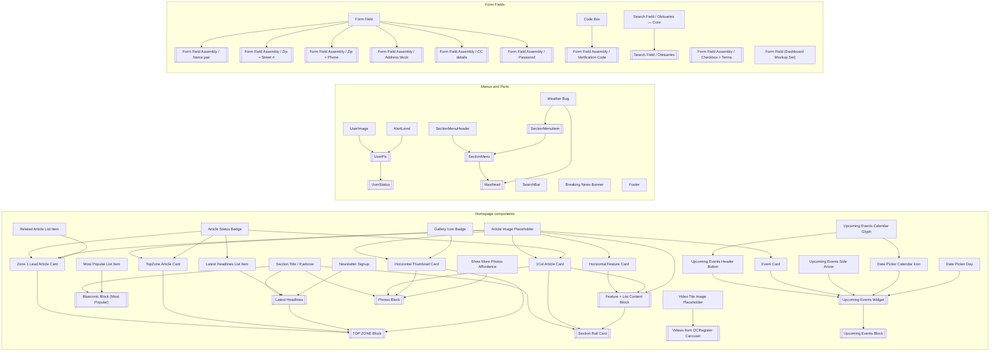

# MNG Design System — component spec export

Exported 2026-10-07 from Figma. 55 items (32 components, 23 assemblies, 370 variants). Page templates are not included; the homepage templates are used only as "where it is used" and breakpoint evidence.

Rebuild: run the calls in `scripts/design-system-export/extract.js` in Figma, then `python3 scripts/design-system-export/build-design-system-export.py <raw> <previews> figma-exports/mng-design-system-export`.

## Sources

- **Homepage components** — WordPress Elements ▸ Homepage ▸ Components (3334:42288)
- **Menus and Parts** — WordPress Elements ▸ Menus and Parts ▸ Push Nav Section Menu, Frame 12634 (Mastheads), Frame 12776 (User & Account Menus), Frame 12804 (Breaking News), Frame 12774 (Footer)
- **Form Fields** — MNG Design System ▸ Form Fields | 2026.09.24 (all components)

## How an agent should use this folder

1. Read `index.json` to find the item (by name, group or breakpoint). Items are numbered in build order: leaf components before the assemblies that contain them.
2. Open the item's `.md` for the human-readable spec, or its `.json` twin for exact values (`variants[].layerTree` holds the full Figma layer tree with sizes, auto-layout, fills, text styles, bound variables and instance references).
3. Start rendering from the `.html` skeleton, which already maps auto-layout to flexbox and colors to `tokens.css`. Replace each dashed `data-component` placeholder with the skeleton of the referenced component.
4. Pick variants per breakpoint using the breakpoint table below.
5. Check `Known issues` before trusting a value; compare with the preview PNGs.
6. Typography: the Type token column names the bound typography token group (for example `Editorial/Body/Excerpt`). Use those tokens rather than the raw values; Figma binds the `…/Style` token (font style) instead of `…/Weight`, and code uses the weight.

## Breakpoints

| Key | Viewport | Template | Bucket |
|---|---|---|---|
| 340 | ≤639px (XS-Fold, built 340) | 340 HomePage | XS-Fold |
| 360 | ≤639px (SM-Mobile, built 360) | Mobile HomePage | SM-Mobile |
| 768 | 640–799px (MD-TabletV) | 768 HomePage | MD-TabletV |
| 1024 | 800–1039px (LG-TabletH, built 1009) | 1024 HomePage | LG-TabletH |
| 1100 | ≥1040px (XL-Desktop, built 1085) | 1100 HomePage | XL-Desktop |
| 1280 | ≥1040px (XL-Desktop, built 1280) | Desktop HomePage | XL-Desktop |

Variant values map onto these keys as follows: `XS-Fold`/`FOLD` → 340, `SM-Mobile`/`Mobile` → 360 (and 340 when no Fold variant exists), `MD-TabletV`/`Tablet` → 768, `LG-TabletH`/`1024` → 1024, `XL-Desktop`/`Desktop` → 1100 and 1280. Form-field `Size=Mobile` → ≤639px and `Size=Desktop` → ≥640px. When a variant is placed in a homepage template, the template decides its breakpoints.

## Homepage components (30)

| # | Item | Kind | Variants | Breakpoints | Built from (in export) | Issues |
|---|---|---|---|---|---|---|
| 1 | [Article Status Badge](homepage/components/01-article-status-badge/article-status-badge.md) | component | 3 | 340, 360, 768, 1024, 1100, 1280 |  | 2 |
| 2 | [Related Article List Item](homepage/components/02-related-article-list-item/related-article-list-item.md) | component | 1 | 340, 360, 768, 1024, 1100, 1280 |  | 0 |
| 3 | [Article Image Placeholder](homepage/components/03-article-image-placeholder/article-image-placeholder.md) | component | 1 | 340, 360, 768, 1024, 1100, 1280 |  | 1 |
| 4 | [Zone 1 Lead Article Card](homepage/components/04-zone-1-lead-article-card/zone-1-lead-article-card.md) | component | 3 | 340, 360, 768, 1024, 1100, 1280 | Article Status Badge, Article Image Placeholder, Related Article List Item | 1 |
| 5 | [TopZone Article Card](homepage/components/05-topzone-article-card/topzone-article-card.md) | component | 4 | 340, 360, 1024, 1100, 1280 | Article Image Placeholder, Article Status Badge | 0 |
| 6 | [Section Title / Eyebrow](homepage/components/06-section-title-eyebrow/section-title-eyebrow.md) | component | 2 | 340, 360, 768, 1024, 1100, 1280 |  | 1 |
| 7 | [Latest Headlines List Item](homepage/components/07-latest-headlines-list-item/latest-headlines-list-item.md) | component | 3 | 340, 360, 768, 1024, 1100, 1280 | Article Status Badge | 0 |
| 8 | [Newsletter Signup](homepage/components/08-newsletter-signup/newsletter-signup.md) | component | 2 | 340, 360, 768, 1024, 1100, 1280 |  | 0 |
| 9 | [Latest Headlines](homepage/assemblies/09-latest-headlines/latest-headlines.md) | assembly | 3 | 340, 360, 768, 1024, 1100, 1280 | Section Title / Eyebrow, Latest Headlines List Item, Newsletter Signup | 1 |
| 10 | [Gallery Icon Badge](homepage/components/10-gallery-icon-badge/gallery-icon-badge.md) | component | 1 | 340, 360, 768, 1024, 1100, 1280 |  | 0 |
| 11 | [Horizontal Thumbnail Card](homepage/components/11-horizontal-thumbnail-card/horizontal-thumbnail-card.md) | component | 3 | 340, 360, 768, 1024, 1100, 1280 | Article Image Placeholder, Gallery Icon Badge | 2 |
| 12 | [TOP ZONE Block](homepage/assemblies/12-top-zone-block/top-zone-block.md) | assembly | 5 | 340, 360, 768, 1024, 1100, 1280 | Zone 1 Lead Article Card, TopZone Article Card, Latest Headlines, Horizontal Thumbnail Card | 0 |
| 13 | [Most Popular List Item](homepage/components/13-most-popular-list-item/most-popular-list-item.md) | component | 1 | 340, 360, 768, 1024, 1100, 1280 |  | 0 |
| 14 | [Blueconic Block (Most Popular)](homepage/assemblies/14-blueconic-block-most-popular/blueconic-block-most-popular.md) | assembly | 6 | 340, 360, 768, 1024, 1100, 1280 | Section Title / Eyebrow, Most Popular List Item | 2 |
| 15 | [Horizontal Feature Card](homepage/components/15-horizontal-feature-card/horizontal-feature-card.md) | component | 1 | 768, 1100, 1280 | Article Image Placeholder | 0 |
| 16 | [1Col Article Card](homepage/components/16-1col-article-card/1col-article-card.md) | component | 2 | 340, 360, 768, 1024, 1100, 1280 | Article Image Placeholder, Article Status Badge | 0 |
| 17 | [Feature + List Content Block](homepage/assemblies/17-feature-list-content-block/feature-list-content-block.md) | assembly | 2 | 768, 1024, 1100, 1280 | Horizontal Feature Card, 1Col Article Card, Article Image Placeholder | 0 |
| 18 | [Section Rail Card](homepage/assemblies/18-section-rail-card/section-rail-card.md) | assembly | 9 | 340, 360, 768, 1024, 1100, 1280 | Section Title / Eyebrow, 1Col Article Card, Feature + List Content Block | 0 |
| 19 | [Video Tile Image Placeholder](homepage/components/19-video-tile-image-placeholder/video-tile-image-placeholder.md) | component | 1 | 340, 360, 768, 1024, 1100, 1280 |  | 1 |
| 20 | [Videos from OCRegister Carousel](homepage/assemblies/20-videos-from-ocregister-carousel/videos-from-ocregister-carousel.md) | assembly | 2 | 340, 360, 768, 1024, 1100, 1280 | Video Tile Image Placeholder | 2 |
| 21 | [Show More Photos Affordance](homepage/components/21-show-more-photos-affordance/show-more-photos-affordance.md) | component | 1 | 340, 360, 768, 1024, 1100, 1280 |  | 0 |
| 22 | [Photos Block](homepage/assemblies/22-photos-block/photos-block.md) | assembly | 6 | 340, 360, 768, 1024, 1100, 1280 | Section Title / Eyebrow, 1Col Article Card, Horizontal Thumbnail Card, Show More Photos Affordance | 2 |
| 23 | [Event Card](homepage/components/23-event-card/event-card.md) | component | 1 | 340, 360, 768, 1024, 1100, 1280 | Article Image Placeholder | 1 |
| 24 | [Date Picker Day](homepage/components/24-date-picker-day/date-picker-day.md) | component | 1 | 340, 360, 768, 1024, 1100, 1280 |  | 1 |
| 25 | [Date Picker Calendar Icon](homepage/components/25-date-picker-calendar-icon/date-picker-calendar-icon.md) | component | 1 | 340, 360, 768, 1024, 1100, 1280 | Upcoming Events Calendar Glyph | 0 |
| 26 | [Upcoming Events Calendar Glyph](homepage/components/26-upcoming-events-calendar-glyph/upcoming-events-calendar-glyph.md) | component | 1 | 340, 360, 768, 1024, 1100, 1280 |  | 1 |
| 27 | [Upcoming Events Header Button](homepage/components/27-upcoming-events-header-button/upcoming-events-header-button.md) | component | 4 | 340, 360, 768, 1024, 1100, 1280 | Upcoming Events Calendar Glyph | 1 |
| 28 | [Upcoming Events Side Arrow](homepage/components/28-upcoming-events-side-arrow/upcoming-events-side-arrow.md) | component | 2 | 340, 360, 768, 1024, 1100, 1280 |  | 0 |
| 29 | [Upcoming Events Widget](homepage/assemblies/29-upcoming-events-widget/upcoming-events-widget.md) | assembly | 5 | 340, 360, 768, 1024, 1100, 1280 | Upcoming Events Header Button, Event Card, Upcoming Events Side Arrow, Date Picker Calendar Icon, Date Picker Day | 1 |
| 30 | [Upcoming Events Block](homepage/assemblies/30-upcoming-events-block/upcoming-events-block.md) | assembly | 5 | 340, 360, 768, 1024, 1100, 1280 | Upcoming Events Widget | 0 |

## Menus and Parts (12)

| # | Item | Kind | Variants | Breakpoints | Built from (in export) | Issues |
|---|---|---|---|---|---|---|
| 31 | [Weather Bug](menus-and-parts/components/31-weather-bug/weather-bug.md) | component | 2 | 1100, 1280 |  | 2 |
| 32 | [SectionMenuHeader](menus-and-parts/components/32-sectionmenuheader/sectionmenuheader.md) | component | 6 | 340, 360, 768, 1024, 1100, 1280 |  | 2 |
| 33 | [AlertLevel](menus-and-parts/components/33-alertlevel/alertlevel.md) | component | 8 |  |  | 1 |
| 34 | [UserImage](menus-and-parts/components/34-userimage/userimage.md) | component | 12 |  |  | 2 |
| 35 | [SearchBar](menus-and-parts/components/35-searchbar/searchbar.md) | component | 2 |  |  | 1 |
| 36 | [Breaking News Banner](menus-and-parts/components/36-breaking-news-banner/breaking-news-banner.md) | component | 3 | 340, 360, 768, 1024, 1100, 1280 |  | 0 |
| 37 | [Footer](menus-and-parts/components/37-footer/footer.md) | component | 5 | 340, 360, 768, 1024, 1100, 1280 |  | 0 |
| 38 | [SectionMenuItem](menus-and-parts/assemblies/38-sectionmenuitem/sectionmenuitem.md) | assembly | 9 |  | Weather Bug | 1 |
| 39 | [UserPic](menus-and-parts/assemblies/39-userpic/userpic.md) | assembly | 6 |  | UserImage, AlertLevel | 1 |
| 40 | [SectionMenu](menus-and-parts/assemblies/40-sectionmenu/sectionmenu.md) | assembly | 15 | 340, 360, 768, 1024, 1100, 1280 | SectionMenuHeader, SectionMenuItem | 3 |
| 41 | [UserStatus](menus-and-parts/assemblies/41-userstatus/userstatus.md) | assembly | 4 | 340, 360, 768, 1024, 1100, 1280 | UserPic | 3 |
| 42 | [Masthead](menus-and-parts/assemblies/42-masthead/masthead.md) | assembly | 75 | 340, 360, 768, 1024, 1100, 1280 | SectionMenu, Weather Bug | 1 |

## Form Fields (13)

| # | Item | Kind | Variants | Breakpoints | Built from (in export) | Issues |
|---|---|---|---|---|---|---|
| 43 | [Form Field](form-fields/components/43-form-field/form-field.md) | component | 10 | 340, 360, 768, 1024, 1100, 1280 |  | 1 |
| 44 | [Code Box](form-fields/components/44-code-box/code-box.md) | component | 10 | 340, 360, 768, 1024, 1100, 1280 |  | 1 |
| 45 | [Form Field Assembly / Checkbox + Terms](form-fields/assemblies/45-form-field-assembly-checkbox-terms/form-field-assembly-checkbox-terms.md) | assembly | 2 | 340, 360, 768, 1024, 1100, 1280 |  | 0 |
| 46 | [Search Field / Obituaries — Core](form-fields/components/46-search-field-obituaries-core/search-field-obituaries-core.md) | component | 1 |  |  | 0 |
| 47 | [Form Field (Dashboard Mockup Set)](form-fields/components/47-form-field-dashboard-mockup-set/form-field-dashboard-mockup-set.md) | component | 102 | 340, 360, 768, 1024, 1100, 1280 |  | 1 |
| 48 | [Form Field Assembly / Name pair](form-fields/assemblies/48-form-field-assembly-name-pair/form-field-assembly-name-pair.md) | assembly | 2 | 340, 360, 768, 1024, 1100, 1280 | Form Field | 1 |
| 49 | [Form Field Assembly / Zip + Street #](form-fields/assemblies/49-form-field-assembly-zip-street/form-field-assembly-zip-street.md) | assembly | 2 | 340, 360, 768, 1024, 1100, 1280 | Form Field | 1 |
| 50 | [Form Field Assembly / Zip + Phone](form-fields/assemblies/50-form-field-assembly-zip-phone/form-field-assembly-zip-phone.md) | assembly | 2 | 340, 360, 768, 1024, 1100, 1280 | Form Field | 1 |
| 51 | [Form Field Assembly / Address block](form-fields/assemblies/51-form-field-assembly-address-block/form-field-assembly-address-block.md) | assembly | 2 | 340, 360, 768, 1024, 1100, 1280 | Form Field | 1 |
| 52 | [Form Field Assembly / CC details](form-fields/assemblies/52-form-field-assembly-cc-details/form-field-assembly-cc-details.md) | assembly | 2 | 340, 360, 768, 1024, 1100, 1280 | Form Field | 0 |
| 53 | [Form Field Assembly / Password](form-fields/assemblies/53-form-field-assembly-password/form-field-assembly-password.md) | assembly | 2 | 340, 360, 768, 1024, 1100, 1280 | Form Field | 1 |
| 54 | [Form Field Assembly / Verification Code](form-fields/assemblies/54-form-field-assembly-verification-code/form-field-assembly-verification-code.md) | assembly | 2 | 340, 360, 768, 1024, 1100, 1280 | Code Box | 0 |
| 55 | [Search Field / Obituaries](form-fields/assemblies/55-search-field-obituaries/search-field-obituaries.md) | assembly | 2 | 340, 360, 768, 1024, 1100, 1280 | Search Field / Obituaries — Core | 1 |

## Dependency graph



Assemblies are drawn as `[[ ]]`. Arrows point from the building block to the item that contains it.

## Tokens

`tokens.css` defines 17 color variables bound in Figma (default theme: BoldCoastal); `tokens.json` also lists every theme's value for the theme-varying colors, every hex value in use, placeholder colors, all font/size/line-height combinations and the breakpoints.

| Variable | CSS | Hex | Varies by theme |
|---|---|---|---|
| Colors/color/feedback/high-error | --mng-feedback-high-error | #CC2B27 |  |
| Colors/color/feedback/low-success | --mng-feedback-low-success | #2E8000 |  |
| Colors/color/feedback/medium | --mng-feedback-medium | #856A00 |  |
| Colors/color/gray/100 | --mng-gray-100 | #393938 |  |
| Colors/color/gray/200 | --mng-gray-200 | #5E5D5C |  |
| Colors/color/gray/300 | --mng-gray-300 | #838280 |  |
| Colors/color/gray/400 | --mng-gray-400 | #A7A6A3 |  |
| Colors/color/gray/500 | --mng-gray-500 | #CCCAC7 |  |
| Colors/color/gray/600 | --mng-gray-600 | #F1EFEB |  |
| Colors/color/gray/black | --mng-gray-black | #000000 |  |
| Colors/color/gray/max | --mng-gray-max | #FFFFFF |  |
| Colors/color/gray/min | --mng-gray-min | #141414 |  |
| Colors/color/theme/near-black | --mng-theme-near-black | #0A0908 | yes (4 values) |
| Colors/color/theme/primary | --mng-theme-primary | #007580 | yes (17 values) |
| Colors/color/theme/primary-dark | --mng-theme-primary-dark | #0A5962 | yes (17 values) |
| Colors/color/theme/secondary | --mng-theme-secondary | #FFEA00 | yes (6 values) |
| Colors/color/tributes/primary | --mng-tributes-primary | #8D092D |  |

## Folder layout

```
README.md  index.json  tokens.json  tokens.css
<group>/components/NN-slug/   slug.md  slug.json  slug.html  previews/*.png
<group>/assemblies/NN-slug/   …same…
```

Groups: `homepage/`, `menus-and-parts/`, `form-fields/`.

## Not included

- Components on Menus and Parts outside the requested frames (AccountMenu in Frame 12695, Footer_w_signup in Frame 12775, the draft Logo, Event Card). They appear only as external references where other items use them.
- Components from other pages (Icons, Ad Blocks, Button Primary/Linkstyle, CheckBox, NavMenu, etc.). These are listed as "not in this export" dependencies.
- Page templates (components only). Template names such as "Desktop HomePage" still appear in each spec under Where it is used.
- Content rules and accessibility notes.
