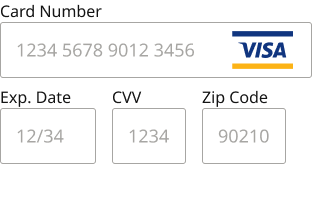
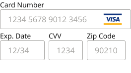

# Form Field Assembly / CC details

**Assembly · 2 variants** · Form Fields · source: MNG Design System ▸ Form Fields | 2026.09.24

**Designer notes on the canvas:**

- Card Number, Exp. Date, CVV and Zip Code are each auto-sized to fit their own label/value content rather than stretched to fill the row - Figma measures the actual rendered text, so each field always stays exactly as wide as it needs to be and re-measures itself if the label, placeholder, or font size ever changes. Currently: Desktop Card Number 211px, Exp. Date 80px, CVV 74px, Zip Code 84px. Mobile: Card Number 191px, Exp. Date 75px, CVV 69px, Zip Code 78px. Desktop: 16px gaps/spacing. Mobile: 8px gaps, 4px vertical spacing - see the smaller sample at left. Card Number's own error message spa

## Figma references

- File: MNG Design System (`jFHYqhZbJjvWQmDI4myCsd`) · Page: Form Fields | 2026.09.24 · Frame path: Form Field & Code Box — Documentation ▸ Frame 12911 ▸ Frame 12918 ▸ Assembly: CC details — Documentation ▸ Frame 11535 ▸ Frame 11522
- Main: [Form Field Assembly / CC details](https://www.figma.com/design/jFHYqhZbJjvWQmDI4myCsd/?node-id=7003-28816) · node `7003:28816` · key `b8f9b47fc2388d4c04fe6194aa2180c6fabdca84`

| Variant | Node | Key | Size | Preview |
|---|---|---|---|---|
| Size=Desktop | [7003:28778](https://www.figma.com/design/jFHYqhZbJjvWQmDI4myCsd/?node-id=7003-28778) | 979c2ad0b3f7e2f8e4fbe55a75153e3374c3f597 | 312×197 |  |
| Size=Mobile | [7003:28815](https://www.figma.com/design/jFHYqhZbJjvWQmDI4myCsd/?node-id=7003-28815) | c2de0b4a3bdb26a3b3c419c56823536db3c64300 | 264×148 |  |

## Properties

| Property | Type | Default | Options |
|---|---|---|---|
| Error message | TEXT | Error message text. |  |
| Show error | BOOLEAN | False |  |
| Show card number | BOOLEAN | True |  |
| Size | VARIANT | Desktop | Desktop, Mobile |

## Where it is used

- **Size=Desktop** — breakpoints: 768, 1024, 1100, 1280; nested inside: InLineMessage / Device=Desktop, Priority=none, Location=DashSubsCCupdate, PanelType=Panel ×1; other pages: In-Line Content Containers | 2026.01.02 ▸ Frame 8 ×1
- **Size=Mobile** — breakpoints: 340, 360; nested inside: InLineMessage / Device=Mobile, Priority=none, Location=DashSubscriptionCCinfo, PanelType=Panel ×1, InLineMessage / Device=FOLD, Priority=none, Location=DashSubscriptionCCinfo, PanelType=Panel ×1; other pages: In-Line Content Containers | 2026.01.02 ▸ Frame 8 ×2

## Breakpoints

| Key | Viewport | Variant(s) |
|---|---|---|
| 340 | ≤639px (XS-Fold, built 340) | Size=Mobile |
| 360 | ≤639px (SM-Mobile, built 360) | Size=Mobile |
| 768 | 640–799px (MD-TabletV) | Size=Desktop |
| 1024 | 800–1039px (LG-TabletH, built 1009) | Size=Desktop |
| 1100 | ≥1040px (XL-Desktop, built 1085) | Size=Desktop |
| 1280 | ≥1040px (XL-Desktop, built 1280) | Size=Desktop |

## Responsive rules

- Size=Desktop: 312×197, vertical gap 8 pad 0/0/0/0 main MIN cross MIN — renders at 768, 1024, 1100, 1280
- Size=Mobile: 264×148, vertical gap 4 pad 0/0/0/0 main MIN cross MIN — renders at 340, 360

## Dependencies

**Built from:**

- [Form Field](../../components/41-form-field-dashboard-mockup-set/form-field-dashboard-mockup-set.md) ×8

**Built into:**

- _no parent in this export_

## Anatomy

**Size=Desktop**

```
- Size=Desktop — component 312×197 [vertical gap 8] (hug/hug)
  - Form Field — instance 312×78 [vertical gap 0] (fixed/hug) → Form Field [Size=Desktop, State=Filled]
  - Fields — frame 286×78 [horizontal gap 16] (hug/hug)
    - Form Field — instance 96×78 [vertical gap 0] (fixed/hug) → Form Field [Size=Desktop, State=Filled]
    - Form Field — instance 74×78 [vertical gap 0] (fixed/hug) → Form Field [Size=Desktop, State=Filled]
    - Form Field — instance 84×78 [vertical gap 0] (fixed/hug) → Form Field [Size=Desktop, State=Filled]
  - Error Message Container (Shared) — frame 270×25 [horizontal gap 8] (fixed/fixed)
    - Error Message Text. — text 270×25 (fixed/fixed) "Error message text." (hidden)
```

**Size=Mobile**

```
- Size=Mobile — component 264×148 [vertical gap 4] (hug/hug)
  - Form Field — instance 264×59 [vertical gap 0] (fixed/hug) → Form Field [Size=Mobile, State=Blank]
  - Fields — frame 253×59 [horizontal gap 8] (hug/hug)
    - Form Field — instance 90×59 [vertical gap 0] (fixed/hug) → Form Field [Size=Mobile, State=Blank]
    - Form Field — instance 69×59 [vertical gap 0] (fixed/hug) → Form Field [Size=Mobile, State=Blank]
    - Form Field — instance 78×59 [vertical gap 0] (fixed/hug) → Form Field [Size=Mobile, State=Blank]
  - Error Message Container (Shared) — frame 238×22 [horizontal gap 8] (fixed/fixed)
    - Error Message Text. — text 238×22 (fixed/fixed) "Error message text." (hidden)
```

## Size & layout

| Variant | Size | Width | Height | Auto-layout | Radius | Clip |
|---|---|---|---|---|---|---|
| Size=Desktop | 312×197 | HUG | HUG | vertical gap 8 pad 0/0/0/0 main MIN cross MIN |  | yes |
| Size=Mobile | 264×148 | HUG | HUG | vertical gap 4 pad 0/0/0/0 main MIN cross MIN |  | yes |

## Typography

| Layer | Font | Weight | Size | Line height | Letter sp. | Case | Color | Token | Truncate | Sample |
|---|---|---|---|---|---|---|---|---|---|---|
| Error Message Text. | Noto Sans | Regular | 18 | auto |  |  | #CC2B27 | Colors/color/feedback/high-error |  | Error message text. |
| Error Message Text. | Noto Sans | Regular | 16 | auto |  |  | #CC2B27 | Colors/color/feedback/high-error |  | Error message text. |

## Color & effects

_None._

## Image ratios

_None._

## Ad slots

_None._

## Production references

_None found in descriptions or layer names._

## Known issues

_None detected._

## Rendering steps

1. Pick the variant for the target breakpoint from the Breakpoints table (property values in `form-field-assembly-cc-details.json` → `variants[].variantProperties`).
2. Start from `form-field-assembly-cc-details.html` — each `<section>` is one variant; auto-layout is already mapped to flexbox and colors use `tokens.css` variables.
3. Replace every dashed `data-component` box with the referenced component's own skeleton (links under Dependencies); leave `data-component` on the wrapper.
4. Fill image slots at the ratio listed in Image ratios; fill text using the Typography table (truncate where a line clamp is listed).
5. Check against the preview PNG, then against the production references.
