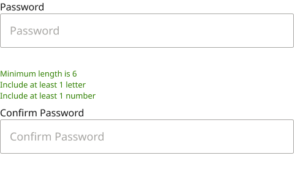
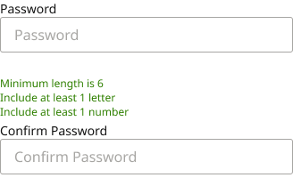

# Form Field Assembly / Password

**Assembly · 2 variants** · Form Fields · source: MNG Design System ▸ Form Fields | 2026.09.24

**Designer notes on the canvas:**

- Password as a full-width Form Field instance (Show icon = off), with all three requirements always visible below it as helper text - Minimum length is 6, Include at least 1 letter, Include at least 1 number - matching the copy and styling from the Create a Password flow: color/feedback/low-success (green), not the standard text color, since it reads as active guidance rather than a plain label. Followed by an optional Confirm Password instance built the same way. Password's own error message space is hidden, so the requirements list sits directly under the field with no reserved gap above it -

## Figma references

- File: MNG Design System (`jFHYqhZbJjvWQmDI4myCsd`) · Page: Form Fields | 2026.09.24 · Frame path: Form Field & Code Box — Documentation ▸ Frame 12911 ▸ Frame 12918 ▸ Assembly: Password — Documentation ▸ Frame 11535 ▸ Frame 11522 ▸ Assembly: Password
- Main: [Form Field Assembly / Password](https://www.figma.com/design/jFHYqhZbJjvWQmDI4myCsd/?node-id=7003-28940) · node `7003:28940` · key `718d7b5dad76274badeee4d3bb8ac0566a18c547`

| Variant | Node | Key | Size | Preview |
|---|---|---|---|---|
| Size=Desktop | [7003:28878](https://www.figma.com/design/jFHYqhZbJjvWQmDI4myCsd/?node-id=7003-28878) | 43436a92956e9e652733bb742b7dab16fd5b3ea7 | 480×276 |  |
| Size=Mobile | [7003:28939](https://www.figma.com/design/jFHYqhZbJjvWQmDI4myCsd/?node-id=7003-28939) | 36b42df3f7ed9203dd2334b08d90119e783e7a55 | 328×218 |  |

## Properties

| Property | Type | Default | Options |
|---|---|---|---|
| Hint | TEXT | Minimum length is 6 Include at least 1 letter Include at least 1 number |  |
| Show hint | BOOLEAN | True |  |
| Size | VARIANT | Desktop | Desktop, Mobile |

## Where it is used

- **Size=Desktop** — breakpoints: 768, 1024, 1100, 1280; no instances found
- **Size=Mobile** — breakpoints: 340, 360; no instances found

## Breakpoints

| Key | Viewport | Variant(s) |
|---|---|---|
| 340 | ≤639px (XS-Fold, built 340) | Size=Mobile |
| 360 | ≤639px (SM-Mobile, built 360) | Size=Mobile |
| 768 | 640–799px (MD-TabletV) | Size=Desktop |
| 1024 | 800–1039px (LG-TabletH, built 1009) | Size=Desktop |
| 1100 | ≥1040px (XL-Desktop, built 1085) | Size=Desktop |
| 1280 | ≥1040px (XL-Desktop, built 1280) | Size=Desktop |

## Responsive rules

- Size=Desktop: 480×276, vertical gap 8 pad 0/0/0/0 main MIN cross MIN — renders at 768, 1024, 1100, 1280
- Size=Mobile: 328×218, vertical gap 4 pad 0/0/0/0 main MIN cross MIN — renders at 340, 360

## Dependencies

**Built from:**

- [Form Field](../../components/41-form-field-dashboard-mockup-set/form-field-dashboard-mockup-set.md) ×4

**Built into:**

- _no parent in this export_

## Anatomy

**Size=Desktop**

```
- Size=Desktop — component 480×276 [vertical gap 8] (fixed/hug)
  - Form Field — instance 480×103 [vertical gap 0] (fill/hug) → Form Field [Size=Desktop, State=Filled]
  - Minimum length is 6 Include at least 1 letter Include at least 1 number — text 157×54 (hug/hug) "Minimum length is 6
Include at least 1 l"
  - Form Field — instance 480×103 [vertical gap 0] (fill/hug) → Form Field [Size=Desktop, State=Filled]
```

**Size=Mobile**

```
- Size=Mobile — component 328×218 [vertical gap 4] (fixed/hug)
  - Form Field — instance 328×81 [vertical gap 0] (fill/hug) → Form Field [Size=Mobile, State=Blank]
  - Minimum length is 6 Include at least 1 letter Include at least 1 number — text 328×48 (fixed/hug) "Minimum length is 6
Include at least 1 l"
  - Form Field — instance 328×81 [vertical gap 0] (fill/hug) → Form Field [Size=Mobile, State=Blank]
```

## Size & layout

| Variant | Size | Width | Height | Auto-layout | Radius | Clip |
|---|---|---|---|---|---|---|
| Size=Desktop | 480×276 | FIXED | HUG | vertical gap 8 pad 0/0/0/0 main MIN cross MIN |  | yes |
| Size=Mobile | 328×218 | FIXED | HUG | vertical gap 4 pad 0/0/0/0 main MIN cross MIN |  | yes |

## Typography

| Layer | Font | Weight | Size | Line height | Letter sp. | Case | Color | Token | Truncate | Sample |
|---|---|---|---|---|---|---|---|---|---|---|
| Minimum length is 6 Include at least 1 letter Include at least 1 number | Noto Sans | Regular | 13 | auto |  |  | #2E8000 | Colors/color/feedback/low-success |  | Minimum length is 6 Include at least 1 letter Incl |
| Minimum length is 6 Include at least 1 letter Include at least 1 number | Noto Sans | Regular | 12 | auto |  |  | #2E8000 | Colors/color/feedback/low-success |  | Minimum length is 6 Include at least 1 letter Incl |

## Color & effects

_None._

## Image ratios

_None._

## Ad slots

_None._

## Production references

_None found in descriptions or layer names._

## Known issues

- No variant has instances in MNG Design System (unused here, or used only from another file): `Size=Desktop`, `Size=Mobile`.

## Rendering steps

1. Pick the variant for the target breakpoint from the Breakpoints table (property values in `form-field-assembly-password.json` → `variants[].variantProperties`).
2. Start from `form-field-assembly-password.html` — each `<section>` is one variant; auto-layout is already mapped to flexbox and colors use `tokens.css` variables.
3. Replace every dashed `data-component` box with the referenced component's own skeleton (links under Dependencies); leave `data-component` on the wrapper.
4. Fill image slots at the ratio listed in Image ratios; fill text using the Typography table (truncate where a line clamp is listed).
5. Check against the preview PNG, then against the production references.
