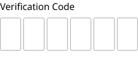
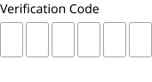

# Form Field Assembly / Verification Code

**Assembly · 2 variants** · Form Fields · source: MNG Design System ▸ Form Fields | 2026.09.24

## Figma references

- File: MNG Design System (`jFHYqhZbJjvWQmDI4myCsd`) · Page: Form Fields | 2026.09.24 · Frame path: Form Field & Code Box — Documentation ▸ Frame 12915 ▸ Frame 12939
- Main: [Form Field Assembly / Verification Code](https://www.figma.com/design/jFHYqhZbJjvWQmDI4myCsd/?node-id=7003-29223) · node `7003:29223` · key `7c0d7e73c63480ff2ecd5a4d2d360a7d470aaa3c`

| Variant | Node | Key | Size | Preview |
|---|---|---|---|---|
| Size=Desktop | [7003:29120](https://www.figma.com/design/jFHYqhZbJjvWQmDI4myCsd/?node-id=7003-29120) | 88238fb7858db54d5d7cd0f8a2fa691f290cc644 | 236×119 |  |
| Size=Mobile | [7003:29222](https://www.figma.com/design/jFHYqhZbJjvWQmDI4myCsd/?node-id=7003-29222) | 75cedc751ec83f3d0e138e00a5502364c335badd | 171×93 |  |

## Properties

| Property | Type | Default | Options |
|---|---|---|---|
| Error message | TEXT | Error message text. |  |
| Show error | BOOLEAN | False |  |
| Label | TEXT | Verification Code |  |
| Size | VARIANT | Desktop | Desktop, Mobile |

## Where it is used

- **Size=Desktop** — breakpoints: 768, 1024, 1100, 1280; other pages: Form Fields | 2026.09.24 ▸ Form Field & Code Box — Documentation ×1
- **Size=Mobile** — breakpoints: 340, 360; other pages: Form Fields | 2026.09.24 ▸ Form Field & Code Box — Documentation ×1

## Breakpoints

| Key | Viewport | Variant(s) |
|---|---|---|
| 340 | ≤639px (XS-Fold, built 340) | Size=Mobile |
| 360 | ≤639px (SM-Mobile, built 360) | Size=Mobile |
| 768 | 640–799px (MD-TabletV) | Size=Desktop |
| 1024 | 800–1039px (LG-TabletH, built 1009) | Size=Desktop |
| 1100 | ≥1040px (XL-Desktop, built 1085) | Size=Desktop |
| 1280 | ≥1040px (XL-Desktop, built 1280) | Size=Desktop |

## Responsive rules

- Size=Desktop: 236×119, vertical gap 8 pad 0/0/0/0 main MIN cross MIN — renders at 768, 1024, 1100, 1280
- Size=Mobile: 171×93, vertical gap 6 pad 0/0/0/0 main MIN cross MIN — renders at 340, 360

## Dependencies

**Built from:**

- [Code Box](../../components/38-code-box/code-box.md) ×12

**Built into:**

- _no parent in this export_

## Anatomy

**Size=Desktop**

```
- Size=Desktop — component 236×119 [vertical gap 8] (hug/hug)
  - Label — text 128×22 (hug/hug) "Verification Code"
  - Frame — frame 236×56 [horizontal gap 4] (hug/hug)
    - Code Box — instance 36×56 [horizontal gap 8] (fixed/fixed) → Code Box [Size=Desktop, State=Blank] ×6
  - Error Message Container (Shared) — frame 236×25 [horizontal gap 0] (fill/fixed)
    - Error message text. — text 165×25 (fixed/fixed) "Error message text." (hidden)
```

**Size=Mobile**

```
- Size=Mobile — component 171×93 [vertical gap 6] (hug/hug)
  - Label — text 112×19 (hug/hug) "Verification Code"
  - Frame — frame 171×40 [horizontal gap 3] (hug/hug)
    - Code Box — instance 26×40 [horizontal gap 8] (fixed/fixed) → Code Box [Size=Mobile, State=Blank] ×6
  - Error Message Container (Shared) — frame 171×22 [horizontal gap 0] (fill/fixed)
    - Error message text. — text 129×19 (fixed/fixed) "Error message text." (hidden)
```

## Size & layout

| Variant | Size | Width | Height | Auto-layout | Radius | Clip |
|---|---|---|---|---|---|---|
| Size=Desktop | 236×119 | HUG | HUG | vertical gap 8 pad 0/0/0/0 main MIN cross MIN |  | yes |
| Size=Mobile | 171×93 | HUG | HUG | vertical gap 6 pad 0/0/0/0 main MIN cross MIN |  | yes |

## Typography

| Layer | Font | Weight | Size | Line height | Letter sp. | Case | Color | Token | Truncate | Sample |
|---|---|---|---|---|---|---|---|---|---|---|
| Label | Noto Sans | Regular | 16 | auto |  |  | #000000 |  |  | Verification Code |
| Error message text. | Noto Sans | Regular | 18 | auto |  |  | #CC2B27 | Colors/color/feedback/high-error |  | Error message text. |
| Label | Noto Sans | Regular | 14 | auto |  |  | #000000 |  |  | Verification Code |
| Error message text. | Noto Sans | Regular | 14 | auto |  |  | #CC2B27 | Colors/color/feedback/high-error |  | Error message text. |

## Color & effects

_None._

## Image ratios

_None._

## Ad slots

_None._

## Production references

_None found in descriptions or layer names._

## Known issues

- 2 solid paints are hard-coded (not bound to a color variable): #000000 ×2.

## Rendering steps

1. Pick the variant for the target breakpoint from the Breakpoints table (property values in `form-field-assembly-verification-code.json` → `variants[].variantProperties`).
2. Start from `form-field-assembly-verification-code.html` — each `<section>` is one variant; auto-layout is already mapped to flexbox and colors use `tokens.css` variables.
3. Replace every dashed `data-component` box with the referenced component's own skeleton (links under Dependencies); leave `data-component` on the wrapper.
4. Fill image slots at the ratio listed in Image ratios; fill text using the Typography table (truncate where a line clamp is listed).
5. Check against the preview PNG, then against the production references.
