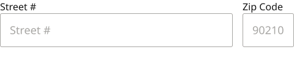
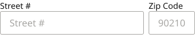

# Form Field Assembly / Zip + Street #

**Assembly · 2 variants** · Form Fields · source: MNG Design System ▸ Form Fields | 2026.09.24

## Figma references

- File: MNG Design System (`jFHYqhZbJjvWQmDI4myCsd`) · Page: Form Fields | 2026.09.24 · Frame path: Form Field & Code Box — Documentation ▸ Frame 12911 ▸ Frame 12918 ▸ Assembly: Zip + Street # — Documentation ▸ Frame 11535 ▸ Frame 11522
- Main: [Form Field Assembly / Zip + Street #](https://www.figma.com/design/jFHYqhZbJjvWQmDI4myCsd/?node-id=7003-28651) · node `7003:28651` · key `b78a5ebf98e6cf2407efa69e070dfe6338390e6c`

| Variant | Node | Key | Size | Preview |
|---|---|---|---|---|
| Size=Desktop | [7003:28643](https://www.figma.com/design/jFHYqhZbJjvWQmDI4myCsd/?node-id=7003-28643) | ab208f45668848d947f53467c37338a9aee11130 | 480×111 |  |
| Size=Mobile | [7003:28650](https://www.figma.com/design/jFHYqhZbJjvWQmDI4myCsd/?node-id=7003-28650) | dc94f8e026257c058c7dfd5eeebe2b670a2e677e | 328×87 |  |

## Properties

| Property | Type | Default | Options |
|---|---|---|---|
| Error message | TEXT | Error message text. |  |
| Show error | BOOLEAN | False |  |
| Size | VARIANT | Desktop | Desktop, Mobile |

## Where it is used

- **Size=Desktop** — breakpoints: 768, 1024, 1100, 1280; no instances in this file
- **Size=Mobile** — breakpoints: 340, 360; no instances in this file

## Breakpoints

| Key | Viewport | Variant(s) |
|---|---|---|
| 340 | ≤639px (XS-Fold, built 340) | Size=Mobile |
| 360 | ≤639px (SM-Mobile, built 360) | Size=Mobile |
| 768 | 640–799px (MD-TabletV) | Size=Desktop |
| 1024 | 800–1039px (LG-TabletH, built 1009) | Size=Desktop |
| 1100 | ≥1040px (XL-Desktop, built 1085) | Size=Desktop |
| 1280 | ≥1040px (XL-Desktop, built 1280) | Size=Desktop |

## Responsive rules

- Size=Desktop: 480×111, vertical gap 8 pad 0/0/0/0 main MIN cross MIN — renders at 768, 1024, 1100, 1280
- Size=Mobile: 328×87, vertical gap 6 pad 0/0/0/0 main MIN cross MIN — renders at 340, 360

## Dependencies

**Built from:**

- [Form Field](../../components/43-form-field/form-field.md) ×2

**Built into:**

_Not used inside another exported item._

## Anatomy

**Size=Desktop**

```
- Size=Desktop — component 480×111 [vertical gap 8] (fixed/hug)
  - Fields — frame 480×78 [horizontal gap 16] (fill/hug)
    - Form Field — instance 380×78 [vertical gap 0] (fill/hug) → Form Field [Size=Desktop, State=Blank]
    - Form Field — instance 84×78 [vertical gap 0] (fixed/hug) → Form Field [Size=Desktop, State=Blank]
  - Error Message Container (Shared) — frame 480×25 [horizontal gap 8] (fill/fixed)
    - Error Message Text. — text 480×25 (fixed/fixed) "Error message text." (hidden)
```

**Size=Mobile**

```
- Size=Mobile — component 328×87 [vertical gap 6] (fixed/hug)
  - Fields — frame 328×59 [horizontal gap 8] (fill/hug)
    - Form Field — instance 242×59 [vertical gap 0] (fill/hug) → Form Field [Size=Mobile, State=Blank]
    - Form Field — instance 78×59 [vertical gap 0] (fixed/hug) → Form Field [Size=Mobile, State=Blank]
  - Error Message Container (Shared) — frame 328×22 [horizontal gap 8] (fill/fixed)
    - Error Message Text. — text 328×22 (fixed/fixed) "Error message text." (hidden)
```

## Size & layout

| Variant | Size | Width | Height | Auto-layout | Radius | Clip |
|---|---|---|---|---|---|---|
| Size=Desktop | 480×111 | FIXED | HUG | vertical gap 8 pad 0/0/0/0 main MIN cross MIN |  | yes |
| Size=Mobile | 328×87 | FIXED | HUG | vertical gap 6 pad 0/0/0/0 main MIN cross MIN |  | yes |

## Typography

| Layer | Font | Weight | Size | Line height | Letter sp. | Case | Color | Color token | Type token | Truncate | Sample | Variants |
|---|---|---|---|---|---|---|---|---|---|---|---|---|
| Error Message Text. | Noto Sans | Regular | 18 | auto |  |  | #CC2B27 | Colors/color/feedback/high-error |  |  | Error message text. | Size=Desktop |
| Error Message Text. | Noto Sans | Regular | 16 | auto |  |  | #CC2B27 | Colors/color/feedback/high-error |  |  | Error message text. | Size=Mobile |

## Color & effects

_None._

## Image ratios

_None._

## Ad slots

_None._

## Production references

_None found in descriptions or layer names._

## Known issues

- No variant has instances in MNG Design System (unused here, or used only from another file): `Size=Desktop`, `Size=Mobile`.

## Rendering steps

1. Pick the variant for the target breakpoint from the Breakpoints table (property values in `form-field-assembly-zip-street.json` → `variants[].variantProperties`).
2. Start from `form-field-assembly-zip-street.html` — each `<section>` is one variant; auto-layout is already mapped to flexbox and colors use `tokens.css` variables.
3. Replace every dashed `data-component` box with the referenced component's own skeleton (links under Dependencies); leave `data-component` on the wrapper.
4. Fill image slots at the ratio listed in Image ratios; fill text using the Typography table (truncate where a line clamp is listed).
5. Check against the preview PNG, then against the production references.
