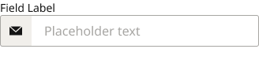
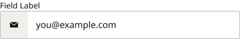
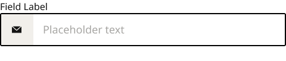
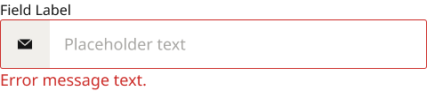
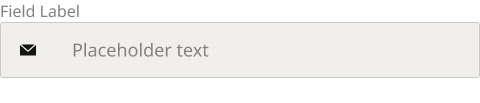
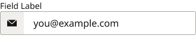
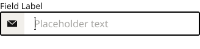
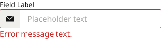
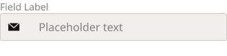

# Form Field

**Component · 10 variants** · Form Fields · source: MNG Design System ▸ Form Fields | 2026.09.24

## Figma references

- File: MNG Design System (`jFHYqhZbJjvWQmDI4myCsd`) · Page: Form Fields | 2026.09.24 · Frame path: Form Field & Code Box — Documentation ▸ Frame 12911 ▸ Frame 12921 ▸ Frame 12912 ▸ Grid Content
- Main: [Form Field](https://www.figma.com/design/jFHYqhZbJjvWQmDI4myCsd/?node-id=6963-6863) · node `6963:6863` · key `65f91c028cc42238d00387a53f812f839bf58969`

| Variant | Node | Key | Size | Preview |
|---|---|---|---|---|
| Size=Desktop, State=Filled | [6962:6663](https://www.figma.com/design/jFHYqhZbJjvWQmDI4myCsd/?node-id=6962-6663) | 4b5990303a23ea2dbcf9ce03ec9860ef909af825 | 480×103 |  |
| Size=Mobile, State=Blank | [6962:6683](https://www.figma.com/design/jFHYqhZbJjvWQmDI4myCsd/?node-id=6962-6683) | 3f929794d492ac59e2698f1f6f03f08d5f300068 | 328×81 |  |
| Size=Desktop, State=Filled | [6962:6703](https://www.figma.com/design/jFHYqhZbJjvWQmDI4myCsd/?node-id=6962-6703) | 8a8927f4d4463a69d882546400ca307c27705ecb | 480×103 |  |
| Size=Desktop, State=Focus | [6962:6723](https://www.figma.com/design/jFHYqhZbJjvWQmDI4myCsd/?node-id=6962-6723) | b45bfea1f5bf9d99f15502fd51b14ceb8cf8c627 | 480×103 |  |
| Size=Desktop, State=Error | [6962:6743](https://www.figma.com/design/jFHYqhZbJjvWQmDI4myCsd/?node-id=6962-6743) | e46f91b3b316cc72c63967053806eeaa2f5144e4 | 480×103 |  |
| Size=Desktop, State=Disabled | [6962:6763](https://www.figma.com/design/jFHYqhZbJjvWQmDI4myCsd/?node-id=6962-6763) | 4c0fc4c01733aad7f72b7ca91acce3bacd3a0734 | 480×103 |  |
| Size=Mobile, State=Filled | [6962:6783](https://www.figma.com/design/jFHYqhZbJjvWQmDI4myCsd/?node-id=6962-6783) | a89ba9126bbe06b3f4a3d99ed66f3b95b61f4aa3 | 328×81 |  |
| Size=Mobile, State=Focus | [6962:6803](https://www.figma.com/design/jFHYqhZbJjvWQmDI4myCsd/?node-id=6962-6803) | 56636632ef45874673c76e09eea94cc01e6a5745 | 328×81 |  |
| Size=Mobile, State=Error | [6962:6823](https://www.figma.com/design/jFHYqhZbJjvWQmDI4myCsd/?node-id=6962-6823) | 76af9db63642f84be162427e024f30a9def14f6e | 328×81 |  |
| Size=Mobile, State=Disabled | [6962:6843](https://www.figma.com/design/jFHYqhZbJjvWQmDI4myCsd/?node-id=6962-6843) | 65676bd9d43c396729700a25fd16b9b352c59bef | 328×81 |  |

## Properties

| Property | Type | Default | Options |
|---|---|---|---|
| Size | VARIANT |  | Desktop, Mobile |
| State | VARIANT |  | Filled, Blank, Focus, Error, Disabled |

## Where it is used

- **Size=Desktop, State=Filled** — breakpoints: 768, 1024, 1100, 1280; other pages: Form Fields | 2026.09.24 ▸ Form Field & Code Box — Documentation ×2
- **Size=Mobile, State=Blank** — breakpoints: 340, 360; nested inside: Form Field Assembly / Zip + Phone / Size=Mobile ×2, Form Field Assembly / Address block / Size=Mobile ×4, Form Field Assembly / Name pair / Size=Mobile ×2, Form Field Assembly / Password / Size=Mobile ×2, InLineMessage / Device=FOLD, Priority=none, Location=DashSMSSetUpMVP, PanelType=Panel ×1, InLineMessage / Device=FOLD, Priority=none, Location=DashSubscriptionCCinfo, PanelType=Panel ×7, ModalsCenter / Device=FOLD ×1, InLineMessage / Device=Mobile, Priority=none, Location=DashProfileDisplayName, PanelType=Panel ×1, Form Field Assembly / CC details / Size=Mobile ×4, InLineMessage / Device=Mobile, Priority=none, Location=DashSubscriptionCCinfo, PanelType=Panel ×7, ModalsCenter / Device=TabletV ×1, InLineMessage / Device=Mobile, Priority=none, Location=DashSMSSetUpMVP, PanelType=Panel ×1 …; other pages: In-Line Content Containers | 2026.01.02 ▸ Frame 8 ×18, Modal Panels | 2025.12.29 ▸ Frame 12995 ×3, ***Buttons | 2026.02.27 ▸ Frame 11591 ×1, Modal Panels | 2025.12.29 ▸ Frame 12672 ×1
- **Size=Desktop, State=Filled** — breakpoints: 768, 1024, 1100, 1280; other pages: Form Fields | 2026.09.24 ▸ Form Field & Code Box — Documentation ×2
- **Size=Desktop, State=Focus** — breakpoints: 768, 1024, 1100, 1280; no instances found
- **Size=Desktop, State=Error** — breakpoints: 768, 1024, 1100, 1280; no instances found
- **Size=Desktop, State=Disabled** — breakpoints: 768, 1024, 1100, 1280; no instances found
- **Size=Mobile, State=Filled** — breakpoints: 340, 360; no instances found
- **Size=Mobile, State=Focus** — breakpoints: 340, 360; no instances found
- **Size=Mobile, State=Error** — breakpoints: 340, 360; no instances found
- **Size=Mobile, State=Disabled** — breakpoints: 340, 360; no instances found

## Breakpoints

| Key | Viewport | Variant(s) |
|---|---|---|
| 340 | ≤639px (XS-Fold, built 340) | Size=Mobile, State=Blank, Size=Mobile, State=Filled, Size=Mobile, State=Focus, Size=Mobile, State=Error, Size=Mobile, State=Disabled |
| 360 | ≤639px (SM-Mobile, built 360) | Size=Mobile, State=Blank, Size=Mobile, State=Filled, Size=Mobile, State=Focus, Size=Mobile, State=Error, Size=Mobile, State=Disabled |
| 768 | 640–799px (MD-TabletV) | Size=Desktop, State=Filled, Size=Desktop, State=Filled, Size=Desktop, State=Focus, Size=Desktop, State=Error, Size=Desktop, State=Disabled |
| 1024 | 800–1039px (LG-TabletH, built 1009) | Size=Desktop, State=Filled, Size=Desktop, State=Filled, Size=Desktop, State=Focus, Size=Desktop, State=Error, Size=Desktop, State=Disabled |
| 1100 | ≥1040px (XL-Desktop, built 1085) | Size=Desktop, State=Filled, Size=Desktop, State=Filled, Size=Desktop, State=Focus, Size=Desktop, State=Error, Size=Desktop, State=Disabled |
| 1280 | ≥1040px (XL-Desktop, built 1280) | Size=Desktop, State=Filled, Size=Desktop, State=Filled, Size=Desktop, State=Focus, Size=Desktop, State=Error, Size=Desktop, State=Disabled |

## Responsive rules

- Error state adds a red message line below the field, so the component gets taller. Leave vertical room for it in forms.
- Size=Desktop, State=Filled: 480×103, vertical gap 0 pad 0/0/0/0 main MIN cross MIN — renders at 768, 1024, 1100, 1280
- Size=Mobile, State=Blank: 328×81, vertical gap 0 pad 0/0/0/0 main MIN cross MIN — renders at 340, 360
- Size=Desktop, State=Filled: 480×103, vertical gap 0 pad 0/0/0/0 main MIN cross MIN — renders at 768, 1024, 1100, 1280
- Size=Desktop, State=Focus: 480×103, vertical gap 0 pad 0/0/0/0 main MIN cross MIN — renders at 768, 1024, 1100, 1280
- Size=Desktop, State=Error: 480×103, vertical gap 0 pad 0/0/0/0 main MIN cross MIN — renders at 768, 1024, 1100, 1280
- Size=Desktop, State=Disabled: 480×103, vertical gap 0 pad 0/0/0/0 main MIN cross MIN — renders at 768, 1024, 1100, 1280
- Size=Mobile, State=Filled: 328×81, vertical gap 0 pad 0/0/0/0 main MIN cross MIN — renders at 340, 360
- Size=Mobile, State=Focus: 328×81, vertical gap 0 pad 0/0/0/0 main MIN cross MIN — renders at 340, 360
- Size=Mobile, State=Error: 328×81, vertical gap 0 pad 0/0/0/0 main MIN cross MIN — renders at 340, 360
- Size=Mobile, State=Disabled: 328×81, vertical gap 0 pad 0/0/0/0 main MIN cross MIN — renders at 340, 360

## Dependencies

**Built from:**

- Icons ×30 _(not in this export)_

**Built into:**

- _no parent in this export_

## Anatomy

**Size=Desktop, State=Filled**

```
- Size=Desktop, State=Filled — component 480×103 [vertical gap 0] (fixed/hug)
  - Label Container — frame 480×22 [horizontal gap 8] (fill/hug)
    - Label Icon Container — frame 16×15 [vertical gap 8] (hug/hug) (hidden)
      - Vector — vector 16×11 (fixed/fixed)
    - Label Text Container — frame 480×22 [horizontal gap 8] (fill/hug)
      - Label — text 480×22 (fill/hug) "Field Label"
  - Input Field Container — frame 480×56 [horizontal gap 0] (fill/fixed)
    - icon frame — frame 56×56 [vertical gap 8] (hug/fixed)
      - Icons — instance 16×16 [horizontal gap 8] (fixed/fixed) → Icons [Name=email]
    - Input Field — frame 424×56 [horizontal gap 8] (fill/fixed)
      - Text Container — frame 392×25 [horizontal gap 8] (fill/hug)
        - Value — text 137×25 (hug/hug) "Placeholder text"
      - Cursor Container — frame 3×20 [horizontal gap 8] (hug/hug) (hidden)
        - Union — boolean_operation 3×20 (fixed/fixed)
          - Line 71 (Stroke) — vector 3×1
          - Line 72 (Stroke) — vector 3×1
          - Line 73 (Stroke) — vector 20×1
      - card badge — instance 66.5×44 [horizontal gap 8] (hug/hug) → Icons [Name=Visa] (hidden)
    - icon frame right — frame 56×56 [vertical gap 8] (hug/fixed) (hidden)
      - Icons — instance 16×16 [horizontal gap 8] (fixed/fixed) → Icons [Name=email]
  - Error Message Container — frame 480×25 [horizontal gap 8] (fill/hug)
    - Error Message Text. — text 480×25 (fill/hug) "Error message text."
```

**Size=Mobile, State=Blank**

```
- Size=Mobile, State=Blank — component 328×81 [vertical gap 0] (fixed/hug)
  - Label Container — frame 328×19 [horizontal gap 8] (fill/hug)
    - Label Icon Container — frame 16×15 [vertical gap 8] (hug/hug) (hidden)
      - Vector — vector 16×11 (fixed/fixed)
    - Label Text Container — frame 328×19 [horizontal gap 8] (fill/hug)
      - Label — text 328×19 (fill/hug) "Field Label"
  - Input Field Container — frame 328×40 [horizontal gap 0] (fill/fixed)
    - icon frame — frame 40×40 [vertical gap 8] (fixed/fixed)
      - Icons — instance 16×16 [horizontal gap 8] (fixed/fixed) → Icons [Name=email]
    - Input Field — frame 288×40 [horizontal gap 8] (fill/fixed)
      - Text Container — frame 256×22 [horizontal gap 8] (fill/hug)
        - Value — text 122×22 (hug/hug) "Placeholder text"
      - Cursor Container — frame 3×20 [horizontal gap 8] (hug/hug) (hidden)
        - Union — boolean_operation 3×20 (fixed/fixed)
          - Line 71 (Stroke) — vector 3×1
          - Line 72 (Stroke) — vector 3×1
          - Line 73 (Stroke) — vector 20×1
      - card badge — instance 66.5×44 [horizontal gap 8] (hug/hug) → Icons [Name=Visa] (hidden)
    - icon frame right — frame 40×40 [vertical gap 8] (fixed/fixed) (hidden)
      - Icons — instance 16×16 [horizontal gap 8] (fixed/fixed) → Icons [Name=email]
  - Error Message Container — frame 328×22 [horizontal gap 8] (fill/hug)
    - Error Message Text. — text 328×22 (fill/hug) "Error message text."
```

**Size=Desktop, State=Filled**

```
- Size=Desktop, State=Filled — component 480×103 [vertical gap 0] (fixed/hug)
  - Label Container — frame 480×22 [horizontal gap 8] (fill/hug)
    - Label Icon Container — frame 16×15 [vertical gap 8] (hug/hug) (hidden)
      - Vector — vector 16×11 (fixed/fixed)
    - Label Text Container — frame 480×22 [horizontal gap 8] (fill/hug)
      - Label — text 480×22 (fill/hug) "Field Label"
  - Input Field Container — frame 480×56 [horizontal gap 0] (fill/fixed)
    - icon frame — frame 56×56 [vertical gap 8] (hug/fixed)
      - Icons — instance 16×16 [horizontal gap 8] (fixed/fixed) → Icons [Name=email]
    - Input Field — frame 424×56 [horizontal gap 8] (fill/fixed)
      - Text Container — frame 392×25 [horizontal gap 8] (fill/hug)
        - Value — text 161×25 (hug/hug) "you@example.com"
      - Cursor Container — frame 3×20 [horizontal gap 8] (hug/hug) (hidden)
        - Union — boolean_operation 3×20 (fixed/fixed)
          - Line 71 (Stroke) — vector 3×1
          - Line 72 (Stroke) — vector 3×1
          - Line 73 (Stroke) — vector 20×1
      - card badge — instance 66.5×44 [horizontal gap 8] (hug/hug) → Icons [Name=Visa] (hidden)
    - icon frame right — frame 56×56 [vertical gap 8] (hug/fixed) (hidden)
      - Icons — instance 16×16 [horizontal gap 8] (fixed/fixed) → Icons [Name=email]
  - Error Message Container — frame 480×25 [horizontal gap 8] (fill/hug)
    - Error Message Text. — text 480×25 (fill/hug) "Error message text."
```

_7 more variants — full layer trees are in `form-field.json` → `variants[].layerTree`._

## Size & layout

| Variant | Size | Width | Height | Auto-layout | Radius | Clip |
|---|---|---|---|---|---|---|
| Size=Desktop, State=Filled | 480×103 | FIXED | HUG | vertical gap 0 pad 0/0/0/0 main MIN cross MIN |  |  |
| Size=Mobile, State=Blank | 328×81 | FIXED | HUG | vertical gap 0 pad 0/0/0/0 main MIN cross MIN |  |  |
| Size=Desktop, State=Filled | 480×103 | FIXED | HUG | vertical gap 0 pad 0/0/0/0 main MIN cross MIN |  |  |
| Size=Desktop, State=Focus | 480×103 | FIXED | HUG | vertical gap 0 pad 0/0/0/0 main MIN cross MIN |  |  |
| Size=Desktop, State=Error | 480×103 | FIXED | HUG | vertical gap 0 pad 0/0/0/0 main MIN cross MIN |  |  |
| Size=Desktop, State=Disabled | 480×103 | FIXED | HUG | vertical gap 0 pad 0/0/0/0 main MIN cross MIN |  |  |
| Size=Mobile, State=Filled | 328×81 | FIXED | HUG | vertical gap 0 pad 0/0/0/0 main MIN cross MIN |  |  |
| Size=Mobile, State=Focus | 328×81 | FIXED | HUG | vertical gap 0 pad 0/0/0/0 main MIN cross MIN |  |  |
| Size=Mobile, State=Error | 328×81 | FIXED | HUG | vertical gap 0 pad 0/0/0/0 main MIN cross MIN |  |  |
| Size=Mobile, State=Disabled | 328×81 | FIXED | HUG | vertical gap 0 pad 0/0/0/0 main MIN cross MIN |  |  |

## Typography

| Layer | Font | Weight | Size | Line height | Letter sp. | Case | Color | Token | Truncate | Sample |
|---|---|---|---|---|---|---|---|---|---|---|
| Label | Noto Sans | Regular | 16 | auto |  |  | #141414 | Colors/color/gray/min |  | Field Label |
| Value | Noto Sans | Regular | 18 | auto |  |  | #A7A6A3 | Colors/color/gray/400 |  | Placeholder text |
| Error Message Text. | Noto Sans | Regular | 18 | auto |  |  | #CC2B27 | Colors/color/feedback/high-error |  | Error message text. |
| Label | Noto Sans | Regular | 14 | auto |  |  | #141414 | Colors/color/gray/min |  | Field Label |
| Value | Noto Sans | Regular | 16 | auto |  |  | #A7A6A3 | Colors/color/gray/400 |  | Placeholder text |
| Error Message Text. | Noto Sans | Regular | 16 | auto |  |  | #CC2B27 | Colors/color/feedback/high-error |  | Error message text. |
| Value | Noto Sans | Regular | 18 | auto |  |  | #141414 | Colors/color/gray/min |  | you@example.com |
| Label | Noto Sans | Regular | 16 | auto |  |  | #838280 | Colors/color/gray/300 |  | Field Label |
| Value | Noto Sans | Regular | 18 | auto |  |  | #838280 | Colors/color/gray/300 |  | Placeholder text |
| Value | Noto Sans | Regular | 16 | auto |  |  | #141414 | Colors/color/gray/min |  | you@example.com |
| Label | Noto Sans | Regular | 14 | auto |  |  | #838280 | Colors/color/gray/300 |  | Field Label |
| Value | Noto Sans | Regular | 16 | auto |  |  | #838280 | Colors/color/gray/300 |  | Placeholder text |

## Color & effects

| Layer | Role | Type | Hex | Token | Opacity | Note |
|---|---|---|---|---|---|---|
| Vector | fill | SOLID | #141414 | Colors/color/gray/min |  |  |
| Input Field Container | fill | SOLID | #FFFFFF | Colors/color/gray/max |  |  |
| Input Field Container | stroke | SOLID | #A7A6A3 | Colors/color/gray/400 |  |  |
| icon frame | fill | SOLID | #F1EFEB | Colors/color/gray/600 |  |  |
| Union | fill | SOLID | #000000 | ⚠ unbound |  |  |
| Line 71 (Stroke) | fill | SOLID | #000000 | ⚠ unbound |  |  |
| Line 72 (Stroke) | fill | SOLID | #000000 | ⚠ unbound |  |  |
| Line 73 (Stroke) | fill | SOLID | #000000 | ⚠ unbound |  |  |
| Input Field Container | stroke | SOLID | #000000 | ⚠ unbound |  |  |
| Input Field Container | stroke | SOLID | #CC2B27 | Colors/color/feedback/high-error |  |  |
| Input Field Container | fill | SOLID | #F1EFEB | Colors/color/gray/600 |  |  |
| Input Field Container | stroke | SOLID | #CCCAC7 | Colors/color/gray/500 |  |  |

## Image ratios

_None._

## Ad slots

_None._

## Production references

_None found in descriptions or layer names._

## Known issues

- 7 of 10 variants have no instances anywhere in MNG Design System (unused, or used only from another file): `Size=Desktop, State=Focus`, `Size=Desktop, State=Error`, `Size=Desktop, State=Disabled`, `Size=Mobile, State=Filled`, `Size=Mobile, State=Focus`, `Size=Mobile, State=Error`, `Size=Mobile, State=Disabled`.
- 42 solid paints are hard-coded (not bound to a color variable): #000000 ×42.
- Figma reports the component set is in an error state: "in get_componentPropertyDefinitions: Component set has existing errors". Properties were derived from variant names.
- Duplicate variant names in the set: Size=Desktop, State=Filled ×2 (this is what puts the set in an error state).
- Checked against the preview: the first `Size=Desktop, State=Filled` variant shows placeholder text, so it is really the missing `Size=Desktop, State=Blank` state under the wrong name. Rename it to fix the duplicate and clear the set's error state.

## Rendering steps

1. Pick the variant for the target breakpoint from the Breakpoints table (property values in `form-field.json` → `variants[].variantProperties`).
2. Start from `form-field.html` — each `<section>` is one variant; auto-layout is already mapped to flexbox and colors use `tokens.css` variables.
3. Replace every dashed `data-component` box with the referenced component's own skeleton (links under Dependencies); leave `data-component` on the wrapper.
4. Fill image slots at the ratio listed in Image ratios; fill text using the Typography table (truncate where a line clamp is listed).
5. Check against the preview PNG, then against the production references.
