# Form Field (Dashboard Mockup Set)

**Component · 102 variants** · Form Fields · source: MNG Design System ▸ Form Fields | 2026.09.24

## Figma references

- File: MNG Design System (`jFHYqhZbJjvWQmDI4myCsd`) · Page: Form Fields | 2026.09.24 · Frame path: Dashboard. Page Templates
- Main: [Form Field](https://www.figma.com/design/jFHYqhZbJjvWQmDI4myCsd/?node-id=2832-766) · node `2832:766` · key `6c2bd6b3a0ae38b11acf9f4a44445ed0ffdc030f`

| Variant | Node | Key | Size | Preview |
|---|---|---|---|---|
| Device=Mobile, Flavor=chckBoxWordsBlank | [3015:2705](https://www.figma.com/design/jFHYqhZbJjvWQmDI4myCsd/?node-id=3015-2705) | a2722b131b8707f4b146499769b29ce5424c625d | 300×114 |  |
| Device=FOLD, Flavor=chckBoxWordsBlank | [3016:3040](https://www.figma.com/design/jFHYqhZbJjvWQmDI4myCsd/?node-id=3016-3040) | 181ff2dec4f4d6c41ea067325be8f311aea5ffdf | 276×133 |  |
| Device=Mobile, Flavor=chckBoxWordsFilled | [3015:2696](https://www.figma.com/design/jFHYqhZbJjvWQmDI4myCsd/?node-id=3015-2696) | b249bfb8d6a8c8056217a983eb7e2abeee47db06 | 300×114 |  |
| Device=FOLD, Flavor=chckBoxWordsFilled | [3016:3049](https://www.figma.com/design/jFHYqhZbJjvWQmDI4myCsd/?node-id=3016-3049) | 90afef1de4c7ef5f5c3032981db5f75f1fb92283 | 276×133 |  |
| Device=Desktop, Flavor=chckBoxWordsFilled | [3015:2682](https://www.figma.com/design/jFHYqhZbJjvWQmDI4myCsd/?node-id=3015-2682) | 88bda0e71538f73b3e68aea50f7326b9709599ca | 480×98 |  |
| Device=Desktop, Flavor=chckBoxWordsBlank | [3015:2653](https://www.figma.com/design/jFHYqhZbJjvWQmDI4myCsd/?node-id=3015-2653) | 5185615e0030b2d8282e5c708054861b182d65ed | 480×98 |  |
| Device=FOLD, Flavor=phoneFilled | [3016:3024](https://www.figma.com/design/jFHYqhZbJjvWQmDI4myCsd/?node-id=3016-3024) | dac2193345fa0ec8cf77812371f15fbefb9e9655 | 276×81 |  |
| Device=Mobile, Flavor=phoneFilled | [3015:2384](https://www.figma.com/design/jFHYqhZbJjvWQmDI4myCsd/?node-id=3015-2384) | 06f48754db140b6ced6e4bbb8ec5e691acd70444 | 300×81 |  |
| Device=Desktop, Flavor=phoneFilled | [3013:2141](https://www.figma.com/design/jFHYqhZbJjvWQmDI4myCsd/?node-id=3013-2141) | a1e48159a2270cbd01c91211c7414bcdef718c47 | 480×103 |  |
| Device=FOLD, Flavor=phoneBlank | [3016:3008](https://www.figma.com/design/jFHYqhZbJjvWQmDI4myCsd/?node-id=3016-3008) | a8e33402db081ff5b1b4431a5b949e741d3528b6 | 276×81 |  |
| Device=Mobile, Flavor=phoneBlank | [3015:2368](https://www.figma.com/design/jFHYqhZbJjvWQmDI4myCsd/?node-id=3015-2368) | 03889649683a68d9af96792b6829b988ceaa9d8e | 300×81 |  |
| Device=Desktop, Flavor=phoneBlank | [3013:2125](https://www.figma.com/design/jFHYqhZbJjvWQmDI4myCsd/?node-id=3013-2125) | b982056a4aacf31aca2f516b53c544931e306eb1 | 480×103 |  |
| Device=FOLD, Flavor=addyBlockFilled | [3016:2962](https://www.figma.com/design/jFHYqhZbJjvWQmDI4myCsd/?node-id=3016-2962) | 5fd641ff772ff440309dd8c9439687d68b94ee3e | 276×199 | 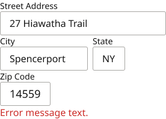 |
| Device=FOLD, Flavor=ZipAddyBlockFilled | [6423:5464](https://www.figma.com/design/jFHYqhZbJjvWQmDI4myCsd/?node-id=6423-5464) | 09e72eb3894d9f41a11b98018d3964d11dd2fcbe | 276×81 |  |
| Device=FOLD, Flavor=ZipPhoneBlockFilled | [6423:6815](https://www.figma.com/design/jFHYqhZbJjvWQmDI4myCsd/?node-id=6423-6815) | fd95fa85e57a49462392092f5ca9227cca4fe888 | 276×81 | 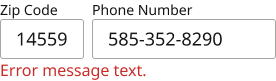 |
| Device=Mobile, Flavor=addyBlockFilled | [3015:2322](https://www.figma.com/design/jFHYqhZbJjvWQmDI4myCsd/?node-id=3015-2322) | 7a0e13d0c401eba973e2c48ed67d18349e9393d9 | 300×140 | 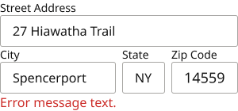 |
| Device=Mobile, Flavor=ZipAddyBlockFilled | [6423:5344](https://www.figma.com/design/jFHYqhZbJjvWQmDI4myCsd/?node-id=6423-5344) | d859737026c387dafeaba331d9c102ff408eca57 | 300×81 |  |
| Device=Mobile, Flavor=ZipPhoneBlockFilled | [6423:6751](https://www.figma.com/design/jFHYqhZbJjvWQmDI4myCsd/?node-id=6423-6751) | 49687644948cfa1870ac2d3ffa7ab9cb75359756 | 300×81 |  |
| Device=Desktop, Flavor=addyBlockFilled | [3013:2076](https://www.figma.com/design/jFHYqhZbJjvWQmDI4myCsd/?node-id=3013-2076) | 914212be0b073af7bee43e717e960dca60f4ede2 | 480×201 | 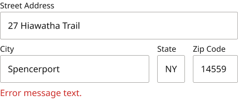 |
| Device=Desktop, Flavor=ZipAddyBlockFilled | [6423:5223](https://www.figma.com/design/jFHYqhZbJjvWQmDI4myCsd/?node-id=6423-5223) | 1077cab1b0aef9f9f6a1d5ade80a23dd54dcaaa1 | 480×113 |  |
| Device=Desktop, Flavor=ZipPhoneBlockFilled | [6423:6686](https://www.figma.com/design/jFHYqhZbJjvWQmDI4myCsd/?node-id=6423-6686) | 10db1be9a3e2f6b73f88d4d17043d6c249b18d78 | 480×113 |  |
| Device=FOLD, Flavor=addyBlockBlank | [3016:2916](https://www.figma.com/design/jFHYqhZbJjvWQmDI4myCsd/?node-id=3016-2916) | c8e541baeebf6b792a4b2bc89e5522428c686e50 | 276×199 |  |
| Device=FOLD, Flavor=ZipAddyBlockBlank | [6423:5404](https://www.figma.com/design/jFHYqhZbJjvWQmDI4myCsd/?node-id=6423-5404) | 61bb8b7dcb557d048c6ec114593434085e38f484 | 276×81 |  |
| Device=FOLD, Flavor=ZipPhoneBlockBlank | [6423:6783](https://www.figma.com/design/jFHYqhZbJjvWQmDI4myCsd/?node-id=6423-6783) | 974c5c006774af4b0f0cff0d7428ae97fe3c7abe | 276×81 | 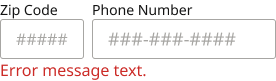 |
| Device=FOLD, Flavor=FLNameBlank | [5826:4391](https://www.figma.com/design/jFHYqhZbJjvWQmDI4myCsd/?node-id=5826-4391) | 8c2f73bcc60cbdc606770ccb9f5835cdd2e86083 | 276×81 |  |
| Device=FOLD, Flavor=LastNameBlank | [6423:5131](https://www.figma.com/design/jFHYqhZbJjvWQmDI4myCsd/?node-id=6423-5131) | 60703c7b76d47fc160eae903d947ed7d9856e712 | 276×81 |  |
| Device=FOLD, Flavor=FLNameFilled | [5826:4911](https://www.figma.com/design/jFHYqhZbJjvWQmDI4myCsd/?node-id=5826-4911) | 901c26709b025c0bf9cc4ea9de7850c147a80597 | 276×81 |  |
| Device=FOLD, Flavor=LastNameFilled | [6423:5099](https://www.figma.com/design/jFHYqhZbJjvWQmDI4myCsd/?node-id=6423-5099) | 544f4e3aa3cfa1d5fd07f16bf53ecedc5abbfc7b | 276×81 |  |
| Device=Mobile, Flavor=addyBlockBlank | [3015:2276](https://www.figma.com/design/jFHYqhZbJjvWQmDI4myCsd/?node-id=3015-2276) | 6e5be0fff57c6873c72f23b1e02fbf58b9b77f61 | 300×140 | 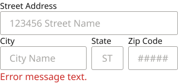 |
| Device=Mobile, Flavor=ZipAddyBlockBlank | [6423:5284](https://www.figma.com/design/jFHYqhZbJjvWQmDI4myCsd/?node-id=6423-5284) | 85bf977398e7c1eb65fdbec756d1125a8aab3657 | 300×81 |  |
| Device=Mobile, Flavor=ZipPhoneBlockBlank | [6423:6719](https://www.figma.com/design/jFHYqhZbJjvWQmDI4myCsd/?node-id=6423-6719) | 94e2120b0d06f3d8ea45302820759b49ce06d5b6 | 300×81 | 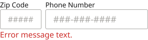 |
| Device=Mobile, Flavor=FLNameBlank | [5826:4331](https://www.figma.com/design/jFHYqhZbJjvWQmDI4myCsd/?node-id=5826-4331) | 511a2444b8fdfb9a9f70148a60cb3d11811a66f3 | 300×81 |  |
| Device=Mobile, Flavor=LastNameBlank | [6423:5067](https://www.figma.com/design/jFHYqhZbJjvWQmDI4myCsd/?node-id=6423-5067) | 69d9588144543f4936ad014d0ca0401c9127300f | 300×81 |  |
| Device=Mobile, Flavor=FLNameFilled | [5826:4879](https://www.figma.com/design/jFHYqhZbJjvWQmDI4myCsd/?node-id=5826-4879) | 28472139b69fea8e7786efb5f141d206d498c876 | 300×81 |  |
| Device=Mobile, Flavor=LastNameFilled | [6423:5035](https://www.figma.com/design/jFHYqhZbJjvWQmDI4myCsd/?node-id=6423-5035) | 29b264daad958c4732bfb45bb41bc44b9745de4f | 300×81 |  |
| Device=Desktop, Flavor=addyBlockBlank | [3013:1912](https://www.figma.com/design/jFHYqhZbJjvWQmDI4myCsd/?node-id=3013-1912) | 3b7ef2d2c7dd3badea40eb1f61c18caa594093a5 | 480×181 | 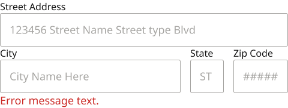 |
| Device=Desktop, Flavor=ZipAddyBlockBlank | [6423:5163](https://www.figma.com/design/jFHYqhZbJjvWQmDI4myCsd/?node-id=6423-5163) | c36cc99c953998122748989056e47eb84765e2de | 480×103 |  |
| Device=Desktop, Flavor=ZipPhoneBlockBlank | [6423:6654](https://www.figma.com/design/jFHYqhZbJjvWQmDI4myCsd/?node-id=6423-6654) | fbcf5095aaaaa3405e388c9d2be1801aaa4e8009 | 480×103 |  |
| Device=Desktop, Flavor=FLNameBlank | [5826:4271](https://www.figma.com/design/jFHYqhZbJjvWQmDI4myCsd/?node-id=5826-4271) | 72751d7b4ac2a554442a3f2857722685798bca5b | 480×103 |  |
| Device=Desktop, Flavor=LastNameBlank | [6423:4256](https://www.figma.com/design/jFHYqhZbJjvWQmDI4myCsd/?node-id=6423-4256) | f3fdf19f0d4c51480271fa0436ad983ef4c955a8 | 480×103 |  |
| Device=Desktop, Flavor=FLNameFilled | [5826:4847](https://www.figma.com/design/jFHYqhZbJjvWQmDI4myCsd/?node-id=5826-4847) | ce79a6705e804a26a3fe88fae2905aa3bfca41d3 | 480×103 |  |
| Device=Desktop, Flavor=LastNameFilled | [6423:4288](https://www.figma.com/design/jFHYqhZbJjvWQmDI4myCsd/?node-id=6423-4288) | 244b4375096637ee9eb61bc52236954a69c36eed | 480×103 |  |
| Device=FOLD, Flavor=CCdeetsFilled | [3016:2890](https://www.figma.com/design/jFHYqhZbJjvWQmDI4myCsd/?node-id=3016-2890) | 25275a327bf792eaa120bb1eb0419649e8e77652 | 259×83 |  |
| Device=Mobile, Flavor=CCdeetsFilled | [3015:2250](https://www.figma.com/design/jFHYqhZbJjvWQmDI4myCsd/?node-id=3015-2250) | c6d3c6dd78ef269ab25dd25ccdb51672ec3e2cf4 | 238×83 | 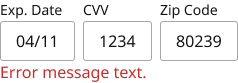 |
| Device=Desktop, Flavor=CCdeetsFilled | [3013:2045](https://www.figma.com/design/jFHYqhZbJjvWQmDI4myCsd/?node-id=3013-2045) | 4891ce45c4d1939024652dabbfff0f3a18f703a3 | 270×103 | 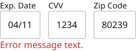 |
| Device=FOLD, Flavor=CCdeetsBlank | [3016:2866](https://www.figma.com/design/jFHYqhZbJjvWQmDI4myCsd/?node-id=3016-2866) | 1784d2c05d8c3e5e39fe5aa57a9e329582e8e94b | 260×83 |  |
| Device=Mobile, Flavor=CCdeetsBlank | [3015:2226](https://www.figma.com/design/jFHYqhZbJjvWQmDI4myCsd/?node-id=3015-2226) | f08e63d44599775bfbfc19803f2315030737af8b | 244×83 | 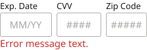 |
| Device=Desktop, Flavor=CCdeetsBlank | [3013:1855](https://www.figma.com/design/jFHYqhZbJjvWQmDI4myCsd/?node-id=3013-1855) | 2a7059fca4dc963a0cdcd3a3be5c830881ba2f4c | 294×103 |  |
| Device=FOLD, Flavor=CCnumFilled | [3016:2849](https://www.figma.com/design/jFHYqhZbJjvWQmDI4myCsd/?node-id=3016-2849) | c7ad617d35cfc79074ae478c625bf223a40dd706 | 276×81 | 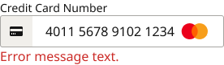 |
| Device=FOLD, Flavor=AcctNumFilled | [6423:5624](https://www.figma.com/design/jFHYqhZbJjvWQmDI4myCsd/?node-id=6423-5624) | 00caeadcd10a7d02427a0e9d97182751cb5fc396 | 276×81 |  |
| Device=Mobile, Flavor=CCnumFilled | [3011:1766](https://www.figma.com/design/jFHYqhZbJjvWQmDI4myCsd/?node-id=3011-1766) | 0a5a7ccba9492be7bdb7bf39222e6de057288bfe | 300×81 |  |
| Device=Mobile, Flavor=AcctNumFilled | [6423:5584](https://www.figma.com/design/jFHYqhZbJjvWQmDI4myCsd/?node-id=6423-5584) | 64dbc00188a16db839e5ed825d9133537e69be0e | 300×81 |  |
| Device=Desktop, Flavor=CCnumFilled | [3011:1701](https://www.figma.com/design/jFHYqhZbJjvWQmDI4myCsd/?node-id=3011-1701) | a042e102494ea7ac89783c8fb1f1c5a4e8004b39 | 480×103 |  |
| Device=Desktop, Flavor=AcctNumFilled | [6423:5544](https://www.figma.com/design/jFHYqhZbJjvWQmDI4myCsd/?node-id=6423-5544) | 15e365662245795df55781abcf0f2029402590e5 | 480×103 |  |
| Device=FOLD, Flavor=CCnumBlank | [3016:2834](https://www.figma.com/design/jFHYqhZbJjvWQmDI4myCsd/?node-id=3016-2834) | 9e36191f4c9cb3d333045a880945a33d91270776 | 276×81 | 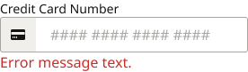 |
| Device=FOLD, Flavor=AcctNumBlank | [6423:5604](https://www.figma.com/design/jFHYqhZbJjvWQmDI4myCsd/?node-id=6423-5604) | 5d791aa4ce06d290fd3497d407825ab2dd90d77a | 276×81 | 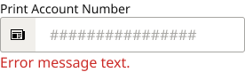 |
| Device=Mobile, Flavor=CCnumBlank | [3011:1781](https://www.figma.com/design/jFHYqhZbJjvWQmDI4myCsd/?node-id=3011-1781) | afe41c29606be75ddf61652aa55e9b9a9c73592c | 300×81 | 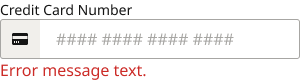 |
| Device=Mobile, Flavor=AcctNumBlank | [6423:5564](https://www.figma.com/design/jFHYqhZbJjvWQmDI4myCsd/?node-id=6423-5564) | 2af726cec39dd340819dfde43d618ecf16a09b64 | 300×81 |  |
| Device=Desktop, Flavor=CCnumBlank | [3011:1717](https://www.figma.com/design/jFHYqhZbJjvWQmDI4myCsd/?node-id=3011-1717) | 7fc2b21d88c911efb203614af4527fff9f6668b5 | 480×103 |  |
| Device=Desktop, Flavor=AcctNumBlank | [6423:5525](https://www.figma.com/design/jFHYqhZbJjvWQmDI4myCsd/?node-id=6423-5525) | ef29e4dfc992a1678b0e4bf470f37f628e543948 | 480×103 |  |
| Device=FOLD, Flavor=PINfilled | [3016:2817](https://www.figma.com/design/jFHYqhZbJjvWQmDI4myCsd/?node-id=3016-2817) | 5f5807190d674b475d3b20da4777472312962491 | 200×81 |  |
| Device=Mobile, Flavor=PINfilled | [2838:1110](https://www.figma.com/design/jFHYqhZbJjvWQmDI4myCsd/?node-id=2838-1110) | 4bc7187c86e8c1741be0d5411b5f0f4e185440d4 | 200×81 | 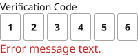 |
| Device=Desktop, Flavor=PINfilled | [2838:1093](https://www.figma.com/design/jFHYqhZbJjvWQmDI4myCsd/?node-id=2838-1093) | ea202cffcfa7ea1227235312db5cfd821ac8cb1a | 236×107 |  |
| Device=FOLD, Flavor=PINblank | [3016:2806](https://www.figma.com/design/jFHYqhZbJjvWQmDI4myCsd/?node-id=3016-2806) | 64c9faa6f35864e1c49de49cfa8de9d4b22e5e9e | 200×81 |  |
| Device=Mobile, Flavor=PINblank | [2837:1030](https://www.figma.com/design/jFHYqhZbJjvWQmDI4myCsd/?node-id=2837-1030) | 049586cf637008d189999288ba0375b3bec1d1f4 | 200×81 |  |
| Device=Desktop, Flavor=PINblank | [2836:934](https://www.figma.com/design/jFHYqhZbJjvWQmDI4myCsd/?node-id=2836-934) | 0f7b7a0af74c643d7c43f2198488321230aa8139 | 236×107 |  |
| Device=FOLD, Flavor=EmailFilled | [3016:2791](https://www.figma.com/design/jFHYqhZbJjvWQmDI4myCsd/?node-id=3016-2791) | 379c3966b6788d8ed92e90874bf1abba533af4dd | 276×81 |  |
| Device=Mobile, Flavor=EmailFilled | [2969:582](https://www.figma.com/design/jFHYqhZbJjvWQmDI4myCsd/?node-id=2969-582) | ed15fa3a988cb69b531452eee9c90ce6b400302a | 300×81 |  |
| Device=Desktop, Flavor=EmailFilled | [2966:564](https://www.figma.com/design/jFHYqhZbJjvWQmDI4myCsd/?node-id=2966-564) | 60c910963a9501df8299c74c33cf4b5247406a21 | 480×103 |  |
| Device=FOLD, Flavor=EmailBlank | [3016:2776](https://www.figma.com/design/jFHYqhZbJjvWQmDI4myCsd/?node-id=3016-2776) | e4321989b70afd67e1722627fcb6b48d46fb9d18 | 276×81 |  |
| Device=Mobile, Flavor=EmailBlank | [2832:765](https://www.figma.com/design/jFHYqhZbJjvWQmDI4myCsd/?node-id=2832-765) | 0e5afdced375be0726903a5099b1260645be1ce5 | 300×81 |  |
| Device=Desktop, Flavor=EmailBlank | [2832:764](https://www.figma.com/design/jFHYqhZbJjvWQmDI4myCsd/?node-id=2832-764) | 193b1d9f6899b0a95fe40861001675385b8f728a | 480×103 |  |
| Device=FOLD, Flavor=subNameFilled | [3023:3170](https://www.figma.com/design/jFHYqhZbJjvWQmDI4myCsd/?node-id=3023-3170) | 0e9c276d93a2f86de1cef6164e6fccbdded1122d | 276×81 |  |
| Device=Mobile, Flavor=subNameFilled | [3023:3140](https://www.figma.com/design/jFHYqhZbJjvWQmDI4myCsd/?node-id=3023-3140) | 0a3998f45ee6a205aaf9ab5c58ee16a072b9746c | 300×81 |  |
| Device=Desktop, Flavor=subNameFilled | [3023:3087](https://www.figma.com/design/jFHYqhZbJjvWQmDI4myCsd/?node-id=3023-3087) | bcd0da1f483f39aa587ee28ee9911f6afba34280 | 480×103 |  |
| Device=FOLD, Flavor=subNameBlank | [3023:3155](https://www.figma.com/design/jFHYqhZbJjvWQmDI4myCsd/?node-id=3023-3155) | c1343950e5d2f2d4c012abfb96579cf8f4ad046f | 276×81 |  |
| Device=Mobile, Flavor=subNameBlank | [3023:3125](https://www.figma.com/design/jFHYqhZbJjvWQmDI4myCsd/?node-id=3023-3125) | ef8b728dc0374ba1c4cfee0ffb9d95a29ffd80ef | 300×81 |  |
| Device=Desktop, Flavor=subNameBlank | [3023:3103](https://www.figma.com/design/jFHYqhZbJjvWQmDI4myCsd/?node-id=3023-3103) | 58e93fb9cf1791624fb44dae66bc78cf383ba813 | 480×103 |  |
| Device=Mobile, Flavor=displayNameFilled | [3009:1641](https://www.figma.com/design/jFHYqhZbJjvWQmDI4myCsd/?node-id=3009-1641) | d67bf4454628c6d81b5ff3a967aa1ba69ae40e5c | 300×81 |  |
| Device=FOLD, Flavor=displayNameFilled | [3016:2761](https://www.figma.com/design/jFHYqhZbJjvWQmDI4myCsd/?node-id=3016-2761) | 870b762f5634b4a164e181862a4f23a3c2ebeb61 | 276×81 |  |
| Device=Desktop, Flavor=displayNameFilled | [3009:1577](https://www.figma.com/design/jFHYqhZbJjvWQmDI4myCsd/?node-id=3009-1577) | b36f1582f4dc8cff91ba4001b275c50a22e97bdc | 480×103 |  |
| Device=FOLD, Flavor=displayNameBlank | [3016:2746](https://www.figma.com/design/jFHYqhZbJjvWQmDI4myCsd/?node-id=3016-2746) | a209a27daad6a1278f33bf6eb8bc27bf90b9a71e | 276×81 |  |
| Device=FOLD, Flavor=PasswordNewBlank | [5120:3902](https://www.figma.com/design/jFHYqhZbJjvWQmDI4myCsd/?node-id=5120-3902) | 124b0be4e69b7bd8acac7bf3132ffe23fd4291fa | 276×211 | 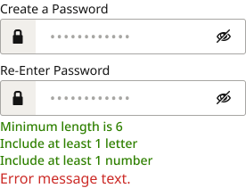 |
| Device=FOLD, Flavor=PasswordEmpty | [6527:5865](https://www.figma.com/design/jFHYqhZbJjvWQmDI4myCsd/?node-id=6527-5865) | 031d9bb67d84b5e1abd4f961b5a7a1f1f80b7fe0 | 276×123 |  |
| Device=FOLD, Flavor=PasswordNewFilled | [5120:4085](https://www.figma.com/design/jFHYqhZbJjvWQmDI4myCsd/?node-id=5120-4085) | de23fce624a75d5d86b6fad0931131795df22788 | 276×211 | 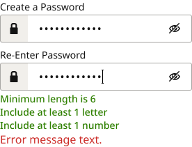 |
| Device=FOLD, Flavor=PasswordFilled | [6527:6066](https://www.figma.com/design/jFHYqhZbJjvWQmDI4myCsd/?node-id=6527-6066) | 120899bef6e767fc6f7569750a0fc766a16fdacc | 276×123 |  |
| Device=Mobile, Flavor=PasswordNewFilled | [5120:4065](https://www.figma.com/design/jFHYqhZbJjvWQmDI4myCsd/?node-id=5120-4065) | 67cf3fcd6dea6a1b6579c34a4ba62c24ff2652e0 | 300×211 | 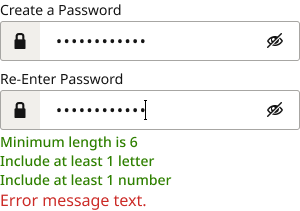 |
| Device=Mobile, Flavor=PasswordFilled | [6527:6026](https://www.figma.com/design/jFHYqhZbJjvWQmDI4myCsd/?node-id=6527-6026) | 04af88e229cbeb491db475efee93d7d30c58f414 | 300×123 |  |
| Device=Desktop, Flavor=PasswordNewFilled | [5120:4045](https://www.figma.com/design/jFHYqhZbJjvWQmDI4myCsd/?node-id=5120-4045) | 2eb34a54151d1b6b2fa170084ece4b5d6882ff96 | 480×249 | 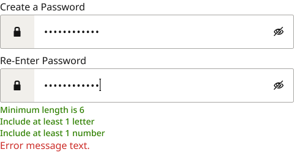 |
| Device=Desktop, Flavor=PasswordFilled | [6527:5986](https://www.figma.com/design/jFHYqhZbJjvWQmDI4myCsd/?node-id=6527-5986) | 8a1537840cc70a4bfd3bd53ce1ac916daaa56464 | 480×142 |  |
| Device=Mobile, Flavor=PasswordNewBlank | [5120:3883](https://www.figma.com/design/jFHYqhZbJjvWQmDI4myCsd/?node-id=5120-3883) | 960ad16c79d1c3cfc4505cb3aa4249f5d0efc8a2 | 300×211 | 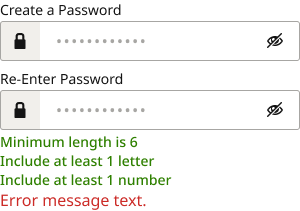 |
| Device=Mobile, Flavor=PasswordEmpty | [6527:5905](https://www.figma.com/design/jFHYqhZbJjvWQmDI4myCsd/?node-id=6527-5905) | 89634e7f5dd0a84a949352a24bebec6b705a4ed9 | 300×123 |  |
| Device=Desktop, Flavor=displayNameBlank | [3009:1560](https://www.figma.com/design/jFHYqhZbJjvWQmDI4myCsd/?node-id=3009-1560) | 3341a7eef5b0293f717b41773d018606ea1912f7 | 480×107 |  |
| Device=Desktop, Flavor=PasswordNewBlank | [5120:3864](https://www.figma.com/design/jFHYqhZbJjvWQmDI4myCsd/?node-id=5120-3864) | eec63665d01a3ecb9a37d328c50e185fa7fed1a9 | 480×249 | 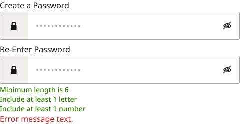 |
| Device=Desktop, Flavor=PasswordEmpty | [6527:5945](https://www.figma.com/design/jFHYqhZbJjvWQmDI4myCsd/?node-id=6527-5945) | 3202f88617ba5371a5059cdb714010531d36b7b7 | 480×144 |  |
| Device=Mobile, Flavor=displayNameBlank | [3009:1626](https://www.figma.com/design/jFHYqhZbJjvWQmDI4myCsd/?node-id=3009-1626) | 74e28801b9be805bcb8cc5f85b65e112cfbe6add | 300×81 |  |
| Device=FOLD, Flavor=IconTitle | [3016:2731](https://www.figma.com/design/jFHYqhZbJjvWQmDI4myCsd/?node-id=3016-2731) | 23397fe524f465010a2f8ed9c8db96f03867c167 | 276×85 |  |
| Device=Mobile, Flavor=IconTitle | [2832:763](https://www.figma.com/design/jFHYqhZbJjvWQmDI4myCsd/?node-id=2832-763) | 27982266ad6fad8d2b2efaa6cd074133086ed21e | 300×85 |  |
| Device=Desktop, Flavor=IconTitle | [2832:762](https://www.figma.com/design/jFHYqhZbJjvWQmDI4myCsd/?node-id=2832-762) | 04cc38dc6c9f23945a97bdbf32817ed01df6038a | 480×107 |  |
| Device=FOLD, Flavor=basic | [3016:2719](https://www.figma.com/design/jFHYqhZbJjvWQmDI4myCsd/?node-id=3016-2719) | 863c851e6e4da4d95cb4899cea273c1f62632777 | 276×85 |  |
| Device=Mobile, Flavor=basic | [2832:761](https://www.figma.com/design/jFHYqhZbJjvWQmDI4myCsd/?node-id=2832-761) | 8be52f87b25ee90674a3f5c1b26d227e9061de1e | 300×85 |  |
| Device=Desktop, Flavor=basic | [2832:760](https://www.figma.com/design/jFHYqhZbJjvWQmDI4myCsd/?node-id=2832-760) | 607d26477029cb1b83b6e7858f273ff6b229aa96 | 480×107 |  |

## Properties

| Property | Type | Default | Options |
|---|---|---|---|
| Device | VARIANT | Desktop | Desktop, Mobile, FOLD |
| Flavor | VARIANT | basic | basic, IconTitle, displayNameBlank, displayNameFilled, subNameBlank, subNameFilled, EmailBlank, EmailFilled, PINblank, PINfilled, CCnumBlank, CCnumFilled, CCdeetsBlank, CCdeetsFilled, addyBlockBlank, addyBlockFilled, phoneBlank, phoneFilled, chckBoxWordsBlank, chckBoxWordsFilled, PasswordNewBlank, PasswordNewFilled, FLNameBlank, FLNameFilled, LastNameBlank, LastNameFilled, ZipPhoneBlockBlank, ZipPhoneBlockFilled, AcctNumBlank, AcctNumFilled, ZipAddyBlockBlank, ZipAddyBlockFilled, PasswordEmpty, PasswordFilled |

## Where it is used

- **Device=Mobile, Flavor=chckBoxWordsBlank** — breakpoints: 360, 768; no instances found
- **Device=FOLD, Flavor=chckBoxWordsBlank** — breakpoints: 340; no instances found
- **Device=Mobile, Flavor=chckBoxWordsFilled** — breakpoints: 360, 768; no instances found
- **Device=FOLD, Flavor=chckBoxWordsFilled** — breakpoints: 340; no instances found
- **Device=Desktop, Flavor=chckBoxWordsFilled** — breakpoints: 768, 1024, 1100, 1280; no instances found
- **Device=Desktop, Flavor=chckBoxWordsBlank** — breakpoints: 768, 1024, 1100, 1280; no instances found
- **Device=FOLD, Flavor=phoneFilled** — breakpoints: 340; no instances found
- **Device=Mobile, Flavor=phoneFilled** — breakpoints: 360, 768; no instances found
- **Device=Desktop, Flavor=phoneFilled** — breakpoints: 768, 1024, 1100, 1280; no instances found
- **Device=FOLD, Flavor=phoneBlank** — breakpoints: 340; nested inside: InLineMessage/FOLD/none/StandAlone/panel ×1, InLineMessage/FOLD/none/StandAloneEmailPrefs/Panel ×1
- **Device=Mobile, Flavor=phoneBlank** — breakpoints: 360, 768; nested inside: InLineMessage/Mobile/none/DashSubsAcctShareALL/Panel ×1, InLineMessage/Mobile/none/StandAlone/panel ×1, InLineMessage/Mobile/none/StandAloneEmailPrefs/Panel ×1
- **Device=Desktop, Flavor=phoneBlank** — breakpoints: 768, 1024, 1100, 1280; no instances found
- **Device=FOLD, Flavor=addyBlockFilled** — breakpoints: 340; no instances found
- **Device=FOLD, Flavor=ZipAddyBlockFilled** — breakpoints: 340; no instances found
- **Device=FOLD, Flavor=ZipPhoneBlockFilled** — breakpoints: 340; no instances found
- **Device=Mobile, Flavor=addyBlockFilled** — breakpoints: 360, 768; no instances found
- **Device=Mobile, Flavor=ZipAddyBlockFilled** — breakpoints: 360, 768; no instances found
- **Device=Mobile, Flavor=ZipPhoneBlockFilled** — breakpoints: 360, 768; no instances found
- **Device=Desktop, Flavor=addyBlockFilled** — breakpoints: 768, 1024, 1100, 1280; no instances found
- **Device=Desktop, Flavor=ZipAddyBlockFilled** — breakpoints: 768, 1024, 1100, 1280; no instances found
- **Device=Desktop, Flavor=ZipPhoneBlockFilled** — breakpoints: 768, 1024, 1100, 1280; no instances found
- **Device=FOLD, Flavor=addyBlockBlank** — breakpoints: 340; no instances found
- **Device=FOLD, Flavor=ZipAddyBlockBlank** — breakpoints: 340; no instances found
- **Device=FOLD, Flavor=ZipPhoneBlockBlank** — breakpoints: 340; no instances found
- **Device=FOLD, Flavor=FLNameBlank** — breakpoints: 340; no instances found
- **Device=FOLD, Flavor=LastNameBlank** — breakpoints: 340; no instances found
- **Device=FOLD, Flavor=FLNameFilled** — breakpoints: 340; no instances found
- **Device=FOLD, Flavor=LastNameFilled** — breakpoints: 340; no instances found
- **Device=Mobile, Flavor=addyBlockBlank** — breakpoints: 360, 768; no instances found
- **Device=Mobile, Flavor=ZipAddyBlockBlank** — breakpoints: 360, 768; no instances found
- **Device=Mobile, Flavor=ZipPhoneBlockBlank** — breakpoints: 360, 768; no instances found
- **Device=Mobile, Flavor=FLNameBlank** — breakpoints: 360, 768; no instances found
- **Device=Mobile, Flavor=LastNameBlank** — breakpoints: 360, 768; no instances found
- **Device=Mobile, Flavor=FLNameFilled** — breakpoints: 360, 768; no instances found
- **Device=Mobile, Flavor=LastNameFilled** — breakpoints: 360, 768; no instances found
- **Device=Desktop, Flavor=addyBlockBlank** — breakpoints: 768, 1024, 1100, 1280; no instances found
- **Device=Desktop, Flavor=ZipAddyBlockBlank** — breakpoints: 768, 1024, 1100, 1280; no instances found
- **Device=Desktop, Flavor=ZipPhoneBlockBlank** — breakpoints: 768, 1024, 1100, 1280; no instances found
- **Device=Desktop, Flavor=FLNameBlank** — breakpoints: 768, 1024, 1100, 1280; no instances found
- **Device=Desktop, Flavor=LastNameBlank** — breakpoints: 768, 1024, 1100, 1280; no instances found
- **Device=Desktop, Flavor=FLNameFilled** — breakpoints: 768, 1024, 1100, 1280; no instances found
- **Device=Desktop, Flavor=LastNameFilled** — breakpoints: 768, 1024, 1100, 1280; no instances found
- **Device=FOLD, Flavor=CCdeetsFilled** — breakpoints: 340; no instances found
- **Device=Mobile, Flavor=CCdeetsFilled** — breakpoints: 360, 768; no instances found
- **Device=Desktop, Flavor=CCdeetsFilled** — breakpoints: 768, 1024, 1100, 1280; no instances found
- **Device=FOLD, Flavor=CCdeetsBlank** — breakpoints: 340; no instances found
- **Device=Mobile, Flavor=CCdeetsBlank** — breakpoints: 360, 768; no instances found
- **Device=Desktop, Flavor=CCdeetsBlank** — breakpoints: 768, 1024, 1100, 1280; no instances found
- **Device=FOLD, Flavor=CCnumFilled** — breakpoints: 340; no instances found
- **Device=FOLD, Flavor=AcctNumFilled** — breakpoints: 340; no instances found
- **Device=Mobile, Flavor=CCnumFilled** — breakpoints: 360, 768; no instances found
- **Device=Mobile, Flavor=AcctNumFilled** — breakpoints: 360, 768; no instances found
- **Device=Desktop, Flavor=CCnumFilled** — breakpoints: 768, 1024, 1100, 1280; no instances found
- **Device=Desktop, Flavor=AcctNumFilled** — breakpoints: 768, 1024, 1100, 1280; no instances found
- **Device=FOLD, Flavor=CCnumBlank** — breakpoints: 340; no instances found
- **Device=FOLD, Flavor=AcctNumBlank** — breakpoints: 340; no instances found
- **Device=Mobile, Flavor=CCnumBlank** — breakpoints: 360, 768; no instances found
- **Device=Mobile, Flavor=AcctNumBlank** — breakpoints: 360, 768; no instances found
- **Device=Desktop, Flavor=CCnumBlank** — breakpoints: 768, 1024, 1100, 1280; no instances found
- **Device=Desktop, Flavor=AcctNumBlank** — breakpoints: 768, 1024, 1100, 1280; no instances found
- **Device=FOLD, Flavor=PINfilled** — breakpoints: 340; no instances found
- **Device=Mobile, Flavor=PINfilled** — breakpoints: 360, 768; no instances found
- **Device=Desktop, Flavor=PINfilled** — breakpoints: 768, 1024, 1100, 1280; no instances found
- **Device=FOLD, Flavor=PINblank** — breakpoints: 340; nested inside: InLineMessage/FOLD/none/DashSMSPIN/Panel ×1, InLineMessage/FOLD/none/StandAloneEmailPrefs/Panel ×1
- **Device=Mobile, Flavor=PINblank** — breakpoints: 360, 768; nested inside: InLineMessage/Mobile/none/DashSMSPIN/Panel ×1
- **Device=Desktop, Flavor=PINblank** — breakpoints: 768, 1024, 1100, 1280; nested inside: InLineMessage/Desktop/none/DashSMSPIN/Panel ×1, InLineMessage/Desktop/none/StandAloneEmailPrefs/Panel ×1
- **Device=FOLD, Flavor=EmailFilled** — breakpoints: 340; no instances found
- **Device=Mobile, Flavor=EmailFilled** — breakpoints: 360, 768; no instances found
- **Device=Desktop, Flavor=EmailFilled** — breakpoints: 768, 1024, 1100, 1280; no instances found
- **Device=FOLD, Flavor=EmailBlank** — breakpoints: 340; no instances found
- **Device=Mobile, Flavor=EmailBlank** — breakpoints: 360, 768; nested inside: InLineMessage/Mobile/none/DashSubsAcctShareALL/Panel ×1
- **Device=Desktop, Flavor=EmailBlank** — breakpoints: 768, 1024, 1100, 1280; nested inside: InLineMessage/Desktop/none/StandAloneEmailPrefs/Panel ×1, InLineMessage/FOLD/none/StandAloneEmailPrefs/Panel ×1
- **Device=FOLD, Flavor=subNameFilled** — breakpoints: 340; no instances found
- **Device=Mobile, Flavor=subNameFilled** — breakpoints: 360, 768; no instances found
- **Device=Desktop, Flavor=subNameFilled** — breakpoints: 768, 1024, 1100, 1280; no instances found
- **Device=FOLD, Flavor=subNameBlank** — breakpoints: 340; no instances found
- **Device=Mobile, Flavor=subNameBlank** — breakpoints: 360, 768; no instances found
- **Device=Desktop, Flavor=subNameBlank** — breakpoints: 768, 1024, 1100, 1280; no instances found
- **Device=Mobile, Flavor=displayNameFilled** — breakpoints: 360, 768; no instances found
- **Device=FOLD, Flavor=displayNameFilled** — breakpoints: 340; no instances found
- **Device=Desktop, Flavor=displayNameFilled** — breakpoints: 768, 1024, 1100, 1280; no instances found
- **Device=FOLD, Flavor=displayNameBlank** — breakpoints: 340; no instances found
- **Device=FOLD, Flavor=PasswordNewBlank** — breakpoints: 340; no instances found
- **Device=FOLD, Flavor=PasswordEmpty** — breakpoints: 340; no instances found
- **Device=FOLD, Flavor=PasswordNewFilled** — breakpoints: 340; no instances found
- **Device=FOLD, Flavor=PasswordFilled** — breakpoints: 340; no instances found
- **Device=Mobile, Flavor=PasswordNewFilled** — breakpoints: 360, 768; no instances found
- **Device=Mobile, Flavor=PasswordFilled** — breakpoints: 360, 768; no instances found
- **Device=Desktop, Flavor=PasswordNewFilled** — breakpoints: 768, 1024, 1100, 1280; no instances found
- **Device=Desktop, Flavor=PasswordFilled** — breakpoints: 768, 1024, 1100, 1280; no instances found
- **Device=Mobile, Flavor=PasswordNewBlank** — breakpoints: 360, 768; no instances found
- **Device=Mobile, Flavor=PasswordEmpty** — breakpoints: 360, 768; no instances found
- **Device=Desktop, Flavor=displayNameBlank** — breakpoints: 768, 1024, 1100, 1280; no instances found
- **Device=Desktop, Flavor=PasswordNewBlank** — breakpoints: 768, 1024, 1100, 1280; no instances found
- **Device=Desktop, Flavor=PasswordEmpty** — breakpoints: 768, 1024, 1100, 1280; no instances found
- **Device=Mobile, Flavor=displayNameBlank** — breakpoints: 360, 768; no instances found
- **Device=FOLD, Flavor=IconTitle** — breakpoints: 340; no instances found
- **Device=Mobile, Flavor=IconTitle** — breakpoints: 360, 768; no instances found
- **Device=Desktop, Flavor=IconTitle** — breakpoints: 768, 1024, 1100, 1280; no instances found
- **Device=FOLD, Flavor=basic** — breakpoints: 340; no instances found
- **Device=Mobile, Flavor=basic** — breakpoints: 360, 768; nested inside: Modals/TabletV/Login ×1, Modals/MobileScroll/Login ×1, Modals/FOLD/Login ×1, Modals/Mobile/Login ×1
- **Device=Desktop, Flavor=basic** — breakpoints: 768, 1024, 1100, 1280; nested inside: Modals/TabletH/Login ×1, Modals/Desktop/Login ×1

## Breakpoints

| Key | Viewport | Variant(s) |
|---|---|---|
| 340 | ≤639px (XS-Fold, built 340) | Device=FOLD, Flavor=chckBoxWordsBlank, Device=FOLD, Flavor=chckBoxWordsFilled, Device=FOLD, Flavor=phoneFilled, Device=FOLD, Flavor=phoneBlank, Device=FOLD, Flavor=addyBlockFilled, Device=FOLD, Flavor=ZipAddyBlockFilled, Device=FOLD, Flavor=ZipPhoneBlockFilled, Device=FOLD, Flavor=addyBlockBlank, Device=FOLD, Flavor=ZipAddyBlockBlank, Device=FOLD, Flavor=ZipPhoneBlockBlank, Device=FOLD, Flavor=FLNameBlank, Device=FOLD, Flavor=LastNameBlank, Device=FOLD, Flavor=FLNameFilled, Device=FOLD, Flavor=LastNameFilled, Device=FOLD, Flavor=CCdeetsFilled, Device=FOLD, Flavor=CCdeetsBlank, Device=FOLD, Flavor=CCnumFilled, Device=FOLD, Flavor=AcctNumFilled, Device=FOLD, Flavor=CCnumBlank, Device=FOLD, Flavor=AcctNumBlank, Device=FOLD, Flavor=PINfilled, Device=FOLD, Flavor=PINblank, Device=FOLD, Flavor=EmailFilled, Device=FOLD, Flavor=EmailBlank, Device=FOLD, Flavor=subNameFilled, Device=FOLD, Flavor=subNameBlank, Device=FOLD, Flavor=displayNameFilled, Device=FOLD, Flavor=displayNameBlank, Device=FOLD, Flavor=PasswordNewBlank, Device=FOLD, Flavor=PasswordEmpty, Device=FOLD, Flavor=PasswordNewFilled, Device=FOLD, Flavor=PasswordFilled, Device=FOLD, Flavor=IconTitle, Device=FOLD, Flavor=basic |
| 360 | ≤639px (SM-Mobile, built 360) | Device=Mobile, Flavor=chckBoxWordsBlank, Device=Mobile, Flavor=chckBoxWordsFilled, Device=Mobile, Flavor=phoneFilled, Device=Mobile, Flavor=phoneBlank, Device=Mobile, Flavor=addyBlockFilled, Device=Mobile, Flavor=ZipAddyBlockFilled, Device=Mobile, Flavor=ZipPhoneBlockFilled, Device=Mobile, Flavor=addyBlockBlank, Device=Mobile, Flavor=ZipAddyBlockBlank, Device=Mobile, Flavor=ZipPhoneBlockBlank, Device=Mobile, Flavor=FLNameBlank, Device=Mobile, Flavor=LastNameBlank, Device=Mobile, Flavor=FLNameFilled, Device=Mobile, Flavor=LastNameFilled, Device=Mobile, Flavor=CCdeetsFilled, Device=Mobile, Flavor=CCdeetsBlank, Device=Mobile, Flavor=CCnumFilled, Device=Mobile, Flavor=AcctNumFilled, Device=Mobile, Flavor=CCnumBlank, Device=Mobile, Flavor=AcctNumBlank, Device=Mobile, Flavor=PINfilled, Device=Mobile, Flavor=PINblank, Device=Mobile, Flavor=EmailFilled, Device=Mobile, Flavor=EmailBlank, Device=Mobile, Flavor=subNameFilled, Device=Mobile, Flavor=subNameBlank, Device=Mobile, Flavor=displayNameFilled, Device=Mobile, Flavor=PasswordNewFilled, Device=Mobile, Flavor=PasswordFilled, Device=Mobile, Flavor=PasswordNewBlank, Device=Mobile, Flavor=PasswordEmpty, Device=Mobile, Flavor=displayNameBlank, Device=Mobile, Flavor=IconTitle, Device=Mobile, Flavor=basic |
| 768 | 640–799px (MD-TabletV) | Device=Mobile, Flavor=chckBoxWordsBlank, Device=Mobile, Flavor=chckBoxWordsFilled, Device=Desktop, Flavor=chckBoxWordsFilled, Device=Desktop, Flavor=chckBoxWordsBlank, Device=Mobile, Flavor=phoneFilled, Device=Desktop, Flavor=phoneFilled, Device=Mobile, Flavor=phoneBlank, Device=Desktop, Flavor=phoneBlank, Device=Mobile, Flavor=addyBlockFilled, Device=Mobile, Flavor=ZipAddyBlockFilled, Device=Mobile, Flavor=ZipPhoneBlockFilled, Device=Desktop, Flavor=addyBlockFilled, Device=Desktop, Flavor=ZipAddyBlockFilled, Device=Desktop, Flavor=ZipPhoneBlockFilled, Device=Mobile, Flavor=addyBlockBlank, Device=Mobile, Flavor=ZipAddyBlockBlank, Device=Mobile, Flavor=ZipPhoneBlockBlank, Device=Mobile, Flavor=FLNameBlank, Device=Mobile, Flavor=LastNameBlank, Device=Mobile, Flavor=FLNameFilled, Device=Mobile, Flavor=LastNameFilled, Device=Desktop, Flavor=addyBlockBlank, Device=Desktop, Flavor=ZipAddyBlockBlank, Device=Desktop, Flavor=ZipPhoneBlockBlank, Device=Desktop, Flavor=FLNameBlank, Device=Desktop, Flavor=LastNameBlank, Device=Desktop, Flavor=FLNameFilled, Device=Desktop, Flavor=LastNameFilled, Device=Mobile, Flavor=CCdeetsFilled, Device=Desktop, Flavor=CCdeetsFilled, Device=Mobile, Flavor=CCdeetsBlank, Device=Desktop, Flavor=CCdeetsBlank, Device=Mobile, Flavor=CCnumFilled, Device=Mobile, Flavor=AcctNumFilled, Device=Desktop, Flavor=CCnumFilled, Device=Desktop, Flavor=AcctNumFilled, Device=Mobile, Flavor=CCnumBlank, Device=Mobile, Flavor=AcctNumBlank, Device=Desktop, Flavor=CCnumBlank, Device=Desktop, Flavor=AcctNumBlank, Device=Mobile, Flavor=PINfilled, Device=Desktop, Flavor=PINfilled, Device=Mobile, Flavor=PINblank, Device=Desktop, Flavor=PINblank, Device=Mobile, Flavor=EmailFilled, Device=Desktop, Flavor=EmailFilled, Device=Mobile, Flavor=EmailBlank, Device=Desktop, Flavor=EmailBlank, Device=Mobile, Flavor=subNameFilled, Device=Desktop, Flavor=subNameFilled, Device=Mobile, Flavor=subNameBlank, Device=Desktop, Flavor=subNameBlank, Device=Mobile, Flavor=displayNameFilled, Device=Desktop, Flavor=displayNameFilled, Device=Mobile, Flavor=PasswordNewFilled, Device=Mobile, Flavor=PasswordFilled, Device=Desktop, Flavor=PasswordNewFilled, Device=Desktop, Flavor=PasswordFilled, Device=Mobile, Flavor=PasswordNewBlank, Device=Mobile, Flavor=PasswordEmpty, Device=Desktop, Flavor=displayNameBlank, Device=Desktop, Flavor=PasswordNewBlank, Device=Desktop, Flavor=PasswordEmpty, Device=Mobile, Flavor=displayNameBlank, Device=Mobile, Flavor=IconTitle, Device=Desktop, Flavor=IconTitle, Device=Mobile, Flavor=basic, Device=Desktop, Flavor=basic |
| 1024 | 800–1039px (LG-TabletH, built 1009) | Device=Desktop, Flavor=chckBoxWordsFilled, Device=Desktop, Flavor=chckBoxWordsBlank, Device=Desktop, Flavor=phoneFilled, Device=Desktop, Flavor=phoneBlank, Device=Desktop, Flavor=addyBlockFilled, Device=Desktop, Flavor=ZipAddyBlockFilled, Device=Desktop, Flavor=ZipPhoneBlockFilled, Device=Desktop, Flavor=addyBlockBlank, Device=Desktop, Flavor=ZipAddyBlockBlank, Device=Desktop, Flavor=ZipPhoneBlockBlank, Device=Desktop, Flavor=FLNameBlank, Device=Desktop, Flavor=LastNameBlank, Device=Desktop, Flavor=FLNameFilled, Device=Desktop, Flavor=LastNameFilled, Device=Desktop, Flavor=CCdeetsFilled, Device=Desktop, Flavor=CCdeetsBlank, Device=Desktop, Flavor=CCnumFilled, Device=Desktop, Flavor=AcctNumFilled, Device=Desktop, Flavor=CCnumBlank, Device=Desktop, Flavor=AcctNumBlank, Device=Desktop, Flavor=PINfilled, Device=Desktop, Flavor=PINblank, Device=Desktop, Flavor=EmailFilled, Device=Desktop, Flavor=EmailBlank, Device=Desktop, Flavor=subNameFilled, Device=Desktop, Flavor=subNameBlank, Device=Desktop, Flavor=displayNameFilled, Device=Desktop, Flavor=PasswordNewFilled, Device=Desktop, Flavor=PasswordFilled, Device=Desktop, Flavor=displayNameBlank, Device=Desktop, Flavor=PasswordNewBlank, Device=Desktop, Flavor=PasswordEmpty, Device=Desktop, Flavor=IconTitle, Device=Desktop, Flavor=basic |
| 1100 | ≥1040px (XL-Desktop, built 1085) | Device=Desktop, Flavor=chckBoxWordsFilled, Device=Desktop, Flavor=chckBoxWordsBlank, Device=Desktop, Flavor=phoneFilled, Device=Desktop, Flavor=phoneBlank, Device=Desktop, Flavor=addyBlockFilled, Device=Desktop, Flavor=ZipAddyBlockFilled, Device=Desktop, Flavor=ZipPhoneBlockFilled, Device=Desktop, Flavor=addyBlockBlank, Device=Desktop, Flavor=ZipAddyBlockBlank, Device=Desktop, Flavor=ZipPhoneBlockBlank, Device=Desktop, Flavor=FLNameBlank, Device=Desktop, Flavor=LastNameBlank, Device=Desktop, Flavor=FLNameFilled, Device=Desktop, Flavor=LastNameFilled, Device=Desktop, Flavor=CCdeetsFilled, Device=Desktop, Flavor=CCdeetsBlank, Device=Desktop, Flavor=CCnumFilled, Device=Desktop, Flavor=AcctNumFilled, Device=Desktop, Flavor=CCnumBlank, Device=Desktop, Flavor=AcctNumBlank, Device=Desktop, Flavor=PINfilled, Device=Desktop, Flavor=PINblank, Device=Desktop, Flavor=EmailFilled, Device=Desktop, Flavor=EmailBlank, Device=Desktop, Flavor=subNameFilled, Device=Desktop, Flavor=subNameBlank, Device=Desktop, Flavor=displayNameFilled, Device=Desktop, Flavor=PasswordNewFilled, Device=Desktop, Flavor=PasswordFilled, Device=Desktop, Flavor=displayNameBlank, Device=Desktop, Flavor=PasswordNewBlank, Device=Desktop, Flavor=PasswordEmpty, Device=Desktop, Flavor=IconTitle, Device=Desktop, Flavor=basic |
| 1280 | ≥1040px (XL-Desktop, built 1280) | Device=Desktop, Flavor=chckBoxWordsFilled, Device=Desktop, Flavor=chckBoxWordsBlank, Device=Desktop, Flavor=phoneFilled, Device=Desktop, Flavor=phoneBlank, Device=Desktop, Flavor=addyBlockFilled, Device=Desktop, Flavor=ZipAddyBlockFilled, Device=Desktop, Flavor=ZipPhoneBlockFilled, Device=Desktop, Flavor=addyBlockBlank, Device=Desktop, Flavor=ZipAddyBlockBlank, Device=Desktop, Flavor=ZipPhoneBlockBlank, Device=Desktop, Flavor=FLNameBlank, Device=Desktop, Flavor=LastNameBlank, Device=Desktop, Flavor=FLNameFilled, Device=Desktop, Flavor=LastNameFilled, Device=Desktop, Flavor=CCdeetsFilled, Device=Desktop, Flavor=CCdeetsBlank, Device=Desktop, Flavor=CCnumFilled, Device=Desktop, Flavor=AcctNumFilled, Device=Desktop, Flavor=CCnumBlank, Device=Desktop, Flavor=AcctNumBlank, Device=Desktop, Flavor=PINfilled, Device=Desktop, Flavor=PINblank, Device=Desktop, Flavor=EmailFilled, Device=Desktop, Flavor=EmailBlank, Device=Desktop, Flavor=subNameFilled, Device=Desktop, Flavor=subNameBlank, Device=Desktop, Flavor=displayNameFilled, Device=Desktop, Flavor=PasswordNewFilled, Device=Desktop, Flavor=PasswordFilled, Device=Desktop, Flavor=displayNameBlank, Device=Desktop, Flavor=PasswordNewBlank, Device=Desktop, Flavor=PasswordEmpty, Device=Desktop, Flavor=IconTitle, Device=Desktop, Flavor=basic |

## Responsive rules

- Device=Mobile, Flavor=chckBoxWordsBlank: 300×114, vertical gap 0 pad 0/0/0/0 main CENTER cross MIN — renders at 360, 768
- Device=FOLD, Flavor=chckBoxWordsBlank: 276×133, vertical gap 0 pad 0/0/0/0 main CENTER cross MIN — renders at 340
- Device=Mobile, Flavor=chckBoxWordsFilled: 300×114, vertical gap 0 pad 0/0/0/0 main CENTER cross MIN — renders at 360, 768
- Device=FOLD, Flavor=chckBoxWordsFilled: 276×133, vertical gap 0 pad 0/0/0/0 main CENTER cross MIN — renders at 340
- Device=Desktop, Flavor=chckBoxWordsFilled: 480×98, vertical gap 0 pad 0/0/0/0 main MIN cross MIN — renders at 768, 1024, 1100, 1280
- Device=Desktop, Flavor=chckBoxWordsBlank: 480×98, vertical gap 0 pad 0/0/0/0 main MIN cross MIN — renders at 768, 1024, 1100, 1280
- Device=FOLD, Flavor=phoneFilled: 276×81, vertical gap 0 pad 0/0/0/0 main CENTER cross MIN — renders at 340
- Device=Mobile, Flavor=phoneFilled: 300×81, vertical gap 0 pad 0/0/0/0 main CENTER cross MIN — renders at 360, 768
- Device=Desktop, Flavor=phoneFilled: 480×103, vertical gap 0 pad 0/0/0/0 main MIN cross MIN — renders at 768, 1024, 1100, 1280
- Device=FOLD, Flavor=phoneBlank: 276×81, vertical gap 0 pad 0/0/0/0 main CENTER cross MIN — renders at 340
- Device=Mobile, Flavor=phoneBlank: 300×81, vertical gap 0 pad 0/0/0/0 main CENTER cross MIN — renders at 360, 768
- Device=Desktop, Flavor=phoneBlank: 480×103, vertical gap 0 pad 0/0/0/0 main MIN cross MIN — renders at 768, 1024, 1100, 1280
- Device=FOLD, Flavor=addyBlockFilled: 276×199, vertical gap 0 pad 0/0/0/0 main CENTER cross MIN — renders at 340
- Device=FOLD, Flavor=ZipAddyBlockFilled: 276×81, vertical gap 0 pad 0/0/0/0 main CENTER cross MIN — renders at 340
- Device=FOLD, Flavor=ZipPhoneBlockFilled: 276×81, vertical gap 0 pad 0/0/0/0 main CENTER cross MIN — renders at 340
- Device=Mobile, Flavor=addyBlockFilled: 300×140, vertical gap 0 pad 0/0/0/0 main CENTER cross MIN — renders at 360, 768
- Device=Mobile, Flavor=ZipAddyBlockFilled: 300×81, vertical gap 0 pad 0/0/0/0 main CENTER cross MIN — renders at 360, 768
- Device=Mobile, Flavor=ZipPhoneBlockFilled: 300×81, vertical gap 0 pad 0/0/0/0 main CENTER cross MIN — renders at 360, 768
- Device=Desktop, Flavor=addyBlockFilled: 480×201, vertical gap 8 pad 0/0/0/0 main MIN cross MIN — renders at 768, 1024, 1100, 1280
- Device=Desktop, Flavor=ZipAddyBlockFilled: 480×113, vertical gap 8 pad 0/0/0/0 main MIN cross MIN — renders at 768, 1024, 1100, 1280
- Device=Desktop, Flavor=ZipPhoneBlockFilled: 480×113, vertical gap 8 pad 0/0/0/0 main MIN cross MIN — renders at 768, 1024, 1100, 1280
- Device=FOLD, Flavor=addyBlockBlank: 276×199, vertical gap 0 pad 0/0/0/0 main CENTER cross MIN — renders at 340
- Device=FOLD, Flavor=ZipAddyBlockBlank: 276×81, vertical gap 0 pad 0/0/0/0 main CENTER cross MIN — renders at 340
- Device=FOLD, Flavor=ZipPhoneBlockBlank: 276×81, vertical gap 0 pad 0/0/0/0 main CENTER cross MIN — renders at 340
- Device=FOLD, Flavor=FLNameBlank: 276×81, vertical gap 0 pad 0/0/0/0 main CENTER cross MIN — renders at 340
- Device=FOLD, Flavor=LastNameBlank: 276×81, vertical gap 0 pad 0/0/0/0 main CENTER cross MIN — renders at 340
- Device=FOLD, Flavor=FLNameFilled: 276×81, vertical gap 0 pad 0/0/0/0 main CENTER cross MIN — renders at 340
- Device=FOLD, Flavor=LastNameFilled: 276×81, vertical gap 0 pad 0/0/0/0 main CENTER cross MIN — renders at 340
- Device=Mobile, Flavor=addyBlockBlank: 300×140, vertical gap 0 pad 0/0/0/0 main CENTER cross MIN — renders at 360, 768
- Device=Mobile, Flavor=ZipAddyBlockBlank: 300×81, vertical gap 0 pad 0/0/0/0 main CENTER cross MIN — renders at 360, 768
- Device=Mobile, Flavor=ZipPhoneBlockBlank: 300×81, vertical gap 0 pad 0/0/0/0 main CENTER cross MIN — renders at 360, 768
- Device=Mobile, Flavor=FLNameBlank: 300×81, vertical gap 0 pad 0/0/0/0 main CENTER cross MIN — renders at 360, 768
- Device=Mobile, Flavor=LastNameBlank: 300×81, vertical gap 0 pad 0/0/0/0 main CENTER cross MIN — renders at 360, 768
- Device=Mobile, Flavor=FLNameFilled: 300×81, vertical gap 0 pad 0/0/0/0 main CENTER cross MIN — renders at 360, 768
- Device=Mobile, Flavor=LastNameFilled: 300×81, vertical gap 0 pad 0/0/0/0 main CENTER cross MIN — renders at 360, 768
- Device=Desktop, Flavor=addyBlockBlank: 480×181, vertical gap 0 pad 0/0/0/0 main MIN cross MIN — renders at 768, 1024, 1100, 1280
- Device=Desktop, Flavor=ZipAddyBlockBlank: 480×103, vertical gap 0 pad 0/0/0/0 main MIN cross MIN — renders at 768, 1024, 1100, 1280
- Device=Desktop, Flavor=ZipPhoneBlockBlank: 480×103, vertical gap 0 pad 0/0/0/0 main MIN cross MIN — renders at 768, 1024, 1100, 1280
- Device=Desktop, Flavor=FLNameBlank: 480×103, vertical gap 0 pad 0/0/0/0 main MIN cross MIN — renders at 768, 1024, 1100, 1280
- Device=Desktop, Flavor=LastNameBlank: 480×103, vertical gap 0 pad 0/0/0/0 main MIN cross MIN — renders at 768, 1024, 1100, 1280
- Device=Desktop, Flavor=FLNameFilled: 480×103, vertical gap 0 pad 0/0/0/0 main MIN cross MIN — renders at 768, 1024, 1100, 1280
- Device=Desktop, Flavor=LastNameFilled: 480×103, vertical gap 0 pad 0/0/0/0 main MIN cross MIN — renders at 768, 1024, 1100, 1280
- Device=FOLD, Flavor=CCdeetsFilled: 259×83, vertical gap 0 pad 0/0/0/0 main CENTER cross MIN — renders at 340
- Device=Mobile, Flavor=CCdeetsFilled: 238×83, vertical gap 0 pad 0/0/0/0 main CENTER cross MIN — renders at 360, 768
- Device=Desktop, Flavor=CCdeetsFilled: 270×103, vertical gap 0 pad 0/0/0/0 main MIN cross MIN — renders at 768, 1024, 1100, 1280
- Device=FOLD, Flavor=CCdeetsBlank: 260×83, vertical gap 0 pad 0/0/0/0 main CENTER cross MIN — renders at 340
- Device=Mobile, Flavor=CCdeetsBlank: 244×83, vertical gap 0 pad 0/0/0/0 main CENTER cross MIN — renders at 360, 768
- Device=Desktop, Flavor=CCdeetsBlank: 294×103, vertical gap 0 pad 0/0/0/0 main MIN cross MIN — renders at 768, 1024, 1100, 1280
- Device=FOLD, Flavor=CCnumFilled: 276×81, vertical gap 0 pad 0/0/0/0 main CENTER cross MIN — renders at 340
- Device=FOLD, Flavor=AcctNumFilled: 276×81, vertical gap 0 pad 0/0/0/0 main CENTER cross MIN — renders at 340
- Device=Mobile, Flavor=CCnumFilled: 300×81, vertical gap 0 pad 0/0/0/0 main CENTER cross MIN — renders at 360, 768
- Device=Mobile, Flavor=AcctNumFilled: 300×81, vertical gap 0 pad 0/0/0/0 main CENTER cross MIN — renders at 360, 768
- Device=Desktop, Flavor=CCnumFilled: 480×103, vertical gap 0 pad 0/0/0/0 main MIN cross MIN — renders at 768, 1024, 1100, 1280
- Device=Desktop, Flavor=AcctNumFilled: 480×103, vertical gap 0 pad 0/0/0/0 main MIN cross MIN — renders at 768, 1024, 1100, 1280
- Device=FOLD, Flavor=CCnumBlank: 276×81, vertical gap 0 pad 0/0/0/0 main CENTER cross MIN — renders at 340
- Device=FOLD, Flavor=AcctNumBlank: 276×81, vertical gap 0 pad 0/0/0/0 main CENTER cross MIN — renders at 340
- Device=Mobile, Flavor=CCnumBlank: 300×81, vertical gap 0 pad 0/0/0/0 main CENTER cross MIN — renders at 360, 768
- Device=Mobile, Flavor=AcctNumBlank: 300×81, vertical gap 0 pad 0/0/0/0 main CENTER cross MIN — renders at 360, 768
- Device=Desktop, Flavor=CCnumBlank: 480×103, vertical gap 0 pad 0/0/0/0 main MIN cross MIN — renders at 768, 1024, 1100, 1280
- Device=Desktop, Flavor=AcctNumBlank: 480×103, vertical gap 0 pad 0/0/0/0 main MIN cross MIN — renders at 768, 1024, 1100, 1280
- Device=FOLD, Flavor=PINfilled: 200×81, vertical gap 0 pad 0/0/0/0 main CENTER cross MIN — renders at 340
- Device=Mobile, Flavor=PINfilled: 200×81, vertical gap 0 pad 0/0/0/0 main CENTER cross MIN — renders at 360, 768
- Device=Desktop, Flavor=PINfilled: 236×107, vertical gap 2 pad 0/0/0/0 main MIN cross MIN — renders at 768, 1024, 1100, 1280
- Device=FOLD, Flavor=PINblank: 200×81, vertical gap 0 pad 0/0/0/0 main CENTER cross MIN — renders at 340
- Device=Mobile, Flavor=PINblank: 200×81, vertical gap 0 pad 0/0/0/0 main CENTER cross MIN — renders at 360, 768
- Device=Desktop, Flavor=PINblank: 236×107, vertical gap 2 pad 0/0/0/0 main MIN cross MIN — renders at 768, 1024, 1100, 1280
- Device=FOLD, Flavor=EmailFilled: 276×81, vertical gap 0 pad 0/0/0/0 main CENTER cross MIN — renders at 340
- Device=Mobile, Flavor=EmailFilled: 300×81, vertical gap 0 pad 0/0/0/0 main CENTER cross MIN — renders at 360, 768
- Device=Desktop, Flavor=EmailFilled: 480×103, vertical gap 0 pad 0/0/0/0 main MIN cross MIN — renders at 768, 1024, 1100, 1280
- Device=FOLD, Flavor=EmailBlank: 276×81, vertical gap 0 pad 0/0/0/0 main CENTER cross MIN — renders at 340
- Device=Mobile, Flavor=EmailBlank: 300×81, vertical gap 0 pad 0/0/0/0 main CENTER cross MIN — renders at 360, 768
- Device=Desktop, Flavor=EmailBlank: 480×103, vertical gap 0 pad 0/0/0/0 main MIN cross MIN — renders at 768, 1024, 1100, 1280
- Device=FOLD, Flavor=subNameFilled: 276×81, vertical gap 0 pad 0/0/0/0 main CENTER cross MIN — renders at 340
- Device=Mobile, Flavor=subNameFilled: 300×81, vertical gap 0 pad 0/0/0/0 main CENTER cross MIN — renders at 360, 768
- Device=Desktop, Flavor=subNameFilled: 480×103, vertical gap 0 pad 0/0/0/0 main MIN cross MIN — renders at 768, 1024, 1100, 1280
- Device=FOLD, Flavor=subNameBlank: 276×81, vertical gap 0 pad 0/0/0/0 main CENTER cross MIN — renders at 340
- Device=Mobile, Flavor=subNameBlank: 300×81, vertical gap 0 pad 0/0/0/0 main CENTER cross MIN — renders at 360, 768
- Device=Desktop, Flavor=subNameBlank: 480×103, vertical gap 0 pad 0/0/0/0 main MIN cross MIN — renders at 768, 1024, 1100, 1280
- Device=Mobile, Flavor=displayNameFilled: 300×81, vertical gap 0 pad 0/0/0/0 main CENTER cross MIN — renders at 360, 768
- Device=FOLD, Flavor=displayNameFilled: 276×81, vertical gap 0 pad 0/0/0/0 main CENTER cross MIN — renders at 340
- Device=Desktop, Flavor=displayNameFilled: 480×103, vertical gap 0 pad 0/0/0/0 main MIN cross MIN — renders at 768, 1024, 1100, 1280
- Device=FOLD, Flavor=displayNameBlank: 276×81, vertical gap 0 pad 0/0/0/0 main CENTER cross MIN — renders at 340
- Device=FOLD, Flavor=PasswordNewBlank: 276×211, vertical gap 8 pad 0/0/0/0 main CENTER cross MIN — renders at 340
- Device=FOLD, Flavor=PasswordEmpty: 276×123, vertical gap 8 pad 0/0/0/0 main CENTER cross MIN — renders at 340
- Device=FOLD, Flavor=PasswordNewFilled: 276×211, vertical gap 8 pad 0/0/0/0 main CENTER cross MIN — renders at 340
- Device=FOLD, Flavor=PasswordFilled: 276×123, vertical gap 8 pad 0/0/0/0 main CENTER cross MIN — renders at 340
- Device=Mobile, Flavor=PasswordNewFilled: 300×211, vertical gap 8 pad 0/0/0/0 main CENTER cross MIN — renders at 360, 768
- Device=Mobile, Flavor=PasswordFilled: 300×123, vertical gap 8 pad 0/0/0/0 main CENTER cross MIN — renders at 360, 768
- Device=Desktop, Flavor=PasswordNewFilled: 480×249, vertical gap 8 pad 0/0/0/0 main MIN cross MIN — renders at 768, 1024, 1100, 1280
- Device=Desktop, Flavor=PasswordFilled: 480×142, vertical gap 8 pad 0/0/0/0 main MIN cross MIN — renders at 768, 1024, 1100, 1280
- Device=Mobile, Flavor=PasswordNewBlank: 300×211, vertical gap 8 pad 0/0/0/0 main CENTER cross MIN — renders at 360, 768
- Device=Mobile, Flavor=PasswordEmpty: 300×123, vertical gap 8 pad 0/0/0/0 main CENTER cross MIN — renders at 360, 768
- Device=Desktop, Flavor=displayNameBlank: 480×107, vertical gap 2 pad 0/0/0/0 main MIN cross MIN — renders at 768, 1024, 1100, 1280
- Device=Desktop, Flavor=PasswordNewBlank: 480×249, vertical gap 8 pad 0/0/0/0 main MIN cross MIN — renders at 768, 1024, 1100, 1280
- Device=Desktop, Flavor=PasswordEmpty: 480×144, vertical gap 8 pad 0/0/0/0 main MIN cross MIN — renders at 768, 1024, 1100, 1280
- Device=Mobile, Flavor=displayNameBlank: 300×81, vertical gap 0 pad 0/0/0/0 main CENTER cross MIN — renders at 360, 768
- Device=FOLD, Flavor=IconTitle: 276×85, vertical gap 2 pad 0/0/0/0 main CENTER cross MIN — renders at 340
- Device=Mobile, Flavor=IconTitle: 300×85, vertical gap 2 pad 0/0/0/0 main CENTER cross MIN — renders at 360, 768
- Device=Desktop, Flavor=IconTitle: 480×107, vertical gap 2 pad 0/0/0/0 main MIN cross MIN — renders at 768, 1024, 1100, 1280
- Device=FOLD, Flavor=basic: 276×85, vertical gap 2 pad 0/0/0/0 main CENTER cross MIN — renders at 340
- Device=Mobile, Flavor=basic: 300×85, vertical gap 2 pad 0/0/0/0 main CENTER cross MIN — renders at 360, 768
- Device=Desktop, Flavor=basic: 480×107, vertical gap 2 pad 0/0/0/0 main MIN cross MIN — renders at 768, 1024, 1100, 1280

## Dependencies

**Built from:**

- CheckBox ×6 _(not in this export)_
- Icons ×83 _(not in this export)_
- Button Linkstyle ×6 _(not in this export)_

**Built into:**

- [Form Field Assembly / Name pair](../../assemblies/42-form-field-assembly-name-pair/form-field-assembly-name-pair.md)
- [Form Field Assembly / Zip + Street #](../../assemblies/43-form-field-assembly-zip-street/form-field-assembly-zip-street.md)
- [Form Field Assembly / Zip + Phone](../../assemblies/44-form-field-assembly-zip-phone/form-field-assembly-zip-phone.md)
- [Form Field Assembly / Address block](../../assemblies/45-form-field-assembly-address-block/form-field-assembly-address-block.md)
- [Form Field Assembly / CC details](../../assemblies/46-form-field-assembly-cc-details/form-field-assembly-cc-details.md)
- [Form Field Assembly / Password](../../assemblies/47-form-field-assembly-password/form-field-assembly-password.md)

## Anatomy

**Device=Mobile, Flavor=chckBoxWordsBlank**

```
- Device=Mobile, Flavor=chckBoxWordsBlank — component 300×114 [vertical gap 0] (fixed/hug)
  - Main Container — frame 300×92 [horizontal gap 0] (fill/hug)
    - Checkbox Container — frame 40×92 [vertical gap 8] (hug/fill)
      - CheckBox — instance 40×40 [horizontal gap 8] (fixed/fixed) → CheckBox [status=unselected, inFocus=False, interaction=Default]
    - Text Container — frame 260×92 [vertical gap 0] (fill/hug)
      - SubExclusive Container — frame 440×13 [horizontal gap 8] (fixed/hug) (hidden)
        - SubExclusiveBadge — frame 138×11 [horizontal gap 8] (hug/hug)
          - Subscriber Exclusive — text 134×7 (hug/hug) "Subscriber Exclusive"
      - Text Body — frame 260×76 [horizontal gap 8] (fill/hug)
        - Text — text 260×76 (fill/hug) "I agree to Terms and Conditions. Terms o"
  - Error Message Container — frame 300×22 [horizontal gap 8] (fill/hug)
    - Error Message Text. — text 300×22 (fill/hug) "Please accept terms and conditions."
```

**Device=FOLD, Flavor=chckBoxWordsBlank**

```
- Device=FOLD, Flavor=chckBoxWordsBlank — component 276×133 [vertical gap 0] (fixed/hug)
  - Main Container — frame 276×111 [horizontal gap 0] (fill/hug)
    - Checkbox Container — frame 40×111 [vertical gap 8] (hug/fill)
      - CheckBox — instance 40×40 [horizontal gap 8] (fixed/fixed) → CheckBox [status=unselected, inFocus=False, interaction=Default]
    - Text Container — frame 236×111 [vertical gap 0] (fill/hug)
      - SubExclusive Container — frame 440×13 [horizontal gap 8] (fixed/hug) (hidden)
        - SubExclusiveBadge — frame 138×11 [horizontal gap 8] (hug/hug)
          - Subscriber Exclusive — text 134×7 (hug/hug) "Subscriber Exclusive"
      - Text Body — frame 236×95 [horizontal gap 8] (fill/hug)
        - Text — text 236×95 (fill/hug) "I agree to Terms and Conditions. Terms o"
  - Error Message Container — frame 276×22 [horizontal gap 8] (fill/hug)
    - Error Message Text. — text 276×22 (fill/hug) "Please accept terms and conditions."
```

**Device=Mobile, Flavor=chckBoxWordsFilled**

```
- Device=Mobile, Flavor=chckBoxWordsFilled — component 300×114 [vertical gap 0] (fixed/hug)
  - Main Container — frame 300×92 [horizontal gap 0] (fill/hug)
    - Checkbox Container — frame 40×92 [vertical gap 8] (hug/fill)
      - CheckBox — instance 40×40 [horizontal gap 8] (fixed/fixed) → CheckBox [status=selected, inFocus=False, interaction=Default]
    - Text Container — frame 260×92 [vertical gap 0] (fill/hug)
      - SubExclusive Container — frame 440×13 [horizontal gap 8] (fixed/hug) (hidden)
        - SubExclusiveBadge — frame 138×11 [horizontal gap 8] (hug/hug)
          - Subscriber Exclusive — text 134×7 (hug/hug) "Subscriber Exclusive"
      - Text Body — frame 260×76 [horizontal gap 8] (fill/hug)
        - Text — text 260×76 (fill/hug) "I agree to Terms and Conditions. Terms o"
  - Error Message Container — frame 300×22 [horizontal gap 8] (fill/hug)
    - Error Message Text. — text 300×22 (fill/hug) "Please accept terms and conditions."
```

_99 more variants — full layer trees are in `form-field-dashboard-mockup-set.json` → `variants[].layerTree`._

## Size & layout

| Variant | Size | Width | Height | Auto-layout | Radius | Clip |
|---|---|---|---|---|---|---|
| Device=Mobile, Flavor=chckBoxWordsBlank | 300×114 | FIXED | HUG | vertical gap 0 pad 0/0/0/0 main CENTER cross MIN |  |  |
| Device=FOLD, Flavor=chckBoxWordsBlank | 276×133 | FIXED | HUG | vertical gap 0 pad 0/0/0/0 main CENTER cross MIN |  |  |
| Device=Mobile, Flavor=chckBoxWordsFilled | 300×114 | FIXED | HUG | vertical gap 0 pad 0/0/0/0 main CENTER cross MIN |  |  |
| Device=FOLD, Flavor=chckBoxWordsFilled | 276×133 | FIXED | HUG | vertical gap 0 pad 0/0/0/0 main CENTER cross MIN |  |  |
| Device=Desktop, Flavor=chckBoxWordsFilled | 480×98 | FIXED | HUG | vertical gap 0 pad 0/0/0/0 main MIN cross MIN |  |  |
| Device=Desktop, Flavor=chckBoxWordsBlank | 480×98 | FIXED | HUG | vertical gap 0 pad 0/0/0/0 main MIN cross MIN |  |  |
| Device=FOLD, Flavor=phoneFilled | 276×81 | FIXED | HUG | vertical gap 0 pad 0/0/0/0 main CENTER cross MIN |  |  |
| Device=Mobile, Flavor=phoneFilled | 300×81 | FIXED | HUG | vertical gap 0 pad 0/0/0/0 main CENTER cross MIN |  |  |
| Device=Desktop, Flavor=phoneFilled | 480×103 | FIXED | HUG | vertical gap 0 pad 0/0/0/0 main MIN cross MIN |  |  |
| Device=FOLD, Flavor=phoneBlank | 276×81 | FIXED | HUG | vertical gap 0 pad 0/0/0/0 main CENTER cross MIN |  |  |
| Device=Mobile, Flavor=phoneBlank | 300×81 | FIXED | HUG | vertical gap 0 pad 0/0/0/0 main CENTER cross MIN |  |  |
| Device=Desktop, Flavor=phoneBlank | 480×103 | FIXED | HUG | vertical gap 0 pad 0/0/0/0 main MIN cross MIN |  |  |
| Device=FOLD, Flavor=addyBlockFilled | 276×199 | FIXED | HUG | vertical gap 0 pad 0/0/0/0 main CENTER cross MIN |  |  |
| Device=FOLD, Flavor=ZipAddyBlockFilled | 276×81 | FIXED | HUG | vertical gap 0 pad 0/0/0/0 main CENTER cross MIN |  |  |
| Device=FOLD, Flavor=ZipPhoneBlockFilled | 276×81 | FIXED | HUG | vertical gap 0 pad 0/0/0/0 main CENTER cross MIN |  |  |
| Device=Mobile, Flavor=addyBlockFilled | 300×140 | FIXED | HUG | vertical gap 0 pad 0/0/0/0 main CENTER cross MIN |  |  |
| Device=Mobile, Flavor=ZipAddyBlockFilled | 300×81 | FIXED | HUG | vertical gap 0 pad 0/0/0/0 main CENTER cross MIN |  |  |
| Device=Mobile, Flavor=ZipPhoneBlockFilled | 300×81 | FIXED | HUG | vertical gap 0 pad 0/0/0/0 main CENTER cross MIN |  |  |
| Device=Desktop, Flavor=addyBlockFilled | 480×201 | FIXED | HUG | vertical gap 8 pad 0/0/0/0 main MIN cross MIN |  |  |
| Device=Desktop, Flavor=ZipAddyBlockFilled | 480×113 | HUG | HUG | vertical gap 8 pad 0/0/0/0 main MIN cross MIN |  |  |
| Device=Desktop, Flavor=ZipPhoneBlockFilled | 480×113 | FIXED | HUG | vertical gap 8 pad 0/0/0/0 main MIN cross MIN |  |  |
| Device=FOLD, Flavor=addyBlockBlank | 276×199 | FIXED | HUG | vertical gap 0 pad 0/0/0/0 main CENTER cross MIN |  |  |
| Device=FOLD, Flavor=ZipAddyBlockBlank | 276×81 | FIXED | HUG | vertical gap 0 pad 0/0/0/0 main CENTER cross MIN |  |  |
| Device=FOLD, Flavor=ZipPhoneBlockBlank | 276×81 | FIXED | HUG | vertical gap 0 pad 0/0/0/0 main CENTER cross MIN |  |  |
| Device=FOLD, Flavor=FLNameBlank | 276×81 | FIXED | HUG | vertical gap 0 pad 0/0/0/0 main CENTER cross MIN |  |  |
| Device=FOLD, Flavor=LastNameBlank | 276×81 | FIXED | HUG | vertical gap 0 pad 0/0/0/0 main CENTER cross MIN |  |  |
| Device=FOLD, Flavor=FLNameFilled | 276×81 | FIXED | HUG | vertical gap 0 pad 0/0/0/0 main CENTER cross MIN |  |  |
| Device=FOLD, Flavor=LastNameFilled | 276×81 | FIXED | HUG | vertical gap 0 pad 0/0/0/0 main CENTER cross MIN |  |  |
| Device=Mobile, Flavor=addyBlockBlank | 300×140 | FIXED | HUG | vertical gap 0 pad 0/0/0/0 main CENTER cross MIN |  |  |
| Device=Mobile, Flavor=ZipAddyBlockBlank | 300×81 | FIXED | HUG | vertical gap 0 pad 0/0/0/0 main CENTER cross MIN |  |  |
| Device=Mobile, Flavor=ZipPhoneBlockBlank | 300×81 | FIXED | HUG | vertical gap 0 pad 0/0/0/0 main CENTER cross MIN |  |  |
| Device=Mobile, Flavor=FLNameBlank | 300×81 | FIXED | HUG | vertical gap 0 pad 0/0/0/0 main CENTER cross MIN |  |  |
| Device=Mobile, Flavor=LastNameBlank | 300×81 | FIXED | HUG | vertical gap 0 pad 0/0/0/0 main CENTER cross MIN |  |  |
| Device=Mobile, Flavor=FLNameFilled | 300×81 | FIXED | HUG | vertical gap 0 pad 0/0/0/0 main CENTER cross MIN |  |  |
| Device=Mobile, Flavor=LastNameFilled | 300×81 | FIXED | HUG | vertical gap 0 pad 0/0/0/0 main CENTER cross MIN |  |  |
| Device=Desktop, Flavor=addyBlockBlank | 480×181 | HUG | HUG | vertical gap 0 pad 0/0/0/0 main MIN cross MIN |  |  |
| Device=Desktop, Flavor=ZipAddyBlockBlank | 480×103 | HUG | HUG | vertical gap 0 pad 0/0/0/0 main MIN cross MIN |  |  |
| Device=Desktop, Flavor=ZipPhoneBlockBlank | 480×103 | HUG | HUG | vertical gap 0 pad 0/0/0/0 main MIN cross MIN |  |  |
| Device=Desktop, Flavor=FLNameBlank | 480×103 | HUG | HUG | vertical gap 0 pad 0/0/0/0 main MIN cross MIN |  |  |
| Device=Desktop, Flavor=LastNameBlank | 480×103 | HUG | HUG | vertical gap 0 pad 0/0/0/0 main MIN cross MIN |  |  |
| Device=Desktop, Flavor=FLNameFilled | 480×103 | HUG | HUG | vertical gap 0 pad 0/0/0/0 main MIN cross MIN |  |  |
| Device=Desktop, Flavor=LastNameFilled | 480×103 | HUG | HUG | vertical gap 0 pad 0/0/0/0 main MIN cross MIN |  |  |
| Device=FOLD, Flavor=CCdeetsFilled | 259×83 | FIXED | HUG | vertical gap 0 pad 0/0/0/0 main CENTER cross MIN |  |  |
| Device=Mobile, Flavor=CCdeetsFilled | 238×83 | HUG | HUG | vertical gap 0 pad 0/0/0/0 main CENTER cross MIN |  |  |
| Device=Desktop, Flavor=CCdeetsFilled | 270×103 | HUG | HUG | vertical gap 0 pad 0/0/0/0 main MIN cross MIN |  |  |
| Device=FOLD, Flavor=CCdeetsBlank | 260×83 | HUG | HUG | vertical gap 0 pad 0/0/0/0 main CENTER cross MIN |  |  |
| Device=Mobile, Flavor=CCdeetsBlank | 244×83 | HUG | HUG | vertical gap 0 pad 0/0/0/0 main CENTER cross MIN |  |  |
| Device=Desktop, Flavor=CCdeetsBlank | 294×103 | HUG | HUG | vertical gap 0 pad 0/0/0/0 main MIN cross MIN |  |  |
| Device=FOLD, Flavor=CCnumFilled | 276×81 | FIXED | HUG | vertical gap 0 pad 0/0/0/0 main CENTER cross MIN |  |  |
| Device=FOLD, Flavor=AcctNumFilled | 276×81 | FIXED | HUG | vertical gap 0 pad 0/0/0/0 main CENTER cross MIN |  |  |
| Device=Mobile, Flavor=CCnumFilled | 300×81 | FIXED | HUG | vertical gap 0 pad 0/0/0/0 main CENTER cross MIN |  |  |
| Device=Mobile, Flavor=AcctNumFilled | 300×81 | FIXED | HUG | vertical gap 0 pad 0/0/0/0 main CENTER cross MIN |  |  |
| Device=Desktop, Flavor=CCnumFilled | 480×103 | FIXED | HUG | vertical gap 0 pad 0/0/0/0 main MIN cross MIN |  |  |
| Device=Desktop, Flavor=AcctNumFilled | 480×103 | FIXED | HUG | vertical gap 0 pad 0/0/0/0 main MIN cross MIN |  |  |
| Device=FOLD, Flavor=CCnumBlank | 276×81 | FIXED | HUG | vertical gap 0 pad 0/0/0/0 main CENTER cross MIN |  |  |
| Device=FOLD, Flavor=AcctNumBlank | 276×81 | FIXED | HUG | vertical gap 0 pad 0/0/0/0 main CENTER cross MIN |  |  |
| Device=Mobile, Flavor=CCnumBlank | 300×81 | FIXED | HUG | vertical gap 0 pad 0/0/0/0 main CENTER cross MIN |  |  |
| Device=Mobile, Flavor=AcctNumBlank | 300×81 | FIXED | HUG | vertical gap 0 pad 0/0/0/0 main CENTER cross MIN |  |  |
| Device=Desktop, Flavor=CCnumBlank | 480×103 | FIXED | HUG | vertical gap 0 pad 0/0/0/0 main MIN cross MIN |  |  |
| Device=Desktop, Flavor=AcctNumBlank | 480×103 | FIXED | HUG | vertical gap 0 pad 0/0/0/0 main MIN cross MIN |  |  |
| Device=FOLD, Flavor=PINfilled | 200×81 | FIXED | HUG | vertical gap 0 pad 0/0/0/0 main CENTER cross MIN |  |  |
| Device=Mobile, Flavor=PINfilled | 200×81 | FIXED | HUG | vertical gap 0 pad 0/0/0/0 main CENTER cross MIN |  |  |
| Device=Desktop, Flavor=PINfilled | 236×107 | HUG | HUG | vertical gap 2 pad 0/0/0/0 main MIN cross MIN |  |  |
| Device=FOLD, Flavor=PINblank | 200×81 | FIXED | HUG | vertical gap 0 pad 0/0/0/0 main CENTER cross MIN |  |  |
| Device=Mobile, Flavor=PINblank | 200×81 | FIXED | HUG | vertical gap 0 pad 0/0/0/0 main CENTER cross MIN |  |  |
| Device=Desktop, Flavor=PINblank | 236×107 | HUG | HUG | vertical gap 2 pad 0/0/0/0 main MIN cross MIN |  |  |
| Device=FOLD, Flavor=EmailFilled | 276×81 | FIXED | HUG | vertical gap 0 pad 0/0/0/0 main CENTER cross MIN |  |  |
| Device=Mobile, Flavor=EmailFilled | 300×81 | FIXED | HUG | vertical gap 0 pad 0/0/0/0 main CENTER cross MIN |  |  |
| Device=Desktop, Flavor=EmailFilled | 480×103 | FIXED | HUG | vertical gap 0 pad 0/0/0/0 main MIN cross MIN |  |  |
| Device=FOLD, Flavor=EmailBlank | 276×81 | FIXED | HUG | vertical gap 0 pad 0/0/0/0 main CENTER cross MIN |  |  |
| Device=Mobile, Flavor=EmailBlank | 300×81 | FIXED | HUG | vertical gap 0 pad 0/0/0/0 main CENTER cross MIN |  |  |
| Device=Desktop, Flavor=EmailBlank | 480×103 | FIXED | HUG | vertical gap 0 pad 0/0/0/0 main MIN cross MIN |  |  |
| Device=FOLD, Flavor=subNameFilled | 276×81 | FIXED | HUG | vertical gap 0 pad 0/0/0/0 main CENTER cross MIN |  |  |
| Device=Mobile, Flavor=subNameFilled | 300×81 | FIXED | HUG | vertical gap 0 pad 0/0/0/0 main CENTER cross MIN |  |  |
| Device=Desktop, Flavor=subNameFilled | 480×103 | FIXED | HUG | vertical gap 0 pad 0/0/0/0 main MIN cross MIN |  |  |
| Device=FOLD, Flavor=subNameBlank | 276×81 | FIXED | HUG | vertical gap 0 pad 0/0/0/0 main CENTER cross MIN |  |  |
| Device=Mobile, Flavor=subNameBlank | 300×81 | FIXED | HUG | vertical gap 0 pad 0/0/0/0 main CENTER cross MIN |  |  |
| Device=Desktop, Flavor=subNameBlank | 480×103 | FIXED | HUG | vertical gap 0 pad 0/0/0/0 main MIN cross MIN |  |  |
| Device=Mobile, Flavor=displayNameFilled | 300×81 | FIXED | HUG | vertical gap 0 pad 0/0/0/0 main CENTER cross MIN |  |  |
| Device=FOLD, Flavor=displayNameFilled | 276×81 | FIXED | HUG | vertical gap 0 pad 0/0/0/0 main CENTER cross MIN |  |  |
| Device=Desktop, Flavor=displayNameFilled | 480×103 | FIXED | HUG | vertical gap 0 pad 0/0/0/0 main MIN cross MIN |  |  |
| Device=FOLD, Flavor=displayNameBlank | 276×81 | FIXED | HUG | vertical gap 0 pad 0/0/0/0 main CENTER cross MIN |  |  |
| Device=FOLD, Flavor=PasswordNewBlank | 276×211 | FIXED | HUG | vertical gap 8 pad 0/0/0/0 main CENTER cross MIN |  |  |
| Device=FOLD, Flavor=PasswordEmpty | 276×123 | FIXED | HUG | vertical gap 8 pad 0/0/0/0 main CENTER cross MIN |  |  |
| Device=FOLD, Flavor=PasswordNewFilled | 276×211 | FIXED | HUG | vertical gap 8 pad 0/0/0/0 main CENTER cross MIN |  |  |
| Device=FOLD, Flavor=PasswordFilled | 276×123 | FIXED | HUG | vertical gap 8 pad 0/0/0/0 main CENTER cross MIN |  |  |
| Device=Mobile, Flavor=PasswordNewFilled | 300×211 | FIXED | HUG | vertical gap 8 pad 0/0/0/0 main CENTER cross MIN |  |  |
| Device=Mobile, Flavor=PasswordFilled | 300×123 | FIXED | HUG | vertical gap 8 pad 0/0/0/0 main CENTER cross MIN |  |  |
| Device=Desktop, Flavor=PasswordNewFilled | 480×249 | FIXED | HUG | vertical gap 8 pad 0/0/0/0 main MIN cross MIN |  |  |
| Device=Desktop, Flavor=PasswordFilled | 480×142 | FIXED | HUG | vertical gap 8 pad 0/0/0/0 main MIN cross MIN |  |  |
| Device=Mobile, Flavor=PasswordNewBlank | 300×211 | FIXED | HUG | vertical gap 8 pad 0/0/0/0 main CENTER cross MIN |  |  |
| Device=Mobile, Flavor=PasswordEmpty | 300×123 | FIXED | HUG | vertical gap 8 pad 0/0/0/0 main CENTER cross MIN |  |  |
| Device=Desktop, Flavor=displayNameBlank | 480×107 | FIXED | HUG | vertical gap 2 pad 0/0/0/0 main MIN cross MIN |  |  |
| Device=Desktop, Flavor=PasswordNewBlank | 480×249 | FIXED | HUG | vertical gap 8 pad 0/0/0/0 main MIN cross MIN |  |  |
| Device=Desktop, Flavor=PasswordEmpty | 480×144 | FIXED | HUG | vertical gap 8 pad 0/0/0/0 main MIN cross MIN |  |  |
| Device=Mobile, Flavor=displayNameBlank | 300×81 | FIXED | HUG | vertical gap 0 pad 0/0/0/0 main CENTER cross MIN |  |  |
| Device=FOLD, Flavor=IconTitle | 276×85 | FIXED | HUG | vertical gap 2 pad 0/0/0/0 main CENTER cross MIN |  |  |
| Device=Mobile, Flavor=IconTitle | 300×85 | FIXED | HUG | vertical gap 2 pad 0/0/0/0 main CENTER cross MIN |  |  |
| Device=Desktop, Flavor=IconTitle | 480×107 | FIXED | HUG | vertical gap 2 pad 0/0/0/0 main MIN cross MIN |  |  |
| Device=FOLD, Flavor=basic | 276×85 | FIXED | HUG | vertical gap 2 pad 0/0/0/0 main CENTER cross MIN |  |  |
| Device=Mobile, Flavor=basic | 300×85 | FIXED | HUG | vertical gap 2 pad 0/0/0/0 main CENTER cross MIN |  |  |
| Device=Desktop, Flavor=basic | 480×107 | FIXED | HUG | vertical gap 2 pad 0/0/0/0 main MIN cross MIN |  |  |

## Typography

| Layer | Font | Weight | Size | Line height | Letter sp. | Case | Color | Token | Truncate | Sample |
|---|---|---|---|---|---|---|---|---|---|---|
| Subscriber Exclusive | Noto Sans | SemiBold | 10 | 22.652000427246094px | 10% | UPPER | #FFFFFF |  |  | Subscriber Exclusive |
| Text | Noto Sans | Regular | 14 | auto |  |  | #141414 | Colors/color/gray/min |  | I agree to Terms and Conditions. Terms of service  |
| Text | Noto Sans | Italic | 14 | auto |  |  | #141414 | Colors/color/gray/min |  | I agree to Terms and Conditions. Terms of service  |
| Error Message Text. | Noto Sans | Regular | 16 | auto |  |  | #CC2B27 | Colors/color/feedback/high-error |  | Please accept terms and conditions. |
| Error Message Text. | Noto Sans | Regular | 18 | auto |  |  | #CC2B27 | Colors/color/feedback/high-error |  | Please accept terms and conditions. |
| Label | Noto Sans | Regular | 14 | auto |  |  | #141414 | Colors/color/gray/min |  | Phone Number (optional) |
| Input Text | Noto Sans | Regular | 16 | auto |  |  | #141414 | Colors/color/gray/min |  | 585-352-8290 |
| Label | Noto Sans | Regular | 16 | auto |  |  | #141414 | Colors/color/gray/min |  | Phone Number (optional) |
| Input Text | Noto Sans | Regular | 18 | auto |  |  | #141414 | Colors/color/gray/min |  | 585-352-8290 |
| Placeholder Text | Noto Sans | Regular | 16 | auto |  |  | #A7A6A3 | Colors/color/gray/400 |  | ###-###-#### |
| Placeholder | Noto Sans | Regular | 18 | auto |  |  | #A7A6A3 | Colors/color/gray/400 |  | ###-###-#### |
| Street Address Label | Noto Sans | Regular | 16 | auto |  |  | #141414 | Colors/color/gray/min |  | Street Address |
| Street Address Input | Noto Sans | Regular | 18 | auto |  |  | #141414 | Colors/color/gray/min |  | 27 Hiawatha Trail |
| City Label | Noto Sans | Regular | 16 | auto |  |  | #141414 | Colors/color/gray/min |  | City |
| City Input | Noto Sans | Regular | 18 | auto |  |  | #141414 | Colors/color/gray/min |  | Spencerport |
| State Label | Noto Sans | Regular | 16 | auto |  |  | #141414 | Colors/color/gray/min |  | State |
| State Input | Noto Sans | Regular | 18 | auto |  |  | #141414 | Colors/color/gray/min |  | NY |
| Zip Code Label | Noto Sans | Regular | 16 | auto |  |  | #141414 | Colors/color/gray/min |  | Zip Code |
| Zip Code Input | Noto Sans | Regular | 18 | auto |  |  | #141414 | Colors/color/gray/min |  | 14559 |
| Input | Noto Sans | Regular | 16 | auto |  |  | #A7A6A3 | Colors/color/gray/400 |  | 123456 Street Name |
| Input | Noto Sans | Regular | 18 | auto |  |  | #A7A6A3 | Colors/color/gray/400 |  | 123456 |
| Input | Noto Sans | Regular | 16 | auto |  |  | #141414 | Colors/color/gray/min |  | Philip |
| Input Text | Noto Sans | Regular | 16 | auto |  |  | #A7A6A3 | Colors/color/gray/400 |  | 123456 Street Name |
| Input Text | Noto Sans | Regular | 18 | auto |  |  | #A7A6A3 | Colors/color/gray/400 |  | 123456 |
| Street Address Input | Noto Sans | Regular | 18 | auto |  |  | #A7A6A3 | Colors/color/gray/400 |  | 123456 Street Name Street type Blvd |
| City Input | Noto Sans | Regular | 18 | auto |  |  | #A7A6A3 | Colors/color/gray/400 |  | City Name Here  |
| State Input | Noto Sans | Regular | 18 | auto |  |  | #A7A6A3 | Colors/color/gray/400 |  | ST |
| Zip Code Input | Noto Sans | Regular | 18 | auto |  |  | #A7A6A3 | Colors/color/gray/400 |  | ##### |
| Exp. Date Label | Noto Sans | Regular | 14 | auto |  |  | #141414 | Colors/color/gray/min |  | Exp. Date |
| Exp. Date Value | Noto Sans | Regular | 16 | auto |  |  | #141414 | Colors/color/gray/min |  | 04/11 |
| CVV Label | Noto Sans | Regular | 14 | auto |  |  | #141414 | Colors/color/gray/min |  | CVV |
| CVV Value | Noto Sans | Regular | 16 | auto |  |  | #141414 | Colors/color/gray/min |  | 1234 |
| Zip Code Label | Noto Sans | Regular | 14 | auto |  |  | #141414 | Colors/color/gray/min |  | Zip Code |
| Zip Code Value | Noto Sans | Regular | 16 | auto |  |  | #141414 | Colors/color/gray/min |  | 80239 |
| Exp. Date Label | Noto Sans | Regular | 16 | auto |  |  | #141414 | Colors/color/gray/min |  | Exp. Date |
| Exp. Date Value | Noto Sans | Regular | 18 | auto |  |  | #141414 | Colors/color/gray/min |  | 04/11 |
| CVV Label | Noto Sans | Regular | 16 | auto |  |  | #141414 | Colors/color/gray/min |  | CVV |
| CVV Value | Noto Sans | Regular | 18 | auto |  |  | #141414 | Colors/color/gray/min |  | 1234 |
| Zip Code Value | Noto Sans | Regular | 18 | auto |  |  | #141414 | Colors/color/gray/min |  | 80239 |
| Exp. Date Placeholder | Noto Sans | Regular | 16 | auto |  |  | #A7A6A3 | Colors/color/gray/400 |  | MM/YY |
| CVV Placeholder | Noto Sans | Regular | 16 | auto |  |  | #A7A6A3 | Colors/color/gray/400 |  | #### |
| Zip Code Placeholder | Noto Sans | Regular | 16 | auto |  |  | #A7A6A3 | Colors/color/gray/400 |  | ##### |
| Exp. Date Placeholder | Noto Sans | Regular | 18 | auto |  |  | #A7A6A3 | Colors/color/gray/400 |  | MM/YY |
| CVV Placeholder | Noto Sans | Regular | 18 | auto |  |  | #A7A6A3 | Colors/color/gray/400 |  | #### |
| Zip Code Placeholder | Noto Sans | Regular | 18 | auto |  |  | #A7A6A3 | Colors/color/gray/400 |  | ##### |
| Credit Card Number | Noto Sans | Regular | 14 | auto |  |  | #141414 | Colors/color/gray/min |  | Credit Card Number |
| Credit Card Number Value | Noto Sans | Regular | 16 | auto |  |  | #141414 | Colors/color/gray/min |  | 4011 5678 9102 1234 |
| Print Account Number | Noto Sans | Regular | 14 | auto |  |  | #141414 | Colors/color/gray/min |  | Print Account Number |
| Input Value | Noto Sans | Regular | 18 | auto |  |  | #141414 | Colors/color/gray/min |  | 4011 5678 9102 1234 |
| Placeholder Text | Noto Sans | Regular | 18 | auto |  |  | #A7A6A3 | Colors/color/gray/400 |  | #### #### #### #### |
| Digit | Noto Sans | Bold | 14 | auto |  |  | #141414 | Colors/color/gray/min |  | 1 |
| Digit | Noto Sans | Bold | 18 | auto |  |  | #141414 | Colors/color/gray/min |  | 1 |
| 1 | Noto Sans | Bold | 14 | auto |  |  | #141414 | Colors/color/gray/min |  | 1 |
| 2 | Noto Sans | Bold | 14 | auto |  |  | #141414 | Colors/color/gray/min |  | 2 |
| 3 | Noto Sans | Bold | 14 | auto |  |  | #141414 | Colors/color/gray/min |  | 3 |
| 4 | Noto Sans | Bold | 14 | auto |  |  | #141414 | Colors/color/gray/min |  | 4 |
| 5 | Noto Sans | Bold | 14 | auto |  |  | #141414 | Colors/color/gray/min |  | 5 |
| 6 | Noto Sans | Bold | 14 | auto |  |  | #141414 | Colors/color/gray/min |  | 6 |
| Verification Code | Noto Sans | Regular | 14 | auto |  |  | #141414 | Colors/color/gray/min |  | Verification Code |
| Verification Code | Noto Sans | Regular | 16 | auto |  |  | #141414 | Colors/color/gray/min |  | Verification Code |

_12 more rows in JSON._

## Color & effects

| Layer | Role | Type | Hex | Token | Opacity | Note |
|---|---|---|---|---|---|---|
| SubExclusiveBadge | fill | SOLID | #007580 | ⚠ unbound |  |  |
| Vector | fill | SOLID | #141414 | Colors/color/gray/min |  |  |
| icon frame | fill | SOLID | #F1EFEB | Colors/color/gray/600 |  |  |
| icon frame | stroke | SOLID | #A7A6A3 | Colors/color/gray/400 |  |  |
| Input Field | fill | SOLID | #FFFFFF | Colors/color/gray/max |  |  |
| Input Field | stroke | SOLID | #A7A6A3 | Colors/color/gray/400 |  |  |
| Union | fill | SOLID | #000000 | ⚠ unbound |  |  |
| Line 71 (Stroke) | fill | SOLID | #000000 | ⚠ unbound |  |  |
| Line 72 (Stroke) | fill | SOLID | #000000 | ⚠ unbound |  |  |
| Line 73 (Stroke) | fill | SOLID | #000000 | ⚠ unbound |  |  |

## Image ratios

_None._

## Ad slots

_None._

## Production references

_None found in descriptions or layer names._

## Known issues

- 93 of 102 variants have no instances anywhere in MNG Design System (unused, or used only from another file): `Device=Mobile, Flavor=chckBoxWordsBlank`, `Device=FOLD, Flavor=chckBoxWordsBlank`, `Device=Mobile, Flavor=chckBoxWordsFilled`, `Device=FOLD, Flavor=chckBoxWordsFilled`, `Device=Desktop, Flavor=chckBoxWordsFilled`, `Device=Desktop, Flavor=chckBoxWordsBlank`, `Device=FOLD, Flavor=phoneFilled`, `Device=Mobile, Flavor=phoneFilled`, `Device=Desktop, Flavor=phoneFilled`, `Device=Desktop, Flavor=phoneBlank`, `Device=FOLD, Flavor=addyBlockFilled`, `Device=FOLD, Flavor=ZipAddyBlockFilled`, `Device=FOLD, Flavor=ZipPhoneBlockFilled`, `Device=Mobile, Flavor=addyBlockFilled`, `Device=Mobile, Flavor=ZipAddyBlockFilled`, `Device=Mobile, Flavor=ZipPhoneBlockFilled`, `Device=Desktop, Flavor=addyBlockFilled`, `Device=Desktop, Flavor=ZipAddyBlockFilled`, `Device=Desktop, Flavor=ZipPhoneBlockFilled`, `Device=FOLD, Flavor=addyBlockBlank` ….
- 720 solid paints are hard-coded (not bound to a color variable): #000000 ×708, #007580 ×6, #FFFFFF ×6.

## Rendering steps

1. Pick the variant for the target breakpoint from the Breakpoints table (property values in `form-field-dashboard-mockup-set.json` → `variants[].variantProperties`).
2. Start from `form-field-dashboard-mockup-set.html` — each `<section>` is one variant; auto-layout is already mapped to flexbox and colors use `tokens.css` variables.
3. Replace every dashed `data-component` box with the referenced component's own skeleton (links under Dependencies); leave `data-component` on the wrapper.
4. Fill image slots at the ratio listed in Image ratios; fill text using the Typography table (truncate where a line clamp is listed).
5. Check against the preview PNG, then against the production references.
