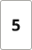
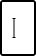
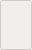
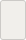

# Code Box

**Component · 10 variants** · Form Fields · source: MNG Design System ▸ Form Fields | 2026.09.24

## Figma references

- File: MNG Design System (`jFHYqhZbJjvWQmDI4myCsd`) · Page: Form Fields | 2026.09.24 · Frame path: Form Field & Code Box — Documentation ▸ Frame 12915 ▸ Frame 12939 ▸ Frame 12922 ▸ Frame 12923 ▸ Grid Content
- Main: [Code Box](https://www.figma.com/design/jFHYqhZbJjvWQmDI4myCsd/?node-id=6964-7032) · node `6964:7032` · key `4d7a04191cf151ff9cd05b60e78c1b05c49f20b0`

| Variant | Node | Key | Size | Preview |
|---|---|---|---|---|
| Size=Desktop, State=Blank | [6964:6999](https://www.figma.com/design/jFHYqhZbJjvWQmDI4myCsd/?node-id=6964-6999) | eb4a281a25dc2a29a2faf3e8036c96440b406922 | 36×56 |  |
| Size=Desktop, State=Filled | [6964:7000](https://www.figma.com/design/jFHYqhZbJjvWQmDI4myCsd/?node-id=6964-7000) | 0cbbdffab276986531e7f480639c27c797b42f05 | 36×56 |  |
| Size=Desktop, State=Focus | [6964:7008](https://www.figma.com/design/jFHYqhZbJjvWQmDI4myCsd/?node-id=6964-7008) | f0a48c484c3c3b8878edbc27208024fc98c409a7 | 36×56 |  |
| Size=Desktop, State=Error | [6964:7016](https://www.figma.com/design/jFHYqhZbJjvWQmDI4myCsd/?node-id=6964-7016) | 12bf2105030635d5da06cb9ec8b1f1d0226d5bcf | 36×56 |  |
| Size=Desktop, State=Disabled | [6964:7024](https://www.figma.com/design/jFHYqhZbJjvWQmDI4myCsd/?node-id=6964-7024) | 2a64cf37866fe198daeca7f0f4e48803f6b9ee32 | 36×56 |  |
| Size=Mobile, State=Blank | [6972:7524](https://www.figma.com/design/jFHYqhZbJjvWQmDI4myCsd/?node-id=6972-7524) | 19a71b11eb5b9b8b80b3527be3e996e07cab0da7 | 26×40 |  |
| Size=Mobile, State=Filled | [6972:7532](https://www.figma.com/design/jFHYqhZbJjvWQmDI4myCsd/?node-id=6972-7532) | 07551ddd5c05d784bf03a224f4ba12d6c0c33ea1 | 26×40 |  |
| Size=Mobile, State=Focus | [6972:7540](https://www.figma.com/design/jFHYqhZbJjvWQmDI4myCsd/?node-id=6972-7540) | 58397837a7f645f94418fc52b8eef07ba78f8528 | 26×40 |  |
| Size=Mobile, State=Error | [6972:7548](https://www.figma.com/design/jFHYqhZbJjvWQmDI4myCsd/?node-id=6972-7548) | a183dc8a209564788db50887d2ea8facd98a6b40 | 26×40 |  |
| Size=Mobile, State=Disabled | [6972:7556](https://www.figma.com/design/jFHYqhZbJjvWQmDI4myCsd/?node-id=6972-7556) | 306ca3f259a376e8085b4023e48689aa19b04020 | 26×40 |  |

## Properties

| Property | Type | Default | Options |
|---|---|---|---|
| Value | TEXT |  |  |
| Size | VARIANT | Desktop | Desktop, Mobile |
| State | VARIANT | Blank | Blank, Filled, Focus, Error, Disabled |

## Where it is used

- **Size=Desktop, State=Blank** — breakpoints: 768, 1024, 1100, 1280; nested inside: Form Field Assembly / Verification Code / Size=Desktop ×6; other pages: Form Fields | 2026.09.24 ▸ Form Field & Code Box — Documentation ×5
- **Size=Desktop, State=Filled** — breakpoints: 768, 1024, 1100, 1280; other pages: Form Fields | 2026.09.24 ▸ Form Field & Code Box — Documentation ×6
- **Size=Desktop, State=Focus** — breakpoints: 768, 1024, 1100, 1280; other pages: Form Fields | 2026.09.24 ▸ Form Field & Code Box — Documentation ×1
- **Size=Desktop, State=Error** — breakpoints: 768, 1024, 1100, 1280; no instances in this file
- **Size=Desktop, State=Disabled** — breakpoints: 768, 1024, 1100, 1280; no instances in this file
- **Size=Mobile, State=Blank** — breakpoints: 340, 360; nested inside: Form Field Assembly / Verification Code / Size=Mobile ×6; other pages: Form Fields | 2026.09.24 ▸ Form Field & Code Box — Documentation ×5
- **Size=Mobile, State=Filled** — breakpoints: 340, 360; other pages: Form Fields | 2026.09.24 ▸ Form Field & Code Box — Documentation ×6
- **Size=Mobile, State=Focus** — breakpoints: 340, 360; other pages: Form Fields | 2026.09.24 ▸ Form Field & Code Box — Documentation ×1
- **Size=Mobile, State=Error** — breakpoints: 340, 360; no instances in this file
- **Size=Mobile, State=Disabled** — breakpoints: 340, 360; no instances in this file

## Breakpoints

| Key | Viewport | Variant(s) |
|---|---|---|
| 340 | ≤639px (XS-Fold, built 340) | Size=Mobile, State=Blank, Size=Mobile, State=Filled, Size=Mobile, State=Focus, Size=Mobile, State=Error, Size=Mobile, State=Disabled |
| 360 | ≤639px (SM-Mobile, built 360) | Size=Mobile, State=Blank, Size=Mobile, State=Filled, Size=Mobile, State=Focus, Size=Mobile, State=Error, Size=Mobile, State=Disabled |
| 768 | 640–799px (MD-TabletV) | Size=Desktop, State=Blank, Size=Desktop, State=Filled, Size=Desktop, State=Focus, Size=Desktop, State=Error, Size=Desktop, State=Disabled |
| 1024 | 800–1039px (LG-TabletH, built 1009) | Size=Desktop, State=Blank, Size=Desktop, State=Filled, Size=Desktop, State=Focus, Size=Desktop, State=Error, Size=Desktop, State=Disabled |
| 1100 | ≥1040px (XL-Desktop, built 1085) | Size=Desktop, State=Blank, Size=Desktop, State=Filled, Size=Desktop, State=Focus, Size=Desktop, State=Error, Size=Desktop, State=Disabled |
| 1280 | ≥1040px (XL-Desktop, built 1280) | Size=Desktop, State=Blank, Size=Desktop, State=Filled, Size=Desktop, State=Focus, Size=Desktop, State=Error, Size=Desktop, State=Disabled |

## Responsive rules

- Size=Desktop, State=Blank: 36×56, horizontal gap 8 pad 8/0/8/0 main CENTER cross CENTER — renders at 768, 1024, 1100, 1280
- Size=Desktop, State=Filled: 36×56, horizontal gap 8 pad 8/0/8/0 main CENTER cross CENTER — renders at 768, 1024, 1100, 1280
- Size=Desktop, State=Focus: 36×56, horizontal gap 8 pad 8/0/8/0 main CENTER cross CENTER — renders at 768, 1024, 1100, 1280
- Size=Desktop, State=Error: 36×56, horizontal gap 8 pad 8/0/8/0 main CENTER cross CENTER — renders at 768, 1024, 1100, 1280
- Size=Desktop, State=Disabled: 36×56, horizontal gap 8 pad 8/0/8/0 main CENTER cross CENTER — renders at 768, 1024, 1100, 1280
- Size=Mobile, State=Blank: 26×40, horizontal gap 8 pad 8/0/8/0 main CENTER cross CENTER — renders at 340, 360
- Size=Mobile, State=Filled: 26×40, horizontal gap 8 pad 8/0/8/0 main CENTER cross CENTER — renders at 340, 360
- Size=Mobile, State=Focus: 26×40, horizontal gap 8 pad 8/0/8/0 main CENTER cross CENTER — renders at 340, 360
- Size=Mobile, State=Error: 26×40, horizontal gap 8 pad 8/0/8/0 main CENTER cross CENTER — renders at 340, 360
- Size=Mobile, State=Disabled: 26×40, horizontal gap 8 pad 8/0/8/0 main CENTER cross CENTER — renders at 340, 360

## Dependencies

**Built from:**

_Nothing — leaf component._

**Built into:**

- [Form Field Assembly / Verification Code](../../assemblies/54-form-field-assembly-verification-code/form-field-assembly-verification-code.md)

## Anatomy

**Size=Desktop, State=Blank**

```
- Size=Desktop, State=Blank — component 36×56 [horizontal gap 8] (fixed/fixed)
  - Text Container — frame 0×25 [horizontal gap 8] (hug/hug)
    - Value — text 0×25 (hug/hug) ""
  - Cursor Container — frame 3×20 [horizontal gap 8] (hug/hug) (hidden)
    - Cursor — boolean operation 3×20 (fixed/fixed)
      - Line 71 (Stroke) — vector 3×1
      - Line 72 (Stroke) — vector 3×1
      - Line 73 (Stroke) — vector 20×1
```

**Size=Desktop, State=Filled**

```
- Size=Desktop, State=Filled — component 36×56 [horizontal gap 8] (fixed/fixed)
  - Text Container — frame 11×25 [horizontal gap 8] (hug/hug)
    - Value — text 11×25 (hug/hug) "5"
  - Cursor Container — frame 3×20 [horizontal gap 8] (hug/hug) (hidden)
    - Cursor — boolean operation 3×20 (fixed/fixed)
      - Line 71 (Stroke) — vector 3×1
      - Line 72 (Stroke) — vector 3×1
      - Line 73 (Stroke) — vector 20×1
```

**Size=Desktop, State=Focus**

```
- Size=Desktop, State=Focus — component 36×56 [horizontal gap 8] (fixed/fixed)
  - Text Container — frame 0×25 [horizontal gap 8] (hug/hug)
    - Value — text 0×25 (hug/hug) ""
  - Cursor Container — frame 3×20 [horizontal gap 8] (hug/hug)
    - Cursor — boolean operation 3×20 (fixed/fixed)
      - Line 71 (Stroke) — vector 3×1
      - Line 72 (Stroke) — vector 3×1
      - Line 73 (Stroke) — vector 20×1
```

**Size=Desktop, State=Error**

```
- Size=Desktop, State=Error — component 36×56 [horizontal gap 8] (fixed/fixed)
  - Text Container — frame 0×25 [horizontal gap 8] (hug/hug)
    - Value — text 0×25 (hug/hug) ""
  - Cursor Container — frame 3×20 [horizontal gap 8] (hug/hug) (hidden)
    - Cursor — boolean operation 3×20 (fixed/fixed)
      - Line 71 (Stroke) — vector 3×1
      - Line 72 (Stroke) — vector 3×1
      - Line 73 (Stroke) — vector 20×1
```

**Size=Desktop, State=Disabled**

```
- Size=Desktop, State=Disabled — component 36×56 [horizontal gap 8] (fixed/fixed)
  - Text Container — frame 0×25 [horizontal gap 8] (hug/hug)
    - Value — text 0×25 (hug/hug) ""
  - Cursor Container — frame 3×20 [horizontal gap 8] (hug/hug) (hidden)
    - Cursor — boolean operation 3×20 (fixed/fixed)
      - Line 71 (Stroke) — vector 3×1
      - Line 72 (Stroke) — vector 3×1
      - Line 73 (Stroke) — vector 20×1
```

**Size=Mobile, State=Blank**

```
- Size=Mobile, State=Blank — component 26×40 [horizontal gap 8] (fixed/fixed)
  - Text Container — frame 0×22 [horizontal gap 8] (hug/hug)
    - Value — text 0×22 (hug/hug) ""
  - Cursor Container — frame 3×20 [horizontal gap 8] (hug/hug) (hidden)
    - Cursor — boolean operation 2.1×14 (fixed/fixed)
      - Line 71 (Stroke) — vector 2.1×0.7
      - Line 72 (Stroke) — vector 2.1×0.7
      - Line 73 (Stroke) — vector 14×0.7
```

**Size=Mobile, State=Filled**

```
- Size=Mobile, State=Filled — component 26×40 [horizontal gap 8] (fixed/fixed)
  - Text Container — frame 10×22 [horizontal gap 8] (hug/hug)
    - Value — text 10×22 (hug/hug) "5"
  - Cursor Container — frame 3×20 [horizontal gap 8] (hug/hug) (hidden)
    - Cursor — boolean operation 2.1×14 (fixed/fixed)
      - Line 71 (Stroke) — vector 2.1×0.7
      - Line 72 (Stroke) — vector 2.1×0.7
      - Line 73 (Stroke) — vector 14×0.7
```

**Size=Mobile, State=Focus**

```
- Size=Mobile, State=Focus — component 26×40 [horizontal gap 8] (fixed/fixed)
  - Text Container — frame 0×22 [horizontal gap 8] (hug/hug)
    - Value — text 0×22 (hug/hug) ""
  - Cursor Container — frame 2.1×14 [horizontal gap 8] (hug/hug)
    - Cursor — boolean operation 2.1×14 (fixed/fixed)
      - Line 71 (Stroke) — vector 2.1×0.7
      - Line 72 (Stroke) — vector 2.1×0.7
      - Line 73 (Stroke) — vector 14×0.7
```

**Size=Mobile, State=Error**

```
- Size=Mobile, State=Error — component 26×40 [horizontal gap 8] (fixed/fixed)
  - Text Container — frame 0×22 [horizontal gap 8] (hug/hug)
    - Value — text 0×22 (hug/hug) ""
  - Cursor Container — frame 3×20 [horizontal gap 8] (hug/hug) (hidden)
    - Cursor — boolean operation 2.1×14 (fixed/fixed)
      - Line 71 (Stroke) — vector 2.1×0.7
      - Line 72 (Stroke) — vector 2.1×0.7
      - Line 73 (Stroke) — vector 14×0.7
```

**Size=Mobile, State=Disabled**

```
- Size=Mobile, State=Disabled — component 26×40 [horizontal gap 8] (fixed/fixed)
  - Text Container — frame 0×22 [horizontal gap 8] (hug/hug)
    - Value — text 0×22 (hug/hug) ""
  - Cursor Container — frame 3×20 [horizontal gap 8] (hug/hug) (hidden)
    - Cursor — boolean operation 2.1×14 (fixed/fixed)
      - Line 71 (Stroke) — vector 2.1×0.7
      - Line 72 (Stroke) — vector 2.1×0.7
      - Line 73 (Stroke) — vector 14×0.7
```

## Size & layout

| Variant | Size | Width | Height | Auto-layout | Radius | Clip |
|---|---|---|---|---|---|---|
| Size=Desktop, State=Blank | 36×56 | FIXED | FIXED | horizontal gap 8 pad 8/0/8/0 main CENTER cross CENTER | 3 | yes |
| Size=Desktop, State=Filled | 36×56 | FIXED | FIXED | horizontal gap 8 pad 8/0/8/0 main CENTER cross CENTER | 3 | yes |
| Size=Desktop, State=Focus | 36×56 | FIXED | FIXED | horizontal gap 8 pad 8/0/8/0 main CENTER cross CENTER | 3 | yes |
| Size=Desktop, State=Error | 36×56 | FIXED | FIXED | horizontal gap 8 pad 8/0/8/0 main CENTER cross CENTER | 3 | yes |
| Size=Desktop, State=Disabled | 36×56 | FIXED | FIXED | horizontal gap 8 pad 8/0/8/0 main CENTER cross CENTER | 3 | yes |
| Size=Mobile, State=Blank | 26×40 | FIXED | FIXED | horizontal gap 8 pad 8/0/8/0 main CENTER cross CENTER | 3 | yes |
| Size=Mobile, State=Filled | 26×40 | FIXED | FIXED | horizontal gap 8 pad 8/0/8/0 main CENTER cross CENTER | 3 | yes |
| Size=Mobile, State=Focus | 26×40 | FIXED | FIXED | horizontal gap 8 pad 8/0/8/0 main CENTER cross CENTER | 3 | yes |
| Size=Mobile, State=Error | 26×40 | FIXED | FIXED | horizontal gap 8 pad 8/0/8/0 main CENTER cross CENTER | 3 | yes |
| Size=Mobile, State=Disabled | 26×40 | FIXED | FIXED | horizontal gap 8 pad 8/0/8/0 main CENTER cross CENTER | 3 | yes |

## Typography

| Layer | Font | Weight | Size | Line height | Letter sp. | Case | Color | Color token | Type token | Truncate | Sample | Variants |
|---|---|---|---|---|---|---|---|---|---|---|---|---|
| Value | Noto Sans | Bold | 18 | auto |  |  | #141414 | Colors/color/gray/min | font/size/18 |  | 5 | Size=Desktop, State=Filled |
| Value | Noto Sans | Bold | 16 | auto |  |  | #141414 | Colors/color/gray/min | font/size/16 |  | 5 | Size=Mobile, State=Filled |

## Color & effects

| Layer | Role | Type | Hex | Token | Opacity | Note |
|---|---|---|---|---|---|---|
| Size=Desktop, State=Blank | fill | SOLID | #FFFFFF | Colors/color/gray/max |  |  |
| Size=Desktop, State=Blank | stroke | SOLID | #A7A6A3 | Colors/color/gray/400 |  |  |
| Cursor | fill | SOLID | #000000 | Colors/color/gray/black |  |  |
| Line 71 (Stroke) | fill | SOLID | #000000 | Colors/color/gray/black |  |  |
| Line 72 (Stroke) | fill | SOLID | #000000 | Colors/color/gray/black |  |  |
| Line 73 (Stroke) | fill | SOLID | #000000 | Colors/color/gray/black |  |  |
| Size=Desktop, State=Filled | fill | SOLID | #FFFFFF | Colors/color/gray/max |  |  |
| Size=Desktop, State=Filled | stroke | SOLID | #A7A6A3 | Colors/color/gray/400 |  |  |
| Size=Desktop, State=Focus | fill | SOLID | #FFFFFF | Colors/color/gray/max |  |  |
| Size=Desktop, State=Focus | stroke | SOLID | #000000 | Colors/color/gray/black |  |  |
| Size=Desktop, State=Error | fill | SOLID | #FFFFFF | Colors/color/gray/max |  |  |
| Size=Desktop, State=Error | stroke | SOLID | #CC2B27 | Colors/color/feedback/high-error |  |  |
| Size=Desktop, State=Disabled | fill | SOLID | #F1EFEB | Colors/color/gray/600 |  |  |
| Size=Desktop, State=Disabled | stroke | SOLID | #CCCAC7 | Colors/color/gray/500 |  |  |
| Size=Mobile, State=Blank | fill | SOLID | #FFFFFF | Colors/color/gray/max |  |  |
| Size=Mobile, State=Blank | stroke | SOLID | #A7A6A3 | Colors/color/gray/400 |  |  |
| Size=Mobile, State=Filled | fill | SOLID | #FFFFFF | Colors/color/gray/max |  |  |
| Size=Mobile, State=Filled | stroke | SOLID | #A7A6A3 | Colors/color/gray/400 |  |  |
| Size=Mobile, State=Focus | fill | SOLID | #FFFFFF | Colors/color/gray/max |  |  |
| Size=Mobile, State=Focus | stroke | SOLID | #000000 | Colors/color/gray/black |  |  |
| Size=Mobile, State=Error | fill | SOLID | #FFFFFF | Colors/color/gray/max |  |  |
| Size=Mobile, State=Error | stroke | SOLID | #CC2B27 | Colors/color/feedback/high-error |  |  |
| Size=Mobile, State=Disabled | fill | SOLID | #F1EFEB | Colors/color/gray/600 |  |  |
| Size=Mobile, State=Disabled | stroke | SOLID | #CCCAC7 | Colors/color/gray/500 |  |  |

## Image ratios

_None._

## Ad slots

_None._

## Production references

_None found in descriptions or layer names._

## Known issues

- 4 of 10 variants have no instances anywhere in MNG Design System (unused, or used only from another file): `Size=Desktop, State=Error`, `Size=Desktop, State=Disabled`, `Size=Mobile, State=Error`, `Size=Mobile, State=Disabled`.

## Rendering steps

1. Pick the variant for the target breakpoint from the Breakpoints table (property values in `code-box.json` → `variants[].variantProperties`).
2. Start from `code-box.html` — each `<section>` is one variant; auto-layout is already mapped to flexbox and colors use `tokens.css` variables.
3. Replace every dashed `data-component` box with the referenced component's own skeleton (links under Dependencies); leave `data-component` on the wrapper.
4. Fill image slots at the ratio listed in Image ratios; fill text using the Typography table (truncate where a line clamp is listed).
5. Check against the preview PNG, then against the production references.
