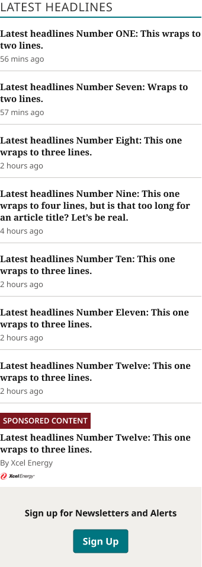
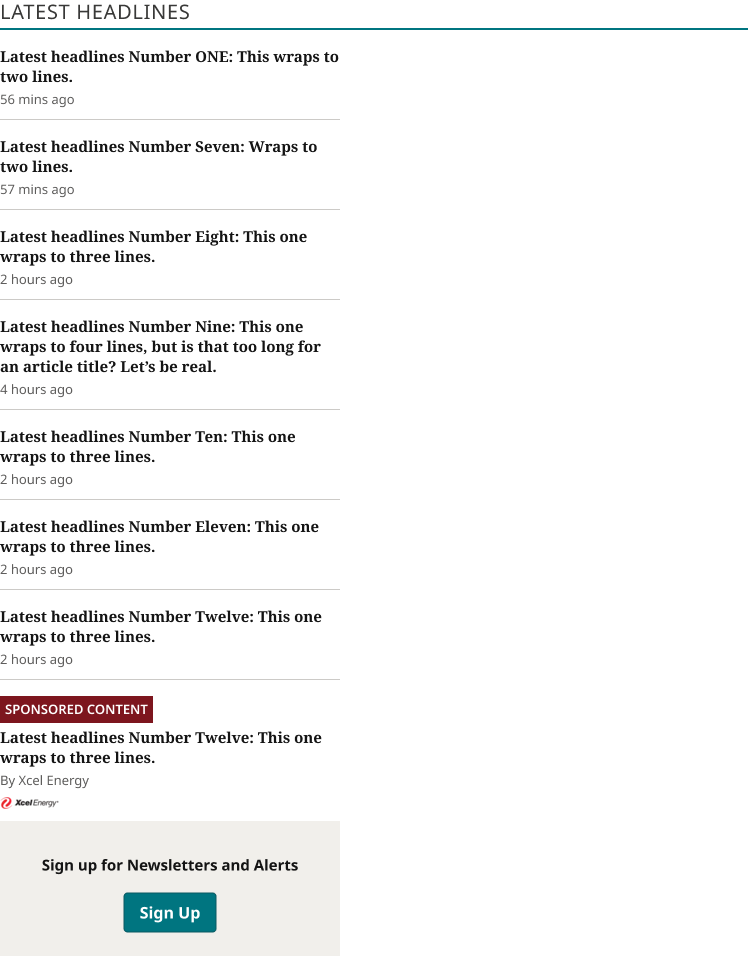
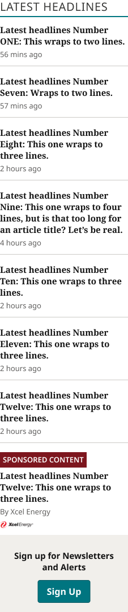

# Latest Headlines

**Assembly · 3 variants** · Homepage components · source: WordPress Elements ▸ Homepage

> Component set · Variant: Device = Mobile, Tablet, Desktop · the Latest Headlines rail (Section Title / Eyebrow + Latest Headlines List Items + Newsletter Signup), reused as an instance inside TOP ZONE Block.

## Figma references

- File: WordPress Elements (`b1iZxkFwtAYq9rElmnCAzd`) · Page: Homepage
- Main: [Latest Headlines](https://www.figma.com/design/b1iZxkFwtAYq9rElmnCAzd/?node-id=3476-62396) · node `3476:62396` · key `a8093d9af051cf493da6a481a57b6c9119f9cbbf`

| Variant | Node | Key | Size | Preview |
|---|---|---|---|---|
| Device=Mobile | [3476:62139](https://www.figma.com/design/b1iZxkFwtAYq9rElmnCAzd/?node-id=3476-62139) | fdf6620bccc9079d978b0f9d5cbbcfbc2743933e | 340×956 |  |
| Device=Tablet | [3476:62152](https://www.figma.com/design/b1iZxkFwtAYq9rElmnCAzd/?node-id=3476-62152) | 5e8a706cadc9d3dbe19b182704b8363d2ef5cc97 | 748×956 |  |
| Device=Desktop | [3476:62164](https://www.figma.com/design/b1iZxkFwtAYq9rElmnCAzd/?node-id=3476-62164) | a2c7b927a88ecebee35ce713ec819df5e57119f4 | 226×1072 |  |

## Properties

| Property | Type | Default | Options |
|---|---|---|---|
| Device | VARIANT | Mobile | Mobile, Tablet, Desktop |

## Where it is used

- **Device=Mobile** — breakpoints: 340, 360; templates (via assembly): Mobile HomePage (via TOP ZONE Block), 340 HomePage (via TOP ZONE Block); nested inside: TOP ZONE Block / Device=Mobile ×1
- **Device=Tablet** — breakpoints: 768; templates (via assembly): 768 HomePage (via TOP ZONE Block); nested inside: TOP ZONE Block / Device=Tablet ×1
- **Device=Desktop** — breakpoints: 1280; templates (via assembly): Desktop HomePage (via TOP ZONE Block); nested inside: TOP ZONE Block / Device=Desktop ×1

## Breakpoints

| Key | Viewport | Variant(s) |
|---|---|---|
| 340 | ≤639px (XS-Fold, built 340) | Device=Mobile |
| 360 | ≤639px (SM-Mobile, built 360) | Device=Mobile |
| 768 | 640–799px (MD-TabletV) | Device=Tablet |
| 1280 | ≥1040px (XL-Desktop, built 1280) | Device=Desktop |

## Responsive rules

- Device=Mobile: 340×956, vertical gap 12 pad 0/0/0/0 main MIN cross MIN — renders at 340, 360
- Device=Tablet: 748×956, vertical gap 12 pad 0/0/0/0 main MIN cross MIN — renders at 768
- Device=Desktop: 226×1072, vertical gap 12 pad 0/0/0/0 main MIN cross MIN — renders at 1280

## Dependencies

**Built from:**

- [Section Title / Eyebrow](../../components/06-section-title-eyebrow/section-title-eyebrow.md) ×1
- [Latest Headlines List Item](../../components/07-latest-headlines-list-item/latest-headlines-list-item.md) ×8
- [Newsletter Signup](../../components/08-newsletter-signup/newsletter-signup.md) ×1

**Built into:**

- [TOP ZONE Block](../12-top-zone-block/top-zone-block.md)

## Anatomy

**Device=Mobile**

```
- Device=Mobile — component 340×956 [vertical gap 12] (fixed/hug)
  - Header Container — frame 340×34 [vertical gap 8] (fill/hug)
    - Section Title / Eyebrow — instance 340×30 [vertical gap 6] (fill/hug) → Section Title / Eyebrow [Style=Underline]
  - Latest Headlines List Item — instance 340×62 [vertical gap 4] (fixed/hug) → Latest Headlines List Item [Type=First]
  - Latest Headlines List Item — instance 340×78 [vertical gap 16] (fixed/hug) → Latest Headlines List Item [Type=Standard] ×2
  - Latest Headlines List Item — instance 340×98 [vertical gap 16] (fixed/hug) → Latest Headlines List Item [Type=Standard]
  - Latest Headlines List Item — instance 340×78 [vertical gap 16] (fixed/hug) → Latest Headlines List Item [Type=Standard] ×3
  - Latest Headlines List Item — instance 340×129 [vertical gap 16] (fixed/hug) → Latest Headlines List Item [Type=Sponsored]
  - Newsletter Signup — instance 340×135 [vertical gap 8] (fixed/fixed) → Newsletter Signup [Device=Mobile]
```

**Device=Tablet**

```
- Device=Tablet — component 748×956 [vertical gap 12] (fixed/hug)
  - Header Container — frame 748×34 [vertical gap 8] (fill/hug)
    - Section Title / Eyebrow — instance 748×30 [vertical gap 6] (fill/hug) → Section Title / Eyebrow [Style=Underline]
  - Latest Headlines List Item — instance 340×62 [vertical gap 4] (fixed/hug) → Latest Headlines List Item [Type=First]
  - Latest Headlines List Item — instance 340×78 [vertical gap 16] (fixed/hug) → Latest Headlines List Item [Type=Standard] ×2
  - Latest Headlines List Item — instance 340×98 [vertical gap 16] (fixed/hug) → Latest Headlines List Item [Type=Standard]
  - Latest Headlines List Item — instance 340×78 [vertical gap 16] (fixed/hug) → Latest Headlines List Item [Type=Standard] ×3
  - Latest Headlines List Item — instance 340×129 [vertical gap 16] (fixed/hug) → Latest Headlines List Item [Type=Sponsored]
  - Newsletter Signup — instance 340×135 [vertical gap 8] (fixed/fixed) → Newsletter Signup [Device=Mobile]
```

**Device=Desktop**

```
- Device=Desktop — component 226×1072 [vertical gap 12] (fixed/hug)
  - Section Title / Eyebrow — instance 226×30 [vertical gap 6] (fill/hug) → Section Title / Eyebrow [Style=Underline]
  - Latest Headlines List Item — instance 226×62 [vertical gap 4] (fixed/hug) → Latest Headlines List Item [Type=First]
  - Latest Headlines List Item — instance 226×78 [vertical gap 16] (fixed/hug) → Latest Headlines List Item [Type=Standard]
  - Latest Headlines List Item — instance 226×98 [vertical gap 16] (fixed/hug) → Latest Headlines List Item [Type=Standard]
  - Latest Headlines List Item — instance 226×118 [vertical gap 16] (fixed/hug) → Latest Headlines List Item [Type=Standard]
  - Latest Headlines List Item — instance 226×98 [vertical gap 16] (fixed/hug) → Latest Headlines List Item [Type=Standard] ×3
  - Latest Headlines List Item — instance 226×149 [vertical gap 16] (fixed/hug) → Latest Headlines List Item [Type=Sponsored]
  - Newsletter Signup — instance 226×135 [vertical gap 8] (fixed/fixed) → Newsletter Signup [Device=Desktop]
```

## Size & layout

| Variant | Size | Width | Height | Auto-layout | Radius | Clip |
|---|---|---|---|---|---|---|
| Device=Mobile | 340×956 | FIXED | HUG | vertical gap 12 pad 0/0/0/0 main MIN cross MIN |  |  |
| Device=Tablet | 748×956 | FIXED | HUG | vertical gap 12 pad 0/0/0/0 main MIN cross MIN |  |  |
| Device=Desktop | 226×1072 | FIXED | HUG | vertical gap 12 pad 0/0/0/0 main MIN cross MIN |  |  |

## Typography

_No text._

## Color & effects

| Layer | Role | Type | Hex | Token | Opacity | Note |
|---|---|---|---|---|---|---|
| Device=Mobile | fill | SOLID | #FFFFFF | Colors/color/gray/max |  |  |
| Header Container | fill | SOLID | #FFFFFF | Colors/color/gray/max |  |  |
| Latest Headlines List Item | fill | SOLID | #FFFFFF | Colors/color/gray/max |  |  |
| Newsletter Signup | fill | SOLID | #F1EFEB | Colors/color/gray/600 |  |  |
| Device=Tablet | fill | SOLID | #FFFFFF | Colors/color/gray/max |  |  |
| Device=Desktop | fill | SOLID | #FFFFFF | Colors/color/gray/max |  |  |

## Image ratios

_None._

## Ad slots

_None._

## Production references

_None found in descriptions or layer names._

## Known issues

- At 1024 and 1100 Latest Headlines sits inside the detached TOP ZONE copies, so those breakpoints are not counted above.

## Rendering steps

1. Pick the variant for the target breakpoint from the Breakpoints table (property values in `latest-headlines.json` → `variants[].variantProperties`).
2. Start from `latest-headlines.html` — each `<section>` is one variant; auto-layout is already mapped to flexbox and colors use `tokens.css` variables.
3. Replace every dashed `data-component` box with the referenced component's own skeleton (links under Dependencies); leave `data-component` on the wrapper.
4. Fill image slots at the ratio listed in Image ratios; fill text using the Typography table (truncate where a line clamp is listed).
5. Check against the preview PNG, then against the production references.
