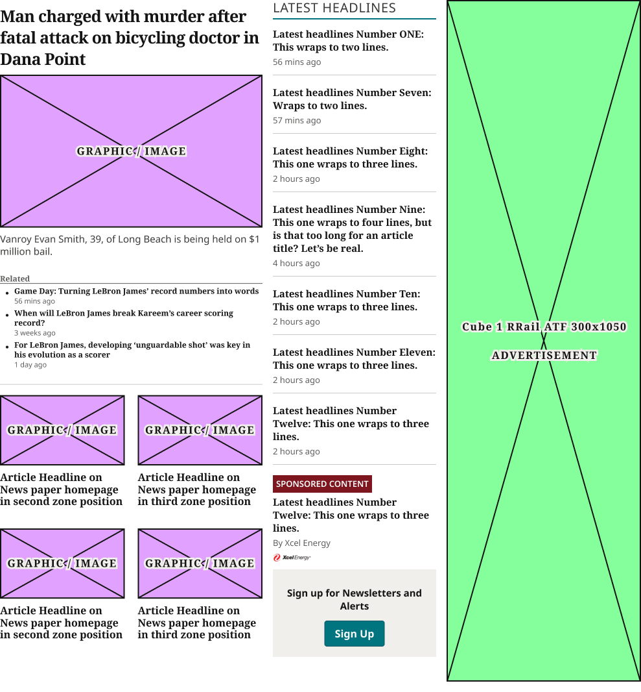
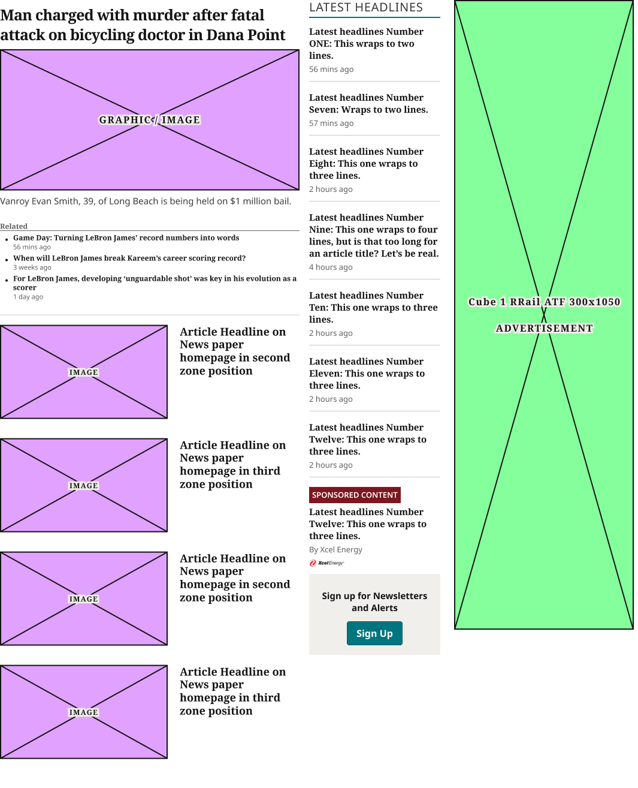

# TOP ZONE Block

**Assembly · 5 variants** · Homepage components · source: WordPress Elements ▸ Homepage

> Component set · Variant: Device = Desktop, Mobile · reused as instances in the assembled Desktop and Mobile pages and in both raw section libraries (Home Page Sections, Frame 12027).

## Figma references

- File: WordPress Elements (`b1iZxkFwtAYq9rElmnCAzd`) · Page: Homepage
- Main: [TOP ZONE Block](https://www.figma.com/design/b1iZxkFwtAYq9rElmnCAzd/?node-id=3352-19482) · node `3352:19482` · key `7a4ff4e26dbe4cde51851d2fa71c64f0c4f6ddd1`

| Variant | Node | Key | Size | Preview |
|---|---|---|---|---|
| Device=Mobile | [3352:19481](https://www.figma.com/design/b1iZxkFwtAYq9rElmnCAzd/?node-id=3352-19481) | 6f47ee23795007df62f06ec3ef7f576a1c87eb75 | 340×2378.7 |  |
| Device=Desktop | [3352:19480](https://www.figma.com/design/b1iZxkFwtAYq9rElmnCAzd/?node-id=3352-19480) | 36fdd688499b8f976a904d80a176e92d829057d4 | 1264×1088 |  |
| Device=Tablet | [3383:46168](https://www.figma.com/design/b1iZxkFwtAYq9rElmnCAzd/?node-id=3383-46168) | b4a1a32615aabad34160c7c1eb0c826d46033f51 | 748×1787 |  |
| Device=1024 | [3553:32881](https://www.figma.com/design/b1iZxkFwtAYq9rElmnCAzd/?node-id=3553-32881) | b48f78878f58785c9a3bfa7f2babad967900c32d | 989×1066 |  |
| Device=1100 | [3553:33340](https://www.figma.com/design/b1iZxkFwtAYq9rElmnCAzd/?node-id=3553-33340) | a2e3848a12d934ff77250990ec1fff1c9418267c | 1065×1313.7 |  |

## Properties

| Property | Type | Default | Options |
|---|---|---|---|
| Device | VARIANT | Mobile | Desktop, Mobile, Tablet, 1024, 1100 |

## Where it is used

- **Device=Mobile** — breakpoints: 340, 360; templates (direct): Mobile HomePage ×1, 340 HomePage ×1
- **Device=Desktop** — breakpoints: 1280; templates (direct): Desktop HomePage ×1
- **Device=Tablet** — breakpoints: 768; templates (direct): 768 HomePage ×1
- **Device=1024** — breakpoints: 1024; templates (direct): 1024 HomePage ×1
- **Device=1100** — breakpoints: 1100; templates (direct): 1100 HomePage ×1

## Breakpoints

| Key | Viewport | Variant(s) |
|---|---|---|
| 340 | ≤639px (XS-Fold, built 340) | Device=Mobile |
| 360 | ≤639px (SM-Mobile, built 360) | Device=Mobile |
| 768 | 640–799px (MD-TabletV) | Device=Tablet |
| 1024 | 800–1039px (LG-TabletH, built 1009) | Device=1024 |
| 1100 | ≥1040px (XL-Desktop, built 1085) | Device=1100 |
| 1280 | ≥1040px (XL-Desktop, built 1280) | Device=Desktop |

## Responsive rules

- Desktop (checked against the preview): three columns. Left: Zone 1 lead card (headline + image side by side) over a 2×2 grid of TopZone cards. Middle: Latest Headlines rail with a sponsored item and newsletter signup. Right: a tall 300×1050 rail ad.
- Tablet: lead card and image across the top, then a 2×2 group of horizontal thumbnail cards, then Latest Headlines full width, with a 300×250 cube ad at the bottom.
- Mobile: one column. The lead card stacks headline → image → dek → related list, followed by four horizontal thumbnail cards, Latest Headlines, and a 300×250 cube ad.
- 1100 (checked against production on 6 sites): lead card over four stacked horizontal TopZone Article Card Device=1100 cards (280×157 image, 18/21.6 CardTertiaryRow headline), then the Latest Headlines column and a 300×1050 rail ad.
- 1024 (checked against production on 6 sites): lead card over a 2×2 grid of vertical TopZone Article Card Device=1024 cards (16:9 image, 16/18.88 CardTertiaryCompact headline), 20px gaps, then Latest Headlines and the rail ad.
- Device=Mobile: 340×2378.7, vertical gap 16 pad 0/0/0/0 main MIN cross MIN — renders at 340, 360
- Device=Desktop: 1264×1088, horizontal gap 16 pad 0/0/16/0 main CENTER cross MIN — renders at 1280
- Device=Tablet: 748×1787, vertical gap 16 pad 0/0/0/0 main MIN cross MIN — renders at 768
- Device=1024: 989×1066, horizontal gap 16 pad 0/0/16/0 main CENTER cross MIN — renders at 1024
- Device=1100: 1065×1313.7, horizontal gap 16 pad 0/0/16/0 main CENTER cross MIN — renders at 1100

## Dependencies

**Built from:**

- [Zone 1 Lead Article Card](../../components/04-zone-1-lead-article-card/zone-1-lead-article-card.md) ×1
- [TopZone Article Card](../../components/05-topzone-article-card/topzone-article-card.md) ×4
- [Latest Headlines](../09-latest-headlines/latest-headlines.md) ×1
- Ad Blocks ×1 _(not in this export)_
- [Horizontal Thumbnail Card](../../components/11-horizontal-thumbnail-card/horizontal-thumbnail-card.md) ×4

**Built into:**

_Not used inside another exported item._

## Anatomy

**Device=Mobile**

```
- Device=Mobile — component 340×2378.7 [vertical gap 16] (fixed/hug)
  - TOP Zones 1-5 MOBILE — frame 340×1140.7 [vertical gap 16] (fill/hug)
    - Zone 1 Lead Article Card — instance 340×648.7 [vertical gap 8] (fixed/hug) → Zone 1 Lead Article Card [Device=Mobile]
    - TopZone Article Card — instance 340×107 [vertical gap 16] (fill/hug) → TopZone Article Card [Device=Mobile] ×4
  - Latest Headlines — instance 340×956 [vertical gap 12] (fixed/hug) → Latest Headlines [Device=Mobile]
  - Ad Block Container — frame 340×250 [vertical gap 16] (fill/hug)
    - Ad Blocks — instance 300×250 [vertical gap 8] (fixed/fixed) → Ad Blocks [Device=All, Name=Cube 1 RRail ATF 300x250]
```

**Device=Desktop**

```
- Device=Desktop — component 1264×1088 [horizontal gap 16] (fixed/hug)
  - Lead Column — frame 706×910.9 [vertical gap 0] (fixed/hug)
    - Zone 1 Lead Article Card — instance 706×349 [horizontal gap 20] (hug/hug) → Zone 1 Lead Article Card [Device=Desktop]
    - Top Zones 2-5 — frame 706×280.9 [horizontal gap 20] (fill/hug)
      - TopZone Article Card — instance 343×264.9 [vertical gap 8] (fill/hug) → TopZone Article Card [Device=Desktop] ×2
    - Top Zones 2-5 — frame 706×280.9 [horizontal gap 20] (fill/hug)
      - TopZone Article Card — instance 343×264.9 [vertical gap 8] (fill/hug) → TopZone Article Card [Device=Desktop] ×2
  - Latest Headlines — instance 226×1072 [vertical gap 12] (fixed/hug) → Latest Headlines [Device=Desktop]
  - Right Rail — frame 300×1050 [vertical gap 16] (fixed/hug)
    - Ad Blocks — instance 300×1050 [vertical gap 8] (fixed/fixed) → Ad Blocks [Device=Desktop, Name=Cube 1 RRail ATF 300x1050]
```

**Device=Tablet**

```
- Device=Tablet — component 748×1787 [vertical gap 16] (fixed/hug)
  - TOP Zones 1-5 TABLET — frame 748×549 [vertical gap 16] (fill/hug)
    - Zone 1 Lead Article Card — instance 748×349 [horizontal gap 32] (hug/hug) → Zone 1 Lead Article Card [Device=Tablet]
    - TopZone Secondary Grid TABLET — frame 748×184 [vertical gap 16] (fixed/hug)
      - Row 1 — frame 748×84 [horizontal gap 32] (hug/hug) ×2
      - Row 2 — frame 748×84 [horizontal gap 32] (hug/hug) ×2
  - Latest Headlines — instance 748×956 [vertical gap 12] (fixed/hug) → Latest Headlines [Device=Tablet]
  - Ad Block Container — frame 748×250 [vertical gap 16] (fill/hug)
    - Ad Blocks — instance 300×250 [vertical gap 8] (fixed/fixed) → Ad Blocks [Device=All, Name=Cube 1 RRail ATF 300x250]
```

**Device=1024**

```
- Device=1024 — component 989×1066 [horizontal gap 16] (fixed/hug)
  - Frame 11645 — frame 405×1019.2 [vertical gap 0] (fixed/hug)
    - Zone 1 Lead Article Card (1024, Tier 3 — Device=Mobile variant swapped in, matches real production vertical-stack layout at 800-1279px) — instance 405×608.7 [vertical gap 8] (fill/hug) → Zone 1 Lead Article Card [Device=Mobile]
    - Top Zones 2-5 — frame 405×205.3 [horizontal gap 20] (fill/hug)
      - TopZone Article Card — instance 192.5×189.3 [vertical gap 8] (fill/hug) → TopZone Article Card [Device=1024] ×2
    - Top Zones 2-5 — frame 405×205.3 [horizontal gap 20] (fill/hug)
      - TopZone Article Card — instance 192.5×189.3 [vertical gap 8] (fill/hug) → TopZone Article Card [Device=1024] ×2
  - Latest Headlines — instance 252×1012 [vertical gap 12] (fill/hug) → Latest Headlines [Device=Desktop]
  - Right Rail — frame 300×1050 [vertical gap 16] (fixed/hug)
    - Ad Blocks — instance 300×1050 [vertical gap 8] (fixed/fixed) → Ad Blocks [Device=Desktop, Name=Cube 1 RRail ATF 300x1050]
```

**Device=1100**

```
- Device=1100 — component 1065×1313.7 [horizontal gap 16] (fixed/hug)
  - Frame 11645 — frame 500×1297.7 [vertical gap 0] (fixed/hug)
    - Zone 1 Lead Article Card (1100, Tier 4 — Device=Mobile variant swapped in, matches real production vertical-stack layout at 800-1279px) — instance 500×541.7 [vertical gap 8] (fill/hug) → Zone 1 Lead Article Card [Device=Mobile]
    - Top Zones 2-5 — frame 500×756 [vertical gap 16] (fill/hug)
      - TopZone Article Card — instance 500×173 [vertical gap 16] (fill/hug) → TopZone Article Card [Device=1100] ×4
  - Latest Headlines — instance 219×1092 [vertical gap 12] (fill/hug) → Latest Headlines [Device=Desktop]
  - Right Rail — frame 314×1050 [vertical gap 16] (fixed/hug)
    - Ad Blocks — instance 300×1050 [vertical gap 8] (fixed/fixed) → Ad Blocks [Device=Desktop, Name=Cube 1 RRail ATF 300x1050]
```

## Size & layout

| Variant | Size | Width | Height | Auto-layout | Radius | Clip |
|---|---|---|---|---|---|---|
| Device=Mobile | 340×2378.7 | FIXED | HUG | vertical gap 16 pad 0/0/0/0 main MIN cross MIN |  |  |
| Device=Desktop | 1264×1088 | FIXED | HUG | horizontal gap 16 pad 0/0/16/0 main CENTER cross MIN |  |  |
| Device=Tablet | 748×1787 | FIXED | HUG | vertical gap 16 pad 0/0/0/0 main MIN cross MIN |  |  |
| Device=1024 | 989×1066 | FIXED | HUG | horizontal gap 16 pad 0/0/16/0 main CENTER cross MIN |  |  |
| Device=1100 | 1065×1313.7 | FIXED | HUG | horizontal gap 16 pad 0/0/16/0 main CENTER cross MIN |  |  |

## Typography

_No text._

## Color & effects

| Layer | Role | Type | Hex | Token | Opacity | Note |
|---|---|---|---|---|---|---|
| Zone 1 Lead Article Card | fill | SOLID | #FFFFFF | Colors/color/gray/max |  |  |
| TopZone Article Card | fill | SOLID | #FFFFFF | Colors/color/gray/max |  |  |
| Latest Headlines | fill | SOLID | #FFFFFF | Colors/color/gray/max |  |  |
| Ad Blocks | fill | SOLID | #85FF9B |  |  |  |
| Ad Blocks | stroke | SOLID | #141414 | Colors/color/gray/min |  |  |
| Device=Desktop | fill | SOLID | #FFFFFF | Colors/color/gray/max |  |  |
| Device=1024 | fill | SOLID | #FFFFFF | Colors/color/gray/max |  |  |
| Zone 1 Lead Article Card (1024, Tier 3 — Device=Mobile varia | fill | SOLID | #FFFFFF | Colors/color/gray/max |  |  |
| Device=1100 | fill | SOLID | #FFFFFF | Colors/color/gray/max |  |  |
| Zone 1 Lead Article Card (1100, Tier 4 — Device=Mobile varia | fill | SOLID | #FFFFFF | Colors/color/gray/max |  |  |

## Image ratios

_None._

## Ad slots

| Variant | Layer | Unit | Size |
|---|---|---|---|
| Device=Mobile | Ad Block Container |  | 340×250 |
| Device=Mobile | Ad Blocks | Cube 1 RRail ATF 300x250 | 300×250 |
| Device=Desktop | Ad Blocks | Cube 1 RRail ATF 300x1050 | 300×1050 |
| Device=Tablet | Ad Block Container |  | 748×250 |
| Device=Tablet | Ad Blocks | Cube 1 RRail ATF 300x250 | 300×250 |
| Device=1024 | Ad Blocks | Cube 1 RRail ATF 300x1050 | 300×1050 |
| Device=1100 | Ad Blocks | Cube 1 RRail ATF 300x1050 | 300×1050 |

## Production references

_None found in descriptions or layer names._

## Known issues

_None detected._

## Rendering steps

1. Pick the variant for the target breakpoint from the Breakpoints table (property values in `top-zone-block.json` → `variants[].variantProperties`).
2. Start from `top-zone-block.html` — each `<section>` is one variant; auto-layout is already mapped to flexbox and colors use `tokens.css` variables.
3. Replace every dashed `data-component` box with the referenced component's own skeleton (links under Dependencies); leave `data-component` on the wrapper.
4. Fill image slots at the ratio listed in Image ratios; fill text using the Typography table (truncate where a line clamp is listed).
5. Check against the preview PNG, then against the production references.
