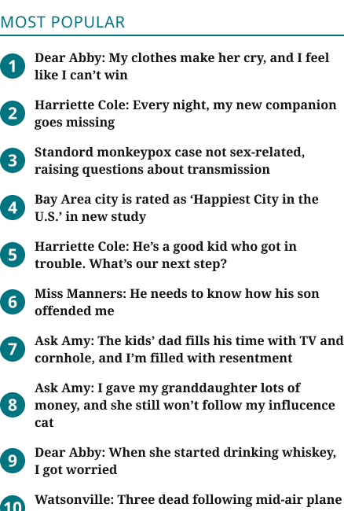
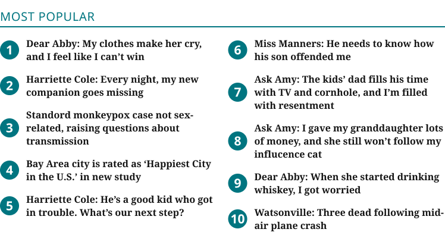
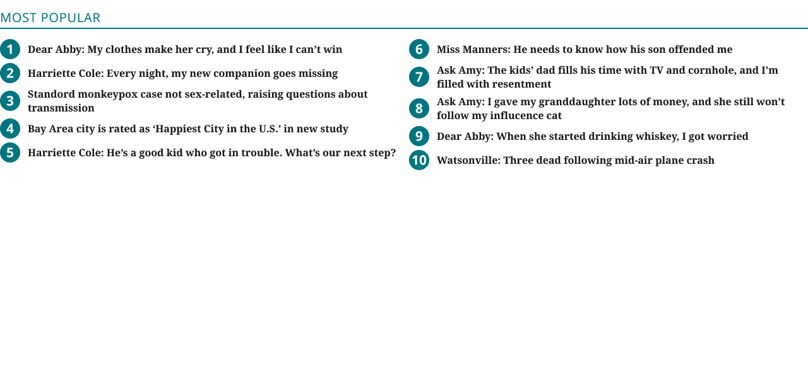
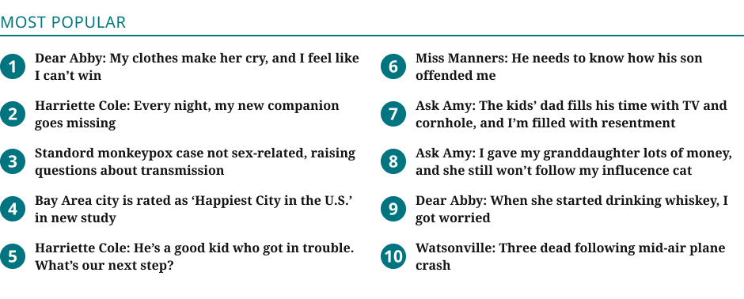
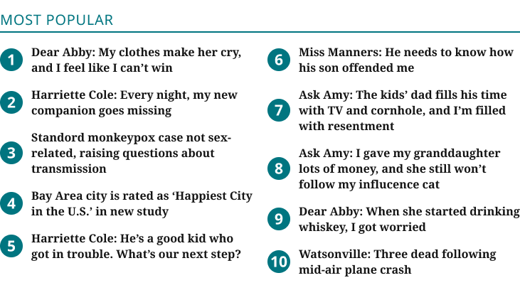
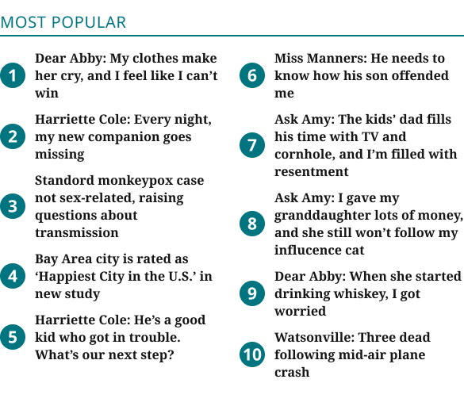

# Blueconic Block (Most Popular)

**Assembly · 6 variants** · Homepage components · source: WordPress Elements ▸ Homepage

> Component set · Variant: Device = Desktop, Mobile · reused as instances in the assembled Desktop and Mobile pages and in both raw section libraries.

## Figma references

- File: WordPress Elements (`b1iZxkFwtAYq9rElmnCAzd`) · Page: Homepage
- Main: [Blueconic Block (Most Popular)](https://www.figma.com/design/b1iZxkFwtAYq9rElmnCAzd/?node-id=3352-20526) · node `3352:20526` · key `82f5635bacf305c14f58abc48d2f3eadf4a3258f`

| Variant | Node | Key | Size | Preview |
|---|---|---|---|---|
| Device=Mobile | [3352:20525](https://www.figma.com/design/b1iZxkFwtAYq9rElmnCAzd/?node-id=3352-20525) | 2369e9662f5695c6f298f9e06e82f7a206147afa | 438×700 |  |
| Device=Tablet | [3383:46926](https://www.figma.com/design/b1iZxkFwtAYq9rElmnCAzd/?node-id=3383-46926) | fb617dc46b7ad6d451fe1864c6f5a29eeca9dc9c | 748×422 |  |
| Device=Desktop | [3352:20524](https://www.figma.com/design/b1iZxkFwtAYq9rElmnCAzd/?node-id=3352-20524) | acff982b4c1448f9efd7dc4e472a3a4a60e0db18 | 1280×600 |  |
| Device=1280 | [3552:31762](https://www.figma.com/design/b1iZxkFwtAYq9rElmnCAzd/?node-id=3552-31762) | 11dd31de130ac48de28a9ec47f72eb379fdfca63 | 940×378 |  |
| Device=1100 | [3552:32224](https://www.figma.com/design/b1iZxkFwtAYq9rElmnCAzd/?node-id=3552-32224) | 1c6ffa5dbf37f02262327b537cd1f77bc2991fcb | 731×422 |  |
| Device=1024 | [3553:32692](https://www.figma.com/design/b1iZxkFwtAYq9rElmnCAzd/?node-id=3553-32692) | 681e2885775557868123c72e83ae38681c4a8aa6 | 585×512 |  |

## Properties

| Property | Type | Default | Options |
|---|---|---|---|
| Device | VARIANT | Mobile | Desktop, Mobile, Tablet, 1280, 1100, 1024 |

## Where it is used

- **Device=Mobile** — breakpoints: 340, 360; templates (direct): Mobile HomePage ×1, 340 HomePage ×1
- **Device=Tablet** — breakpoints: 768; templates (direct): 768 HomePage ×1
- **Device=Desktop** — breakpoints: 1100, 1280; no instances in this file
- **Device=1280** — breakpoints: 1280; templates (direct): Desktop HomePage ×1
- **Device=1100** — breakpoints: 1100; templates (direct): 1100 HomePage ×1
- **Device=1024** — breakpoints: 1024; templates (direct): 1024 HomePage ×1

## Breakpoints

| Key | Viewport | Variant(s) |
|---|---|---|
| 340 | ≤639px (XS-Fold, built 340) | Device=Mobile |
| 360 | ≤639px (SM-Mobile, built 360) | Device=Mobile |
| 768 | 640–799px (MD-TabletV) | Device=Tablet |
| 1024 | 800–1039px (LG-TabletH, built 1009) | Device=1024 |
| 1100 | ≥1040px (XL-Desktop, built 1085) | Device=Desktop, Device=1100 |
| 1280 | ≥1040px (XL-Desktop, built 1280) | Device=Desktop, Device=1280 |

## Responsive rules

- Device=1024 / 1100 / 1280 are the content column only; the ad sits in the template's rail. Device=Desktop (full width, no rail) is not used by any template.
- Most Popular List Item stays 44px; the column gap adds the spacing production shows (60px rows for one-line items): 16 (`spacing/200`) at 360, 768, 1100 and 1280, 11 at 1024. Column gaps: 19 at 768 and 1024, 21 at 1100, 22 at 1280. See production-vs-design entry 27.
- Device=Mobile: 438×700, vertical gap 16 pad 0/0/0/0 main MIN cross CENTER — renders at 340, 360
- Device=Tablet: 748×422, vertical gap 16 pad 0/0/0/0 main MIN cross CENTER — renders at 768
- Device=Desktop: 1280×600, horizontal gap 16 pad 0/0/0/0 main MIN cross MIN — renders at 1100, 1280
- Device=1280: 940×378, vertical gap 16 pad 0/0/0/0 main MIN cross CENTER — renders at 1280
- Device=1100: 731×422, vertical gap 16 pad 0/0/0/0 main MIN cross CENTER — renders at 1100
- Device=1024: 585×512, vertical gap 16 pad 0/0/0/0 main MIN cross CENTER — renders at 1024

## Dependencies

**Built from:**

- [Section Title / Eyebrow](../../components/06-section-title-eyebrow/section-title-eyebrow.md) ×1
- [Most Popular List Item](../../components/13-most-popular-list-item/most-popular-list-item.md) ×10

**Built into:**

_Not used inside another exported item._

## Anatomy

**Device=Mobile**

```
- Device=Mobile — component 438×700 [vertical gap 16] (fixed/hug)
  - Content Container — frame 438×700 [vertical gap 0] (fill/hug)
    - Blueconic Header MOBILE — frame 438×30 [vertical gap 4] (fill/hug)
      - Section Title / Eyebrow — instance 438×30 [vertical gap 6] (fill/hug) → Section Title / Eyebrow [Style=Underline]
    - List Container — frame 438×638 [horizontal gap 16] (fill/hug)
      - 1st Column — frame 438×606 [vertical gap 16] (fill/hug) ×7 ×2
```

**Device=Tablet**

```
- Device=Tablet — component 748×422 [vertical gap 16] (fixed/hug)
  - Content Container — frame 748×422 [vertical gap 0] (fill/hug)
    - Blueconic Header MOBILE — frame 748×30 [vertical gap 4] (fill/hug)
      - Section Title / Eyebrow — instance 748×30 [vertical gap 6] (fill/hug) → Section Title / Eyebrow [Style=Underline]
    - List Container — frame 748×360 [horizontal gap 19] (fill/hug)
      - 1st Column — frame 364.5×306 [vertical gap 16] (fill/hug) ×2 ×2
      - 2nd Column — frame 364.5×328 [vertical gap 16] (fill/hug) ×2 ×2
```

**Device=Desktop**

```
- Device=Desktop — component 1280×600 [horizontal gap 16] (fixed/fixed)
  - Content Container — frame 1280×302 [vertical gap 0] (fill/hug)
    - Blueconic 3Col Header — frame 1280×30 [vertical gap 4] (fill/hug)
      - Section Title / Eyebrow — instance 1280×30 [vertical gap 6] (fill/hug) → Section Title / Eyebrow [Style=Underline]
    - Items Container — frame 1280×240 [horizontal gap 16] (fill/hug)
      - 1st Column — frame 632×196 [vertical gap 6] (fill/hug) ×2 ×2
      - 2nd Column — frame 632×208 [vertical gap 6] (fill/hug) ×2 ×2
```

**Device=1280**

```
- Device=1280 — component 940×378 [vertical gap 16] (fixed/hug)
  - Content Container — frame 940×378 [vertical gap 0] (fill/hug)
    - Blueconic Header MOBILE — frame 940×30 [vertical gap 4] (fill/hug)
      - Section Title / Eyebrow — instance 940×30 [vertical gap 6] (fill/hug) → Section Title / Eyebrow [Style=Underline]
    - List Container — frame 940×316 [horizontal gap 22] (fill/hug)
      - 1st Column — frame 459×284 [vertical gap 16] (fill/hug) ×5
      - 2nd Column — frame 459×284 [vertical gap 16] (fill/hug) ×5
```

**Device=1100**

```
- Device=1100 — component 731×422 [vertical gap 16] (fixed/hug)
  - Content Container — frame 731×422 [vertical gap 0] (fill/hug)
    - Blueconic Header MOBILE — frame 731×30 [vertical gap 4] (fill/hug)
      - Section Title / Eyebrow — instance 731×30 [vertical gap 6] (fill/hug) → Section Title / Eyebrow [Style=Underline]
    - List Container — frame 731×360 [horizontal gap 21] (fill/hug)
      - 1st Column — frame 355×306 [vertical gap 16] (fill/hug) ×2 ×2
      - 2nd Column — frame 355×328 [vertical gap 16] (fill/hug) ×2 ×2
```

**Device=1024**

```
- Device=1024 — component 585×512 [vertical gap 16] (fixed/hug)
  - Content Container — frame 585×512 [vertical gap 0] (fill/hug)
    - Blueconic Header MOBILE — frame 585×30 [vertical gap 4] (fill/hug)
      - Section Title / Eyebrow — instance 585×30 [vertical gap 6] (fill/hug) → Section Title / Eyebrow [Style=Underline]
    - List Container — frame 585×450 [horizontal gap 19] (fill/hug)
      - 1st Column — frame 283×396 [vertical gap 11] (fill/hug) ×2 ×2
      - 2nd Column — frame 283×418 [vertical gap 11] (fill/hug) ×2 ×2
```

## Size & layout

| Variant | Size | Width | Height | Auto-layout | Radius | Clip |
|---|---|---|---|---|---|---|
| Device=Mobile | 438×700 | FIXED | HUG | vertical gap 16 pad 0/0/0/0 main MIN cross CENTER |  |  |
| Device=Tablet | 748×422 | FIXED | HUG | vertical gap 16 pad 0/0/0/0 main MIN cross CENTER |  |  |
| Device=Desktop | 1280×600 | FIXED | FIXED | horizontal gap 16 pad 0/0/0/0 main MIN cross MIN |  |  |
| Device=1280 | 940×378 | FIXED | HUG | vertical gap 16 pad 0/0/0/0 main MIN cross CENTER |  |  |
| Device=1100 | 731×422 | FIXED | HUG | vertical gap 16 pad 0/0/0/0 main MIN cross CENTER |  |  |
| Device=1024 | 585×512 | FIXED | HUG | vertical gap 16 pad 0/0/0/0 main MIN cross CENTER |  |  |

## Typography

_No text._

## Color & effects

| Layer | Role | Type | Hex | Token | Opacity | Note |
|---|---|---|---|---|---|---|
| Device=Mobile | fill | SOLID | #FFFFFF | Colors/color/gray/max |  |  |
| Content Container | fill | SOLID | #FFFFFF | Colors/color/gray/max |  |  |
| Blueconic Header MOBILE | fill | SOLID | #FFFFFF | Colors/color/gray/max |  |  |
| List Container | fill | SOLID | #FFFFFF | Colors/color/gray/max |  |  |
| Most Popular List Item | fill | SOLID | #FFFFFF | Colors/color/gray/max |  |  |
| Device=Tablet | fill | SOLID | #FFFFFF | Colors/color/gray/max |  |  |
| Device=Desktop | fill | SOLID | #FFFFFF | Colors/color/gray/max |  |  |
| Blueconic 3Col Header | fill | SOLID | #FFFFFF | Colors/color/gray/max |  |  |
| Items Container | fill | SOLID | #FFFFFF | Colors/color/gray/max |  |  |
| Device=1280 | fill | SOLID | #FFFFFF |  |  |  |
| Content Container | fill | SOLID | #FFFFFF |  |  |  |
| Blueconic Header MOBILE | fill | SOLID | #FFFFFF |  |  |  |
| List Container | fill | SOLID | #FFFFFF |  |  |  |
| Device=1100 | fill | SOLID | #FFFFFF |  |  |  |
| Device=1024 | fill | SOLID | #FFFFFF |  |  |  |

## Image ratios

_None._

## Ad slots

_None._

## Production references

_None found in descriptions or layer names._

## Known issues

- 1 of 6 variants have no instances anywhere in WordPress Elements (unused, or used only from another file): `Device=Desktop`.
- 12 solid paints are hard-coded (not bound to a color variable): #FFFFFF ×12.

## Rendering steps

1. Pick the variant for the target breakpoint from the Breakpoints table (property values in `blueconic-block-most-popular.json` → `variants[].variantProperties`).
2. Start from `blueconic-block-most-popular.html` — each `<section>` is one variant; auto-layout is already mapped to flexbox and colors use `tokens.css` variables.
3. Replace every dashed `data-component` box with the referenced component's own skeleton (links under Dependencies); leave `data-component` on the wrapper.
4. Fill image slots at the ratio listed in Image ratios; fill text using the Typography table (truncate where a line clamp is listed).
5. Check against the preview PNG, then against the production references.
