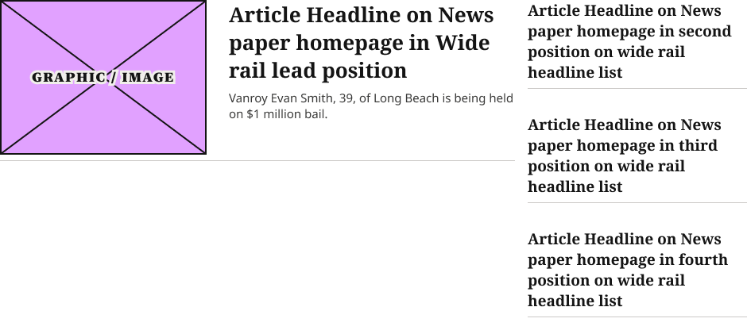
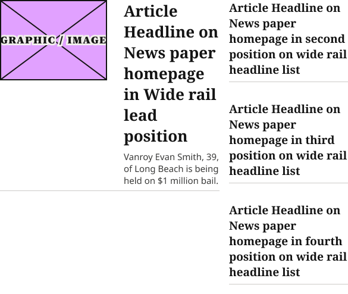

# Feature + List Content Block

**Assembly · 2 variants** · Homepage components · source: WordPress Elements ▸ Homepage

> New atom (2026-09-22) — the shared internal content block for Section Rail Card's Wide layout: a Horizontal Feature Card (fills remaining width) beside a fixed-width, headline-only list (3 items, matching production). Replaces "Top Zones Section Block MOBILE" — the stacked single-column arrangement that had been copy-pasted into every Wide variant instead of a real side-by-side layout. Confirmed against production's two-column ".section-highlight-content" split and .headline-list item count (ocregister.com). Feature image corrected from square (260×260) to production's 4:3 ratio.
> 
> Now a proper variant set with a "Size" property: Default (940w, used by Tablet/1100/1280/Desktop-Wide) and Narrow (585w, used by the 1024 breakpoint, which is genuinely too tight for the Default proportions — smaller feature image (180×135) and list column (200w) so the text column still has room to breathe. The 1024 breakpoint's Section Rail Card variant now instances Size=Narrow directly instead of carrying a detached, hand-edited one-off, so future edits to either size propagate normally.

## Figma references

- File: WordPress Elements (`b1iZxkFwtAYq9rElmnCAzd`) · Page: Homepage
- Main: [Feature + List Content Block](https://www.figma.com/design/b1iZxkFwtAYq9rElmnCAzd/?node-id=3484-66933) · node `3484:66933` · key `b49909a16526e6df948efc84d6bfbd5b8ebc3c96`

| Variant | Node | Key | Size | Preview |
|---|---|---|---|---|
| Size=Default | [3478:63611](https://www.figma.com/design/b1iZxkFwtAYq9rElmnCAzd/?node-id=3478-63611) | d9c96ebd29527f812f5906abd384c00e203583e9 | 940×320 |  |
| Size=Narrow | [3484:66879](https://www.figma.com/design/b1iZxkFwtAYq9rElmnCAzd/?node-id=3484-66879) | 6e8d20beb8cdbe33910a2c93824ebdda43d964c0 | 585×464 |  |

## Properties

| Property | Type | Default | Options |
|---|---|---|---|
| Size | VARIANT | Narrow | Default, Narrow |

## Where it is used

- **Size=Default** — breakpoints: 768, 1100, 1280; templates (via assembly): Desktop HomePage (via Section Rail Card), 768 HomePage (via Section Rail Card), 1100 HomePage (via Section Rail Card); nested inside: Section Rail Card / Device=1280, Layout=Wide ×1, Section Rail Card / Device=Tablet, Layout=Wide ×1, Section Rail Card / Device=1100, Layout=Wide ×1
- **Size=Narrow** — breakpoints: 1024; templates (via assembly): 1024 HomePage (via Section Rail Card); nested inside: Section Rail Card / Device=1024, Layout=Wide ×1

## Breakpoints

| Key | Viewport | Variant(s) |
|---|---|---|
| 768 | 640–799px (MD-TabletV) | Size=Default |
| 1024 | 800–1039px (LG-TabletH, built 1009) | Size=Narrow |
| 1100 | ≥1040px (XL-Desktop, built 1085) | Size=Default |
| 1280 | ≥1040px (XL-Desktop, built 1280) | Size=Default |

## Responsive rules

- Size=Default: 940×320, horizontal gap 16 pad 0/0/0/0 main MIN cross MIN — renders at 768, 1100, 1280
- Size=Narrow: 585×464, horizontal gap 16 pad 0/0/0/0 main MIN cross MIN — renders at 1024

## Dependencies

**Built from:**

- [Horizontal Feature Card](../../components/15-horizontal-feature-card/horizontal-feature-card.md) ×1
- [1Col Article Card](../../components/16-1col-article-card/1col-article-card.md) ×3
- [Article Image Placeholder](../../components/03-article-image-placeholder/article-image-placeholder.md) ×1

**Built into:**

- [Section Rail Card](../18-section-rail-card/section-rail-card.md)

## Anatomy

**Size=Default**

```
- Size=Default — component 940×320 [horizontal gap 16] (fixed/hug)
  - Horizontal Feature Card — instance 648×203 [vertical gap 8] (fill/hug) → Horizontal Feature Card
  - Headline List — frame 276×320 [vertical gap 16] (fixed/hug)
    - 1Col Article Card — instance 276×96 [vertical gap 8] (fill/hug) → 1Col Article Card [Style=Standard] ×3
```

**Size=Narrow**

```
- Size=Narrow — component 585×464 [horizontal gap 16] (fixed/hug)
  - Horizontal Feature Card — frame 369×324 [vertical gap 8] (fill/hug)
    - Content — frame 369×316 [horizontal gap 28] (fill/hug)
      - Article Graphic — instance 180×135 [vertical gap 8] (fixed/fixed) → Article Image Placeholder
      - Text Column — frame 161×316 [vertical gap 8] (fill/hug)
    - Bottom Border Line — line 369×0 (fill/fixed)
  - Headline List — frame 200×464 [vertical gap 16] (fixed/hug)
    - 1Col Article Card — instance 200×144 [vertical gap 8] (fill/hug) → 1Col Article Card [Style=Standard] ×3
```

## Size & layout

| Variant | Size | Width | Height | Auto-layout | Radius | Clip |
|---|---|---|---|---|---|---|
| Size=Default | 940×320 | FIXED | HUG | horizontal gap 16 pad 0/0/0/0 main MIN cross MIN |  |  |
| Size=Narrow | 585×464 | FIXED | HUG | horizontal gap 16 pad 0/0/0/0 main MIN cross MIN |  |  |

## Typography

| Layer | Font | Weight | Size | Line height | Letter sp. | Case | Color | Color token | Type token | Truncate | Sample | Variants |
|---|---|---|---|---|---|---|---|---|---|---|---|---|
| Article Headline on News paper homepage in Wide rail lead po | Noto Serif | Bold | 26 | auto |  |  | #141414 | Colors/color/gray/min | font/size/26 |  | Article Headline on News paper homepage in Wide ra | Size=Narrow |
| Vanroy Evan Smith, 39, of Long Beach is being held on $1 mil | Noto Sans | Regular | 15 | 21px |  |  | #393938 | Colors/color/gray/100 | Editorial/Body/Excerpt |  | Vanroy Evan Smith, 39, of Long Beach is being held | Size=Narrow |

## Color & effects

| Layer | Role | Type | Hex | Token | Opacity | Note |
|---|---|---|---|---|---|---|
| 1Col Article Card | fill | SOLID | #FFFFFF | Colors/color/gray/max |  |  |
| Article Graphic | fill | SOLID | #E1A1FF |  |  | image placeholder fill |
| Article Graphic | stroke | SOLID | #141414 | Colors/color/gray/min |  |  |
| Bottom Border Line | stroke | SOLID | #CCCAC7 | Colors/color/gray/500 |  |  |

## Image ratios

| Variant | Layer | Size | Ratio | Source |
|---|---|---|---|---|
| Size=Narrow | Article Graphic | 180×135 | 4:3 | Article Image Placeholder |

## Ad slots

_None._

## Production references

- `.headline-list`
- `ocregister.com`

## Known issues

_None detected._

## Rendering steps

1. Pick the variant for the target breakpoint from the Breakpoints table (property values in `feature-list-content-block.json` → `variants[].variantProperties`).
2. Start from `feature-list-content-block.html` — each `<section>` is one variant; auto-layout is already mapped to flexbox and colors use `tokens.css` variables.
3. Replace every dashed `data-component` box with the referenced component's own skeleton (links under Dependencies); leave `data-component` on the wrapper.
4. Fill image slots at the ratio listed in Image ratios; fill text using the Typography table (truncate where a line clamp is listed).
5. Check against the preview PNG, then against the production references.
