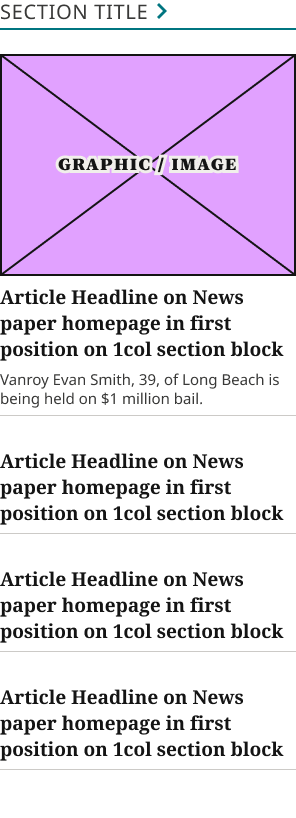
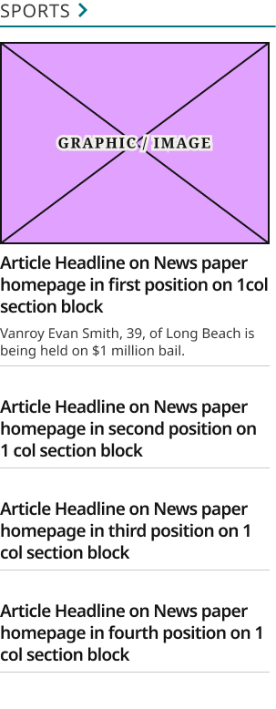
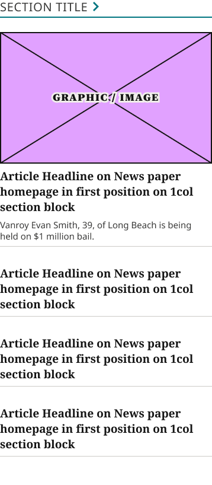
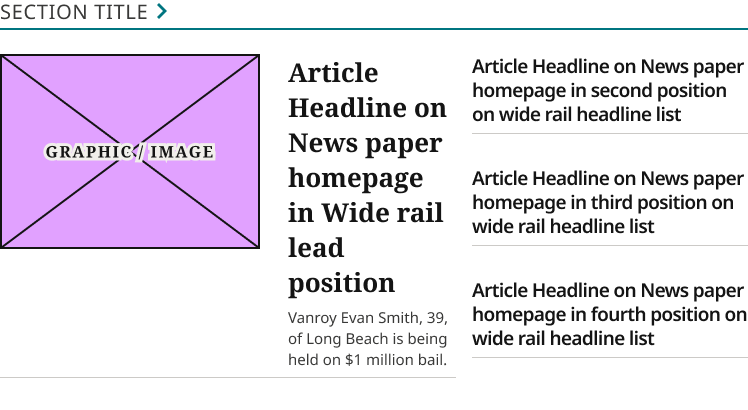
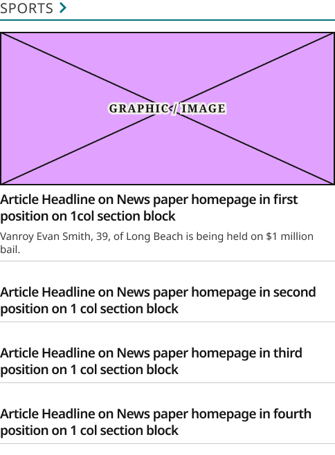
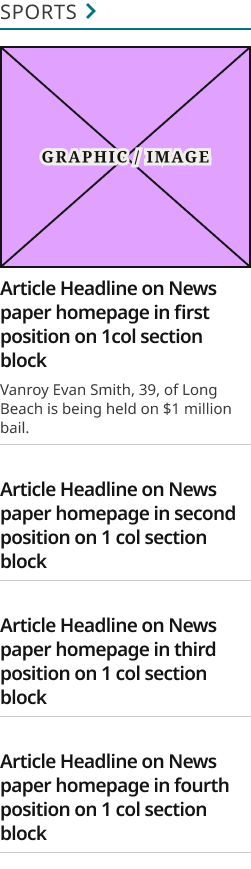
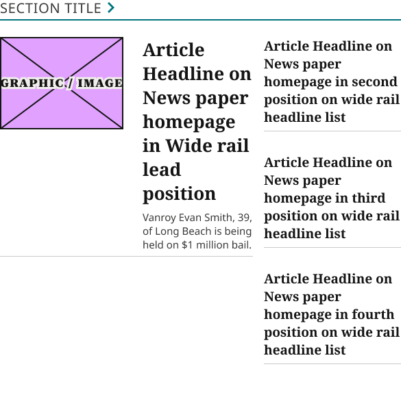
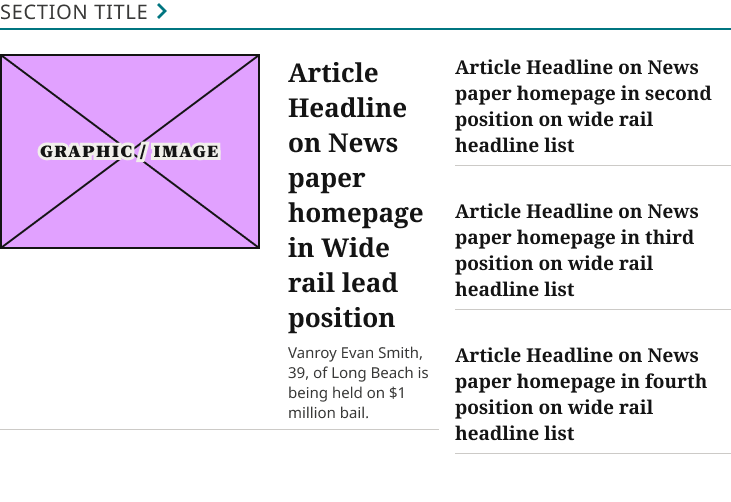
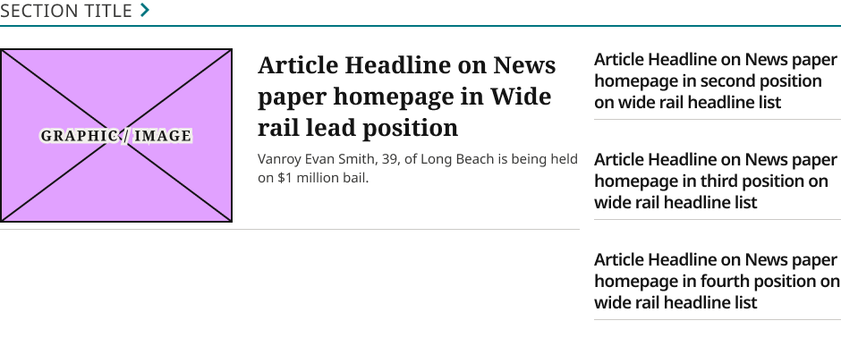

# Section Rail Card

**Assembly · 9 variants** · Homepage components · source: WordPress Elements ▸ Homepage

> Component set · Variant: Device = Desktop, Mobile · Layout = Wide, Narrow (Desktop supports both; Mobile is always Narrow, matching production — mobile never uses the wide side-by-side layout). Confirmed against live ocregister.com: the desktop 3-across rail's columns and the mobile rail share the same narrow, stacked layout.

## Figma references

- File: WordPress Elements (`b1iZxkFwtAYq9rElmnCAzd`) · Page: Homepage
- Main: [Section Rail Card](https://www.figma.com/design/b1iZxkFwtAYq9rElmnCAzd/?node-id=3352-22067) · node `3352:22067` · key `a190cd2a7299d5dfbfd24bae57f8bf986bf7add6`

| Variant | Node | Key | Size | Preview |
|---|---|---|---|---|
| Device=Mobile, Layout=Narrow | [3352:22066](https://www.figma.com/design/b1iZxkFwtAYq9rElmnCAzd/?node-id=3352-22066) | edee2be023963cf675ee580ff5cfc4de809ea3ff | 296×794 |  |
| Device=Desktop, Layout=Narrow | [3352:22065](https://www.figma.com/design/b1iZxkFwtAYq9rElmnCAzd/?node-id=3352-22065) | f7d929e561adc6506bc02a1bde425a49aceb8146 | 302.7×778 |  |
| Device=Tablet, Layout=Narrow | [3383:46831](https://www.figma.com/design/b1iZxkFwtAYq9rElmnCAzd/?node-id=3383-46831) | 3b44a196f904cae8eff2ce006ad42a604702c74d | 358×794 |  |
| Device=Tablet, Layout=Wide | [3383:46746](https://www.figma.com/design/b1iZxkFwtAYq9rElmnCAzd/?node-id=3383-46746) | b4f2a0688a47649b0ecc5bae007f06ac64eaf417 | 748×410 |  |
| Device=1024, Layout=Narrow | [3445:55994](https://www.figma.com/design/b1iZxkFwtAYq9rElmnCAzd/?node-id=3445-55994) | 8d3d7b5955f32538b35968f1a7429d9e8cc3313f | 484×658 |  |
| Device=1100, Layout=Narrow | [3445:56061](https://www.figma.com/design/b1iZxkFwtAYq9rElmnCAzd/?node-id=3445-56061) | cb767c709d26904179312aa86c0e0543028191a3 | 251×869 |  |
| Device=1024, Layout=Wide | [3476:60465](https://www.figma.com/design/b1iZxkFwtAYq9rElmnCAzd/?node-id=3476-60465) | 2db0cc5ecc5064327d9311445d183faf405e9af7 | 585×550 |  |
| Device=1100, Layout=Wide | [3476:60484](https://www.figma.com/design/b1iZxkFwtAYq9rElmnCAzd/?node-id=3476-60484) | da0fe7f95386430425adb5745621581eb6549ad5 | 731×466 |  |
| Device=1280, Layout=Wide | [3478:63072](https://www.figma.com/design/b1iZxkFwtAYq9rElmnCAzd/?node-id=3478-63072) | 8021b5e7c4489fec57fe07cb4285e193de1bdb3b | 940×406 |  |

## Properties

| Property | Type | Default | Options |
|---|---|---|---|
| Device | VARIANT | Mobile | Desktop, Mobile, Tablet, 1024, 1100, 1280 |
| Layout | VARIANT | Narrow | Wide, Narrow |

## Where it is used

- **Device=Mobile, Layout=Narrow** — breakpoints: 340, 360; templates (direct): Mobile HomePage ×9, 340 HomePage ×9
- **Device=Desktop, Layout=Narrow** — breakpoints: 1280; templates (direct): Desktop HomePage ×3
- **Device=Tablet, Layout=Narrow** — breakpoints: 768; templates (direct): 768 HomePage ×3
- **Device=Tablet, Layout=Wide** — breakpoints: 768; templates (direct): 768 HomePage ×6
- **Device=1024, Layout=Narrow** — breakpoints: 1024; templates (direct): 1024 HomePage ×3
- **Device=1100, Layout=Narrow** — breakpoints: 1100; templates (direct): 1100 HomePage ×3
- **Device=1024, Layout=Wide** — breakpoints: 1024; templates (direct): 1024 HomePage ×6
- **Device=1100, Layout=Wide** — breakpoints: 1100; templates (direct): 1100 HomePage ×6
- **Device=1280, Layout=Wide** — breakpoints: 1280; templates (direct): Desktop HomePage ×6

## Breakpoints

| Key | Viewport | Variant(s) |
|---|---|---|
| 340 | ≤639px (XS-Fold, built 340) | Device=Mobile, Layout=Narrow |
| 360 | ≤639px (SM-Mobile, built 360) | Device=Mobile, Layout=Narrow |
| 768 | 640–799px (MD-TabletV) | Device=Tablet, Layout=Narrow, Device=Tablet, Layout=Wide |
| 1024 | 800–1039px (LG-TabletH, built 1009) | Device=1024, Layout=Narrow, Device=1024, Layout=Wide |
| 1100 | ≥1040px (XL-Desktop, built 1085) | Device=1100, Layout=Narrow, Device=1100, Layout=Wide |
| 1280 | ≥1040px (XL-Desktop, built 1280) | Device=Desktop, Layout=Narrow, Device=1280, Layout=Wide |

## Responsive rules

- Wide variants (checked against the previews): Section Title on top, then a lead story with image left and headline/dek right, plus a 3-item headline list in a right column.
- Narrow variants: single column. Section Title, then a full-width image lead, then stacked 1Col Article Card headlines.
- The 1024 and 1100 variants exist because production uses fixed landing-item widths at those breakpoints. Use them instead of scaling the Desktop variant.
- Device=Mobile, Layout=Narrow: 296×794, vertical gap 24 pad 0/0/32/0 main MIN cross CENTER — renders at 340, 360
- Device=Desktop, Layout=Narrow: 302.7×778, vertical gap 16 pad 0/0/0/0 main MIN cross MIN — renders at 1280
- Device=Tablet, Layout=Narrow: 358×794, vertical gap 24 pad 0/0/32/0 main MIN cross CENTER — renders at 768
- Device=Tablet, Layout=Wide: 748×410, vertical gap 24 pad 0/0/32/0 main MIN cross CENTER — renders at 768
- Device=1024, Layout=Narrow: 484×658, vertical gap 16 pad 0/0/0/0 main MIN cross MIN — renders at 1024
- Device=1100, Layout=Narrow: 251×869, vertical gap 16 pad 0/0/0/0 main MIN cross MIN — renders at 1100
- Device=1024, Layout=Wide: 585×550, vertical gap 24 pad 0/0/32/0 main MIN cross CENTER — renders at 1024
- Device=1100, Layout=Wide: 731×466, vertical gap 24 pad 0/0/32/0 main MIN cross CENTER — renders at 1100
- Device=1280, Layout=Wide: 940×406, vertical gap 24 pad 0/0/32/0 main MIN cross CENTER — renders at 1280

## Dependencies

**Built from:**

- [Section Title / Eyebrow](../../components/06-section-title-eyebrow/section-title-eyebrow.md) ×1
- [1Col Article Card](../../components/16-1col-article-card/1col-article-card.md) ×4
- [Feature + List Content Block](../17-feature-list-content-block/feature-list-content-block.md) ×1

**Built into:**

_Not used inside another exported item._

## Anatomy

**Device=Mobile, Layout=Narrow**

```
- Device=Mobile, Layout=Narrow — component 296×794 [vertical gap 24] (hug/hug)
  - News Content — frame 296×762 [vertical gap 24] (hug/hug)
    - 3Col Header — frame 296×30 [vertical gap 4] (fill/hug)
      - Section Title / Eyebrow — instance 296×30 [vertical gap 6] (fill/hug) → Section Title / Eyebrow [Style=Underline]
    - Top Zones Section Block MOBILE — frame 296×708 [vertical gap 16] (hug/hug)
      - 1Col Article Card — instance 296×372 [vertical gap 8] (hug/hug) → 1Col Article Card [Style=Standard]
      - 1Col Article Card — instance 296×96 [vertical gap 8] (hug/hug) → 1Col Article Card [Style=Standard] ×3
```

**Device=Desktop, Layout=Narrow**

```
- Device=Desktop, Layout=Narrow — component 302.7×778 [vertical gap 16] (fixed/fixed)
  - 1Col Header — frame 302.7×30 [vertical gap 4] (fill/hug)
    - Section Title / Eyebrow — instance 302.7×30 [vertical gap 6] (fill/hug) → Section Title / Eyebrow [Style=Underline]
  - 1Col Article Card — instance 296×372 [vertical gap 8] (fixed/hug) → 1Col Article Card [Style=Standard]
  - 1Col Article Card — instance 296×96 [vertical gap 8] (fixed/hug) → 1Col Article Card [Style=Standard] ×3
```

**Device=Tablet, Layout=Narrow**

```
- Device=Tablet, Layout=Narrow — component 358×794 [vertical gap 24] (fixed/hug)
  - News Content — frame 358×762 [vertical gap 24] (fixed/hug)
    - 3Col Header — frame 358×30 [vertical gap 4] (fill/hug)
      - Section Title / Eyebrow — instance 358×30 [vertical gap 6] (fill/hug) → Section Title / Eyebrow [Style=Underline]
    - Top Zones Section Block MOBILE — frame 358×708 [vertical gap 16] (fixed/hug)
      - 1Col Article Card — instance 358×372 [vertical gap 8] (fixed/hug) → 1Col Article Card [Style=Standard]
      - 1Col Article Card — instance 358×96 [vertical gap 8] (fixed/hug) → 1Col Article Card [Style=Standard] ×3
```

**Device=Tablet, Layout=Wide**

```
- Device=Tablet, Layout=Wide — component 748×410 [vertical gap 24] (fixed/hug)
  - News Content — frame 748×378 [vertical gap 24] (fixed/hug)
    - 3Col Header — frame 748×30 [vertical gap 4] (fill/hug)
      - Section Title / Eyebrow — instance 748×30 [vertical gap 6] (fill/hug) → Section Title / Eyebrow [Style=Underline]
    - Section Block — instance 748×324 [horizontal gap 16] (fill/hug) → Feature + List Content Block [Size=Default]
```

**Device=1024, Layout=Narrow**

```
- Device=1024, Layout=Narrow — component 484×658 [vertical gap 16] (fixed/hug)
  - 1Col Header — frame 484×30 [vertical gap 4] (fill/hug)
    - Section Title / Eyebrow — instance 484×30 [vertical gap 6] (fill/hug) → Section Title / Eyebrow [Style=Underline]
  - 1Col Article Card — instance 484×348 [vertical gap 8] (fill/hug) → 1Col Article Card [Style=Standard]
  - 1Col Article Card — instance 484×72 [vertical gap 8] (fill/hug) → 1Col Article Card [Style=Standard] ×3
```

**Device=1100, Layout=Narrow**

```
- Device=1100, Layout=Narrow — component 251×869 [vertical gap 16] (fixed/hug)
  - 1Col Header — frame 251×30 [vertical gap 4] (fill/hug)
    - Section Title / Eyebrow — instance 251×30 [vertical gap 6] (fill/hug) → Section Title / Eyebrow [Style=Underline]
  - 1Col Article Card — instance 251×415 [vertical gap 8] (fill/hug) → 1Col Article Card [Style=Standard]
  - 1Col Article Card — instance 251×120 [vertical gap 8] (fill/hug) → 1Col Article Card [Style=Standard] ×3
```

**Device=1024, Layout=Wide**

```
- Device=1024, Layout=Wide — component 585×550 [vertical gap 24] (fixed/hug)
  - News Content — frame 585×518 [vertical gap 24] (fill/hug)
    - 3Col Header — frame 585×30 [vertical gap 4] (fill/hug)
      - Section Title / Eyebrow — instance 585×30 [vertical gap 6] (fill/hug) → Section Title / Eyebrow [Style=Underline]
    - Section Block — instance 585×464 [horizontal gap 16] (fill/hug) → Feature + List Content Block [Size=Narrow]
```

**Device=1100, Layout=Wide**

```
- Device=1100, Layout=Wide — component 731×466 [vertical gap 24] (fixed/hug)
  - News Content — frame 731×434 [vertical gap 24] (fill/hug)
    - 3Col Header — frame 731×30 [vertical gap 4] (fill/hug)
      - Section Title / Eyebrow — instance 731×30 [vertical gap 6] (fill/hug) → Section Title / Eyebrow [Style=Underline]
    - Section Block — instance 731×380 [horizontal gap 16] (fill/hug) → Feature + List Content Block [Size=Default]
```

**Device=1280, Layout=Wide**

```
- Device=1280, Layout=Wide — component 940×406 [vertical gap 24] (fixed/hug)
  - News Content — frame 940×374 [vertical gap 24] (fill/hug)
    - 3Col Header — frame 940×30 [vertical gap 4] (fill/hug)
      - Section Title / Eyebrow — instance 940×30 [vertical gap 6] (fill/hug) → Section Title / Eyebrow [Style=Underline]
    - Section Block — instance 940×320 [horizontal gap 16] (fill/hug) → Feature + List Content Block [Size=Default]
```

## Size & layout

| Variant | Size | Width | Height | Auto-layout | Radius | Clip |
|---|---|---|---|---|---|---|
| Device=Mobile, Layout=Narrow | 296×794 | HUG | HUG | vertical gap 24 pad 0/0/32/0 main MIN cross CENTER |  |  |
| Device=Desktop, Layout=Narrow | 302.7×778 | FIXED | FIXED | vertical gap 16 pad 0/0/0/0 main MIN cross MIN |  |  |
| Device=Tablet, Layout=Narrow | 358×794 | FIXED | HUG | vertical gap 24 pad 0/0/32/0 main MIN cross CENTER |  |  |
| Device=Tablet, Layout=Wide | 748×410 | FIXED | HUG | vertical gap 24 pad 0/0/32/0 main MIN cross CENTER |  |  |
| Device=1024, Layout=Narrow | 484×658 | FIXED | HUG | vertical gap 16 pad 0/0/0/0 main MIN cross MIN |  |  |
| Device=1100, Layout=Narrow | 251×869 | FIXED | HUG | vertical gap 16 pad 0/0/0/0 main MIN cross MIN |  |  |
| Device=1024, Layout=Wide | 585×550 | FIXED | HUG | vertical gap 24 pad 0/0/32/0 main MIN cross CENTER |  |  |
| Device=1100, Layout=Wide | 731×466 | FIXED | HUG | vertical gap 24 pad 0/0/32/0 main MIN cross CENTER |  |  |
| Device=1280, Layout=Wide | 940×406 | FIXED | HUG | vertical gap 24 pad 0/0/32/0 main MIN cross CENTER |  |  |

## Typography

_No text._

## Color & effects

| Layer | Role | Type | Hex | Token | Opacity | Note |
|---|---|---|---|---|---|---|
| Device=Mobile, Layout=Narrow | fill | SOLID | #FFFFFF | Colors/color/gray/max |  |  |
| 3Col Header | fill | SOLID | #FFFFFF | Colors/color/gray/max |  |  |
| 1Col Article Card | fill | SOLID | #FFFFFF | Colors/color/gray/max |  |  |
| 1Col Header | fill | SOLID | #FFFFFF | Colors/color/gray/max |  |  |
| Device=Tablet, Layout=Narrow | fill | SOLID | #FFFFFF | Colors/color/gray/max |  |  |
| Device=Tablet, Layout=Wide | fill | SOLID | #FFFFFF | Colors/color/gray/max |  |  |
| Device=1024, Layout=Wide | fill | SOLID | #FFFFFF | Colors/color/gray/max |  |  |
| Device=1100, Layout=Wide | fill | SOLID | #FFFFFF | Colors/color/gray/max |  |  |
| Device=1280, Layout=Wide | fill | SOLID | #FFFFFF | Colors/color/gray/max |  |  |

## Image ratios

_None._

## Ad slots

_None._

## Production references

- `ocregister.com`

## Known issues

_None detected._

## Rendering steps

1. Pick the variant for the target breakpoint from the Breakpoints table (property values in `section-rail-card.json` → `variants[].variantProperties`).
2. Start from `section-rail-card.html` — each `<section>` is one variant; auto-layout is already mapped to flexbox and colors use `tokens.css` variables.
3. Replace every dashed `data-component` box with the referenced component's own skeleton (links under Dependencies); leave `data-component` on the wrapper.
4. Fill image slots at the ratio listed in Image ratios; fill text using the Typography table (truncate where a line clamp is listed).
5. Check against the preview PNG, then against the production references.
