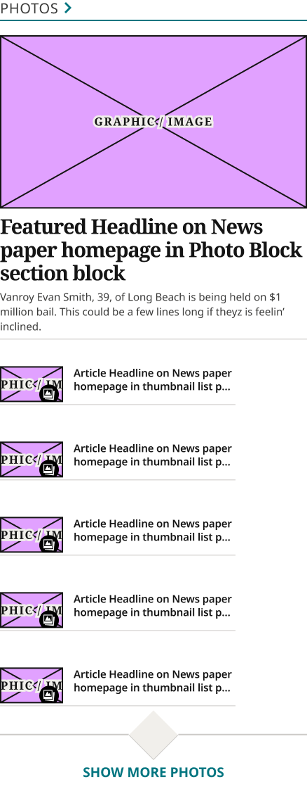
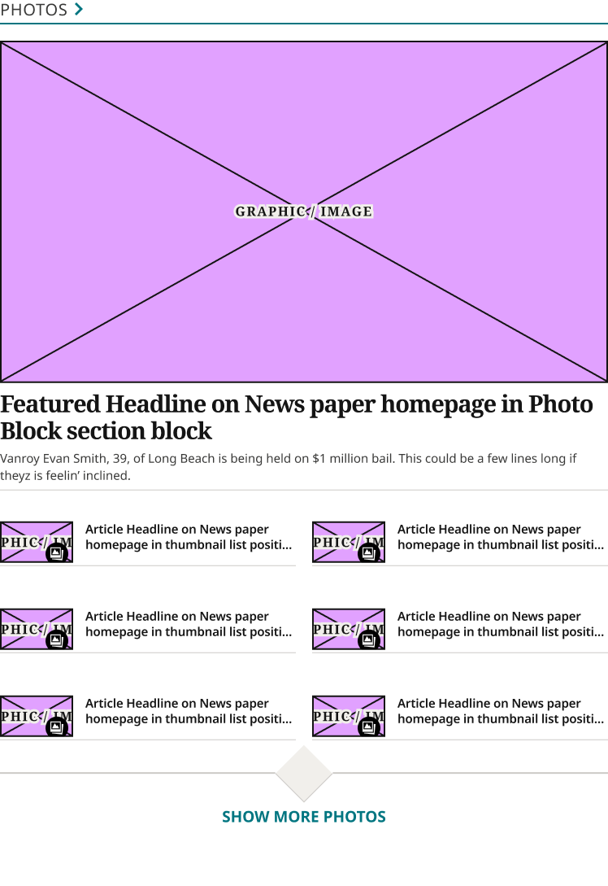
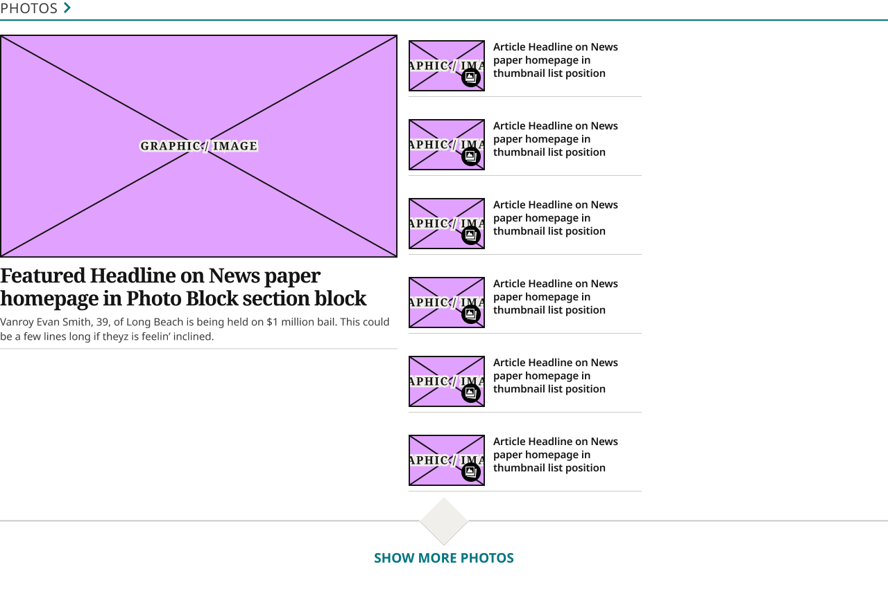

# Photos Block

**Assembly · 3 variants** · Homepage components · source: WordPress Elements ▸ Homepage

> Component set · Variant: Device = Desktop, Mobile · reused as instances in the assembled Desktop and Mobile pages and in both raw section libraries.

## Figma references

- File: WordPress Elements (`b1iZxkFwtAYq9rElmnCAzd`) · Page: Homepage
- Main: [Photos Block](https://www.figma.com/design/b1iZxkFwtAYq9rElmnCAzd/?node-id=3352-20865) · node `3352:20865` · key `e952aa813910f9c37fe311a21c266b3089bad6ab`

| Variant | Node | Key | Size | Preview |
|---|---|---|---|---|
| Device=Mobile | [3352:20864](https://www.figma.com/design/b1iZxkFwtAYq9rElmnCAzd/?node-id=3352-20864) | bb477912263428727959de2d6182b0892f47ec88 | 438×1182.1 |  |
| Device=Tablet | [3383:46539](https://www.figma.com/design/b1iZxkFwtAYq9rElmnCAzd/?node-id=3383-46539) | 8f68df50113ec3908dfd74195bcf90582ebe7727 | 748×1088.5 |  |
| Device=Desktop | [3352:20863](https://www.figma.com/design/b1iZxkFwtAYq9rElmnCAzd/?node-id=3352-20863) | d31d44fe7433df413291723e261947681a004f86 | 1280×886.7 |  |

## Properties

| Property | Type | Default | Options |
|---|---|---|---|
| Device | VARIANT | Mobile | Mobile, Desktop, Tablet |

## Where it is used

- **Device=Mobile** — breakpoints: 340, 360; no instances in this file
- **Device=Tablet** — breakpoints: 768; templates (direct): 768 HomePage ×1
- **Device=Desktop** — breakpoints: 1024, 1100, 1280; no instances in this file

## Breakpoints

| Key | Viewport | Variant(s) |
|---|---|---|
| 340 | ≤639px (XS-Fold, built 340) | Device=Mobile |
| 360 | ≤639px (SM-Mobile, built 360) | Device=Mobile |
| 768 | 640–799px (MD-TabletV) | Device=Tablet |
| 1024 | 800–1039px (LG-TabletH, built 1009) | Device=Desktop |
| 1100 | ≥1040px (XL-Desktop, built 1085) | Device=Desktop |
| 1280 | ≥1040px (XL-Desktop, built 1280) | Device=Desktop |

## Responsive rules

- The lead story is a `1Col Article Card` Style=Media Lead instance (16:9 image, 29/33 headline) at every breakpoint; the list is `Horizontal Thumbnail Card` (90×51 thumbnails, Noto Sans 600 15/19 HeadlineList titles).
- Device=Mobile: 438×1182.1, vertical gap 24 pad 0/0/32/0 main MIN cross CENTER — renders at 340, 360
- Device=Tablet: 748×1088.5, vertical gap 24 pad 0/0/32/0 main MIN cross CENTER — renders at 768
- Device=Desktop: 1280×886.7, horizontal gap 24 pad 0/0/32/0 main CENTER cross MIN — renders at 1024, 1100, 1280

## Dependencies

**Built from:**

- [Section Title / Eyebrow](../../components/06-section-title-eyebrow/section-title-eyebrow.md) ×1
- [1Col Article Card](../../components/16-1col-article-card/1col-article-card.md) ×1
- [Horizontal Thumbnail Card](../../components/11-horizontal-thumbnail-card/horizontal-thumbnail-card.md) ×6
- [Show More Photos Affordance](../../components/21-show-more-photos-affordance/show-more-photos-affordance.md) ×1

**Built into:**

_Not used inside another exported item._

## Anatomy

**Device=Mobile**

```
- Device=Mobile — component 438×1182.1 [vertical gap 24] (fixed/hug)
  - News Content — frame 438×1150.1 [vertical gap 0] (fill/hug)
    - 3Col Header — frame 438×50 [vertical gap 4] (fill/hug)
      - Section Title / Eyebrow — instance 438×30 [vertical gap 6] (fill/hug) → Section Title / Eyebrow [Style=Underline]
    - Section Block — frame 438×959.4 [vertical gap 16] (fill/hug)
      - 1Col Article Card — instance 438×448.4 [vertical gap 8] (fill/hug) → 1Col Article Card [Style=Media Lead]
      - Additional Articles — frame 336×495 [vertical gap 40] (fixed/hug) ×5
    - Show More Photos Affordance — instance 438×140.7 [vertical gap 4] (fill/hug) → Show More Photos Affordance
```

**Device=Tablet**

```
- Device=Tablet — component 748×1088.5 [vertical gap 24] (fixed/hug)
  - News Content — frame 748×1056.5 [vertical gap 0] (fill/hug)
    - 3Col Header — frame 748×50 [vertical gap 4] (fill/hug)
      - Section Title / Eyebrow — instance 748×30 [vertical gap 6] (fill/hug) → Section Title / Eyebrow [Style=Underline]
    - Section Block — frame 748×865.8 [vertical gap 16] (fill/hug)
      - 1Col Article Card — instance 748×568.8 [vertical gap 8] (fixed/hug) → 1Col Article Card [Style=Media Lead]
      - Additional Articles Grid TABLET — frame 748×281 [vertical gap 40] (fixed/hug)
    - Show More Photos Affordance — instance 748×140.7 [vertical gap 4] (fill/hug) → Show More Photos Affordance
```

**Device=Desktop**

```
- Device=Desktop — component 1280×886.7 [horizontal gap 24] (fixed/fixed)
  - News Content — frame 1280×858.7 [vertical gap 0] (fill/hug)
    - 3Col Header — frame 1280×50 [vertical gap 4] (fill/hug)
      - Section Title / Eyebrow — instance 1280×30 [vertical gap 6] (fill/hug) → Section Title / Eyebrow [Style=Underline]
    - Section Block — frame 1280×668 [horizontal gap 16] (fill/hug)
      - 1Col Article Card — instance 573×470.3 [vertical gap 8] (fixed/hug) → 1Col Article Card [Style=Media Lead]
      - Additional Articles — frame 336×668 [vertical gap 16] (fixed/hug) ×6
    - Show More Photos Affordance — instance 1280×140.7 [vertical gap 4] (fill/hug) → Show More Photos Affordance
```

## Size & layout

| Variant | Size | Width | Height | Auto-layout | Radius | Clip |
|---|---|---|---|---|---|---|
| Device=Mobile | 438×1182.1 | FIXED | HUG | vertical gap 24 pad 0/0/32/0 main MIN cross CENTER |  |  |
| Device=Tablet | 748×1088.5 | FIXED | HUG | vertical gap 24 pad 0/0/32/0 main MIN cross CENTER |  |  |
| Device=Desktop | 1280×886.7 | FIXED | FIXED | horizontal gap 24 pad 0/0/32/0 main CENTER cross MIN |  |  |

## Typography

_No text._

## Color & effects

| Layer | Role | Type | Hex | Token | Opacity | Note |
|---|---|---|---|---|---|---|
| Device=Mobile | fill | SOLID | #FFFFFF | Colors/color/gray/max |  |  |
| News Content | fill | SOLID | #FFFFFF | Colors/color/gray/max |  |  |
| 3Col Header | fill | SOLID | #FFFFFF | Colors/color/gray/max |  |  |
| 1Col Article Card | fill | SOLID | #FFFFFF | Colors/color/gray/max |  |  |
| Device=Tablet | fill | SOLID | #FFFFFF | Colors/color/gray/max |  |  |
| Device=Desktop | fill | SOLID | #FFFFFF | Colors/color/gray/max |  |  |

## Image ratios

_None._

## Ad slots

_None._

## Production references

_None found in descriptions or layer names._

## Known issues

- 2 of 3 variants have no instances anywhere in WordPress Elements (unused, or used only from another file): `Device=Mobile`, `Device=Desktop`.
- The 1024, 1100 and 1280 HomePage templates use detached, resized copies ('Photos Block Content (Tablet, detached, resized to 585 — internal ad removed…)'; their lead cards are 1Col Article Card Style=Media Lead instances) instead of instances, so those breakpoints are not counted above. Reattaching them is on the status list.

## Rendering steps

1. Pick the variant for the target breakpoint from the Breakpoints table (property values in `photos-block.json` → `variants[].variantProperties`).
2. Start from `photos-block.html` — each `<section>` is one variant; auto-layout is already mapped to flexbox and colors use `tokens.css` variables.
3. Replace every dashed `data-component` box with the referenced component's own skeleton (links under Dependencies); leave `data-component` on the wrapper.
4. Fill image slots at the ratio listed in Image ratios; fill text using the Typography table (truncate where a line clamp is listed).
5. Check against the preview PNG, then against the production references.
