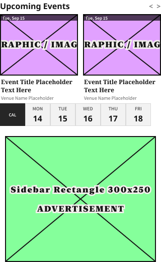
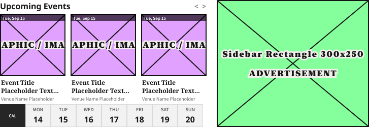
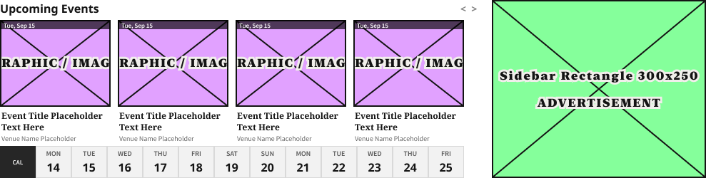
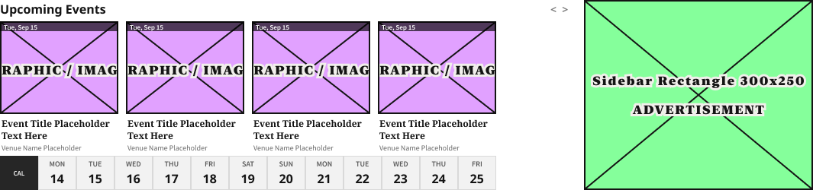
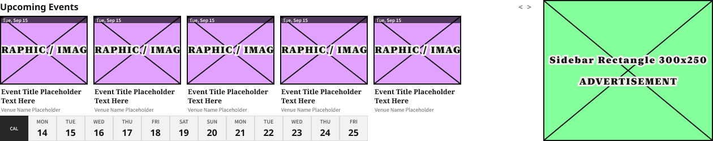

# Upcoming Events Block

**Assembly · 5 variants** · Homepage components · source: WordPress Elements ▸ Homepage

> Component set · Variant: Device = Mobile, Tablet, 1024, 1100, Desktop · the third-party events carousel block (Upcoming Events Widget + ad), instanced on every homepage breakpoint.

## Figma references

- File: WordPress Elements (`b1iZxkFwtAYq9rElmnCAzd`) · Page: Homepage
- Main: [Upcoming Events Block](https://www.figma.com/design/b1iZxkFwtAYq9rElmnCAzd/?node-id=3476-59741) · node `3476:59741` · key `41fc7fc2b3692e1147d50b2d400c396408ff5d9e`

| Variant | Node | Key | Size | Preview |
|---|---|---|---|---|
| Device=Mobile | [3476:59520](https://www.figma.com/design/b1iZxkFwtAYq9rElmnCAzd/?node-id=3476-59520) | 374b4a47a27654014e316b7981f9bdac8ee63223 | 320×520 |  |
| Device=Tablet | [3476:59524](https://www.figma.com/design/b1iZxkFwtAYq9rElmnCAzd/?node-id=3476-59524) | 8040ad47fa3bcec69ae323dddbff2fd35af89109 | 727×250 |  |
| Device=1024 | [3476:59528](https://www.figma.com/design/b1iZxkFwtAYq9rElmnCAzd/?node-id=3476-59528) | a0a664f2d08ef481c3e35feb46e1ccdc6a0066e7 | 989×250 |  |
| Device=1100 | [3476:59627](https://www.figma.com/design/b1iZxkFwtAYq9rElmnCAzd/?node-id=3476-59627) | 9fb4c039da2c98aff7da892f2eb6f3593b56da53 | 1065×250 |  |
| Device=Desktop | [3476:59739](https://www.figma.com/design/b1iZxkFwtAYq9rElmnCAzd/?node-id=3476-59739) | 7d9738eff79cc639364c9d012aae8fec977cbb78 | 1260×250 |  |

## Properties

| Property | Type | Default | Options |
|---|---|---|---|
| Device | VARIANT | Mobile | Mobile, Tablet, 1024, 1100, Desktop |

## Where it is used

- **Device=Mobile** — breakpoints: 340, 360; templates (direct): Mobile HomePage ×1, 340 HomePage ×1
- **Device=Tablet** — breakpoints: 768; templates (direct): 768 HomePage ×1
- **Device=1024** — breakpoints: 1024; templates (direct): 1024 HomePage ×1
- **Device=1100** — breakpoints: 1100; templates (direct): 1100 HomePage ×1
- **Device=Desktop** — breakpoints: 1100, 1280; templates (direct): Desktop HomePage ×1

## Breakpoints

| Key | Viewport | Variant(s) |
|---|---|---|
| 340 | ≤639px (XS-Fold, built 340) | Device=Mobile |
| 360 | ≤639px (SM-Mobile, built 360) | Device=Mobile |
| 768 | 640–799px (MD-TabletV) | Device=Tablet |
| 1024 | 800–1039px (LG-TabletH, built 1009) | Device=1024 |
| 1100 | ≥1040px (XL-Desktop, built 1085) | Device=1100, Device=Desktop |
| 1280 | ≥1040px (XL-Desktop, built 1280) | Device=Desktop |

## Responsive rules

- Device=Mobile: 320×520, vertical gap 20 pad 0/0/0/0 main MIN cross CENTER — renders at 340, 360
- Device=Tablet: 727×250, horizontal gap 20 pad 0/0/0/0 main MIN cross MIN — renders at 768
- Device=1024: 989×250, horizontal gap 20 pad 0/0/0/0 main MIN cross MIN — renders at 1024
- Device=1100: 1065×250, horizontal gap 20 pad 0/0/0/0 main MIN cross MIN — renders at 1100
- Device=Desktop: 1260×250, horizontal gap 20 pad 0/0/0/0 main MIN cross MIN — renders at 1100, 1280

## Dependencies

**Built from:**

- Ad Blocks ×5 _(not in this export)_
- [Upcoming Events Widget (768, 3 cards, 7 days)](../../components/23-upcoming-events-widget-768-3-cards-7-days/upcoming-events-widget-768-3-cards-7-days.md) ×1
- Upcoming Events Widget ×1 _(not in this export)_

**Built into:**

- _no parent in this export_

## Anatomy

**Device=Mobile**

```
- Device=Mobile — component 320×520 [vertical gap 20] (fixed/hug)
  - Upcoming Events Widget (340/360, detached, 2 cards) — frame 320×250 [vertical gap 4] (hug/fixed)
    - Header — frame 320×24 [horizontal gap 0] (fill/fixed)
      - Upcoming Events — text 296×22 (fill/hug) "Upcoming Events"
      - < > — text 24×19 (hug/hug) "<  >"
    - Event Card Row (4 cards — width matches available content column at this size) — frame 320×173 [horizontal gap 10] (hug/hug)
      - Event Card — frame 155×173 [vertical gap 0] (fixed/fixed)
        - … 2 children
      - Event Card — frame 155×173 [vertical gap 0] (fixed/fixed)
        - … 2 children
    - Date Picker Strip — frame 300×45 [horizontal gap 0] (hug/fixed)
      - Date Picker Calendar Icon — frame 50×45 [vertical gap 0] (fixed/fixed)
        - … 1 children
      - Date Picker Day — frame 50×45 [vertical gap 2] (fixed/fixed)
        - … 2 children
      - Date Picker Day — frame 50×45 [vertical gap 2] (fixed/fixed)
        - … 2 children
      - Date Picker Day — frame 50×45 [vertical gap 2] (fixed/fixed)
        - … 2 children
      - Date Picker Day — frame 50×45 [vertical gap 2] (fixed/fixed)
        - … 2 children
      - Date Picker Day — frame 50×45 [vertical gap 2] (fixed/fixed)
        - … 2 children
  - Ad Blocks — instance 300×250 [vertical gap 8] (fixed/fixed) → Ad Blocks [Device=All, Name=Sidebar Rectangle 300x250]
```

**Device=Tablet**

```
- Device=Tablet — component 727×250 [horizontal gap 20] (hug/hug)
  - Upcoming Events Widget (768, 3 cards, 7 days) — instance 407×250 [vertical gap 4] (hug/fixed) → Upcoming Events Widget (768, 3 cards, 7 days)
  - Ad Blocks — instance 300×250 [vertical gap 8] (fixed/fixed) → Ad Blocks [Device=All, Name=Sidebar Rectangle 300x250]
```

**Device=1024**

```
- Device=1024 — component 989×250 [horizontal gap 20] (fixed/hug)
  - Upcoming Events Widget — instance 669×250 [vertical gap 4] (fill/fixed) → Upcoming Events Widget
  - Ad Blocks — instance 300×250 [vertical gap 8] (fixed/fixed) → Ad Blocks [Device=All, Name=Sidebar Rectangle 300x250]
```

**Device=1100**

```
- Device=1100 — component 1065×250 [horizontal gap 20] (fixed/hug)
  - Upcoming Events Widget — frame 745×250 [vertical gap 4] (fill/fixed)
    - Header — frame 745×24 [horizontal gap 0] (fill/fixed)
      - Upcoming Events — text 721×22 (fill/hug) "Upcoming Events"
      - < > — text 24×19 (hug/hug) "<  >"
    - Event Card Row (4 cards — width matches available content column at this size) — frame 650×173 [horizontal gap 10] (hug/hug)
      - Event Card — frame 155×173 [vertical gap 0] (fixed/fixed)
        - … 2 children
      - Event Card — frame 155×173 [vertical gap 0] (fixed/fixed)
        - … 2 children
      - Event Card — frame 155×173 [vertical gap 0] (fixed/fixed)
        - … 2 children
      - Event Card — frame 155×173 [vertical gap 0] (fixed/fixed)
        - … 2 children
    - Date Picker Strip — frame 650×45 [horizontal gap 0] (hug/fixed)
      - Date Picker Calendar Icon — frame 50×45 [vertical gap 0] (fixed/fixed)
        - … 1 children
      - Date Picker Day — frame 50×45 [vertical gap 2] (fixed/fixed)
        - … 2 children
      - Date Picker Day — frame 50×45 [vertical gap 2] (fixed/fixed)
        - … 2 children
      - Date Picker Day — frame 50×45 [vertical gap 2] (fixed/fixed)
        - … 2 children
      - Date Picker Day — frame 50×45 [vertical gap 2] (fixed/fixed)
        - … 2 children
      - Date Picker Day — frame 50×45 [vertical gap 2] (fixed/fixed)
        - … 2 children
      - Date Picker Day — frame 50×45 [vertical gap 2] (fixed/fixed)
        - … 2 children
      - Date Picker Day — frame 50×45 [vertical gap 2] (fixed/fixed)
        - … 2 children
      - Date Picker Day — frame 50×45 [vertical gap 2] (fixed/fixed)
        - … 2 children
      - Date Picker Day — frame 50×45 [vertical gap 2] (fixed/fixed)
        - … 2 children
      - Date Picker Day — frame 50×45 [vertical gap 2] (fixed/fixed)
        - … 2 children
      - Date Picker Day — frame 50×45 [vertical gap 2] (fixed/fixed)
        - … 2 children
      - Date Picker Day — frame 50×45 [vertical gap 2] (fixed/fixed)
        - … 2 children
  - Ad Blocks — instance 300×250 [vertical gap 8] (fixed/fixed) → Ad Blocks [Device=All, Name=Sidebar Rectangle 300x250]
```

**Device=Desktop**

```
- Device=Desktop — component 1260×250 [horizontal gap 20] (fixed/hug)
  - Upcoming Events Widget — frame 940×250 [vertical gap 4] (fill/fixed)
    - Header — frame 940×24 [horizontal gap 0] (fill/fixed)
      - Upcoming Events — text 916×22 (fill/hug) "Upcoming Events"
      - < > — text 24×19 (hug/hug) "<  >"
    - Event Card Row (4 cards — width matches available content column at this size) — frame 815×173 [horizontal gap 10] (hug/hug)
      - Event Card — frame 155×173 [vertical gap 0] (fixed/fixed)
        - … 2 children
      - Event Card — frame 155×173 [vertical gap 0] (fixed/fixed)
        - … 2 children
      - Event Card — frame 155×173 [vertical gap 0] (fixed/fixed)
        - … 2 children
      - Event Card — frame 155×173 [vertical gap 0] (fixed/fixed)
        - … 2 children
      - Event Card — frame 155×173 [vertical gap 0] (fixed/fixed)
        - … 2 children
    - Date Picker Strip — frame 650×45 [horizontal gap 0] (hug/fixed)
      - Date Picker Calendar Icon — frame 50×45 [vertical gap 0] (fixed/fixed)
        - … 1 children
      - Date Picker Day — frame 50×45 [vertical gap 2] (fixed/fixed)
        - … 2 children
      - Date Picker Day — frame 50×45 [vertical gap 2] (fixed/fixed)
        - … 2 children
      - Date Picker Day — frame 50×45 [vertical gap 2] (fixed/fixed)
        - … 2 children
      - Date Picker Day — frame 50×45 [vertical gap 2] (fixed/fixed)
        - … 2 children
      - Date Picker Day — frame 50×45 [vertical gap 2] (fixed/fixed)
        - … 2 children
      - Date Picker Day — frame 50×45 [vertical gap 2] (fixed/fixed)
        - … 2 children
      - Date Picker Day — frame 50×45 [vertical gap 2] (fixed/fixed)
        - … 2 children
      - Date Picker Day — frame 50×45 [vertical gap 2] (fixed/fixed)
        - … 2 children
      - Date Picker Day — frame 50×45 [vertical gap 2] (fixed/fixed)
        - … 2 children
      - Date Picker Day — frame 50×45 [vertical gap 2] (fixed/fixed)
        - … 2 children
      - Date Picker Day — frame 50×45 [vertical gap 2] (fixed/fixed)
        - … 2 children
      - Date Picker Day — frame 50×45 [vertical gap 2] (fixed/fixed)
        - … 2 children
  - Ad Blocks — instance 300×250 [vertical gap 8] (fixed/fixed) → Ad Blocks [Device=All, Name=Sidebar Rectangle 300x250]
```

## Size & layout

| Variant | Size | Width | Height | Auto-layout | Radius | Clip |
|---|---|---|---|---|---|---|
| Device=Mobile | 320×520 | FIXED | HUG | vertical gap 20 pad 0/0/0/0 main MIN cross CENTER |  | yes |
| Device=Tablet | 727×250 | HUG | HUG | horizontal gap 20 pad 0/0/0/0 main MIN cross MIN |  | yes |
| Device=1024 | 989×250 | FIXED | HUG | horizontal gap 20 pad 0/0/0/0 main MIN cross MIN |  | yes |
| Device=1100 | 1065×250 | FIXED | HUG | horizontal gap 20 pad 0/0/0/0 main MIN cross MIN |  | yes |
| Device=Desktop | 1260×250 | FIXED | HUG | horizontal gap 20 pad 0/0/0/0 main MIN cross MIN |  | yes |

## Typography

| Layer | Font | Weight | Size | Line height | Letter sp. | Case | Color | Token | Truncate | Sample |
|---|---|---|---|---|---|---|---|---|---|---|
| Upcoming Events | Noto Sans | Bold | 16 | auto |  |  | #141414 |  |  | Upcoming Events |
| < > | Noto Sans | Bold | 14 | auto |  |  | #808080 |  |  | <  > |
| ARTICLE IMAGE | New York | Black | 16 | auto | 10% |  | #141414 | Colors/color/gray/min |  | GRAPHIC / IMAGE |
| Tue, Sep 15 | Source Sans Pro | SemiBold | 9 | auto |  |  | #FFFFFF |  |  | Tue, Sep 15 |
| Event Title Placeholder Text Here | Noto Serif | Bold | 12 | auto |  |  | #141414 |  |  | Event Title Placeholder Text Here |
| Venue Name Placeholder | Source Sans Pro | Regular | 10 | auto |  |  | #666666 |  |  | Venue Name Placeholder |
| CAL | Source Sans Pro | SemiBold | 9 | auto |  |  | #FFFFFF |  |  | CAL |
| MON | Source Sans Pro | SemiBold | 10 | auto |  |  | #595959 |  |  | MON |
| 14 | Noto Sans | Bold | 16 | auto |  |  | #141414 |  |  | 14 |

## Color & effects

| Layer | Role | Type | Hex | Token | Opacity | Note |
|---|---|---|---|---|---|---|
| Image Area | fill | SOLID | #FFFFFF | ⚠ unbound |  |  |
| Article Image Placeholder | fill | SOLID | #E1A1FF | ⚠ unbound |  |  |
| Article Image Placeholder | stroke | SOLID | #141414 | Colors/color/gray/min |  |  |
| Union | fill | SOLID | #141414 | Colors/color/gray/min |  |  |
| Vector 1 | stroke | SOLID | #111111 | ⚠ unbound |  |  |
| Vector 2 | stroke | SOLID | #111111 | ⚠ unbound |  |  |
| ARTICLE IMAGE | stroke | SOLID | #F1EFEB | Colors/color/gray/600 |  |  |
| Date Bar | fill | SOLID | #000000 | ⚠ unbound | 0.65 |  |
| Date Picker Calendar Icon | fill | SOLID | #262626 | ⚠ unbound |  |  |
| Date Picker Day | fill | SOLID | #F2F2F2 | ⚠ unbound |  |  |
| Date Picker Day | stroke | SOLID | #D9D9D9 | ⚠ unbound |  | Figma default placeholder grey (image slot) |

## Image ratios

_None._

## Ad slots

| Variant | Layer | Unit | Device | Size |
|---|---|---|---|---|
| Device=Mobile | Ad Blocks | Sidebar Rectangle 300x250 | All | 300×250 |
| Device=Tablet | Ad Blocks | Sidebar Rectangle 300x250 | All | 300×250 |
| Device=1024 | Ad Blocks | Sidebar Rectangle 300x250 | All | 300×250 |
| Device=1100 | Ad Blocks | Sidebar Rectangle 300x250 | All | 300×250 |
| Device=Desktop | Ad Blocks | Sidebar Rectangle 300x250 | All | 300×250 |

## Production references

_None found in descriptions or layer names._

## Known issues

- `Device=Mobile`: fonts outside the production pair (Noto Sans / Noto Serif): New York Black ×2, Source Sans Pro SemiBold ×8, Source Sans Pro Regular ×2.
- `Device=1100`: fonts outside the production pair (Noto Sans / Noto Serif): New York Black ×4, Source Sans Pro SemiBold ×17, Source Sans Pro Regular ×4.
- `Device=Desktop`: fonts outside the production pair (Noto Sans / Noto Serif): New York Black ×5, Source Sans Pro SemiBold ×18, Source Sans Pro Regular ×5.
- 187 solid paints are hard-coded (not bound to a color variable): #141414 ×43, #F2F2F2 ×29, #595959 ×29, #FFFFFF ×25, #111111 ×22, #E1A1FF ×11.
- Layer 'Upcoming Events Widget (340/360, detached, 2 cards)' is marked detached.

## Rendering steps

1. Pick the variant for the target breakpoint from the Breakpoints table (property values in `upcoming-events-block.json` → `variants[].variantProperties`).
2. Start from `upcoming-events-block.html` — each `<section>` is one variant; auto-layout is already mapped to flexbox and colors use `tokens.css` variables.
3. Replace every dashed `data-component` box with the referenced component's own skeleton (links under Dependencies); leave `data-component` on the wrapper.
4. Fill image slots at the ratio listed in Image ratios; fill text using the Typography table (truncate where a line clamp is listed).
5. Check against the preview PNG, then against the production references.
