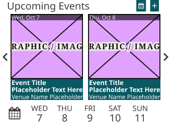
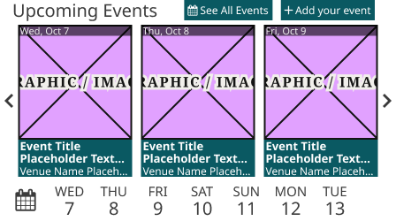
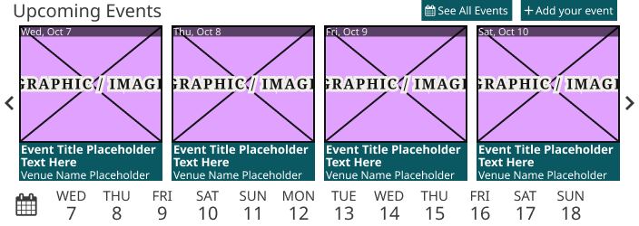
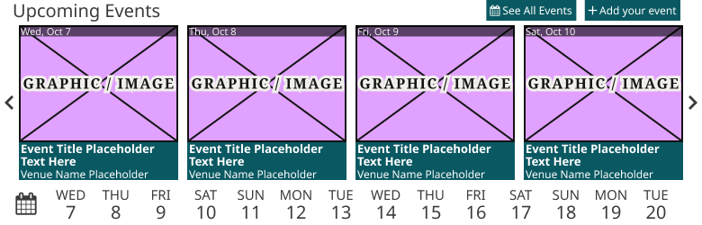
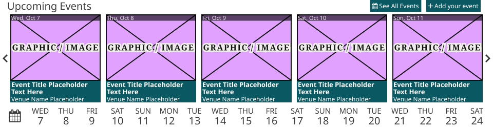

# Upcoming Events Widget

**Assembly · 5 variants** · Homepage components · source: WordPress Elements ▸ Homepage

> Device = Mobile, Tablet, 1024, 1100, Desktop (340 / 448 / 704 / 780 / 960 × 250). Matches the production CitySpark widget: 2 / 3 / 4 / 4 / 5 Event Cards, 5 / 7 / 12 / 14 / 18 days, header buttons, edge arrows. Text is Noto Sans (production Roboto Condensed; production-vs-design entry 28).

## Figma references

- File: WordPress Elements (`b1iZxkFwtAYq9rElmnCAzd`) · Page: Homepage
- Main: [Upcoming Events Widget](https://www.figma.com/design/b1iZxkFwtAYq9rElmnCAzd/?node-id=3557-24236) · node `3557:24236` · key `0e0f6ee3449a74f8060a49aa8f874252735b60d7`

| Variant | Node | Key | Size | Preview |
|---|---|---|---|---|
| Device=Mobile | [3557:40212](https://www.figma.com/design/b1iZxkFwtAYq9rElmnCAzd/?node-id=3557-40212) | e1af7ed6ecbae7f194991dec4fd7234b8e648e97 | 340×250 |  |
| Device=Tablet | [3557:40278](https://www.figma.com/design/b1iZxkFwtAYq9rElmnCAzd/?node-id=3557-40278) | 9b2fdc96cbe4b275eee78d03576e1a23ed531270 | 448×250 |  |
| Device=1024 | [3557:40363](https://www.figma.com/design/b1iZxkFwtAYq9rElmnCAzd/?node-id=3557-40363) | dc2ed1491082416d2d9d167610fd0a8a02d54062 | 704×250 |  |
| Device=1100 | [3395:51894](https://www.figma.com/design/b1iZxkFwtAYq9rElmnCAzd/?node-id=3395-51894) | 32790cfe4f7dbc49b56e891b2a4fa59e0f73a49d | 780×250 |  |
| Device=Desktop | [3557:24235](https://www.figma.com/design/b1iZxkFwtAYq9rElmnCAzd/?node-id=3557-24235) | 04c0447be33bc73881dc44b151df9fe9e7bf66e1 | 960×250 |  |

## Properties

| Property | Type | Default | Options |
|---|---|---|---|
| Device | VARIANT | Mobile | Mobile, Tablet, 1100, 1024, Desktop |

## Where it is used

- **Device=Mobile** — breakpoints: 340, 360; templates (via assembly): Mobile HomePage (via Upcoming Events Block), 340 HomePage (via Upcoming Events Block); nested inside: Upcoming Events Block / Device=Mobile ×1
- **Device=Tablet** — breakpoints: 768; templates (via assembly): 768 HomePage (via Upcoming Events Block); nested inside: Upcoming Events Block / Device=Tablet ×1
- **Device=1024** — breakpoints: 1024; templates (via assembly): 1024 HomePage (via Upcoming Events Block); nested inside: Upcoming Events Block / Device=1024 ×1
- **Device=1100** — breakpoints: 1100; templates (via assembly): 1100 HomePage (via Upcoming Events Block); nested inside: Upcoming Events Block / Device=1100 ×1
- **Device=Desktop** — breakpoints: 1280; templates (via assembly): Desktop HomePage (via Upcoming Events Block); nested inside: Upcoming Events Block / Device=Desktop ×1

## Breakpoints

| Key | Viewport | Variant(s) |
|---|---|---|
| 340 | ≤639px (XS-Fold, built 340) | Device=Mobile |
| 360 | ≤639px (SM-Mobile, built 360) | Device=Mobile |
| 768 | 640–799px (MD-TabletV) | Device=Tablet |
| 1024 | 800–1039px (LG-TabletH, built 1009) | Device=1024 |
| 1100 | ≥1040px (XL-Desktop, built 1085) | Device=1100 |
| 1280 | ≥1040px (XL-Desktop, built 1280) | Device=Desktop |

## Responsive rules

- Device=Mobile: 340×250 — renders at 340, 360
- Device=Tablet: 448×250 — renders at 768
- Device=1024: 704×250 — renders at 1024
- Device=1100: 780×250 — renders at 1100
- Device=Desktop: 960×250 — renders at 1280

## Dependencies

**Built from:**

- [Upcoming Events Header Button](../../components/27-upcoming-events-header-button/upcoming-events-header-button.md) ×2
- [Event Card](../../components/23-event-card/event-card.md) ×5
- [Upcoming Events Side Arrow](../../components/28-upcoming-events-side-arrow/upcoming-events-side-arrow.md) ×2
- [Date Picker Calendar Icon](../../components/25-date-picker-calendar-icon/date-picker-calendar-icon.md) ×1
- [Date Picker Day](../../components/24-date-picker-day/date-picker-day.md) ×18

**Built into:**

- [Upcoming Events Block](../30-upcoming-events-block/upcoming-events-block.md)

## Anatomy

**Device=Mobile**

```
- Device=Mobile — component 340×250
  - Header — frame 332×28 [horizontal gap 0] (fixed/fixed)
    - Title — text 257×22 (fill/hug) "Upcoming Events"
    - Buttons — frame 45×23 [horizontal gap 8.4] (hug/hug)
      - Upcoming Events Header Button — instance 19.2×23 [horizontal gap 2.8] (hug/fixed) → Upcoming Events Header Button [Type=See All Events, Label=Off]
      - Add your event — instance 17.4×23 [horizontal gap 2.8] (hug/fixed) → Upcoming Events Header Button [Type=Add your event, Label=Off]
  - Event List — frame 308×172 [horizontal gap 10] (fixed/fixed)
    - Event Card — instance 144×172 [vertical gap 0] (fill/fixed) → Event Card ×2
  - Prev Arrow — instance 20×20 → Upcoming Events Side Arrow [Direction=Left]
  - Next Arrow — instance 20×20 → Upcoming Events Side Arrow [Direction=Right]
  - Date Strip — frame 332×50
    - Date Picker Calendar Icon — instance 50×50 [vertical gap 0] (fixed/fixed) → Date Picker Calendar Icon
    - Date Picker Day — instance 50×50 [vertical gap 0] (fixed/fixed) → Date Picker Day ×5
```

**Device=Tablet**

```
- Device=Tablet — component 448×250
  - Header — frame 440×28 [horizontal gap 0] (fixed/fixed)
    - Title — text 194.4×22 (fill/hug) "Upcoming Events"
    - Buttons — frame 215.6×23 [horizontal gap 9.4] (hug/hug)
      - Upcoming Events Header Button — instance 100×23 [horizontal gap 2.8] (hug/fixed) → Upcoming Events Header Button [Type=See All Events, Label=On]
      - Add your event — instance 106.2×23 [horizontal gap 2.8] (hug/fixed) → Upcoming Events Header Button [Type=Add your event, Label=On]
  - Event List — frame 416×172 [horizontal gap 10] (fixed/fixed)
    - Event Card — instance 129×172 [vertical gap 0] (fixed/fixed) → Event Card ×3
  - Prev Arrow — instance 20×20 → Upcoming Events Side Arrow [Direction=Left]
  - Next Arrow — instance 20×20 → Upcoming Events Side Arrow [Direction=Right]
  - Date Strip — frame 440×50
    - Date Picker Calendar Icon — instance 50×50 [vertical gap 0] (fixed/fixed) → Date Picker Calendar Icon
    - Date Picker Day — instance 50×50 [vertical gap 0] (fixed/fixed) → Date Picker Day ×7
```

**Device=1024**

```
- Device=1024 — component 704×250
  - Header — frame 696×28 [horizontal gap 0] (fixed/fixed)
    - Title — text 450.4×22 (fill/hug) "Upcoming Events"
    - Buttons — frame 215.6×23 [horizontal gap 9.4] (hug/hug)
      - Upcoming Events Header Button — instance 100×23 [horizontal gap 2.8] (hug/fixed) → Upcoming Events Header Button [Type=See All Events, Label=On]
      - Add your event — instance 106.2×23 [horizontal gap 2.8] (hug/fixed) → Upcoming Events Header Button [Type=Add your event, Label=On]
  - Event List — frame 672×172 [horizontal gap 10] (fixed/fixed)
    - Event Card — instance 158×172 [vertical gap 0] (fixed/fixed) → Event Card ×4
  - Prev Arrow — instance 20×20 → Upcoming Events Side Arrow [Direction=Left]
  - Next Arrow — instance 20×20 → Upcoming Events Side Arrow [Direction=Right]
  - Date Strip — frame 696×50
    - Date Picker Calendar Icon — instance 50×50 [vertical gap 0] (fixed/fixed) → Date Picker Calendar Icon
    - Date Picker Day — instance 50×50 [vertical gap 0] (fixed/fixed) → Date Picker Day ×12
```

**Device=1100**

```
- Device=1100 — component 780×250
  - Header — frame 772×28 [horizontal gap 0] (fixed/fixed)
    - Title — text 526.4×22 (fill/hug) "Upcoming Events"
    - Buttons — frame 215.6×23 [horizontal gap 9.4] (hug/hug)
      - Upcoming Events Header Button — instance 100×23 [horizontal gap 2.8] (hug/fixed) → Upcoming Events Header Button [Type=See All Events, Label=On]
      - Add your event — instance 106.2×23 [horizontal gap 2.8] (hug/fixed) → Upcoming Events Header Button [Type=Add your event, Label=On]
  - Event List — frame 748×172 [horizontal gap 10] (fixed/fixed)
    - Event Card — instance 177×172 [vertical gap 0] (fixed/fixed) → Event Card ×4
  - Prev Arrow — instance 20×20 → Upcoming Events Side Arrow [Direction=Left]
  - Next Arrow — instance 20×20 → Upcoming Events Side Arrow [Direction=Right]
  - Date Strip — frame 772×50
    - Date Picker Calendar Icon — instance 50×50 [vertical gap 0] (fixed/fixed) → Date Picker Calendar Icon
    - Date Picker Day — instance 50×50 [vertical gap 0] (fixed/fixed) → Date Picker Day ×14
```

**Device=Desktop**

```
- Device=Desktop — component 960×250
  - Header — frame 952×28 [horizontal gap 0] (fixed/fixed)
    - Title — text 706.4×22 (fill/hug) "Upcoming Events"
    - Buttons — frame 215.6×23 [horizontal gap 9.4] (hug/hug)
      - Upcoming Events Header Button — instance 100×23 [horizontal gap 2.8] (hug/fixed) → Upcoming Events Header Button [Type=See All Events, Label=On]
      - Add your event — instance 106.2×23 [horizontal gap 2.8] (hug/fixed) → Upcoming Events Header Button [Type=Add your event, Label=On]
  - Event List — frame 928×172 [horizontal gap 10] (fixed/fixed)
    - Event Card — instance 176×172 [vertical gap 0] (fixed/fixed) → Event Card ×5
  - Prev Arrow — instance 20×20 → Upcoming Events Side Arrow [Direction=Left]
  - Next Arrow — instance 20×20 → Upcoming Events Side Arrow [Direction=Right]
  - Date Strip — frame 952×50
    - Date Picker Calendar Icon — instance 50×50 [vertical gap 0] (fixed/fixed) → Date Picker Calendar Icon
    - Date Picker Day — instance 50×50 [vertical gap 0] (fixed/fixed) → Date Picker Day ×18
```

## Size & layout

| Variant | Size | Width | Height | Auto-layout | Radius | Clip |
|---|---|---|---|---|---|---|
| Device=Mobile | 340×250 |  |  |  |  | yes |
| Device=Tablet | 448×250 |  |  |  |  | yes |
| Device=1024 | 704×250 |  |  |  |  | yes |
| Device=1100 | 780×250 |  |  |  |  | yes |
| Device=Desktop | 960×250 |  |  |  |  | yes |

## Typography

| Layer | Font | Weight | Size | Line height | Letter sp. | Case | Color | Color token | Type token | Truncate | Sample | Variants |
|---|---|---|---|---|---|---|---|---|---|---|---|---|
| Title | Noto Sans | Regular | 20 | 22px |  |  | #3B3B3B |  |  |  | Upcoming Events | all |

## Color & effects

| Layer | Role | Type | Hex | Token | Opacity | Note |
|---|---|---|---|---|---|---|
| Device=Mobile | fill | SOLID | #FFFFFF |  |  |  |
| Upcoming Events Header Button | fill | SOLID | #0A5962 | Colors/color/theme/primary-dark |  |  |
| Add your event | fill | SOLID | #0A5962 | Colors/color/theme/primary-dark |  |  |
| Event Card | fill | SOLID | #0A5962 | Colors/color/theme/primary-dark |  |  |
| Device=Tablet | fill | SOLID | #FFFFFF |  |  |  |
| Device=1024 | fill | SOLID | #FFFFFF |  |  |  |
| Device=1100 | fill | SOLID | #FFFFFF |  |  |  |
| Device=Desktop | fill | SOLID | #FFFFFF |  |  |  |

## Image ratios

_None._

## Ad slots

_None._

## Production references

_None found in descriptions or layer names._

## Known issues

- 10 solid paints are hard-coded (not bound to a color variable): #FFFFFF ×5, #3B3B3B ×5.

## Rendering steps

1. Pick the variant for the target breakpoint from the Breakpoints table (property values in `upcoming-events-widget.json` → `variants[].variantProperties`).
2. Start from `upcoming-events-widget.html` — each `<section>` is one variant; auto-layout is already mapped to flexbox and colors use `tokens.css` variables.
3. Replace every dashed `data-component` box with the referenced component's own skeleton (links under Dependencies); leave `data-component` on the wrapper.
4. Fill image slots at the ratio listed in Image ratios; fill text using the Typography table (truncate where a line clamp is listed).
5. Check against the preview PNG, then against the production references.
