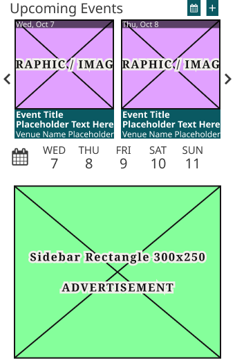
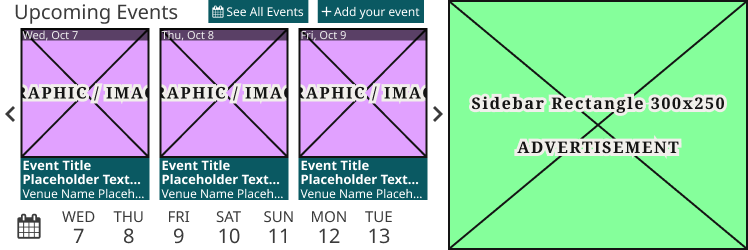
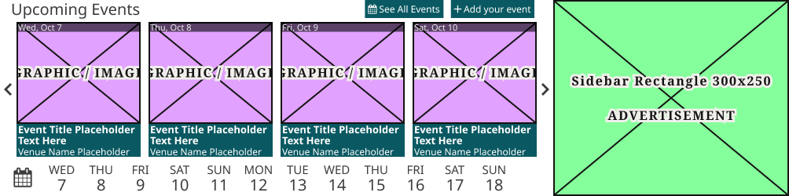
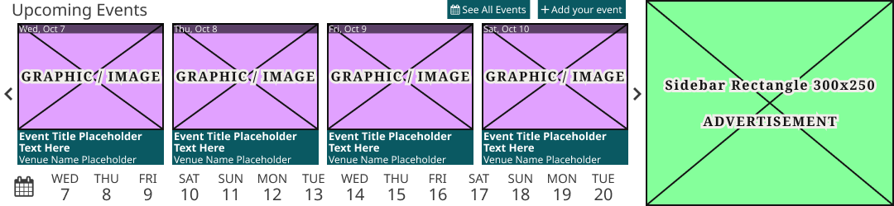
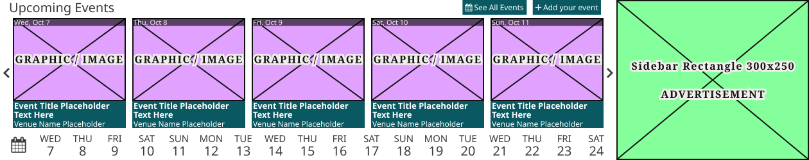

# Upcoming Events Block

**Assembly · 5 variants** · Homepage components · source: WordPress Elements ▸ Homepage

> Component set · Variant: Device = Mobile, Tablet, 1024, 1100, Desktop · the third-party events carousel block (Upcoming Events Widget + ad), instanced on every homepage breakpoint.

## Figma references

- File: WordPress Elements (`b1iZxkFwtAYq9rElmnCAzd`) · Page: Homepage
- Main: [Upcoming Events Block](https://www.figma.com/design/b1iZxkFwtAYq9rElmnCAzd/?node-id=3476-59741) · node `3476:59741` · key `41fc7fc2b3692e1147d50b2d400c396408ff5d9e`

| Variant | Node | Key | Size | Preview |
|---|---|---|---|---|
| Device=Mobile | [3476:59520](https://www.figma.com/design/b1iZxkFwtAYq9rElmnCAzd/?node-id=3476-59520) | 374b4a47a27654014e316b7981f9bdac8ee63223 | 340×517.5 |  |
| Device=Tablet | [3476:59524](https://www.figma.com/design/b1iZxkFwtAYq9rElmnCAzd/?node-id=3476-59524) | 8040ad47fa3bcec69ae323dddbff2fd35af89109 | 748×250 |  |
| Device=1024 | [3476:59528](https://www.figma.com/design/b1iZxkFwtAYq9rElmnCAzd/?node-id=3476-59528) | a0a664f2d08ef481c3e35feb46e1ccdc6a0066e7 | 1004×250 |  |
| Device=1100 | [3476:59627](https://www.figma.com/design/b1iZxkFwtAYq9rElmnCAzd/?node-id=3476-59627) | 9fb4c039da2c98aff7da892f2eb6f3593b56da53 | 1080×250 |  |
| Device=Desktop | [3476:59739](https://www.figma.com/design/b1iZxkFwtAYq9rElmnCAzd/?node-id=3476-59739) | 7d9738eff79cc639364c9d012aae8fec977cbb78 | 1260×250 |  |

## Properties

| Property | Type | Default | Options |
|---|---|---|---|
| Device | VARIANT | Mobile | Mobile, Tablet, 1024, 1100, Desktop |

## Where it is used

- **Device=Mobile** — breakpoints: 340, 360; templates (direct): Mobile HomePage ×1, 340 HomePage ×1
- **Device=Tablet** — breakpoints: 768; templates (direct): 768 HomePage ×1
- **Device=1024** — breakpoints: 1024; templates (direct): 1024 HomePage ×1
- **Device=1100** — breakpoints: 1100; templates (direct): 1100 HomePage ×1
- **Device=Desktop** — breakpoints: 1280; templates (direct): Desktop HomePage ×1

## Breakpoints

| Key | Viewport | Variant(s) |
|---|---|---|
| 340 | ≤639px (XS-Fold, built 340) | Device=Mobile |
| 360 | ≤639px (SM-Mobile, built 360) | Device=Mobile |
| 768 | 640–799px (MD-TabletV) | Device=Tablet |
| 1024 | 800–1039px (LG-TabletH, built 1009) | Device=1024 |
| 1100 | ≥1040px (XL-Desktop, built 1085) | Device=1100 |
| 1280 | ≥1040px (XL-Desktop, built 1280) | Device=Desktop |

## Responsive rules

- Device=Mobile: 340×517.5, vertical gap 17.5 pad 0/0/0/0 main MIN cross CENTER — renders at 340, 360
- Device=Tablet: 748×250, horizontal gap 0 pad 0/0/0/0 main MIN cross MIN — renders at 768
- Device=1024: 1004×250, horizontal gap 0 pad 0/0/0/0 main MIN cross MIN — renders at 1024
- Device=1100: 1080×250, horizontal gap 0 pad 0/0/0/0 main MIN cross MIN — renders at 1100
- Device=Desktop: 1260×250, horizontal gap 0 pad 0/0/0/0 main MIN cross MIN — renders at 1280

## Dependencies

**Built from:**

- [Upcoming Events Widget](../29-upcoming-events-widget/upcoming-events-widget.md) ×1
- Ad Blocks ×1 _(not in this export)_

**Built into:**

_Not used inside another exported item._

## Anatomy

**Device=Mobile**

```
- Device=Mobile — component 340×517.5 [vertical gap 17.5] (fixed/hug)
  - Upcoming Events Widget — instance 340×250 (fill/fixed) → Upcoming Events Widget [Device=Mobile]
  - Ad Blocks — instance 300×250 [vertical gap 8] (fixed/fixed) → Ad Blocks [Device=All, Name=Sidebar Rectangle 300x250]
```

**Device=Tablet**

```
- Device=Tablet — component 748×250 [horizontal gap 0] (hug/hug)
  - Upcoming Events Widget — instance 448×250 (fixed/fixed) → Upcoming Events Widget [Device=Tablet]
  - Ad Blocks — instance 300×250 [vertical gap 8] (fixed/fixed) → Ad Blocks [Device=All, Name=Sidebar Rectangle 300x250]
```

**Device=1024**

```
- Device=1024 — component 1004×250 [horizontal gap 0] (hug/hug)
  - Upcoming Events Widget — instance 704×250 (fixed/fixed) → Upcoming Events Widget [Device=1024]
  - Ad Blocks — instance 300×250 [vertical gap 8] (fixed/fixed) → Ad Blocks [Device=All, Name=Sidebar Rectangle 300x250]
```

**Device=1100**

```
- Device=1100 — component 1080×250 [horizontal gap 0] (hug/hug)
  - Upcoming Events Widget — instance 780×250 (fixed/fixed) → Upcoming Events Widget [Device=1100]
  - Ad Blocks — instance 300×250 [vertical gap 8] (fixed/fixed) → Ad Blocks [Device=All, Name=Sidebar Rectangle 300x250]
```

**Device=Desktop**

```
- Device=Desktop — component 1260×250 [horizontal gap 0] (hug/hug)
  - Upcoming Events Widget — instance 960×250 (fill/fixed) → Upcoming Events Widget [Device=Desktop]
  - Ad Blocks — instance 300×250 [vertical gap 8] (fixed/fixed) → Ad Blocks [Device=All, Name=Sidebar Rectangle 300x250]
```

## Size & layout

| Variant | Size | Width | Height | Auto-layout | Radius | Clip |
|---|---|---|---|---|---|---|
| Device=Mobile | 340×517.5 | FIXED | HUG | vertical gap 17.5 pad 0/0/0/0 main MIN cross CENTER |  | yes |
| Device=Tablet | 748×250 | HUG | HUG | horizontal gap 0 pad 0/0/0/0 main MIN cross MIN |  | yes |
| Device=1024 | 1004×250 | HUG | HUG | horizontal gap 0 pad 0/0/0/0 main MIN cross MIN |  | yes |
| Device=1100 | 1080×250 | HUG | HUG | horizontal gap 0 pad 0/0/0/0 main MIN cross MIN |  | yes |
| Device=Desktop | 1260×250 | HUG | HUG | horizontal gap 0 pad 0/0/0/0 main MIN cross MIN |  | yes |

## Typography

_No text._

## Color & effects

| Layer | Role | Type | Hex | Token | Opacity | Note |
|---|---|---|---|---|---|---|
| Upcoming Events Widget | fill | SOLID | #FFFFFF |  |  |  |
| Ad Blocks | fill | SOLID | #85FF9B |  |  |  |
| Ad Blocks | stroke | SOLID | #141414 | Colors/color/gray/min |  |  |

## Image ratios

_None._

## Ad slots

| Variant | Layer | Unit | Size |
|---|---|---|---|
| Device=Mobile | Ad Blocks | Sidebar Rectangle 300x250 | 300×250 |
| Device=Tablet | Ad Blocks | Sidebar Rectangle 300x250 | 300×250 |
| Device=1024 | Ad Blocks | Sidebar Rectangle 300x250 | 300×250 |
| Device=1100 | Ad Blocks | Sidebar Rectangle 300x250 | 300×250 |
| Device=Desktop | Ad Blocks | Sidebar Rectangle 300x250 | 300×250 |

## Production references

_None found in descriptions or layer names._

## Known issues

_None detected._

## Rendering steps

1. Pick the variant for the target breakpoint from the Breakpoints table (property values in `upcoming-events-block.json` → `variants[].variantProperties`).
2. Start from `upcoming-events-block.html` — each `<section>` is one variant; auto-layout is already mapped to flexbox and colors use `tokens.css` variables.
3. Replace every dashed `data-component` box with the referenced component's own skeleton (links under Dependencies); leave `data-component` on the wrapper.
4. Fill image slots at the ratio listed in Image ratios; fill text using the Typography table (truncate where a line clamp is listed).
5. Check against the preview PNG, then against the production references.
