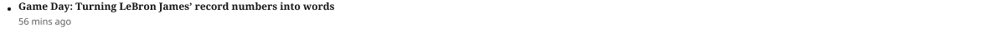

# Related Article List Item

**Component · Standalone** · Homepage components · source: WordPress Elements ▸ Homepage

> Standalone component · no variants (includes bullet icon)

## Figma references

- File: WordPress Elements (`b1iZxkFwtAYq9rElmnCAzd`) · Page: Homepage
- Main: [Related Article List Item](https://www.figma.com/design/b1iZxkFwtAYq9rElmnCAzd/?node-id=3334-43017) · node `3334:43017` · key `b713574ec2e2bb93789c51812dfb4f34cb971a71`

| Variant | Node | Key | Size | Preview |
|---|---|---|---|---|
| Related Article List Item | [3334:43017](https://www.figma.com/design/b1iZxkFwtAYq9rElmnCAzd/?node-id=3334-43017) | b713574ec2e2bb93789c51812dfb4f34cb971a71 | 1194×45 |  |

## Properties

_None._

## Where it is used

- **Related Article List Item** — breakpoints: 340, 360, 768, 1024, 1100, 1280; templates (via assembly): 768 HomePage (via Zone 1 Lead Article Card), Desktop HomePage (via Zone 1 Lead Article Card), 1100 HomePage (via Zone 1 Lead Article Card), 1024 HomePage (via Zone 1 Lead Article Card), Mobile HomePage (via Zone 1 Lead Article Card), 340 HomePage (via Zone 1 Lead Article Card); nested inside: Zone 1 Lead Article Card / Device=Tablet ×3, Zone 1 Lead Article Card / Device=Desktop ×3, Zone 1 Lead Article Card / Device=Mobile ×3

## Breakpoints

| Key | Viewport | Variant(s) |
|---|---|---|
| 340 | ≤639px (XS-Fold, built 340) | Related Article List Item |
| 360 | ≤639px (SM-Mobile, built 360) | Related Article List Item |
| 768 | 640–799px (MD-TabletV) | Related Article List Item |
| 1024 | 800–1039px (LG-TabletH, built 1009) | Related Article List Item |
| 1100 | ≥1040px (XL-Desktop, built 1085) | Related Article List Item |
| 1280 | ≥1040px (XL-Desktop, built 1280) | Related Article List Item |

## Responsive rules

- Related Article List Item: 1194×45, horizontal gap 0 pad 0/0/0/0 main MIN cross MIN — renders at 340, 360, 768, 1024, 1100, 1280

## Dependencies

**Built from:**

_Nothing — leaf component._

**Built into:**

- [Zone 1 Lead Article Card](../04-zone-1-lead-article-card/zone-1-lead-article-card.md)

## Anatomy

**Related Article List Item**

```
- Related Article List Item — component 1194×45 [horizontal gap 0] (fixed/fixed)
  - Bullet — frame 22×45 [vertical gap 12] (hug/fill)
    - Bullet Dot — vector 6×6 (fixed/fixed)
  - Content — frame 1172×36 [vertical gap 0] (fill/hug)
    - Title — frame 1172×15 [horizontal gap 8] (fill/hug)
      - Game Day: Turning LeBron James’ record numbers into words — text 1172×15 (fill/hug) "Game Day: Turning LeBron James’ record n"
    - Meta — frame 64×21 [horizontal gap 8] (hug/hug)
      - 56 mins ago — text 64×21 (hug/hug) "56 mins ago"
```

## Size & layout

| Variant | Size | Width | Height | Auto-layout | Radius | Clip |
|---|---|---|---|---|---|---|
| Related Article List Item | 1194×45 | FIXED | FIXED | horizontal gap 0 pad 0/0/0/0 main MIN cross MIN |  |  |

## Typography

| Layer | Font | Weight | Size | Line height | Letter sp. | Case | Color | Color token | Type token | Truncate | Sample | Variants |
|---|---|---|---|---|---|---|---|---|---|---|---|---|
| Game Day: Turning LeBron James’ record numbers into words | Noto Serif | Bold | 12 | 15px |  |  | #141414 | Colors/color/gray/min | font/size/12 |  | Game Day: Turning LeBron James’ record numbers int | all |
| 56 mins ago | Noto Sans | Regular | 11 | 20.63px |  |  | #5E5D5C | Colors/color/gray/200 | font/size/11 |  | 56 mins ago | all |

## Color & effects

| Layer | Role | Type | Hex | Token | Opacity | Note |
|---|---|---|---|---|---|---|
| Bullet Dot | fill | SOLID | #141414 | Colors/color/gray/min |  |  |
| Bullet Dot | stroke | SOLID | #F1EFEB | Colors/color/gray/600 |  |  |

## Image ratios

_None._

## Ad slots

_None._

## Production references

_None found in descriptions or layer names._

## Known issues

_None detected._

## Rendering steps

1. Pick the variant for the target breakpoint from the Breakpoints table (property values in `related-article-list-item.json` → `variants[].variantProperties`).
2. Start from `related-article-list-item.html` — each `<section>` is one variant; auto-layout is already mapped to flexbox and colors use `tokens.css` variables.
3. Replace every dashed `data-component` box with the referenced component's own skeleton (links under Dependencies); leave `data-component` on the wrapper.
4. Fill image slots at the ratio listed in Image ratios; fill text using the Typography table (truncate where a line clamp is listed).
5. Check against the preview PNG, then against the production references.
