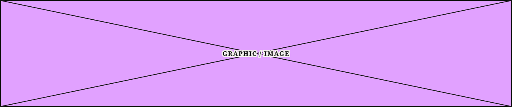

# Article Image Placeholder

**Component · Standalone** · Homepage components · source: WordPress Elements ▸ Homepage

> Standalone component · freely resizable, no variants

## Figma references

- File: WordPress Elements (`b1iZxkFwtAYq9rElmnCAzd`) · Page: Homepage
- Main: [Article Image Placeholder](https://www.figma.com/design/b1iZxkFwtAYq9rElmnCAzd/?node-id=3334-42380) · node `3334:42380` · key `682588ec19d35ed6a03e5a8e45b70e5fbc16d7cf`

| Variant | Node | Key | Size | Preview |
|---|---|---|---|---|
| Article Image Placeholder | [3334:42380](https://www.figma.com/design/b1iZxkFwtAYq9rElmnCAzd/?node-id=3334-42380) | 682588ec19d35ed6a03e5a8e45b70e5fbc16d7cf | 1290×271 |  |

## Properties

_None._

## Where it is used

- **Article Image Placeholder** — breakpoints: 340, 360, 768, 1024, 1100, 1280; templates (via assembly): Mobile HomePage (via 1Col Article Card, Event Card, Horizontal Thumbnail Card, TopZone Article Card, Zone 1 Lead Article Card), 340 HomePage (via 1Col Article Card, Event Card, Horizontal Thumbnail Card, TopZone Article Card, Zone 1 Lead Article Card), 768 HomePage (via 1Col Article Card, Event Card, Horizontal Feature Card, Horizontal Thumbnail Card, Zone 1 Lead Article Card), 1100 HomePage (via 1Col Article Card, Event Card, Horizontal Feature Card, Horizontal Thumbnail Card, TopZone Article Card, Zone 1 Lead Article Card), Desktop HomePage (via 1Col Article Card, Event Card, Horizontal Feature Card, Horizontal Thumbnail Card, TopZone Article Card, Zone 1 Lead Article Card), 1024 HomePage (via 1Col Article Card, Event Card, Feature + List Content Block, Horizontal Thumbnail Card, TopZone Article Card, Zone 1 Lead Article Card); nested inside: TopZone Article Card / Device=Mobile ×1, Event Card ×2, Horizontal Thumbnail Card / Device=Mobile ×1, Zone 1 Lead Article Card / Device=Tablet ×1, Horizontal Thumbnail Card / Device=Tablet ×1, Zone 1 Lead Article Card / Device=Desktop ×1, Feature + List Content Block / Size=Narrow ×1, Horizontal Thumbnail Card / Device=Desktop ×1, TopZone Article Card / Device=Desktop ×1, Zone 1 Lead Article Card / Device=Mobile ×1, Horizontal Feature Card ×1, 1Col Article Card / Style=Standard ×1, 1Col Article Card / Style=Media Lead ×1, TopZone Article Card / Device=1100 ×1, TopZone Article Card / Device=1024 ×1

## Breakpoints

| Key | Viewport | Variant(s) |
|---|---|---|
| 340 | ≤639px (XS-Fold, built 340) | Article Image Placeholder |
| 360 | ≤639px (SM-Mobile, built 360) | Article Image Placeholder |
| 768 | 640–799px (MD-TabletV) | Article Image Placeholder |
| 1024 | 800–1039px (LG-TabletH, built 1009) | Article Image Placeholder |
| 1100 | ≥1040px (XL-Desktop, built 1085) | Article Image Placeholder |
| 1280 | ≥1040px (XL-Desktop, built 1280) | Article Image Placeholder |

## Responsive rules

- Article Image Placeholder: 1290×271, vertical gap 8 pad 0/0/0/0 main CENTER cross CENTER — renders at 340, 360, 768, 1024, 1100, 1280

## Dependencies

**Built from:**

_Nothing — leaf component._

**Built into:**

- [Zone 1 Lead Article Card](../04-zone-1-lead-article-card/zone-1-lead-article-card.md)
- [TopZone Article Card](../05-topzone-article-card/topzone-article-card.md)
- [Horizontal Thumbnail Card](../11-horizontal-thumbnail-card/horizontal-thumbnail-card.md)
- [Horizontal Feature Card](../15-horizontal-feature-card/horizontal-feature-card.md)
- [1Col Article Card](../16-1col-article-card/1col-article-card.md)
- [Feature + List Content Block](../../assemblies/17-feature-list-content-block/feature-list-content-block.md)
- [Event Card](../23-event-card/event-card.md)

## Anatomy

**Article Image Placeholder**

```
- Article Image Placeholder — component 1290×271 [vertical gap 8] (fixed/fixed)
  - Placeholder X — boolean operation 1290×271 (fill/fill)
    - Diagonal 1 — vector 1289.6×269
    - Diagonal 2 — vector 1289.6×269
  - Label — frame 168×22 [horizontal gap 8] (hug/hug)
    - ARTICLE IMAGE — text 168×22 (hug/hug) "GRAPHIC / IMAGE"
```

## Size & layout

| Variant | Size | Width | Height | Auto-layout | Radius | Clip |
|---|---|---|---|---|---|---|
| Article Image Placeholder | 1290×271 | FIXED | FIXED | vertical gap 8 pad 0/0/0/0 main CENTER cross CENTER |  | yes |

## Typography

| Layer | Font | Weight | Size | Line height | Letter sp. | Case | Color | Color token | Type token | Truncate | Sample | Variants |
|---|---|---|---|---|---|---|---|---|---|---|---|---|
| ARTICLE IMAGE | Noto Serif | Bold | 16 | auto | 10% |  | #141414 | Colors/color/gray/min |  |  | GRAPHIC / IMAGE | all |

## Color & effects

| Layer | Role | Type | Hex | Token | Opacity | Note |
|---|---|---|---|---|---|---|
| Article Image Placeholder | fill | SOLID | #E1A1FF |  |  | image placeholder fill |
| Article Image Placeholder | stroke | SOLID | #141414 | Colors/color/gray/min |  |  |
| Placeholder X | fill | SOLID | #141414 | Colors/color/gray/min |  |  |
| Diagonal 1 | stroke | SOLID | #141414 | Colors/color/gray/min |  |  |
| Diagonal 2 | stroke | SOLID | #141414 | Colors/color/gray/min |  |  |

## Image ratios

_None._

## Ad slots

_None._

## Production references

_None found in descriptions or layer names._

## Known issues

- 1 solid paints are hard-coded (not bound to a color variable): #E1A1FF ×1.

## Rendering steps

1. Pick the variant for the target breakpoint from the Breakpoints table (property values in `article-image-placeholder.json` → `variants[].variantProperties`).
2. Start from `article-image-placeholder.html` — each `<section>` is one variant; auto-layout is already mapped to flexbox and colors use `tokens.css` variables.
3. Replace every dashed `data-component` box with the referenced component's own skeleton (links under Dependencies); leave `data-component` on the wrapper.
4. Fill image slots at the ratio listed in Image ratios; fill text using the Typography table (truncate where a line clamp is listed).
5. Check against the preview PNG, then against the production references.
