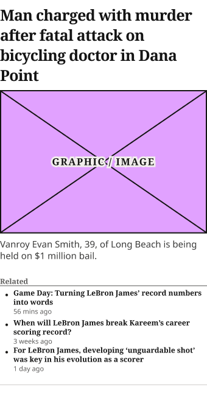
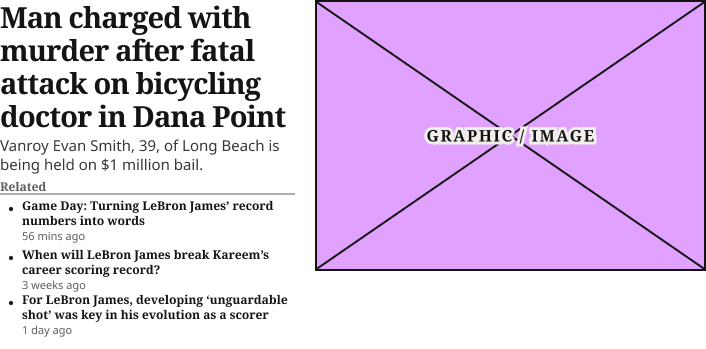
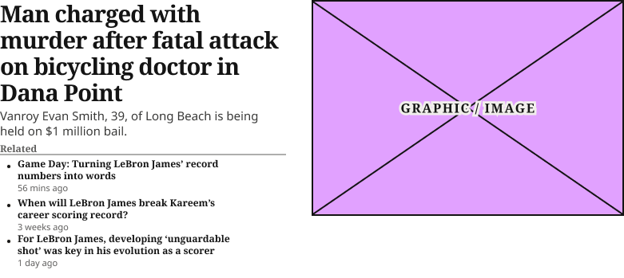

# Zone 1 Lead Article Card

**Component · 3 variants** · Homepage components · source: WordPress Elements ▸ Homepage

> Component set · Variant: Device = Desktop, Mobile (badge defaults to None on both)

## Figma references

- File: WordPress Elements (`b1iZxkFwtAYq9rElmnCAzd`) · Page: Homepage
- Main: [Zone 1 Lead Article Card](https://www.figma.com/design/b1iZxkFwtAYq9rElmnCAzd/?node-id=3336-46157) · node `3336:46157` · key `20dc946d8602b998c7cb522bb6e28d102459bf66`

| Variant | Node | Key | Size | Preview |
|---|---|---|---|---|
| Device=Mobile | [3336:46156](https://www.figma.com/design/b1iZxkFwtAYq9rElmnCAzd/?node-id=3336-46156) | d801cdf7da6c90d8b5e1b45f57a94859d62b55e0 | 340×648.7 |  |
| Device=Desktop | [3336:46155](https://www.figma.com/design/b1iZxkFwtAYq9rElmnCAzd/?node-id=3336-46155) | 5aaf6f2e20539bd0a19675266678595a12deb55e | 706×349 |  |
| Device=Tablet | [3383:46111](https://www.figma.com/design/b1iZxkFwtAYq9rElmnCAzd/?node-id=3383-46111) | 584ab8714d388b3464f920773139fc63e5917590 | 748×349 |  |

## Properties

| Property | Type | Default | Options |
|---|---|---|---|
| Device | VARIANT | Mobile | Desktop, Mobile, Tablet |

## Where it is used

- **Device=Mobile** — breakpoints: 340, 360, 1024, 1100; templates (direct): 1100 HomePage ×1, 1024 HomePage ×1; templates (via assembly): Mobile HomePage (via TOP ZONE Block), 340 HomePage (via TOP ZONE Block); nested inside: TOP ZONE Block / Device=Mobile ×1
- **Device=Desktop** — breakpoints: 1280; templates (via assembly): Desktop HomePage (via TOP ZONE Block); nested inside: TOP ZONE Block / Device=Desktop ×1
- **Device=Tablet** — breakpoints: 768; templates (via assembly): 768 HomePage (via TOP ZONE Block); nested inside: TOP ZONE Block / Device=Tablet ×1

## Breakpoints

| Key | Viewport | Variant(s) |
|---|---|---|
| 340 | ≤639px (XS-Fold, built 340) | Device=Mobile |
| 360 | ≤639px (SM-Mobile, built 360) | Device=Mobile |
| 768 | 640–799px (MD-TabletV) | Device=Tablet |
| 1024 | 800–1039px (LG-TabletH, built 1009) | Device=Mobile |
| 1100 | ≥1040px (XL-Desktop, built 1085) | Device=Mobile |
| 1280 | ≥1040px (XL-Desktop, built 1280) | Device=Desktop |

## Responsive rules

- Device=Mobile: 340×648.7, vertical gap 8 pad 0/0/16/0 main MIN cross CENTER — renders at 340, 360, 1024, 1100
- Device=Desktop: 706×349, horizontal gap 20 pad 0/0/16/0 main MIN cross MIN — renders at 1280
- Device=Tablet: 748×349, horizontal gap 32 pad 0/0/16/0 main MIN cross MIN — renders at 768

## Dependencies

**Built from:**

- [Article Status Badge](../01-article-status-badge/article-status-badge.md) ×1
- [Article Image Placeholder](../03-article-image-placeholder/article-image-placeholder.md) ×1
- [Related Article List Item](../02-related-article-list-item/related-article-list-item.md) ×3

**Built into:**

- [TOP ZONE Block](../../assemblies/12-top-zone-block/top-zone-block.md)

## Anatomy

**Device=Mobile**

```
- Device=Mobile — component 340×648.7 [vertical gap 8] (fixed/hug)
  - SubsOnly Frame — frame 340×0 [vertical gap 8] (fill/hug)
    - Article Status Badge — instance 0×0 [horizontal gap 0] (hug/hug) → Article Status Badge [Type=None] (hidden)
  - Headline Container — frame 340×132 [horizontal gap 8] (fill/hug)
    - Man charged with murder after fatal attack on bicycling doctor in Dana Point — text 340×132 (fill/hug) "Man charged with murder after fatal atta"
  - Featured Image — frame 340×235.7 [vertical gap 8] (fill/fixed)
    - Article Image Placeholder — instance 340×235.7 [vertical gap 8] (fill/fixed) → Article Image Placeholder
  - Excerpt Container — frame 340×54 [horizontal gap 8] (fill/hug)
    - Vanroy Evan Smith, 39, of Long Beach is being held on $1 million bail. — text 340×38 (fill/hug) "Vanroy Evan Smith, 39, of Long Beach is "
  - Relate Articles Zone 1 Container — frame 340×171 [vertical gap 4] (fill/hug)
    - Related Articles Header — frame 340×16 [horizontal gap 8] (fill/hug)
      - Header — text 47×16 (hug/hug) "Related"
    - Related Articles Body — frame 340×135 [vertical gap 4] (fill/hug)
      - Related Article List Item — instance 340×45 [horizontal gap 0] (fill/fixed) → Related Article List Item
      - Related Article List Item — instance 340×41 [horizontal gap 0] (fill/fixed) → Related Article List Item ×2
  - Bottom Border Line — line 340×0 (fill/fixed)
```

**Device=Desktop**

```
- Device=Desktop — component 706×349 [horizontal gap 20] (hug/hug)
  - 1st Col — frame 295×333 [vertical gap 4] (fixed/hug)
    - Article Status Badge — instance 0×0 [horizontal gap 0] (hug/hug) → Article Status Badge [Type=None] (hidden)
    - Headline Container — frame 295×132 [horizontal gap 8] (fill/hug)
      - Man charged with murder after fatal attack on bicycling doctor in Dana Point — text 295×132 (fill/hug) "Man charged with murder after fatal atta"
    - Excerpt Container — frame 295×38 [horizontal gap 8] (fill/hug)
      - Vanroy Evan Smith, 39, of Long Beach is being held on $1 million bail. — text 295×38 (fill/hug) "Vanroy Evan Smith, 39, of Long Beach is "
    - Relate Articles Zone 1 Container — frame 295×155 [vertical gap 4] (fill/hug)
      - Related Articles Header — frame 295×16 [horizontal gap 8] (fill/hug)
        - Header — text 47×16 (hug/hug) "Related"
      - Related Articles Body — frame 295×135 [vertical gap 4] (fill/hug)
        - Related Article List Item — instance 295×45 [horizontal gap 0] (fixed/fixed) → Related Article List Item
        - Related Article List Item — instance 295×41 [horizontal gap 0] (fixed/fixed) → Related Article List Item ×2
  - 2nd Col — frame 391×271 [vertical gap 8] (fixed/fixed)
    - Article Image Placeholder — instance 391×271 [vertical gap 8] (fixed/fixed) → Article Image Placeholder
```

**Device=Tablet**

```
- Device=Tablet — component 748×349 [horizontal gap 32] (hug/hug)
  - 1st Col — frame 358×333 [vertical gap 4] (fixed/hug)
    - Article Status Badge — instance 0×0 [horizontal gap 0] (hug/hug) → Article Status Badge [Type=None] (hidden)
    - Headline Container — frame 358×132 [horizontal gap 8] (fill/hug)
      - Man charged with murder after fatal attack on bicycling doctor in Dana Point — text 358×132 (fill/hug) "Man charged with murder after fatal atta"
    - Excerpt Container — frame 358×38 [horizontal gap 8] (fill/hug)
      - Vanroy Evan Smith, 39, of Long Beach is being held on $1 million bail. — text 358×38 (fill/hug) "Vanroy Evan Smith, 39, of Long Beach is "
    - Relate Articles Zone 1 Container — frame 358×155 [vertical gap 4] (fill/hug)
      - Related Articles Header — frame 358×16 [horizontal gap 8] (fill/hug)
        - Header — text 47×16 (hug/hug) "Related"
      - Related Articles Body — frame 358×135 [vertical gap 4] (fill/hug)
        - Related Article List Item — instance 295×45 [horizontal gap 0] (fixed/fixed) → Related Article List Item
        - Related Article List Item — instance 295×41 [horizontal gap 0] (fixed/fixed) → Related Article List Item ×2
  - 2nd Col — frame 358×271 [vertical gap 8] (fixed/fixed)
    - Article Image Placeholder — instance 391×271 [vertical gap 8] (fixed/fixed) → Article Image Placeholder
```

## Size & layout

| Variant | Size | Width | Height | Auto-layout | Radius | Clip |
|---|---|---|---|---|---|---|
| Device=Mobile | 340×648.7 | FIXED | HUG | vertical gap 8 pad 0/0/16/0 main MIN cross CENTER |  |  |
| Device=Desktop | 706×349 | HUG | HUG | horizontal gap 20 pad 0/0/16/0 main MIN cross MIN |  |  |
| Device=Tablet | 748×349 | HUG | HUG | horizontal gap 32 pad 0/0/16/0 main MIN cross MIN |  |  |

## Typography

| Layer | Font | Weight | Size | Line height | Letter sp. | Case | Color | Color token | Type token | Truncate | Sample | Variants |
|---|---|---|---|---|---|---|---|---|---|---|---|---|
| Man charged with murder after fatal attack on bicycling doct | Noto Serif | Bold | 25 | 33px | -3% |  | #141414 | Colors/color/gray/min |  |  | Man charged with murder after fatal attack on bicy | Device=Mobile |
| Vanroy Evan Smith, 39, of Long Beach is being held on $1 mil | Noto Sans | Regular | 15 | 19px |  |  | #393938 | Colors/color/gray/100 | Editorial/Body/ExcerptCompact |  | Vanroy Evan Smith, 39, of Long Beach is being held | all |
| Header | Noto Serif | Bold | 12 | auto |  |  | #5E5D5C | Colors/color/gray/200 |  |  | Related | all |
| Man charged with murder after fatal attack on bicycling doct | Noto Serif | Bold | 29 | 33px | -3% |  | #141414 | Colors/color/gray/min |  |  | Man charged with murder after fatal attack on bicy | Device=Desktop, Device=Tablet |

## Color & effects

| Layer | Role | Type | Hex | Token | Opacity | Note |
|---|---|---|---|---|---|---|
| Device=Mobile | fill | SOLID | #FFFFFF | Colors/color/gray/max |  |  |
| Article Image Placeholder | fill | SOLID | #E1A1FF |  |  | image placeholder fill |
| Article Image Placeholder | stroke | SOLID | #141414 | Colors/color/gray/min |  |  |
| Related Articles Header | stroke | SOLID | #5E5D5C | Colors/color/gray/200 |  |  |
| Bottom Border Line | stroke | SOLID | #CCCAC7 | Colors/color/gray/500 |  |  |
| Device=Desktop | fill | SOLID | #FFFFFF | Colors/color/gray/max |  |  |
| Device=Tablet | fill | SOLID | #FFFFFF | Colors/color/gray/max |  |  |

## Image ratios

| Variant | Layer | Size | Ratio | Source |
|---|---|---|---|---|
| Device=Mobile | Article Image Placeholder | 340×235.7 | 1.44:1 | Article Image Placeholder |
| Device=Desktop | Article Image Placeholder | 391×271 | 1.44:1 | Article Image Placeholder |
| Device=Tablet | Article Image Placeholder | 391×271 | 1.44:1 | Article Image Placeholder |

## Ad slots

_None._

## Production references

_None found in descriptions or layer names._

## Known issues

- `Device=Mobile` is declared for 340, 360 but is placed in template(s) at 1024, 1100 — check the variant choice.

## Rendering steps

1. Pick the variant for the target breakpoint from the Breakpoints table (property values in `zone-1-lead-article-card.json` → `variants[].variantProperties`).
2. Start from `zone-1-lead-article-card.html` — each `<section>` is one variant; auto-layout is already mapped to flexbox and colors use `tokens.css` variables.
3. Replace every dashed `data-component` box with the referenced component's own skeleton (links under Dependencies); leave `data-component` on the wrapper.
4. Fill image slots at the ratio listed in Image ratios; fill text using the Typography table (truncate where a line clamp is listed).
5. Check against the preview PNG, then against the production references.
