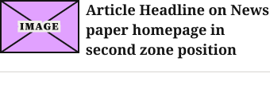
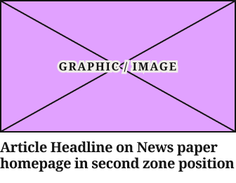
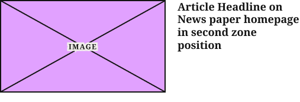

# TopZone Article Card

**Component · 4 variants** · Homepage components · source: WordPress Elements ▸ Homepage

> Component set · Variant: Device = Desktop, Mobile (badge defaults to None on both)

## Figma references

- File: WordPress Elements (`b1iZxkFwtAYq9rElmnCAzd`) · Page: Homepage
- Main: [TopZone Article Card](https://www.figma.com/design/b1iZxkFwtAYq9rElmnCAzd/?node-id=3336-46079) · node `3336:46079` · key `4daecb8ad8cafb30916853070665c768d1fc18e8`

| Variant | Node | Key | Size | Preview |
|---|---|---|---|---|
| Device=Mobile | [3336:46078](https://www.figma.com/design/b1iZxkFwtAYq9rElmnCAzd/?node-id=3336-46078) | 997b110ba5e030bfc5ba916de350fbd24160af6f | 340×107 |  |
| Device=Desktop | [3336:46077](https://www.figma.com/design/b1iZxkFwtAYq9rElmnCAzd/?node-id=3336-46077) | 8dcd8a244e91736a663d21060039986716abae71 | 336×261 |  |
| Device=1024 | [3553:32800](https://www.figma.com/design/b1iZxkFwtAYq9rElmnCAzd/?node-id=3553-32800) | 48a16f06d7d00fc7b7e02a48e479b8380bc919cb | 197×191.8 |  |
| Device=1100 | [3553:32811](https://www.figma.com/design/b1iZxkFwtAYq9rElmnCAzd/?node-id=3553-32811) | 67dbd9fd7a6a57850fcbcc30e741a596ed8c723f | 507×173 |  |

## Properties

| Property | Type | Default | Options |
|---|---|---|---|
| Device | VARIANT | Mobile | Desktop, Mobile, 1024, 1100 |

## Where it is used

- **Device=Mobile** — breakpoints: 340, 360; templates (via assembly): Mobile HomePage (via TOP ZONE Block), 340 HomePage (via TOP ZONE Block); nested inside: TOP ZONE Block / Device=Mobile ×4
- **Device=Desktop** — breakpoints: 1280; templates (via assembly): Desktop HomePage (via TOP ZONE Block); nested inside: TOP ZONE Block / Device=Desktop ×4
- **Device=1024** — breakpoints: 1024; templates (via assembly): 1024 HomePage (via TOP ZONE Block); nested inside: TOP ZONE Block / Device=1024 ×4
- **Device=1100** — breakpoints: 1100; templates (via assembly): 1100 HomePage (via TOP ZONE Block); nested inside: TOP ZONE Block / Device=1100 ×4

## Breakpoints

| Key | Viewport | Variant(s) |
|---|---|---|
| 340 | ≤639px (XS-Fold, built 340) | Device=Mobile |
| 360 | ≤639px (SM-Mobile, built 360) | Device=Mobile |
| 1024 | 800–1039px (LG-TabletH, built 1009) | Device=1024 |
| 1100 | ≥1040px (XL-Desktop, built 1085) | Device=1100 |
| 1280 | ≥1040px (XL-Desktop, built 1280) | Device=Desktop |

## Responsive rules

- Device=Mobile: horizontal, 100×67 image. Device=1024: vertical, 16:9 image filling the width, CardTertiaryCompact 16/18.88. Device=1100: horizontal, 280×157 image, 20px gap, CardTertiaryRow 18/21.6. Device=Desktop: vertical, 16:9 image (340×191 in production at 1280), CardTertiary 20/23.6 −0.4. Checked on 6 sites at 1024, 1100 and 1280 (2026-10-07).
- Device=Mobile: 340×107, vertical gap 16 pad 0/0/16/0 main MIN cross MIN — renders at 340, 360
- Device=Desktop: 336×261, vertical gap 8 pad 0/0/16/0 main MIN cross MIN — renders at 1280
- Device=1024: 197×191.8, vertical gap 8 pad 0/0/16/0 main MIN cross MIN — renders at 1024
- Device=1100: 507×173, vertical gap 16 pad 0/0/16/0 main MIN cross MIN — renders at 1100

## Dependencies

**Built from:**

- [Article Image Placeholder](../03-article-image-placeholder/article-image-placeholder.md) ×1
- [Article Status Badge](../01-article-status-badge/article-status-badge.md) ×1

**Built into:**

- [TOP ZONE Block](../../assemblies/12-top-zone-block/top-zone-block.md)

## Anatomy

**Device=Mobile**

```
- Device=Mobile — component 340×107 [vertical gap 16] (fixed/hug)
  - Content — frame 340×75 [horizontal gap 8] (fill/hug)
    - Article Image Placeholder — instance 100×67 [vertical gap 8] (fixed/fixed) → Article Image Placeholder
    - Headline — frame 232×75 [vertical gap 15] (fixed/hug)
      - Article Status Badge — instance 0×0 [horizontal gap 0] (hug/hug) → Article Status Badge [Type=None] (hidden)
      - Article Headline on News paper homepage in second zone position — text 232×75 (fill/hug) "Article Headline on News paper homepage "
  - Bottom Border Line — line 340×0 (fill/fixed)
```

**Device=Desktop**

```
- Device=Desktop — component 336×261 [vertical gap 8] (fixed/hug)
  - Article Image Placeholder — instance 336×189 [vertical gap 8] (fill/fixed) → Article Image Placeholder
  - Article Status Badge — instance 153×27 [horizontal gap 8] (hug/hug) → Article Status Badge [Type=Sponsored] (hidden)
  - Headline — frame 336×48 [vertical gap 15] (fill/hug)
    - Article Headline on News paper homepage in second zone position — text 336×48 (fill/hug) "Article Headline on News paper homepage "
```

**Device=1024**

```
- Device=1024 — component 197×191.8 [vertical gap 8] (fixed/hug)
  - Article Image Placeholder — instance 197×110.8 [vertical gap 8] (fill/fixed) → Article Image Placeholder
  - Article Status Badge — instance 153×27 [horizontal gap 8] (hug/hug) → Article Status Badge [Type=Sponsored] (hidden)
  - Headline — frame 197×57 [vertical gap 15] (fill/hug)
    - Article Headline on News paper homepage in second zone position — text 197×57 (fill/hug) "Article Headline on News paper homepage "
```

**Device=1100**

```
- Device=1100 — component 507×173 [vertical gap 16] (fixed/hug)
  - Content — frame 507×157 [horizontal gap 20] (fill/hug)
    - Article Image Placeholder — instance 280×157 [vertical gap 8] (fixed/fixed) → Article Image Placeholder
    - Headline — frame 207×87 [vertical gap 15] (fill/hug)
      - Article Status Badge — instance 0×0 [horizontal gap 0] (hug/hug) → Article Status Badge [Type=None] (hidden)
      - Article Headline on News paper homepage in second zone position — text 207×87 (fill/hug) "Article Headline on News paper homepage "
  - Bottom Border Line — line 507×0 (fixed/fixed) (hidden)
```

## Size & layout

| Variant | Size | Width | Height | Auto-layout | Radius | Clip |
|---|---|---|---|---|---|---|
| Device=Mobile | 340×107 | FIXED | HUG | vertical gap 16 pad 0/0/16/0 main MIN cross MIN |  |  |
| Device=Desktop | 336×261 | FIXED | HUG | vertical gap 8 pad 0/0/16/0 main MIN cross MIN |  |  |
| Device=1024 | 197×191.8 | FIXED | HUG | vertical gap 8 pad 0/0/16/0 main MIN cross MIN |  |  |
| Device=1100 | 507×173 | FIXED | HUG | vertical gap 16 pad 0/0/16/0 main MIN cross MIN |  |  |

## Typography

| Layer | Font | Weight | Size | Line height | Letter sp. | Case | Color | Color token | Type token | Truncate | Sample | Variants |
|---|---|---|---|---|---|---|---|---|---|---|---|---|
| Article Headline on News paper homepage in second zone posit | Noto Serif | Bold | 18 | auto |  |  | #141414 | Colors/color/gray/min |  |  | Article Headline on News paper homepage in second  | Device=Mobile |
| Article Headline on News paper homepage in second zone posit | Noto Serif | Bold | 20 | 23.6px | -0.4px |  | #141414 | Colors/color/gray/min | Editorial/Titles/CardTertiary |  | Article Headline on News paper homepage in second  | Device=Desktop |
| Article Headline on News paper homepage in second zone posit | Noto Serif | Bold | 16 | 18.88px |  |  | #141414 | Colors/color/gray/min | Editorial/Titles/CardTertiaryCompact |  | Article Headline on News paper homepage in second  | Device=1024 |
| Article Headline on News paper homepage in second zone posit | Noto Serif | Bold | 18 | 21.6px |  |  | #141414 | Colors/color/gray/min | Editorial/Titles/CardTertiaryRow |  | Article Headline on News paper homepage in second  | Device=1100 |

## Color & effects

| Layer | Role | Type | Hex | Token | Opacity | Note |
|---|---|---|---|---|---|---|
| Device=Mobile | fill | SOLID | #FFFFFF | Colors/color/gray/max |  |  |
| Article Image Placeholder | fill | SOLID | #E1A1FF |  |  | image placeholder fill |
| Article Image Placeholder | stroke | SOLID | #141414 | Colors/color/gray/min |  |  |
| Bottom Border Line | stroke | SOLID | #CCCAC7 | Colors/color/gray/500 |  |  |
| Device=Desktop | fill | SOLID | #FFFFFF | Colors/color/gray/max |  |  |
| Article Status Badge | fill | SOLID | #7D161E |  |  |  |
| Device=1024 | fill | SOLID | #FFFFFF | Colors/color/gray/max |  |  |
| Device=1100 | fill | SOLID | #FFFFFF | Colors/color/gray/max |  |  |

## Image ratios

| Variant | Layer | Size | Ratio | Source |
|---|---|---|---|---|
| Device=Mobile | Article Image Placeholder | 100×67 | 3:2 | Article Image Placeholder |
| Device=Desktop | Article Image Placeholder | 336×189 | 16:9 | Article Image Placeholder |
| Device=1024 | Article Image Placeholder | 197×110.8 | 16:9 | Article Image Placeholder |
| Device=1100 | Article Image Placeholder | 280×157 | 16:9 | Article Image Placeholder |

## Ad slots

_None._

## Production references

_None found in descriptions or layer names._

## Known issues

_None detected._

## Rendering steps

1. Pick the variant for the target breakpoint from the Breakpoints table (property values in `topzone-article-card.json` → `variants[].variantProperties`).
2. Start from `topzone-article-card.html` — each `<section>` is one variant; auto-layout is already mapped to flexbox and colors use `tokens.css` variables.
3. Replace every dashed `data-component` box with the referenced component's own skeleton (links under Dependencies); leave `data-component` on the wrapper.
4. Fill image slots at the ratio listed in Image ratios; fill text using the Typography table (truncate where a line clamp is listed).
5. Check against the preview PNG, then against the production references.
