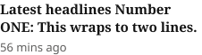
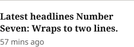
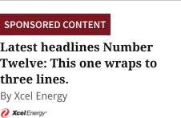

# Latest Headlines List Item

**Component · 3 variants** · Homepage components · source: WordPress Elements ▸ Homepage

> Component set · Variant: Type = First, Standard, Sponsored (badge defaults to None; Sponsored variant uses Article Status Badge = Sponsored)

## Figma references

- File: WordPress Elements (`b1iZxkFwtAYq9rElmnCAzd`) · Page: Homepage
- Main: [Latest Headlines List Item](https://www.figma.com/design/b1iZxkFwtAYq9rElmnCAzd/?node-id=3336-46118) · node `3336:46118` · key `264c00580f01ace3ec1483efbb4da877a0238766`

| Variant | Node | Key | Size | Preview |
|---|---|---|---|---|
| Type=First | [3336:46115](https://www.figma.com/design/b1iZxkFwtAYq9rElmnCAzd/?node-id=3336-46115) | 25a91f43951ba19fc2b1308139dc36b75d9440fc | 226×62 |  |
| Type=Standard | [3336:46116](https://www.figma.com/design/b1iZxkFwtAYq9rElmnCAzd/?node-id=3336-46116) | b2edcd919d342f5066f444ab35b2fca0a68b7705 | 226×78 |  |
| Type=Sponsored | [3336:46117](https://www.figma.com/design/b1iZxkFwtAYq9rElmnCAzd/?node-id=3336-46117) | 4a28da74cdd8fc131f87a55c16f435ca71b9533e | 226×146 |  |

## Properties

| Property | Type | Default | Options |
|---|---|---|---|
| Type | VARIANT | First | First, Standard, Sponsored |

## Where it is used

- **Type=First** — breakpoints: 340, 360, 768, 1024, 1100, 1280; templates (direct): 1024 HomePage ×1, 1100 HomePage ×1; templates (via assembly): Desktop HomePage (via Latest Headlines), Mobile HomePage (via Latest Headlines), 340 HomePage (via Latest Headlines), 768 HomePage (via Latest Headlines); nested inside: Latest Headlines / Device=Desktop ×1, Latest Headlines / Device=Mobile ×1, Latest Headlines / Device=Tablet ×1
- **Type=Standard** — breakpoints: 340, 360, 768, 1024, 1100, 1280; templates (direct): 1100 HomePage ×6, 1024 HomePage ×6; templates (via assembly): Mobile HomePage (via Latest Headlines), 340 HomePage (via Latest Headlines), 768 HomePage (via Latest Headlines), Desktop HomePage (via Latest Headlines); nested inside: Latest Headlines / Device=Mobile ×6, Latest Headlines / Device=Tablet ×6, Latest Headlines / Device=Desktop ×6
- **Type=Sponsored** — breakpoints: 340, 360, 768, 1024, 1100, 1280; templates (direct): 1100 HomePage ×1, 1024 HomePage ×1; templates (via assembly): 768 HomePage (via Latest Headlines), Mobile HomePage (via Latest Headlines), 340 HomePage (via Latest Headlines), Desktop HomePage (via Latest Headlines); nested inside: Latest Headlines / Device=Tablet ×1, Latest Headlines / Device=Mobile ×1, Latest Headlines / Device=Desktop ×1

## Breakpoints

| Key | Viewport | Variant(s) |
|---|---|---|
| 340 | ≤639px (XS-Fold, built 340) | Type=First, Type=Standard, Type=Sponsored |
| 360 | ≤639px (SM-Mobile, built 360) | Type=First, Type=Standard, Type=Sponsored |
| 768 | 640–799px (MD-TabletV) | Type=First, Type=Standard, Type=Sponsored |
| 1024 | 800–1039px (LG-TabletH, built 1009) | Type=First, Type=Standard, Type=Sponsored |
| 1100 | ≥1040px (XL-Desktop, built 1085) | Type=First, Type=Standard, Type=Sponsored |
| 1280 | ≥1040px (XL-Desktop, built 1280) | Type=First, Type=Standard, Type=Sponsored |

## Responsive rules

- Type=First: 226×62, vertical gap 4 pad 0/0/0/0 main MIN cross MIN — renders at 340, 360, 768, 1024, 1100, 1280
- Type=Standard: 226×78, vertical gap 16 pad 0/0/0/0 main MIN cross MIN — renders at 340, 360, 768, 1024, 1100, 1280
- Type=Sponsored: 226×146, vertical gap 16 pad 0/0/0/0 main MIN cross MIN — renders at 340, 360, 768, 1024, 1100, 1280

## Dependencies

**Built from:**

- [Article Status Badge](../01-article-status-badge/article-status-badge.md) ×3

**Built into:**

- [Latest Headlines](../../assemblies/09-latest-headlines/latest-headlines.md)

## Anatomy

**Type=First**

```
- Type=First — component 226×62 [vertical gap 4] (fixed/hug)
  - Article Status Badge — instance 0×0 [horizontal gap 0] (hug/hug) → Article Status Badge [Type=None] (hidden)
  - Headline Container — frame 226×40 [horizontal gap 8] (fill/hug)
    - Latest headlines Number ONE: This wraps to two lines. — text 226×40 (fill/hug) "Latest headlines Number ONE: This wraps "
  - Meta Container — frame 226×18 [vertical gap 8] (fill/hug)
    - 56 mins ago — text 226×18 (fill/hug) "56 mins ago"
```

**Type=Standard**

```
- Type=Standard — component 226×78 [vertical gap 16] (fixed/hug)
  - Line 1 — line 226×0 (fill/fixed)
  - Content Card — frame 226×62 [vertical gap 4] (fill/hug)
    - Article Status Badge — instance 0×0 [horizontal gap 0] (hug/hug) → Article Status Badge [Type=None] (hidden)
    - Headline Container — frame 226×40 [horizontal gap 8] (fill/hug)
      - Latest headlines Number Seven: Wraps to two lines. — text 226×40 (fill/hug) "Latest headlines Number Seven: Wraps to "
    - Meta Container — frame 226×18 [vertical gap 8] (fill/hug)
      - 57 mins ago — text 226×18 (fill/hug) "57 mins ago"
```

**Type=Sponsored**

```
- Type=Sponsored — component 226×146 [vertical gap 16] (fixed/hug)
  - Line 1 — line 226×0 (fill/fixed)
  - Content Card — frame 226×130 [vertical gap 4] (fill/hug)
    - Frame 323 — frame 138×27 [horizontal gap 8] (hug/hug)
      - Article Status Badge — instance 138×27 [horizontal gap 8] (hug/hug) → Article Status Badge [Type=Sponsored]
    - Headline Container — frame 226×60 [horizontal gap 8] (fill/hug)
      - Latest headlines Number Twelve: This one wraps to three lines. — text 226×60 (fill/hug) "Latest headlines Number Twelve: This one"
    - Meta Container — frame 226×35 [vertical gap 8] (fill/hug)
      - By Xcel Energy — text 226×15 (fixed/hug) "By Xcel Energy"
      - 90D7B78FD37C47F7A7A09F85AE8E804B 1 — rectangle 60×12 (fixed/fixed)
```

## Size & layout

| Variant | Size | Width | Height | Auto-layout | Radius | Clip |
|---|---|---|---|---|---|---|
| Type=First | 226×62 | FIXED | HUG | vertical gap 4 pad 0/0/0/0 main MIN cross MIN |  |  |
| Type=Standard | 226×78 | FIXED | HUG | vertical gap 16 pad 0/0/0/0 main MIN cross MIN |  |  |
| Type=Sponsored | 226×146 | FIXED | HUG | vertical gap 16 pad 0/0/0/0 main MIN cross MIN |  |  |

## Typography

| Layer | Font | Weight | Size | Line height | Letter sp. | Case | Color | Token | Truncate | Sample |
|---|---|---|---|---|---|---|---|---|---|---|
| Latest headlines Number ONE: This wraps to two lines. | Noto Serif | Bold | 15 | auto |  |  | #141414 | Colors/color/gray/min |  | Latest headlines Number ONE: This wraps to two lin |
| 56 mins ago | Noto Sans | Regular | 13 | auto |  |  | #5E5D5C | Colors/color/gray/200 |  | 56 mins ago |
| Latest headlines Number Seven: Wraps to two lines. | Noto Serif | Bold | 15 | auto |  |  | #141414 | Colors/color/gray/min |  | Latest headlines Number Seven: Wraps to two lines. |
| 57 mins ago | Noto Sans | Regular | 13 | auto |  |  | #5E5D5C | Colors/color/gray/200 |  | 57 mins ago |
| Latest headlines Number Twelve: This one wraps to three lines. | Noto Serif | Bold | 15 | auto |  |  | #141414 | Colors/color/gray/min |  | Latest headlines Number Twelve: This one wraps to  |
| By Xcel Energy | Droid Sans | Regular | 13 | auto |  |  | #5E5D5C | Colors/color/gray/200 |  | By Xcel Energy |

## Color & effects

| Layer | Role | Type | Hex | Token | Opacity | Note |
|---|---|---|---|---|---|---|
| Type=First | fill | SOLID | #FFFFFF | Colors/color/gray/max |  |  |
| Type=Standard | fill | SOLID | #FFFFFF | Colors/color/gray/max |  |  |
| Line 1 | stroke | SOLID | #CCCAC7 | Colors/color/gray/500 |  |  |
| Type=Sponsored | fill | SOLID | #FFFFFF | Colors/color/gray/max |  |  |
| 90D7B78FD37C47F7A7A09F85AE8E804B 1 | fill | IMAGE |  |  |  | IMAGE FILL |

## Image ratios

_None._

## Ad slots

_None._

## Production references

_None found in descriptions or layer names._

## Known issues

- `Type=Sponsored`: fonts outside the production pair (Noto Sans / Noto Serif): Droid Sans Regular ×1.

## Rendering steps

1. Pick the variant for the target breakpoint from the Breakpoints table (property values in `latest-headlines-list-item.json` → `variants[].variantProperties`).
2. Start from `latest-headlines-list-item.html` — each `<section>` is one variant; auto-layout is already mapped to flexbox and colors use `tokens.css` variables.
3. Replace every dashed `data-component` box with the referenced component's own skeleton (links under Dependencies); leave `data-component` on the wrapper.
4. Fill image slots at the ratio listed in Image ratios; fill text using the Typography table (truncate where a line clamp is listed).
5. Check against the preview PNG, then against the production references.
