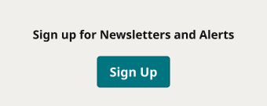
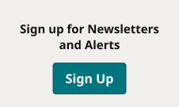

# Newsletter Signup

**Component · 2 variants** · Homepage components · source: WordPress Elements ▸ Homepage

> Component set · Variant: Device = Desktop, Mobile (button = true instance of Button Primary)

## Figma references

- File: WordPress Elements (`b1iZxkFwtAYq9rElmnCAzd`) · Page: Homepage
- Main: [Newsletter Signup](https://www.figma.com/design/b1iZxkFwtAYq9rElmnCAzd/?node-id=3336-44765) · node `3336:44765` · key `84f47333e168c6d47184245169a01ad2d8be9958`

| Variant | Node | Key | Size | Preview |
|---|---|---|---|---|
| Device=Mobile | [3336:44764](https://www.figma.com/design/b1iZxkFwtAYq9rElmnCAzd/?node-id=3336-44764) | 5690d303c79ab00c4a3d17f1a9b6ec2e7a8a21b7 | 340×135 |  |
| Device=Desktop | [3336:44763](https://www.figma.com/design/b1iZxkFwtAYq9rElmnCAzd/?node-id=3336-44763) | 2e1da2bf24ead30b83e35e315ff4baa7ba5cc0ca | 226×135 |  |

## Properties

| Property | Type | Default | Options |
|---|---|---|---|
| Device | VARIANT | Mobile | Desktop, Mobile |

## Where it is used

- **Device=Mobile** — breakpoints: 340, 360, 768; templates (via assembly): 768 HomePage (via Latest Headlines), Mobile HomePage (via Latest Headlines), 340 HomePage (via Latest Headlines); nested inside: Latest Headlines / Device=Tablet ×1, Latest Headlines / Device=Mobile ×1
- **Device=Desktop** — breakpoints: 1024, 1100, 1280; templates (via assembly): Desktop HomePage (via Latest Headlines), 1100 HomePage (via Latest Headlines), 1024 HomePage (via Latest Headlines); nested inside: Latest Headlines / Device=Desktop ×1

## Breakpoints

| Key | Viewport | Variant(s) |
|---|---|---|
| 340 | ≤639px (XS-Fold, built 340) | Device=Mobile |
| 360 | ≤639px (SM-Mobile, built 360) | Device=Mobile |
| 768 | 640–799px (MD-TabletV) | Device=Mobile |
| 1024 | 800–1039px (LG-TabletH, built 1009) | Device=Desktop |
| 1100 | ≥1040px (XL-Desktop, built 1085) | Device=Desktop |
| 1280 | ≥1040px (XL-Desktop, built 1280) | Device=Desktop |

## Responsive rules

- Device=Mobile: 340×135, vertical gap 8 pad 16/16/16/16 main CENTER cross CENTER — renders at 340, 360, 768
- Device=Desktop: 226×135, vertical gap 8 pad 16/16/16/16 main SPACE_BETWEEN cross CENTER — renders at 1024, 1100, 1280

## Dependencies

**Built from:**

- Button Primary ×1 _(not in this export)_

**Built into:**

- [Latest Headlines](../../assemblies/09-latest-headlines/latest-headlines.md)

## Anatomy

**Device=Mobile**

```
- Device=Mobile — component 340×135 [vertical gap 8] (fixed/fixed)
  - Content — frame 308×88 [vertical gap 8] (fill/hug)
    - Text Container — frame 308×40 [horizontal gap 24] (fill/hug)
      - Sign up for Newsletters and Alerts — text 308×20 (fill/hug) "Sign up for Newsletters and Alerts"
    - Button Container — frame 125×40 [vertical gap 8] (hug/fixed)
      - Button Primary — instance 109×40 [vertical gap 8] (fixed/hug) → Button Primary [Icon=None, State=Default, Breakpoint=Desktop]
```

**Device=Desktop**

```
- Device=Desktop — component 226×135 [vertical gap 8] (fixed/fixed)
  - Heading Container — frame 194×60 [horizontal gap 24] (fill/hug)
    - Sign up for Newsletters and Alerts — text 194×40 (fill/hug) "Sign up for Newsletters and Alerts"
  - Button Container — frame 125×40 [vertical gap 8] (hug/fixed)
    - Button Primary — instance 109×40 [vertical gap 8] (fixed/hug) → Button Primary [Icon=None, State=Default, Breakpoint=Desktop]
```

## Size & layout

| Variant | Size | Width | Height | Auto-layout | Radius | Clip |
|---|---|---|---|---|---|---|
| Device=Mobile | 340×135 | FIXED | FIXED | vertical gap 8 pad 16/16/16/16 main CENTER cross CENTER |  |  |
| Device=Desktop | 226×135 | FIXED | FIXED | vertical gap 8 pad 16/16/16/16 main SPACE_BETWEEN cross CENTER |  |  |

## Typography

| Layer | Font | Weight | Size | Line height | Letter sp. | Case | Color | Color token | Type token | Truncate | Sample | Variants |
|---|---|---|---|---|---|---|---|---|---|---|---|---|
| Sign up for Newsletters and Alerts | Noto Sans | Bold | 15 | auto |  |  | #141414 | Colors/color/gray/min |  |  | Sign up for Newsletters and Alerts | all |

## Color & effects

| Layer | Role | Type | Hex | Token | Opacity | Note |
|---|---|---|---|---|---|---|
| Device=Mobile | fill | SOLID | #F1EFEB | Colors/color/gray/600 |  |  |
| Device=Desktop | fill | SOLID | #F1EFEB | Colors/color/gray/600 |  |  |

## Image ratios

_None._

## Ad slots

_None._

## Production references

_None found in descriptions or layer names._

## Known issues

_None detected._

## Rendering steps

1. Pick the variant for the target breakpoint from the Breakpoints table (property values in `newsletter-signup.json` → `variants[].variantProperties`).
2. Start from `newsletter-signup.html` — each `<section>` is one variant; auto-layout is already mapped to flexbox and colors use `tokens.css` variables.
3. Replace every dashed `data-component` box with the referenced component's own skeleton (links under Dependencies); leave `data-component` on the wrapper.
4. Fill image slots at the ratio listed in Image ratios; fill text using the Typography table (truncate where a line clamp is listed).
5. Check against the preview PNG, then against the production references.
