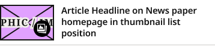

# Horizontal Thumbnail Card

**Component · 3 variants** · Homepage components · source: WordPress Elements ▸ Homepage

> New atom (2026-09-09) — Device=Desktop/Mobile. Compact horizontal row: small fixed-size thumbnail image (left, with optional Gallery Icon Badge) + fill-width headline (right), no excerpt. Replaces 1Col Article Card in Photos Block's secondary list on both Desktop and Mobile — the old full stacked-card shape (image full-width above headline) didn't match production's compact list pattern, confirmed across all 6 repertoire sites. Boolean prop: Show Gallery Icon.

## Figma references

- File: WordPress Elements (`b1iZxkFwtAYq9rElmnCAzd`) · Page: Homepage
- Main: [Horizontal Thumbnail Card](https://www.figma.com/design/b1iZxkFwtAYq9rElmnCAzd/?node-id=3362-2992) · node `3362:2992` · key `c64c9a57e8074d5ae0481728bc08aa3f8c828174`

| Variant | Node | Key | Size | Preview |
|---|---|---|---|---|
| Device=Desktop | [3362:2990](https://www.figma.com/design/b1iZxkFwtAYq9rElmnCAzd/?node-id=3362-2990) | 237ce2a3cd413acd157af50d2841f5d653ffa57f | 336×98 |  |
| Device=Mobile | [3362:2991](https://www.figma.com/design/b1iZxkFwtAYq9rElmnCAzd/?node-id=3362-2991) | d3542c97683a405950bd47e9f227af5459e4ee2e | 336×67 |  |
| Device=Tablet | [3383:46153](https://www.figma.com/design/b1iZxkFwtAYq9rElmnCAzd/?node-id=3383-46153) | f15a17172416b1f111128ab63180ea29f8a8bcd4 | 358×84 |  |

## Properties

| Property | Type | Default | Options |
|---|---|---|---|
| Show Gallery Icon | BOOLEAN | True |  |
| Device | VARIANT | Mobile | Desktop, Mobile, Tablet |

## Where it is used

- **Device=Desktop** — breakpoints: 1024, 1100, 1280; nested inside: Photos Block / Device=Desktop ×6
- **Device=Mobile** — breakpoints: 340, 360, 768, 1024, 1100, 1280; templates (via assembly): 1100 HomePage (via Photos Block), 1024 HomePage (via Photos Block), 768 HomePage (via Photos Block), Mobile HomePage (via Photos Block), 340 HomePage (via Photos Block), Desktop HomePage (via Photos Block); nested inside: Photos Block / Device=1100 ×6, Photos Block / Device=1024 ×6, Photos Block / Device=Tablet ×6, Photos Block / Device=Mobile ×5, Photos Block / Device=1280 ×6
- **Device=Tablet** — breakpoints: 768; templates (via assembly): 768 HomePage (via TOP ZONE Block); nested inside: TOP ZONE Block / Device=Tablet ×4

## Breakpoints

| Key | Viewport | Variant(s) |
|---|---|---|
| 340 | ≤639px (XS-Fold, built 340) | Device=Mobile |
| 360 | ≤639px (SM-Mobile, built 360) | Device=Mobile |
| 768 | 640–799px (MD-TabletV) | Device=Mobile, Device=Tablet |
| 1024 | 800–1039px (LG-TabletH, built 1009) | Device=Desktop, Device=Mobile |
| 1100 | ≥1040px (XL-Desktop, built 1085) | Device=Desktop, Device=Mobile |
| 1280 | ≥1040px (XL-Desktop, built 1280) | Device=Desktop, Device=Mobile |

## Responsive rules

- Device=Desktop: 336×98, vertical gap 8 pad 8/0/8/0 main MIN cross MIN — renders at 1024, 1100, 1280
- Device=Mobile: 336×67, vertical gap 4 pad 6/0/6/0 main MIN cross MIN — renders at 340, 360, 768, 1024, 1100, 1280
- Device=Tablet: 358×84, vertical gap 8 pad 8/0/8/0 main MIN cross MIN — renders at 768

## Dependencies

**Built from:**

- [Article Image Placeholder](../03-article-image-placeholder/article-image-placeholder.md) ×1
- [Gallery Icon Badge](../10-gallery-icon-badge/gallery-icon-badge.md) ×1

**Built into:**

- [TOP ZONE Block](../../assemblies/12-top-zone-block/top-zone-block.md)
- [Photos Block](../../assemblies/22-photos-block/photos-block.md)

## Anatomy

**Device=Desktop**

```
- Device=Desktop — component 336×98 [vertical gap 8] (fixed/hug)
  - Content — frame 336×74 [horizontal gap 12] (fill/hug)
    - Image Container — frame 110×74 [horizontal gap 0] (fixed/fixed)
      - Article Image Placeholder — instance 110×74 [vertical gap 8] (fixed/fixed) → Article Image Placeholder
      - Gallery Icon Badge — instance 28×28 [horizontal gap 0] (fixed/fixed) → Gallery Icon Badge
    - Headline — frame 214×57 [vertical gap 0] (fill/hug)
      - Article Headline on News paper homepage in thumbnail list position — text 214×57 (fill/hug) "Article Headline on News paper homepage "
  - Bottom Border Line — line 336×0 (fill/fixed)
```

**Device=Mobile**

```
- Device=Mobile — component 336×67 [vertical gap 4] (fixed/hug)
  - Content — frame 336×51 [horizontal gap 15] (fill/hug)
    - Image Container — frame 90×51 [horizontal gap 0] (fixed/fixed)
      - Article Image Placeholder — instance 90×51 [vertical gap 8] (fixed/fixed) → Article Image Placeholder
      - Gallery Icon Badge — instance 28×28 [horizontal gap 0] (fixed/fixed) → Gallery Icon Badge
    - Headline — frame 231×51 [vertical gap 0] (fill/fixed)
      - Article Headline on News paper homepage in thumbnail list position — text 231×51 (fill/fixed) "Article Headline on News paper homepage "
  - Bottom Border Line — line 336×0 (fill/fixed)
```

**Device=Tablet**

```
- Device=Tablet — component 358×84 [vertical gap 8] (fixed/hug)
  - Content — frame 358×60 [horizontal gap 12] (fill/hug)
    - Image Container — frame 90×60 [horizontal gap 0] (fixed/fixed)
      - Article Image Placeholder — instance 90×60 [vertical gap 8] (fixed/fixed) → Article Image Placeholder
      - Gallery Icon Badge — instance 28×28 [horizontal gap 0] (fixed/fixed) → Gallery Icon Badge
    - Headline — frame 256×57 [vertical gap 0] (fill/hug)
      - Article Headline on News paper homepage in thumbnail list position — text 256×57 (fill/hug) "Article Headline on News paper homepage "
  - Bottom Border Line — line 358×0 (fill/fixed)
```

## Size & layout

| Variant | Size | Width | Height | Auto-layout | Radius | Clip |
|---|---|---|---|---|---|---|
| Device=Desktop | 336×98 | FIXED | HUG | vertical gap 8 pad 8/0/8/0 main MIN cross MIN |  | yes |
| Device=Mobile | 336×67 | FIXED | HUG | vertical gap 4 pad 6/0/6/0 main MIN cross MIN |  | yes |
| Device=Tablet | 358×84 | FIXED | HUG | vertical gap 8 pad 8/0/8/0 main MIN cross MIN |  | yes |

## Typography

| Layer | Font | Weight | Size | Line height | Letter sp. | Case | Color | Color token | Type token | Truncate | Sample | Variants |
|---|---|---|---|---|---|---|---|---|---|---|---|---|
| Article Headline on News paper homepage in thumbnail list po | Noto Sans | SemiBold | 15 | 19px | -0.15px |  | #141414 | Colors/color/gray/min | Editorial/Titles/HeadlineList |  | Article Headline on News paper homepage in thumbna | all |

## Color & effects

| Layer | Role | Type | Hex | Token | Opacity | Note |
|---|---|---|---|---|---|---|
| Article Image Placeholder | fill | SOLID | #E1A1FF |  |  | image placeholder fill |
| Article Image Placeholder | stroke | SOLID | #141414 | Colors/color/gray/min |  |  |
| Gallery Icon Badge | fill | SOLID | #000000 | Colors/color/gray/black |  |  |
| Bottom Border Line | stroke | SOLID | #CCCAC7 | Colors/color/gray/500 |  |  |

## Image ratios

| Variant | Layer | Size | Ratio | Source |
|---|---|---|---|---|
| Device=Desktop | Article Image Placeholder | 110×74 | 3:2 | Article Image Placeholder |
| Device=Mobile | Article Image Placeholder | 90×51 | 16:9 | Article Image Placeholder |
| Device=Tablet | Article Image Placeholder | 90×60 | 3:2 | Article Image Placeholder |

## Ad slots

_None._

## Production references

_None found in descriptions or layer names._

## Known issues

- `Device=Mobile` is declared for 340, 360 but is placed in template(s) at 768, 1024, 1100, 1280 — check the variant choice.
- Expected: production uses the Device=Mobile thumbnail (90×51 image, 15/19 title) at every width, so the templates place Mobile at 768–1280 too. Device=Desktop (98px) and Device=Tablet (84px) don't match any production width checked on 2026-10-07; review whether to keep them.

## Rendering steps

1. Pick the variant for the target breakpoint from the Breakpoints table (property values in `horizontal-thumbnail-card.json` → `variants[].variantProperties`).
2. Start from `horizontal-thumbnail-card.html` — each `<section>` is one variant; auto-layout is already mapped to flexbox and colors use `tokens.css` variables.
3. Replace every dashed `data-component` box with the referenced component's own skeleton (links under Dependencies); leave `data-component` on the wrapper.
4. Fill image slots at the ratio listed in Image ratios; fill text using the Typography table (truncate where a line clamp is listed).
5. Check against the preview PNG, then against the production references.
