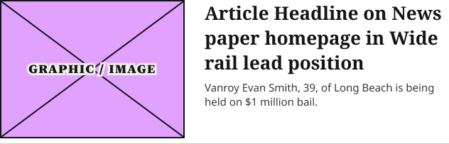

# Horizontal Feature Card

**Component · Standalone** · Homepage components · source: WordPress Elements ▸ Homepage

> New atom (2026-09-09), image ratio fixed (2026-09-22) — Desktop only (Section Rail Card's Mobile layout is Narrow-only, so there's no mobile equivalent). Horizontal lead-item card: image (left) + headline & excerpt column (right, fill width). Replaces 1Col Article Card as the lead item in Section Rail Card's Wide layout — the old stacked shape didn't match production's side-by-side pattern, confirmed across 4 Wide rails on denverpost.com. Image was originally built square (260×260); corrected to a 4:3 ratio (260×195) after confirming production's .section-feature .image-wrapper renders 273×205 (ocregister.com, Business & Crime and Public Safety rails) — the live  tag itself measures square before the crop wrapper is accounted for, which is what caused the original mismeasurement.

## Figma references

- File: WordPress Elements (`b1iZxkFwtAYq9rElmnCAzd`) · Page: Homepage
- Main: [Horizontal Feature Card](https://www.figma.com/design/b1iZxkFwtAYq9rElmnCAzd/?node-id=3362-3022) · node `3362:3022` · key `e663ba16223c281b866a5d6edf44c09c6a01e34b`

| Variant | Node | Key | Size | Preview |
|---|---|---|---|---|
| Horizontal Feature Card | [3362:3022](https://www.figma.com/design/b1iZxkFwtAYq9rElmnCAzd/?node-id=3362-3022) | e663ba16223c281b866a5d6edf44c09c6a01e34b | 632×203 |  |

## Properties

_None._

## Where it is used

- **Horizontal Feature Card** — breakpoints: 768, 1100, 1280; templates (via assembly): Desktop HomePage (via Feature + List Content Block), 768 HomePage (via Feature + List Content Block), 1100 HomePage (via Feature + List Content Block); nested inside: Feature + List Content Block / Size=Default ×1

## Breakpoints

| Key | Viewport | Variant(s) |
|---|---|---|
| 340 | ≤639px (XS-Fold, built 340) | — |
| 360 | ≤639px (SM-Mobile, built 360) | — |
| 768 | 640–799px (MD-TabletV) | Horizontal Feature Card |
| 1024 | 800–1039px (LG-TabletH, built 1009) | — |
| 1100 | ≥1040px (XL-Desktop, built 1085) | Horizontal Feature Card |
| 1280 | ≥1040px (XL-Desktop, built 1280) | Horizontal Feature Card |

## Responsive rules

- Horizontal Feature Card: 632×203, vertical gap 8 pad 0/0/0/0 main MIN cross MIN — renders at 768, 1100, 1280

## Dependencies

**Built from:**

- [Article Image Placeholder](../03-article-image-placeholder/article-image-placeholder.md) ×1

**Built into:**

- [Feature + List Content Block](../../assemblies/17-feature-list-content-block/feature-list-content-block.md)

## Anatomy

**Horizontal Feature Card**

```
- Horizontal Feature Card — component 632×203 [vertical gap 8] (fixed/hug)
  - Content — frame 632×195 [horizontal gap 28] (fill/hug)
    - Article Graphic — instance 260×195 [vertical gap 8] (fixed/fixed) → Article Image Placeholder
    - Text Column — frame 344×153 [vertical gap 8] (fill/hug)
      - Headline Container — frame 344×105 [vertical gap 0] (fill/hug)
        - Article Headline on News paper homepage in Wide rail lead position — text 344×105 (fill/hug) "Article Headline on News paper homepage "
      - Excerpt Container — frame 344×40 [vertical gap 0] (fill/hug)
        - Vanroy Evan Smith, 39, of Long Beach is being held on $1 million bail. — text 344×40 (fill/hug) "Vanroy Evan Smith, 39, of Long Beach is "
  - Bottom Border Line — line 632×0 (fill/fixed)
```

## Size & layout

| Variant | Size | Width | Height | Auto-layout | Radius | Clip |
|---|---|---|---|---|---|---|
| Horizontal Feature Card | 632×203 | FIXED | HUG | vertical gap 8 pad 0/0/0/0 main MIN cross MIN |  | yes |

## Typography

| Layer | Font | Weight | Size | Line height | Letter sp. | Case | Color | Token | Truncate | Sample |
|---|---|---|---|---|---|---|---|---|---|---|
| Article Headline on News paper homepage in Wide rail lead position | Noto Serif | Bold | 26 | auto |  |  | #141414 | Colors/color/gray/min |  | Article Headline on News paper homepage in Wide ra |
| Vanroy Evan Smith, 39, of Long Beach is being held on $1 million bail. | Noto Sans | Regular | 15 | auto |  |  | #393938 | Colors/color/gray/100 |  | Vanroy Evan Smith, 39, of Long Beach is being held |

## Color & effects

| Layer | Role | Type | Hex | Token | Opacity | Note |
|---|---|---|---|---|---|---|
| Bottom Border Line | stroke | SOLID | #CCCAC7 | Colors/color/gray/500 |  |  |

## Image ratios

| Variant | Layer | Size | Ratio | Source |
|---|---|---|---|---|
| Horizontal Feature Card | Article Graphic | 260×195 | 4:3 | Article Image Placeholder |

## Ad slots

_None._

## Production references

- `.image-wrapper`
- `.section-feature`
- `denverpost.com`
- `ocregister.com`

## Known issues

_None detected._

## Rendering steps

1. Pick the variant for the target breakpoint from the Breakpoints table (property values in `horizontal-feature-card.json` → `variants[].variantProperties`).
2. Start from `horizontal-feature-card.html` — each `<section>` is one variant; auto-layout is already mapped to flexbox and colors use `tokens.css` variables.
3. Replace every dashed `data-component` box with the referenced component's own skeleton (links under Dependencies); leave `data-component` on the wrapper.
4. Fill image slots at the ratio listed in Image ratios; fill text using the Typography table (truncate where a line clamp is listed).
5. Check against the preview PNG, then against the production references.
