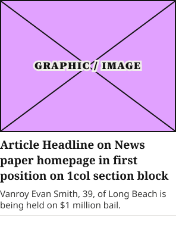

# 1Col Article Card

**Component · Standalone** · Homepage components · source: WordPress Elements ▸ Homepage

> Standalone component · Boolean props: Show Image, Show Subscriber Badge, Show Excerpt, Show Meta · uses instances of Article Image Placeholder and Article Status Badge internally. Shared atom for the lead + secondary items inside Photos Block and Section Rail Card (Wide + Narrow) — replaces duplicated raw frames found in those blocks.

## Figma references

- File: WordPress Elements (`b1iZxkFwtAYq9rElmnCAzd`) · Page: Homepage
- Main: [1Col Article Card](https://www.figma.com/design/b1iZxkFwtAYq9rElmnCAzd/?node-id=3352-24163) · node `3352:24163` · key `480dedb94931bf80d85b41c0a7e921311b39dc0d`

| Variant | Node | Key | Size | Preview |
|---|---|---|---|---|
| 1Col Article Card | [3352:24163](https://www.figma.com/design/b1iZxkFwtAYq9rElmnCAzd/?node-id=3352-24163) | 480dedb94931bf80d85b41c0a7e921311b39dc0d | 296×378 |  |

## Properties

| Property | Type | Default | Options |
|---|---|---|---|
| Show Image | BOOLEAN | True |  |
| Show Subscriber Badge | BOOLEAN | False |  |
| Show Excerpt | BOOLEAN | True |  |
| Show Meta | BOOLEAN | False |  |

## Where it is used

- **1Col Article Card** — breakpoints: 340, 360, 768, 1024, 1100, 1280; templates (direct): Mobile HomePage ×36, 340 HomePage ×36, 1024 HomePage ×18, 1100 HomePage ×18, 768 HomePage ×30, Desktop HomePage ×18; templates (via assembly): 768 HomePage (via Feature + List Content Block, Section Rail Card), 1024 HomePage (via Feature + List Content Block, Section Rail Card), 1100 HomePage (via Feature + List Content Block, Section Rail Card), Mobile HomePage (via Section Rail Card), 340 HomePage (via Section Rail Card), Desktop HomePage (via Feature + List Content Block, Section Rail Card); nested inside: Section Rail Card / Device=Tablet, Layout=Narrow ×4, Section Rail Card / Device=1024, Layout=Narrow ×4, Section Rail Card / Device=1100, Layout=Wide ×3, Section Rail Card / Device=Mobile, Layout=Narrow ×4, Section Rail Card / Device=1024, Layout=Wide ×3, Section Rail Card / Device=1100, Layout=Narrow ×4, Feature + List Content Block / Size=Narrow ×3, Section Rail Card / Device=1280, Layout=Wide ×3, Feature + List Content Block / Size=Default ×3, Section Rail Card / Device=Tablet, Layout=Wide ×3, Photos Block / Device=Desktop ×1, Section Rail Card / Device=Desktop, Layout=Narrow ×4

## Breakpoints

| Key | Viewport | Variant(s) |
|---|---|---|
| 340 | ≤639px (XS-Fold, built 340) | 1Col Article Card |
| 360 | ≤639px (SM-Mobile, built 360) | 1Col Article Card |
| 768 | 640–799px (MD-TabletV) | 1Col Article Card |
| 1024 | 800–1039px (LG-TabletH, built 1009) | 1Col Article Card |
| 1100 | ≥1040px (XL-Desktop, built 1085) | 1Col Article Card |
| 1280 | ≥1040px (XL-Desktop, built 1280) | 1Col Article Card |

## Responsive rules

- 1Col Article Card: 296×378, vertical gap 8 pad 0/0/16/0 main MIN cross MIN — renders at 340, 360, 768, 1024, 1100, 1280

## Dependencies

**Built from:**

- [Article Image Placeholder](../03-article-image-placeholder/article-image-placeholder.md) ×1
- [Article Status Badge](../01-article-status-badge/article-status-badge.md) ×1

**Built into:**

- [Feature + List Content Block](../../assemblies/17-feature-list-content-block/feature-list-content-block.md)
- [Section Rail Card](../../assemblies/18-section-rail-card/section-rail-card.md)
- [Photos Block](../../assemblies/22-photos-block/photos-block.md)

## Anatomy

**1Col Article Card**

```
- 1Col Article Card — component 296×378 [vertical gap 8] (fixed/hug)
  - Article Graphic — instance 296×222 [vertical gap 8] (fill/fixed) → Article Image Placeholder
  - SubsOnlyBadge — instance 114×27 [horizontal gap 8] (hug/hug) → Article Status Badge [Type=Subscriber] (hidden)
  - Headline Container — frame 296×78 [vertical gap 15] (fill/hug)
    - Article Headline on News paper homepage in first position on 1col section block — text 296×78 (fill/hug) "Article Headline on News paper homepage "
  - Excerpt Container — frame 296×38 [horizontal gap 8] (fill/hug)
    - Vanroy Evan Smith, 39, of Long Beach is being held on $1 million bail. — text 296×38 (fill/hug) "Vanroy Evan Smith, 39, of Long Beach is "
  - Meta Container — frame 296×18 [vertical gap 8] (fixed/hug) (hidden)
    - 56 mins ago — text 296×18 (fill/hug) "56 mins ago"
  - Bottom Border Line — line 296×0 (fill/fixed)
```

## Size & layout

| Variant | Size | Width | Height | Auto-layout | Radius | Clip |
|---|---|---|---|---|---|---|
| 1Col Article Card | 296×378 | FIXED | HUG | vertical gap 8 pad 0/0/16/0 main MIN cross MIN |  |  |

## Typography

| Layer | Font | Weight | Size | Line height | Letter sp. | Case | Color | Token | Truncate | Sample |
|---|---|---|---|---|---|---|---|---|---|---|
| Article Headline on News paper homepage in first position on 1col section block | Noto Serif | Bold | 19 | auto |  |  | #141414 | Colors/color/gray/min |  | Article Headline on News paper homepage in first p |
| Vanroy Evan Smith, 39, of Long Beach is being held on $1 million bail. | Noto Sans | Regular | 15 | 19px |  |  | #393938 | Colors/color/gray/100 |  | Vanroy Evan Smith, 39, of Long Beach is being held |
| 56 mins ago | Noto Sans | Regular | 13 | auto |  |  | #5E5D5C | Colors/color/gray/200 |  | 56 mins ago |

## Color & effects

| Layer | Role | Type | Hex | Token | Opacity | Note |
|---|---|---|---|---|---|---|
| 1Col Article Card | fill | SOLID | #FFFFFF | Colors/color/gray/max |  |  |
| Bottom Border Line | stroke | SOLID | #CCCAC7 | Colors/color/gray/500 |  |  |

## Image ratios

| Variant | Layer | Size | Ratio | Source |
|---|---|---|---|---|
| 1Col Article Card | Article Graphic | 296×222 | 4:3 | Article Image Placeholder |

## Ad slots

_None._

## Production references

_None found in descriptions or layer names._

## Known issues

_None detected._

## Rendering steps

1. Pick the variant for the target breakpoint from the Breakpoints table (property values in `1col-article-card.json` → `variants[].variantProperties`).
2. Start from `1col-article-card.html` — each `<section>` is one variant; auto-layout is already mapped to flexbox and colors use `tokens.css` variables.
3. Replace every dashed `data-component` box with the referenced component's own skeleton (links under Dependencies); leave `data-component` on the wrapper.
4. Fill image slots at the ratio listed in Image ratios; fill text using the Typography table (truncate where a line clamp is listed).
5. Check against the preview PNG, then against the production references.
