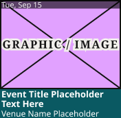

# Event Card

**Component · Standalone** · Homepage components · source: WordPress Elements ▸ Homepage

> Upcoming Events atom. 172 tall: image 130 with a 12.5 date bar (black 60%, 11px #EEEEEE), details 42 (name Bold 13/14, venue 12/14, white). Fill theme/primary-dark. The widget sets the width (144 / 129 / 158 / 177 / 176).

## Figma references

- File: WordPress Elements (`b1iZxkFwtAYq9rElmnCAzd`) · Page: Homepage
- Main: [Event Card](https://www.figma.com/design/b1iZxkFwtAYq9rElmnCAzd/?node-id=3395-51876) · node `3395:51876` · key `c7de86b4a1e4673b2f5e1d8b4dc3d3fa124493f6`

| Variant | Node | Key | Size | Preview |
|---|---|---|---|---|
| Event Card | [3395:51876](https://www.figma.com/design/b1iZxkFwtAYq9rElmnCAzd/?node-id=3395-51876) | c7de86b4a1e4673b2f5e1d8b4dc3d3fa124493f6 | 176×172 |  |

## Properties

_None._

## Where it is used

- **Event Card** — breakpoints: 340, 360, 768, 1024, 1100, 1280; templates (via assembly): 1024 HomePage (via Upcoming Events Widget), Desktop HomePage (via Upcoming Events Widget), Mobile HomePage (via Upcoming Events Widget), 340 HomePage (via Upcoming Events Widget), 1100 HomePage (via Upcoming Events Widget), 768 HomePage (via Upcoming Events Widget); nested inside: Upcoming Events Widget / Device=1024 ×4, Upcoming Events Widget / Device=Desktop ×5, Upcoming Events Widget / Device=Mobile ×2, Upcoming Events Widget / Device=1100 ×4, Upcoming Events Widget / Device=Tablet ×3

## Breakpoints

| Key | Viewport | Variant(s) |
|---|---|---|
| 340 | ≤639px (XS-Fold, built 340) | Event Card |
| 360 | ≤639px (SM-Mobile, built 360) | Event Card |
| 768 | 640–799px (MD-TabletV) | Event Card |
| 1024 | 800–1039px (LG-TabletH, built 1009) | Event Card |
| 1100 | ≥1040px (XL-Desktop, built 1085) | Event Card |
| 1280 | ≥1040px (XL-Desktop, built 1280) | Event Card |

## Responsive rules

- Event Card: 176×172, vertical gap 0 pad 0/0/0/0 main MIN cross MIN — renders at 340, 360, 768, 1024, 1100, 1280

## Dependencies

**Built from:**

- [Article Image Placeholder](../03-article-image-placeholder/article-image-placeholder.md) ×1

**Built into:**

- [Upcoming Events Widget](../../assemblies/29-upcoming-events-widget/upcoming-events-widget.md)

## Anatomy

**Event Card**

```
- Event Card — component 176×172 [vertical gap 0] (fixed/fixed)
  - Image Area — frame 176×130 [vertical gap 0] (fill/fixed)
    - Article Image Placeholder — instance 176×130 [vertical gap 8] (fixed/fixed) → Article Image Placeholder
    - Date Bar — frame 176×12.5 (fixed/fixed)
      - Tue, Sep 15 — text 59×13 "Tue, Sep 15"
  - Details — frame 176×42 [vertical gap 0] (fill/fixed)
    - Event Title Placeholder Text Here — text 174×28 (fill/fixed) "Event Title Placeholder Text Here"
    - Venue Name Placeholder — text 174×14 (fill/fixed) "Venue Name Placeholder"
```

## Size & layout

| Variant | Size | Width | Height | Auto-layout | Radius | Clip |
|---|---|---|---|---|---|---|
| Event Card | 176×172 | FIXED | FIXED | vertical gap 0 pad 0/0/0/0 main MIN cross MIN |  | yes |

## Typography

| Layer | Font | Weight | Size | Line height | Letter sp. | Case | Color | Color token | Type token | Truncate | Sample | Variants |
|---|---|---|---|---|---|---|---|---|---|---|---|---|
| Tue, Sep 15 | Noto Sans | Regular | 11 | 12.5px |  |  | #EEEEEE |  | font/family/noto-sans |  | Tue, Sep 15 | all |
| Event Title Placeholder Text Here | Noto Sans | Bold | 13 | 14px |  |  | #FFFFFF |  | font/size/13 | None lines | Event Title Placeholder Text Here | all |
| Venue Name Placeholder | Noto Sans | Regular | 12 | 14px |  |  | #FFFFFF |  | font/size/12 | None lines | Venue Name Placeholder | all |

## Color & effects

| Layer | Role | Type | Hex | Token | Opacity | Note |
|---|---|---|---|---|---|---|
| Event Card | fill | SOLID | #0A5962 | Colors/color/theme/primary-dark |  |  |
| Image Area | fill | SOLID | #FFFFFF |  |  |  |
| Article Image Placeholder | fill | SOLID | #E1A1FF |  |  | image placeholder fill |
| Article Image Placeholder | stroke | SOLID | #141414 | Colors/color/gray/min |  |  |
| Date Bar | fill | SOLID | #000000 |  | 0.6 |  |

## Image ratios

| Variant | Layer | Size | Ratio | Source |
|---|---|---|---|---|
| Event Card | Article Image Placeholder | 176×130 | 4:3 | Article Image Placeholder |

## Ad slots

_None._

## Production references

_None found in descriptions or layer names._

## Known issues

- 5 solid paints are hard-coded (not bound to a color variable): #FFFFFF ×3, #000000 ×1, #EEEEEE ×1.

## Rendering steps

1. Pick the variant for the target breakpoint from the Breakpoints table (property values in `event-card.json` → `variants[].variantProperties`).
2. Start from `event-card.html` — each `<section>` is one variant; auto-layout is already mapped to flexbox and colors use `tokens.css` variables.
3. Replace every dashed `data-component` box with the referenced component's own skeleton (links under Dependencies); leave `data-component` on the wrapper.
4. Fill image slots at the ratio listed in Image ratios; fill text using the Typography table (truncate where a line clamp is listed).
5. Check against the preview PNG, then against the production references.
