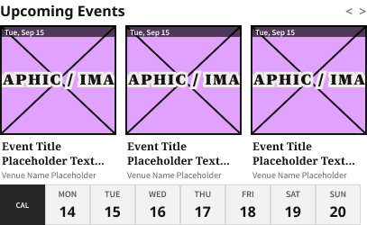

# Upcoming Events Widget (768, 3 cards, 7 days)

**Component · Standalone** · Homepage components · source: WordPress Elements ▸ Homepage

> Standalone component · the 768 (Tablet) sizing of the Upcoming Events Widget. The main Upcoming Events Widget component set lives on the “Ads and Sponsored” page; this one-off is used by the 768 HomePage template.

## Figma references

- File: WordPress Elements (`b1iZxkFwtAYq9rElmnCAzd`) · Page: Homepage
- Main: [Upcoming Events Widget (768, 3 cards, 7 days)](https://www.figma.com/design/b1iZxkFwtAYq9rElmnCAzd/?node-id=3445-57028) · node `3445:57028` · key `5729ce5a5beca9edccf2836f37c6e1fc6765e9b3`

| Variant | Node | Key | Size | Preview |
|---|---|---|---|---|
| Upcoming Events Widget (768, 3 cards, 7 days) | [3445:57028](https://www.figma.com/design/b1iZxkFwtAYq9rElmnCAzd/?node-id=3445-57028) | 5729ce5a5beca9edccf2836f37c6e1fc6765e9b3 | 407×250 |  |

## Properties

_None._

## Where it is used

- **Upcoming Events Widget (768, 3 cards, 7 days)** — breakpoints: 768; templates (via assembly): 768 HomePage (via Upcoming Events Block); nested inside: Upcoming Events Block / Device=Tablet ×1

## Breakpoints

| Key | Viewport | Variant(s) |
|---|---|---|
| 340 | ≤639px (XS-Fold, built 340) | — |
| 360 | ≤639px (SM-Mobile, built 360) | — |
| 768 | 640–799px (MD-TabletV) | Upcoming Events Widget (768, 3 cards, 7 days) |
| 1024 | 800–1039px (LG-TabletH, built 1009) | — |
| 1100 | ≥1040px (XL-Desktop, built 1085) | — |
| 1280 | ≥1040px (XL-Desktop, built 1280) | — |

## Responsive rules

- Upcoming Events Widget (768, 3 cards, 7 days): 407×250, vertical gap 4 pad 0/0/0/0 main MIN cross MIN — renders at 768

## Dependencies

**Built from:**

- _nothing (leaf component)_

**Built into:**

- [Upcoming Events Block](../../assemblies/24-upcoming-events-block/upcoming-events-block.md)

## Anatomy

**Upcoming Events Widget (768, 3 cards, 7 days)**

```
- Upcoming Events Widget (768, 3 cards, 7 days) — component 407×250 [vertical gap 4] (hug/fixed)
  - Header — frame 407×24 [horizontal gap 0] (fill/fixed)
    - Upcoming Events — text 383×22 (fill/hug) "Upcoming Events"
    - < > — text 24×19 (hug/hug) "<  >"
  - Event Card Row (4 cards — width matches available content column at this size) — frame 407×173 [horizontal gap 10] (hug/hug)
    - Event Card (768, 129w) — frame 129×173 [vertical gap 0] (fixed/fixed)
      - Image Area — frame 129×122 [vertical gap 0] (fill/fixed)
        - Article Image Placeholder — frame 129×122 [vertical gap 8] (fixed/fixed)
          - Union — boolean_operation 129×122 (fill/fill)
            - … 2 children
          - Frame 11643 — frame 179×19 [horizontal gap 8] (hug/hug)
            - … 1 children
        - Date Bar — frame 129×13 (fixed/fixed)
          - Tue, Sep 15 — text 44×11 "Tue, Sep 15"
      - Details — frame 129×51 [vertical gap 2] (fill/fixed)
        - Event Title Placeholder Text Here — text 125×32 (fill/fixed) "Event Title Placeholder Text Here"
        - Venue Name Placeholder — text 125×13 (fill/hug) "Venue Name Placeholder"
    - Event Card (768, 129w) — frame 129×173 [vertical gap 0] (fixed/fixed)
      - Image Area — frame 129×122 [vertical gap 0] (fill/fixed)
        - Article Image Placeholder — frame 129×122 [vertical gap 8] (fixed/fixed)
          - Union — boolean_operation 129×122 (fill/fill)
            - … 2 children
          - Frame 11643 — frame 179×19 [horizontal gap 8] (hug/hug)
            - … 1 children
        - Date Bar — frame 129×13 (fixed/fixed)
          - Tue, Sep 15 — text 44×11 "Tue, Sep 15"
      - Details — frame 129×51 [vertical gap 2] (fill/fixed)
        - Event Title Placeholder Text Here — text 125×32 (fill/fixed) "Event Title Placeholder Text Here"
        - Venue Name Placeholder — text 125×13 (fill/hug) "Venue Name Placeholder"
    - Event Card (768, 129w) — frame 129×173 [vertical gap 0] (fixed/fixed)
      - Image Area — frame 129×122 [vertical gap 0] (fill/fixed)
        - Article Image Placeholder — frame 129×122 [vertical gap 8] (fixed/fixed)
          - Union — boolean_operation 129×122 (fill/fill)
            - … 2 children
          - Frame 11643 — frame 179×19 [horizontal gap 8] (hug/hug)
            - … 1 children
        - Date Bar — frame 129×13 (fixed/fixed)
          - Tue, Sep 15 — text 44×11 "Tue, Sep 15"
      - Details — frame 129×51 [vertical gap 2] (fill/fixed)
        - Event Title Placeholder Text Here — text 125×32 (fill/fixed) "Event Title Placeholder Text Here"
        - Venue Name Placeholder — text 125×13 (fill/hug) "Venue Name Placeholder"
  - Date Picker Strip — frame 400×45 [horizontal gap 0] (hug/fixed)
    - Date Picker Calendar Icon — frame 50×45 [vertical gap 0] (fixed/fixed)
      - CAL — text 15×11 (hug/hug) "CAL"
    - Date Picker Day — frame 50×45 [vertical gap 2] (fixed/fixed)
      - MON — text 21×13 (hug/hug) "MON"
      - 14 — text 19×22 (hug/hug) "14"
    - Date Picker Day — frame 50×45 [vertical gap 2] (fixed/fixed)
      - MON — text 18×13 (hug/hug) "TUE"
      - 14 — text 19×22 (hug/hug) "15"
    - Date Picker Day — frame 50×45 [vertical gap 2] (fixed/fixed)
      - MON — text 20×13 (hug/hug) "WED"
      - 14 — text 19×22 (hug/hug) "16"
    - Date Picker Day — frame 50×45 [vertical gap 2] (fixed/fixed)
      - MON — text 19×13 (hug/hug) "THU"
      - 14 — text 19×22 (hug/hug) "17"
    - Date Picker Day — frame 50×45 [vertical gap 2] (fixed/fixed)
      - MON — text 14×13 (hug/hug) "FRI"
      - 14 — text 19×22 (hug/hug) "18"
    - Date Picker Day — frame 50×45 [vertical gap 2] (fixed/fixed)
      - MON — text 16×13 (hug/hug) "SAT"
      - 14 — text 19×22 (hug/hug) "19"
    - Date Picker Day — frame 50×45 [vertical gap 2] (fixed/fixed)
      - MON — text 19×13 (hug/hug) "SUN"
      - 14 — text 19×22 (hug/hug) "20"
```

## Size & layout

| Variant | Size | Width | Height | Auto-layout | Radius | Clip |
|---|---|---|---|---|---|---|
| Upcoming Events Widget (768, 3 cards, 7 days) | 407×250 | HUG | FIXED | vertical gap 4 pad 0/0/0/0 main MIN cross MIN |  | yes |

## Typography

| Layer | Font | Weight | Size | Line height | Letter sp. | Case | Color | Token | Truncate | Sample |
|---|---|---|---|---|---|---|---|---|---|---|
| Upcoming Events | Noto Sans | Bold | 16 | auto |  |  | #141414 |  |  | Upcoming Events |
| < > | Noto Sans | Bold | 14 | auto |  |  | #808080 |  |  | <  > |
| ARTICLE IMAGE | New York | Black | 16 | auto | 10% |  | #141414 | Colors/color/gray/min |  | GRAPHIC / IMAGE |
| Tue, Sep 15 | Source Sans Pro | SemiBold | 9 | auto |  |  | #FFFFFF |  |  | Tue, Sep 15 |
| Event Title Placeholder Text Here | Noto Serif | Bold | 12 | auto |  |  | #141414 |  |  | Event Title Placeholder Text Here |
| Venue Name Placeholder | Source Sans Pro | Regular | 10 | auto |  |  | #666666 |  |  | Venue Name Placeholder |
| CAL | Source Sans Pro | SemiBold | 9 | auto |  |  | #FFFFFF |  |  | CAL |
| MON | Source Sans Pro | SemiBold | 10 | auto |  |  | #595959 |  |  | MON |
| 14 | Noto Sans | Bold | 16 | auto |  |  | #141414 |  |  | 14 |

## Color & effects

| Layer | Role | Type | Hex | Token | Opacity | Note |
|---|---|---|---|---|---|---|
| Image Area | fill | SOLID | #FFFFFF | ⚠ unbound |  |  |
| Article Image Placeholder | fill | SOLID | #E1A1FF | ⚠ unbound |  |  |
| Article Image Placeholder | stroke | SOLID | #141414 | Colors/color/gray/min |  |  |
| Union | fill | SOLID | #141414 | Colors/color/gray/min |  |  |
| Vector 1 | stroke | SOLID | #111111 | ⚠ unbound |  |  |
| Vector 2 | stroke | SOLID | #111111 | ⚠ unbound |  |  |
| ARTICLE IMAGE | stroke | SOLID | #F1EFEB | Colors/color/gray/600 |  |  |
| Date Bar | fill | SOLID | #000000 | ⚠ unbound | 0.65 |  |
| Date Picker Calendar Icon | fill | SOLID | #262626 | ⚠ unbound |  |  |
| Date Picker Day | fill | SOLID | #F2F2F2 | ⚠ unbound |  |  |
| Date Picker Day | stroke | SOLID | #D9D9D9 | ⚠ unbound |  | Figma default placeholder grey (image slot) |

## Image ratios

_None._

## Ad slots

_None._

## Production references

_None found in descriptions or layer names._

## Known issues

- `Upcoming Events Widget (768, 3 cards, 7 days)`: fonts outside the production pair (Noto Sans / Noto Serif): New York Black ×3, Source Sans Pro SemiBold ×11, Source Sans Pro Regular ×3.
- 49 solid paints are hard-coded (not bound to a color variable): #141414 ×11, #FFFFFF ×7, #F2F2F2 ×7, #595959 ×7, #111111 ×6, #E1A1FF ×3.

## Rendering steps

1. Pick the variant for the target breakpoint from the Breakpoints table (property values in `upcoming-events-widget-768-3-cards-7-days.json` → `variants[].variantProperties`).
2. Start from `upcoming-events-widget-768-3-cards-7-days.html` — each `<section>` is one variant; auto-layout is already mapped to flexbox and colors use `tokens.css` variables.
3. Replace every dashed `data-component` box with the referenced component's own skeleton (links under Dependencies); leave `data-component` on the wrapper.
4. Fill image slots at the ratio listed in Image ratios; fill text using the Typography table (truncate where a line clamp is listed).
5. Check against the preview PNG, then against the production references.
