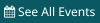
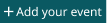

# Upcoming Events Header Button

**Component · 4 variants** · Homepage components · source: WordPress Elements ▸ Homepage

> Type = See All Events, Add your event · Label = On, Off. theme/primary-dark, pad 4, label 12/15 white. Label=Off (icon only) is used at 340/360.

## Figma references

- File: WordPress Elements (`b1iZxkFwtAYq9rElmnCAzd`) · Page: Homepage
- Main: [Upcoming Events Header Button](https://www.figma.com/design/b1iZxkFwtAYq9rElmnCAzd/?node-id=3557-40202) · node `3557:40202` · key `26e2331192774e16afcfa1ac704ba3868a3b0be7`

| Variant | Node | Key | Size | Preview |
|---|---|---|---|---|
| Type=See All Events, Label=On | [3557:40182](https://www.figma.com/design/b1iZxkFwtAYq9rElmnCAzd/?node-id=3557-40182) | 7c902fe246fbe24841be073196de3a2ed89234cf | 100×23 |  |
| Type=See All Events, Label=Off | [3557:40187](https://www.figma.com/design/b1iZxkFwtAYq9rElmnCAzd/?node-id=3557-40187) | 546c42474ce4b3fbde3b0c77d6183a41ce381b41 | 19.2×23 |  |
| Type=Add your event, Label=On | [3557:40192](https://www.figma.com/design/b1iZxkFwtAYq9rElmnCAzd/?node-id=3557-40192) | 6378f04591d224f8ac2301a41d19a9581ddb094c | 106.2×23 |  |
| Type=Add your event, Label=Off | [3557:40197](https://www.figma.com/design/b1iZxkFwtAYq9rElmnCAzd/?node-id=3557-40197) | cd8b3aa55ec8ac9e11756ec780f91bc16112d42a | 17.4×23 |  |

## Properties

| Property | Type | Default | Options |
|---|---|---|---|
| Type | VARIANT | See All Events | See All Events, Add your event |
| Label | VARIANT | On | On, Off |

## Where it is used

- **Type=See All Events, Label=On** — breakpoints: 768, 1024, 1100, 1280; templates (via assembly): 1024 HomePage (via Upcoming Events Widget), Desktop HomePage (via Upcoming Events Widget), 1100 HomePage (via Upcoming Events Widget), 768 HomePage (via Upcoming Events Widget); nested inside: Upcoming Events Widget / Device=1024 ×1, Upcoming Events Widget / Device=Desktop ×1, Upcoming Events Widget / Device=1100 ×1, Upcoming Events Widget / Device=Tablet ×1
- **Type=See All Events, Label=Off** — breakpoints: 340, 360; templates (via assembly): Mobile HomePage (via Upcoming Events Widget), 340 HomePage (via Upcoming Events Widget); nested inside: Upcoming Events Widget / Device=Mobile ×1
- **Type=Add your event, Label=On** — breakpoints: 768, 1024, 1100, 1280; templates (via assembly): Desktop HomePage (via Upcoming Events Widget), 1024 HomePage (via Upcoming Events Widget), 768 HomePage (via Upcoming Events Widget), 1100 HomePage (via Upcoming Events Widget); nested inside: Upcoming Events Widget / Device=Desktop ×1, Upcoming Events Widget / Device=1024 ×1, Upcoming Events Widget / Device=Tablet ×1, Upcoming Events Widget / Device=1100 ×1
- **Type=Add your event, Label=Off** — breakpoints: 340, 360; templates (via assembly): Mobile HomePage (via Upcoming Events Widget), 340 HomePage (via Upcoming Events Widget); nested inside: Upcoming Events Widget / Device=Mobile ×1

## Breakpoints

| Key | Viewport | Variant(s) |
|---|---|---|
| 340 | ≤639px (XS-Fold, built 340) | Type=See All Events, Label=Off, Type=Add your event, Label=Off |
| 360 | ≤639px (SM-Mobile, built 360) | Type=See All Events, Label=Off, Type=Add your event, Label=Off |
| 768 | 640–799px (MD-TabletV) | Type=See All Events, Label=On, Type=Add your event, Label=On |
| 1024 | 800–1039px (LG-TabletH, built 1009) | Type=See All Events, Label=On, Type=Add your event, Label=On |
| 1100 | ≥1040px (XL-Desktop, built 1085) | Type=See All Events, Label=On, Type=Add your event, Label=On |
| 1280 | ≥1040px (XL-Desktop, built 1280) | Type=See All Events, Label=On, Type=Add your event, Label=On |

## Responsive rules

- Type=See All Events, Label=On: 100×23, horizontal gap 2.8 pad 4/4/4/4 main MIN cross CENTER — renders at 768, 1024, 1100, 1280
- Type=See All Events, Label=Off: 19.2×23, horizontal gap 2.8 pad 4/4/4/4 main MIN cross CENTER — renders at 340, 360
- Type=Add your event, Label=On: 106.2×23, horizontal gap 2.8 pad 4/4/4/4 main MIN cross CENTER — renders at 768, 1024, 1100, 1280
- Type=Add your event, Label=Off: 17.4×23, horizontal gap 2.8 pad 4/4/4/4 main MIN cross CENTER — renders at 340, 360

## Dependencies

**Built from:**

- [Upcoming Events Calendar Glyph](../26-upcoming-events-calendar-glyph/upcoming-events-calendar-glyph.md) ×1
- Icons ×1 _(not in this export)_

**Built into:**

- [Upcoming Events Widget](../../assemblies/29-upcoming-events-widget/upcoming-events-widget.md)

## Anatomy

**Type=See All Events, Label=On**

```
- Type=See All Events, Label=On — component 100×23 [horizontal gap 2.8] (hug/fixed)
  - Icon — frame 11.2×12.5 (fixed/fixed)
    - Upcoming Events Calendar Glyph — instance 11.2×12 → Upcoming Events Calendar Glyph
  - Label — text 78×15 (hug/hug) "See All Events"
```

**Type=See All Events, Label=Off**

```
- Type=See All Events, Label=Off — component 19.2×23 [horizontal gap 2.8] (hug/fixed)
  - Icon — frame 11.2×12.5 (fixed/fixed)
    - Upcoming Events Calendar Glyph — instance 11.2×12 → Upcoming Events Calendar Glyph
  - Label — text 78×15 (fixed/fixed) "See All Events" (hidden)
```

**Type=Add your event, Label=On**

```
- Type=Add your event, Label=On — component 106.2×23 [horizontal gap 2.8] (hug/fixed)
  - Icon — frame 9.4×12.5 (fixed/fixed)
    - Icons — instance 9.4×9.4 [horizontal gap 8] (fixed/fixed) → Icons [Name=plus]
  - Label — text 86×15 (hug/hug) "Add your event"
```

**Type=Add your event, Label=Off**

```
- Type=Add your event, Label=Off — component 17.4×23 [horizontal gap 2.8] (hug/fixed)
  - Icon — frame 9.4×12.5 (fixed/fixed)
    - Icons — instance 9.4×9.4 [horizontal gap 8] (fixed/fixed) → Icons [Name=plus]
  - Label — text 86×15 (fixed/fixed) "Add your event" (hidden)
```

## Size & layout

| Variant | Size | Width | Height | Auto-layout | Radius | Clip |
|---|---|---|---|---|---|---|
| Type=See All Events, Label=On | 100×23 | HUG | FIXED | horizontal gap 2.8 pad 4/4/4/4 main MIN cross CENTER |  |  |
| Type=See All Events, Label=Off | 19.2×23 | HUG | FIXED | horizontal gap 2.8 pad 4/4/4/4 main MIN cross CENTER |  |  |
| Type=Add your event, Label=On | 106.2×23 | HUG | FIXED | horizontal gap 2.8 pad 4/4/4/4 main MIN cross CENTER |  |  |
| Type=Add your event, Label=Off | 17.4×23 | HUG | FIXED | horizontal gap 2.8 pad 4/4/4/4 main MIN cross CENTER |  |  |

## Typography

| Layer | Font | Weight | Size | Line height | Letter sp. | Case | Color | Color token | Type token | Truncate | Sample | Variants |
|---|---|---|---|---|---|---|---|---|---|---|---|---|
| Label | Noto Sans | Regular | 12 | 15px |  |  | #FFFFFF |  |  |  | See All Events | all |

## Color & effects

| Layer | Role | Type | Hex | Token | Opacity | Note |
|---|---|---|---|---|---|---|
| Type=See All Events, Label=On | fill | SOLID | #0A5962 | Colors/color/theme/primary-dark |  |  |
| Type=See All Events, Label=Off | fill | SOLID | #0A5962 | Colors/color/theme/primary-dark |  |  |
| Type=Add your event, Label=On | fill | SOLID | #0A5962 | Colors/color/theme/primary-dark |  |  |
| Type=Add your event, Label=Off | fill | SOLID | #0A5962 | Colors/color/theme/primary-dark |  |  |

## Image ratios

_None._

## Ad slots

_None._

## Production references

_None found in descriptions or layer names._

## Known issues

- 4 solid paints are hard-coded (not bound to a color variable): #FFFFFF ×4.

## Rendering steps

1. Pick the variant for the target breakpoint from the Breakpoints table (property values in `upcoming-events-header-button.json` → `variants[].variantProperties`).
2. Start from `upcoming-events-header-button.html` — each `<section>` is one variant; auto-layout is already mapped to flexbox and colors use `tokens.css` variables.
3. Replace every dashed `data-component` box with the referenced component's own skeleton (links under Dependencies); leave `data-component` on the wrapper.
4. Fill image slots at the ratio listed in Image ratios; fill text using the Typography table (truncate where a line clamp is listed).
5. Check against the preview PNG, then against the production references.
