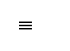
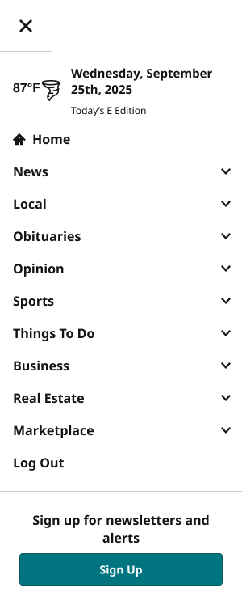
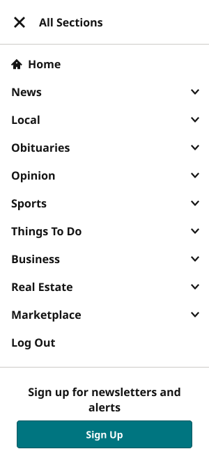

# SectionMenu

**Assembly · 15 variants** · Menus and Parts · source: WordPress Elements ▸ Menus and Parts

> SectionMenu (hamburger / All Sections toggle) — 15 variants across 3 axes: Device (XS-Fold, SM-Mobile, MD-TabletV, LG-TabletH, XL-Desktop — aligned to Masthead's 5-bucket vocabulary), View (Closed, Open), and UserType (all/subscriber, nonSub — only applies when View=Open).
> 
> Layout: layoutMode=NONE (plain manual positioning, no auto-layout/grid). Variants are arranged in a fixed visual grid, organized left-to-right by Device (5 columns), top-to-bottom by View (2 rows), with UserType as a secondary horizontal split within each Device's Open row (subscriber left, nonSub right). This structure is documented outside the component in "SectionMenu Documented" (inside Main Container, Menus and Parts page), which wraps this component set with matching header labels (Device / UserType) above each column and row labels (View) beside each row, built as auto-layout frames sized to align with this set's fixed column/row geometry.
> 
> History: previously used Figma's native GRID layout, which had a bug where resizing the set proportionally inflated all row heights. Switched to layoutMode=NONE with manually computed positions to eliminate that class of bug entirely. All variants use layoutPositioning=AUTO (irrelevant but kept consistent since the parent has no auto-layout).
> 
> Column x-offsets (per Device, width 616 = two 300px UserType sub-columns + 16px gap): XS-Fold=0, SM-Mobile=664, MD-TabletV=1328, LG-TabletH=1992, XL-Desktop=2656. Row y-offsets: Closed=0 (height 64), Open=104 (height 820).

## Figma references

- File: WordPress Elements (`b1iZxkFwtAYq9rElmnCAzd`) · Page: Menus and Parts · Frame path: Frame 12800 ▸ Frame 416 ▸ Frame 11820 ▸ Main Container ▸ Push Nav Section Menu ▸ SectionMenu Documented ▸ Grid Row
- Main: [SectionMenu](https://www.figma.com/design/b1iZxkFwtAYq9rElmnCAzd/?node-id=456-5837) · node `456:5837` · key `c8e491010e441c0201b947dfc91b0af3a1d466f9`

| Variant | Node | Key | Size | Preview |
|---|---|---|---|---|
| View=Closed, Device=XL-Desktop, UserType=all | [456:5838](https://www.figma.com/design/b1iZxkFwtAYq9rElmnCAzd/?node-id=456-5838) | 252803d115d751e872ac8fe112121f23ca7cc33a | 300×64 |  |
| View=Closed, Device=MD-TabletV, UserType=all | [456:5840](https://www.figma.com/design/b1iZxkFwtAYq9rElmnCAzd/?node-id=456-5840) | 4bbdaed809cabaf12abfc7e744ce4c8c9af690a4 | 88×64 |  |
| View=Closed, Device=SM-Mobile, UserType=all | [456:5842](https://www.figma.com/design/b1iZxkFwtAYq9rElmnCAzd/?node-id=456-5842) | e10e6b37bab060f457ba594756e601290c8a541d | 64×64 |  |
| View=Closed, Device=XS-Fold, UserType=all | [3344:64074](https://www.figma.com/design/b1iZxkFwtAYq9rElmnCAzd/?node-id=3344-64074) | 82a23ef35e003da2be7ad3eb794bc611b8a6020d | 64×64 |  |
| View=Closed, Device=LG-TabletH, UserType=all | [3344:64076](https://www.figma.com/design/b1iZxkFwtAYq9rElmnCAzd/?node-id=3344-64076) | f1fe8aa8639095eb08c5248073180019635b61f4 | 300×64 |  |
| View=Open, Device=XL-Desktop, UserType=subscriber | [456:5844](https://www.figma.com/design/b1iZxkFwtAYq9rElmnCAzd/?node-id=456-5844) | 0499d879b65e9706fd92819016406b8ddde14e7e | 300×668 |  |
| View=Open, Device=XL-Desktop, UserType=nonSub | [456:5859](https://www.figma.com/design/b1iZxkFwtAYq9rElmnCAzd/?node-id=456-5859) | 80adddfabedc6db9e4b135d7874a7f3bb2271d42 | 300×740 |  |
| View=Open, Device=SM-Mobile, UserType=subscriber | [456:5875](https://www.figma.com/design/b1iZxkFwtAYq9rElmnCAzd/?node-id=456-5875) | 4a6f74ea703f34fb478770aabe1623ade3fc7013 | 300×748 |  |
| View=Open, Device=SM-Mobile, UserType=nonSub | [456:5891](https://www.figma.com/design/b1iZxkFwtAYq9rElmnCAzd/?node-id=456-5891) | d3b7dbed07047d5c88f5b4e300cbb6693dc72733 | 300×820 |  |
| View=Open, Device=XS-Fold, UserType=subscriber | [3344:64078](https://www.figma.com/design/b1iZxkFwtAYq9rElmnCAzd/?node-id=3344-64078) | bd415bc9e0bdd46a53342904ea49dc7ffab535df | 300×748 |  |
| View=Open, Device=XS-Fold, UserType=nonSub | [3344:64109](https://www.figma.com/design/b1iZxkFwtAYq9rElmnCAzd/?node-id=3344-64109) | 503633ec6acbdc61029d8abd4ca6adae6939053e | 300×820 |  |
| View=Open, Device=LG-TabletH, UserType=subscriber | [3344:64094](https://www.figma.com/design/b1iZxkFwtAYq9rElmnCAzd/?node-id=3344-64094) | 5b4d6bcbc455aa2a9537216be7324c922ac2d525 | 300×668 |  |
| View=Open, Device=LG-TabletH, UserType=nonSub | [3344:64126](https://www.figma.com/design/b1iZxkFwtAYq9rElmnCAzd/?node-id=3344-64126) | 20cf49c233148831fb86afd6ba2b5eade545d25c | 300×740 |  |
| View=Open, Device=MD-TabletV, UserType=subscriber | [3344:64973](https://www.figma.com/design/b1iZxkFwtAYq9rElmnCAzd/?node-id=3344-64973) | d0126f6723797f947467583fc9d49df11f034aad | 300×748 |  |
| View=Open, Device=MD-TabletV, UserType=nonSub | [3344:64989](https://www.figma.com/design/b1iZxkFwtAYq9rElmnCAzd/?node-id=3344-64989) | a2865a76812c3c345705c0c1a9c2acda1b7c95fd | 300×820 |  |

## Properties

| Property | Type | Default | Options |
|---|---|---|---|
| View | VARIANT | Closed | Closed, Open |
| Device | VARIANT | XS-Fold | XL-Desktop, MD-TabletV, SM-Mobile, XS-Fold, LG-TabletH |
| UserType | VARIANT | all | all, subscriber, nonSub |

## Where it is used

- **View=Closed, Device=XL-Desktop, UserType=all** — breakpoints: 1024, 1100, 1280; templates (direct): 1024 HomePage ×1, 1100 HomePage ×1, Desktop HomePage ×1; templates (via assembly): 1024 HomePage (via Masthead), Desktop HomePage (via Masthead), 1100 HomePage (via Masthead); nested inside: Masthead / Device=LG-TabletH (800–1039px), State=Scrolled, Page=SectionFront ×1, Masthead/tabletH/default/home ×2, Masthead / Device=LG-TabletH (800–1039px), State=AdFree, Page=Article ×1, ObitMastHead/TabletH/Scrolled/Default/SectionFront ×1, Masthead / Device=XL-Desktop (≥1040px), State=Default, Page=Obituaries ×1, Masthead / Device=XL-Desktop (≥1040px), State=Scrolled, Page=Obituaries ×1, Masthead / Device=LG-TabletH (800–1039px), State=AdFree, Page=Obituaries ×1, Masthead / Device=LG-TabletH (800–1039px), State=Scrolled, Page=Article ×1, Masthead / Device=XL-Desktop (≥1040px), State=AdFree, Page=Home ×1, ObitMastHead / Device=TabletH, View=Default, Subscriber=Adfree, Page=SectionFront ×1, Masthead / Device=LG-TabletH (800–1039px), State=AdFree, Page=SectionFront ×1, Masthead/tabletH/DefaultAdFree/home ×2 …; other pages: Menus and Parts ▸ Frame 12800 ×27
- **View=Closed, Device=MD-TabletV, UserType=all** — breakpoints: 768; templates (direct): 768 HomePage ×1; templates (via assembly): 768 HomePage (via Masthead); nested inside: Masthead / Device=MD-TabletV (640–799px), State=AdFree-Scrolled, Page=Obituaries ×1, ObitMastHead/TabletV/Scrolled/Default/SectionFront ×1, Masthead / Device=MD-TabletV (640–799px), State=Default, Page=Obituaries ×1, Masthead / Device=MD-TabletV (640–799px), State=Scrolled, Page=Dashboard ×1, Masthead / Device=MD-TabletV (640–799px), State=Default, Page=Home ×1, Masthead / Device=MD-TabletV (640–799px), State=Default, Page=SectionFront ×1, Masthead / Device=MD-TabletV (640–799px), State=Default, Page=Dashboard ×1, Masthead / Device=MD-TabletV (640–799px), State=Scrolled, Page=Article ×1, ObitMastHead / Device=TabletV, View=Default, Subscriber=Standard, Page=ObitPage ×1, ObitMastHead / Device=TabletV, View=Default, Subscriber=Adfree, Page=SectionFront ×1, Masthead / Device=MD-TabletV (640–799px), State=Default, Page=Article ×1, Masthead / Device=MD-TabletV (640–799px), State=AdFree, Page=Article ×1 …; other pages: Menus and Parts ▸ Frame 12800 ×16
- **View=Closed, Device=SM-Mobile, UserType=all** — breakpoints: 340, 360; templates (direct): 340 HomePage ×1, Mobile HomePage ×1; templates (via assembly): Mobile HomePage (via Masthead), 340 HomePage (via Masthead); nested inside: Masthead/tabletH/scrolled/article ×1, ObitMastHead/Mobile/Default/Adfree/SectionFront ×4, Masthead / Device=SM-Mobile (≤639px · built 360px), State=Default, Page=Home ×1, ObitMastHead/Fold/Default/Standard/SectionFront ×1, ObitMastHead / Device=TabletH, View=Scrolled, Subscriber=Default, Page=ObitPage ×1, ObitMastHead / Device=Mobile, View=Default, Subscriber=Standard, Page=SectionFront ×1, AccountMenu / Status=loggedIn, View=Open, Device=SM-Mobile, UserType=PremSub ×1, ObitMastHead/Mobile/Default/Standard/SectionFront ×2, ObitMastHead/Fold/Scrolled/Default/SectionFront ×1, ObitMastHead/Mobile/Scrolled/Default/ObitPage ×1, ObitMastHead / Device=Fold, View=Scrolled, Subscriber=Default, Page=SectionFront ×1, Masthead / Device=SM-Mobile (≤639px · built 360px), State=Default, Page=SectionFront ×1 …; other pages: Menus and Parts ▸ Frame 12800 ×32
- **View=Closed, Device=XS-Fold, UserType=all** — breakpoints: 340; no instances found
- **View=Closed, Device=LG-TabletH, UserType=all** — breakpoints: 1024; no instances found
- **View=Open, Device=XL-Desktop, UserType=subscriber** — breakpoints: 1100, 1280; no instances found
- **View=Open, Device=XL-Desktop, UserType=nonSub** — breakpoints: 1100, 1280; no instances found
- **View=Open, Device=SM-Mobile, UserType=subscriber** — breakpoints: 360; no instances found
- **View=Open, Device=SM-Mobile, UserType=nonSub** — breakpoints: 360; no instances found
- **View=Open, Device=XS-Fold, UserType=subscriber** — breakpoints: 340; no instances found
- **View=Open, Device=XS-Fold, UserType=nonSub** — breakpoints: 340; no instances found
- **View=Open, Device=LG-TabletH, UserType=subscriber** — breakpoints: 1024; no instances found
- **View=Open, Device=LG-TabletH, UserType=nonSub** — breakpoints: 1024; no instances found
- **View=Open, Device=MD-TabletV, UserType=subscriber** — breakpoints: 768; no instances found
- **View=Open, Device=MD-TabletV, UserType=nonSub** — breakpoints: 768; no instances found

## Breakpoints

| Key | Viewport | Variant(s) |
|---|---|---|
| 340 | ≤639px (XS-Fold, built 340) | View=Closed, Device=SM-Mobile, UserType=all, View=Closed, Device=XS-Fold, UserType=all, View=Open, Device=XS-Fold, UserType=subscriber, View=Open, Device=XS-Fold, UserType=nonSub |
| 360 | ≤639px (SM-Mobile, built 360) | View=Closed, Device=SM-Mobile, UserType=all, View=Open, Device=SM-Mobile, UserType=subscriber, View=Open, Device=SM-Mobile, UserType=nonSub |
| 768 | 640–799px (MD-TabletV) | View=Closed, Device=MD-TabletV, UserType=all, View=Open, Device=MD-TabletV, UserType=subscriber, View=Open, Device=MD-TabletV, UserType=nonSub |
| 1024 | 800–1039px (LG-TabletH, built 1009) | View=Closed, Device=XL-Desktop, UserType=all, View=Closed, Device=LG-TabletH, UserType=all, View=Open, Device=LG-TabletH, UserType=subscriber, View=Open, Device=LG-TabletH, UserType=nonSub |
| 1100 | ≥1040px (XL-Desktop, built 1085) | View=Closed, Device=XL-Desktop, UserType=all, View=Open, Device=XL-Desktop, UserType=subscriber, View=Open, Device=XL-Desktop, UserType=nonSub |
| 1280 | ≥1040px (XL-Desktop, built 1280) | View=Closed, Device=XL-Desktop, UserType=all, View=Open, Device=XL-Desktop, UserType=subscriber, View=Open, Device=XL-Desktop, UserType=nonSub |

## Responsive rules

- View=Closed, Device=XL-Desktop, UserType=all: 300×64, vertical gap 0 pad 0/0/0/0 main MIN cross MIN — renders at 1024, 1100, 1280
- View=Closed, Device=MD-TabletV, UserType=all: 88×64, vertical gap 0 pad 0/0/0/0 main MIN cross MIN — renders at 768
- View=Closed, Device=SM-Mobile, UserType=all: 64×64, vertical gap 0 pad 0/0/0/0 main MIN cross MIN — renders at 340, 360
- View=Closed, Device=XS-Fold, UserType=all: 64×64, vertical gap 0 pad 0/0/0/0 main MIN cross MIN — renders at 340
- View=Closed, Device=LG-TabletH, UserType=all: 300×64, vertical gap 0 pad 0/0/0/0 main MIN cross MIN — renders at 1024
- View=Open, Device=XL-Desktop, UserType=subscriber: 300×668, vertical gap 0 pad 0/0/0/0 main MIN cross MIN — renders at 1100, 1280
- View=Open, Device=XL-Desktop, UserType=nonSub: 300×740, vertical gap 0 pad 0/0/0/0 main MIN cross MIN — renders at 1100, 1280
- View=Open, Device=SM-Mobile, UserType=subscriber: 300×748, vertical gap 0 pad 0/0/0/0 main MIN cross MIN — renders at 360
- View=Open, Device=SM-Mobile, UserType=nonSub: 300×820, vertical gap 0 pad 0/0/0/0 main MIN cross MIN — renders at 360
- View=Open, Device=XS-Fold, UserType=subscriber: 300×748, vertical gap 0 pad 0/0/0/0 main MIN cross MIN — renders at 340
- View=Open, Device=XS-Fold, UserType=nonSub: 300×820, vertical gap 0 pad 0/0/0/0 main MIN cross MIN — renders at 340
- View=Open, Device=LG-TabletH, UserType=subscriber: 300×668, vertical gap 0 pad 0/0/0/0 main MIN cross MIN — renders at 1024
- View=Open, Device=LG-TabletH, UserType=nonSub: 300×740, vertical gap 0 pad 0/0/0/0 main MIN cross MIN — renders at 1024
- View=Open, Device=MD-TabletV, UserType=subscriber: 300×748, vertical gap 0 pad 0/0/0/0 main MIN cross MIN — renders at 768
- View=Open, Device=MD-TabletV, UserType=nonSub: 300×820, vertical gap 0 pad 0/0/0/0 main MIN cross MIN — renders at 768

## Dependencies

**Built from:**

- [SectionMenuHeader](../../components/26-sectionmenuheader/sectionmenuheader.md) ×15
- [SectionMenuItem](../32-sectionmenuitem/sectionmenuitem.md) ×131

**Built into:**

- [Masthead](../36-masthead/masthead.md)

## Anatomy

**View=Closed, Device=XL-Desktop, UserType=all**

```
- View=Closed, Device=XL-Desktop, UserType=all — component 300×64 [vertical gap 0] (hug/hug)
  - SectionMenuHeader — instance 300×64 [vertical gap 0] (fixed/fixed) → SectionMenuHeader [View=Closed, Device=Desktop]
```

**View=Closed, Device=MD-TabletV, UserType=all**

```
- View=Closed, Device=MD-TabletV, UserType=all — component 88×64 [vertical gap 0] (hug/hug)
  - SectionMenuHeader — instance 88×64 [vertical gap 0] (fixed/fixed) → SectionMenuHeader [View=Closed, Device=TabletV]
```

**View=Closed, Device=SM-Mobile, UserType=all**

```
- View=Closed, Device=SM-Mobile, UserType=all — component 64×64 [vertical gap 0] (hug/hug)
  - SectionMenuHeader — instance 64×64 [vertical gap 0] (hug/fixed) → SectionMenuHeader [View=Closed, Device=TabletV]
```

_12 more variants — full layer trees are in `sectionmenu.json` → `variants[].layerTree`._

## Size & layout

| Variant | Size | Width | Height | Auto-layout | Radius | Clip |
|---|---|---|---|---|---|---|
| View=Closed, Device=XL-Desktop, UserType=all | 300×64 | HUG | HUG | vertical gap 0 pad 0/0/0/0 main MIN cross MIN |  |  |
| View=Closed, Device=MD-TabletV, UserType=all | 88×64 | HUG | HUG | vertical gap 0 pad 0/0/0/0 main MIN cross MIN |  |  |
| View=Closed, Device=SM-Mobile, UserType=all | 64×64 | HUG | HUG | vertical gap 0 pad 0/0/0/0 main MIN cross MIN |  |  |
| View=Closed, Device=XS-Fold, UserType=all | 64×64 | HUG | HUG | vertical gap 0 pad 0/0/0/0 main MIN cross MIN |  |  |
| View=Closed, Device=LG-TabletH, UserType=all | 300×64 | HUG | HUG | vertical gap 0 pad 0/0/0/0 main MIN cross MIN |  |  |
| View=Open, Device=XL-Desktop, UserType=subscriber | 300×668 | HUG | HUG | vertical gap 0 pad 0/0/0/0 main MIN cross MIN |  |  |
| View=Open, Device=XL-Desktop, UserType=nonSub | 300×740 | HUG | HUG | vertical gap 0 pad 0/0/0/0 main MIN cross MIN |  |  |
| View=Open, Device=SM-Mobile, UserType=subscriber | 300×748 | HUG | HUG | vertical gap 0 pad 0/0/0/0 main MIN cross MIN |  |  |
| View=Open, Device=SM-Mobile, UserType=nonSub | 300×820 | HUG | HUG | vertical gap 0 pad 0/0/0/0 main MIN cross MIN |  |  |
| View=Open, Device=XS-Fold, UserType=subscriber | 300×748 | HUG | HUG | vertical gap 0 pad 0/0/0/0 main MIN cross MIN |  |  |
| View=Open, Device=XS-Fold, UserType=nonSub | 300×820 | HUG | HUG | vertical gap 0 pad 0/0/0/0 main MIN cross MIN |  |  |
| View=Open, Device=LG-TabletH, UserType=subscriber | 300×668 | HUG | HUG | vertical gap 0 pad 0/0/0/0 main MIN cross MIN |  |  |
| View=Open, Device=LG-TabletH, UserType=nonSub | 300×740 | HUG | HUG | vertical gap 0 pad 0/0/0/0 main MIN cross MIN |  |  |
| View=Open, Device=MD-TabletV, UserType=subscriber | 300×748 | HUG | HUG | vertical gap 0 pad 0/0/0/0 main MIN cross MIN |  |  |
| View=Open, Device=MD-TabletV, UserType=nonSub | 300×820 | HUG | HUG | vertical gap 0 pad 0/0/0/0 main MIN cross MIN |  |  |

## Typography

_None._

## Color & effects

| Layer | Role | Type | Hex | Token | Opacity | Note |
|---|---|---|---|---|---|---|
| Container | fill | SOLID | #FFFFFF | Colors/color/gray/max |  |  |

## Image ratios

_None._

## Ad slots

_None._

## Production references

_None found in descriptions or layer names._

## Known issues

- 12 of 15 variants have no instances anywhere in WordPress Elements (unused, or used only from another file): `View=Closed, Device=XS-Fold, UserType=all`, `View=Closed, Device=LG-TabletH, UserType=all`, `View=Open, Device=XL-Desktop, UserType=subscriber`, `View=Open, Device=XL-Desktop, UserType=nonSub`, `View=Open, Device=SM-Mobile, UserType=subscriber`, `View=Open, Device=SM-Mobile, UserType=nonSub`, `View=Open, Device=XS-Fold, UserType=subscriber`, `View=Open, Device=XS-Fold, UserType=nonSub`, `View=Open, Device=LG-TabletH, UserType=subscriber`, `View=Open, Device=LG-TabletH, UserType=nonSub`, `View=Open, Device=MD-TabletV, UserType=subscriber`, `View=Open, Device=MD-TabletV, UserType=nonSub`.
- `View=Closed, Device=XL-Desktop, UserType=all` is declared for 1100, 1280 but is placed in template(s) at 1024 — check the variant choice.
- `View=Closed, Device=SM-Mobile, UserType=all` is declared for 360 but is placed in template(s) at 340 — check the variant choice.

## Rendering steps

1. Pick the variant for the target breakpoint from the Breakpoints table (property values in `sectionmenu.json` → `variants[].variantProperties`).
2. Start from `sectionmenu.html` — each `<section>` is one variant; auto-layout is already mapped to flexbox and colors use `tokens.css` variables.
3. Replace every dashed `data-component` box with the referenced component's own skeleton (links under Dependencies); leave `data-component` on the wrapper.
4. Fill image slots at the ratio listed in Image ratios; fill text using the Typography table (truncate where a line clamp is listed).
5. Check against the preview PNG, then against the production references.
