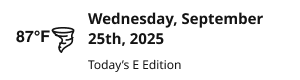
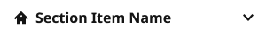
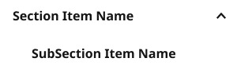

# SectionMenuItem

**Assembly · 9 variants** · Menus and Parts · source: WordPress Elements ▸ Menus and Parts

## Figma references

- File: WordPress Elements (`b1iZxkFwtAYq9rElmnCAzd`) · Page: Menus and Parts · Frame path: Frame 12800 ▸ Frame 416 ▸ Frame 11820 ▸ Main Container ▸ Push Nav Section Menu ▸ Container ▸ Container
- Main: [SectionMenuItem](https://www.figma.com/design/b1iZxkFwtAYq9rElmnCAzd/?node-id=456-5781) · node `456:5781` · key `4739909bf219a46a34480ef19995cbe58b3f99d5`

| Variant | Node | Key | Size | Preview |
|---|---|---|---|---|
| leftIcon=no, withSubItems=no, View=default, kind=CTAButton | [456:5782](https://www.figma.com/design/b1iZxkFwtAYq9rElmnCAzd/?node-id=456-5782) | 8be07983e6991840f3c8941533e5404d18952117 | 300×72 |  |
| leftIcon=no, withSubItems=no, View=default, kind=Weather | [456:5787](https://www.figma.com/design/b1iZxkFwtAYq9rElmnCAzd/?node-id=456-5787) | d486e11d8ad773a6a671e83a5d460fb4aa374a09 | 300×80 |  |
| leftIcon=yes, withSubItems=no, View=default, kind=main | [456:5794](https://www.figma.com/design/b1iZxkFwtAYq9rElmnCAzd/?node-id=456-5794) | 14862fd3520e84ffbfc1e23761ad0785393fb129 | 300×40 |  |
| leftIcon=yes, withSubItems=yes, View=closed, kind=main | [456:5798](https://www.figma.com/design/b1iZxkFwtAYq9rElmnCAzd/?node-id=456-5798) | 22debb32258b351cf8c21abf6ef43f4992dcbb76 | 300×40 |  |
| leftIcon=no, withSubItems=no, View=default, kind=main | [456:5804](https://www.figma.com/design/b1iZxkFwtAYq9rElmnCAzd/?node-id=456-5804) | 4e9cf792d1476d05f4a72e07f31d66d7c4fcaa2e | 300×40 |  |
| leftIcon=no, withSubItems=yes, View=closed, kind=main | [456:5810](https://www.figma.com/design/b1iZxkFwtAYq9rElmnCAzd/?node-id=456-5810) | b7f48da1147888b0a120cd82770968bc316354f2 | 300×40 |  |
| leftIcon=no, withSubItems=no, View=default, kind=subItem | [456:5816](https://www.figma.com/design/b1iZxkFwtAYq9rElmnCAzd/?node-id=456-5816) | 550e5320c063758dad7236a1810fb0277cb36fec | 300×40 |  |
| leftIcon=no, withSubItems=yes, View=open, kind=main | [456:5821](https://www.figma.com/design/b1iZxkFwtAYq9rElmnCAzd/?node-id=456-5821) | a765e15a270bfdd2caf4bae2b3c4a9271ee3881e | 300×88 |  |
| leftIcon=no, withSubItems=no, View=default, kind=CTAMessage | [456:5828](https://www.figma.com/design/b1iZxkFwtAYq9rElmnCAzd/?node-id=456-5828) | c453a561c419a37020b994497f64629793b0e0da | 300×156 |  |

## Properties

| Property | Type | Default | Options |
|---|---|---|---|
| leftIcon | VARIANT | no | no, yes |
| withSubItems | VARIANT | no | no, yes |
| View | VARIANT | default | open, default, closed |
| kind | VARIANT | CTAButton | Weather, main, CTAButton, subItem, CTAMessage |

## Where it is used

- **leftIcon=no, withSubItems=no, View=default, kind=CTAButton** — breakpoints: —; nested inside: SectionMenu / View=Open, Device=LG-TabletH, UserType=nonSub ×1, SectionMenu / View=Open, Device=SM-Mobile, UserType=nonSub ×1, SectionMenu / View=Open, Device=XS-Fold, UserType=nonSub ×1, SectionMenu / View=Open, Device=MD-TabletV, UserType=nonSub ×1, SectionMenu / View=Open, Device=XL-Desktop, UserType=nonSub ×1
- **leftIcon=no, withSubItems=no, View=default, kind=Weather** — breakpoints: —; nested inside: SectionMenu / View=Open, Device=MD-TabletV, UserType=subscriber ×1, SectionMenu / View=Open, Device=SM-Mobile, UserType=subscriber ×1, SectionMenu / View=Open, Device=XS-Fold, UserType=nonSub ×1, SectionMenu / View=Open, Device=MD-TabletV, UserType=nonSub ×1, SectionMenu / View=Open, Device=XS-Fold, UserType=subscriber ×1, SectionMenu / View=Open, Device=SM-Mobile, UserType=nonSub ×1
- **leftIcon=yes, withSubItems=no, View=default, kind=main** — breakpoints: —; nested inside: SectionMenu / View=Open, Device=LG-TabletH, UserType=subscriber ×1, SectionMenu / View=Open, Device=MD-TabletV, UserType=nonSub ×1, SectionMenu / View=Open, Device=XS-Fold, UserType=nonSub ×1, SectionMenu / View=Open, Device=SM-Mobile, UserType=subscriber ×1, SectionMenu / View=Open, Device=XS-Fold, UserType=subscriber ×1, SectionMenu / View=Open, Device=XL-Desktop, UserType=subscriber ×1, SectionMenu / View=Open, Device=XL-Desktop, UserType=nonSub ×1, SectionMenu / View=Open, Device=MD-TabletV, UserType=subscriber ×1, SectionMenu / View=Open, Device=LG-TabletH, UserType=nonSub ×1, SectionMenu / View=Open, Device=SM-Mobile, UserType=nonSub ×1
- **leftIcon=yes, withSubItems=yes, View=closed, kind=main** — breakpoints: —; no instances in this file
- **leftIcon=no, withSubItems=no, View=default, kind=main** — breakpoints: —; nested inside: SectionMenu / View=Open, Device=MD-TabletV, UserType=nonSub ×1, SectionMenu / View=Open, Device=XL-Desktop, UserType=nonSub ×1, SectionMenu / View=Open, Device=LG-TabletH, UserType=nonSub ×1, SectionMenu / View=Open, Device=XS-Fold, UserType=subscriber ×1, SectionMenu / View=Open, Device=LG-TabletH, UserType=subscriber ×1, SectionMenu / View=Open, Device=SM-Mobile, UserType=nonSub ×1, SectionMenu / View=Open, Device=XS-Fold, UserType=nonSub ×1, SectionMenu / View=Open, Device=MD-TabletV, UserType=subscriber ×1, SectionMenu / View=Open, Device=XL-Desktop, UserType=subscriber ×1, SectionMenu / View=Open, Device=SM-Mobile, UserType=subscriber ×1
- **leftIcon=no, withSubItems=yes, View=closed, kind=main** — breakpoints: —; nested inside: SectionMenu / View=Open, Device=XS-Fold, UserType=nonSub ×9, SectionMenu / View=Open, Device=XL-Desktop, UserType=nonSub ×9, SectionMenu / View=Open, Device=LG-TabletH, UserType=subscriber ×9, SectionMenu / View=Open, Device=LG-TabletH, UserType=nonSub ×9, SectionMenu / View=Open, Device=MD-TabletV, UserType=subscriber ×9, SectionMenu / View=Open, Device=SM-Mobile, UserType=subscriber ×9, SectionMenu / View=Open, Device=MD-TabletV, UserType=nonSub ×9, SectionMenu / View=Open, Device=SM-Mobile, UserType=nonSub ×9, SectionMenu / View=Open, Device=XS-Fold, UserType=subscriber ×9, SectionMenu / View=Open, Device=XL-Desktop, UserType=subscriber ×9
- **leftIcon=no, withSubItems=no, View=default, kind=subItem** — breakpoints: —; nested inside: SectionMenuItem / leftIcon=no, withSubItems=yes, View=open, kind=main ×1
- **leftIcon=no, withSubItems=yes, View=open, kind=main** — breakpoints: —; no instances in this file
- **leftIcon=no, withSubItems=no, View=default, kind=CTAMessage** — breakpoints: —; nested inside: SectionMenu / View=Open, Device=SM-Mobile, UserType=subscriber ×1, SectionMenu / View=Open, Device=MD-TabletV, UserType=nonSub ×1, SectionMenu / View=Open, Device=MD-TabletV, UserType=subscriber ×1, SectionMenu / View=Open, Device=LG-TabletH, UserType=nonSub ×1, SectionMenu / View=Open, Device=LG-TabletH, UserType=subscriber ×1, SectionMenu / View=Open, Device=XS-Fold, UserType=subscriber ×1, SectionMenu / View=Open, Device=XS-Fold, UserType=nonSub ×1, SectionMenu / View=Open, Device=SM-Mobile, UserType=nonSub ×1, SectionMenu / View=Open, Device=XL-Desktop, UserType=nonSub ×1, SectionMenu / View=Open, Device=XL-Desktop, UserType=subscriber ×1

## Breakpoints

| Key | Viewport | Variant(s) |
|---|---|---|
| — | not placed in any homepage template | — |

## Responsive rules

- leftIcon=no, withSubItems=no, View=default, kind=CTAButton: 300×72, vertical gap 0 pad 0/0/0/0 main CENTER cross MIN — no breakpoint (not placed in a template)
- leftIcon=no, withSubItems=no, View=default, kind=Weather: 300×80, horizontal gap 12 pad 0/0/0/0 main MIN cross CENTER — no breakpoint (not placed in a template)
- leftIcon=yes, withSubItems=no, View=default, kind=main: 300×40, vertical gap 8 pad 0/0/0/0 main CENTER cross MIN — no breakpoint (not placed in a template)
- leftIcon=yes, withSubItems=yes, View=closed, kind=main: 300×40, vertical gap 8 pad 0/0/0/0 main CENTER cross MIN — no breakpoint (not placed in a template)
- leftIcon=no, withSubItems=no, View=default, kind=main: 300×40, vertical gap 8 pad 0/0/0/0 main CENTER cross MIN — no breakpoint (not placed in a template)
- leftIcon=no, withSubItems=yes, View=closed, kind=main: 300×40, vertical gap 8 pad 0/0/0/0 main CENTER cross MIN — no breakpoint (not placed in a template)
- leftIcon=no, withSubItems=no, View=default, kind=subItem: 300×40, horizontal gap 8 pad 0/0/0/16 main MIN cross CENTER — no breakpoint (not placed in a template)
- leftIcon=no, withSubItems=yes, View=open, kind=main: 300×88, vertical gap 8 pad 0/0/0/0 main CENTER cross MIN — no breakpoint (not placed in a template)
- leftIcon=no, withSubItems=no, View=default, kind=CTAMessage: 300×156, vertical gap 0 pad 16/0/0/0 main MIN cross MIN — no breakpoint (not placed in a template)

## Dependencies

**Built from:**

- Button Primary ×1 _(not in this export)_
- [Weather Bug](../../components/31-weather-bug/weather-bug.md) ×1
- Icons ×2 _(not in this export)_

**Built into:**

- [SectionMenu](../40-sectionmenu/sectionmenu.md)

## Anatomy

**leftIcon=no, withSubItems=no, View=default, kind=CTAButton**

```
- leftIcon=no, withSubItems=no, View=default, kind=CTAButton — component 300×72 [vertical gap 0] (fixed/hug)
  - Container — frame 300×72 [vertical gap 8] (fill/hug)
    - Button Primary — instance 268×40 [vertical gap 8] (fill/hug) → Button Primary [Icon=None, State=Default, Breakpoint=Desktop]
```

**leftIcon=no, withSubItems=no, View=default, kind=Weather**

```
- leftIcon=no, withSubItems=no, View=default, kind=Weather — component 300×80 [horizontal gap 12] (fixed/fixed)
  - Weather Bug — instance 300×80 [horizontal gap 12] (fixed/fixed) → Weather Bug [Location=SectionMenu]
```

**leftIcon=yes, withSubItems=no, View=default, kind=main**

```
- leftIcon=yes, withSubItems=no, View=default, kind=main — component 300×40 [vertical gap 8] (fixed/fixed)
  - Container — frame 300×22 [horizontal gap 8] (fill/hug)
    - Icons — instance 16×16 [horizontal gap 8] (fixed/fixed) → Icons [Name=home]
    - Item Name — text 260×22 (fill/hug) "Section Item Name"
```

**leftIcon=yes, withSubItems=yes, View=closed, kind=main**

```
- leftIcon=yes, withSubItems=yes, View=closed, kind=main — component 300×40 [vertical gap 8] (fixed/fixed)
  - Container — frame 300×40 [horizontal gap 8] (fill/hug)
    - Icons — instance 16×16 [horizontal gap 8] (fixed/fixed) → Icons [Name=home]
    - Item Name — text 212×22 (fill/hug) "Section Item Name"
    - Submenu — frame 40×40 [vertical gap 8] (fixed/fixed)
      - Icons — instance 16×16 [vertical gap 8] (fixed/fixed) → Icons [Name=arrow-downSMALL]
```

**leftIcon=no, withSubItems=no, View=default, kind=main**

```
- leftIcon=no, withSubItems=no, View=default, kind=main — component 300×40 [vertical gap 8] (fixed/fixed)
  - Container — frame 300×40 [horizontal gap 8] (fill/fixed)
    - Icons — instance 16×16 [horizontal gap 8] (fixed/fixed) → Icons [Name=home] (hidden)
    - Item Name — text 284×22 (fill/hug) "Section Item Name"
    - Submenu — frame 40×40 [vertical gap 8] (fixed/fixed) (hidden)
      - Icons — instance 16×16 [vertical gap 8] (fixed/fixed) → Icons [Name=arrow-downSMALL]
```

**leftIcon=no, withSubItems=yes, View=closed, kind=main**

```
- leftIcon=no, withSubItems=yes, View=closed, kind=main — component 300×40 [vertical gap 8] (fixed/fixed)
  - Container — frame 300×40 [horizontal gap 8] (fill/hug)
    - Icons — instance 16×16 [horizontal gap 8] (fixed/fixed) → Icons [Name=home] (hidden)
    - Item Name — text 236×22 (fill/hug) "Section Item Name"
    - Submenu — frame 40×40 [vertical gap 8] (fixed/fixed)
      - Icons — instance 16×16 [vertical gap 8] (fixed/fixed) → Icons [Name=arrow-downSMALL]
```

**leftIcon=no, withSubItems=no, View=default, kind=subItem**

```
- leftIcon=no, withSubItems=no, View=default, kind=subItem — component 300×40 [horizontal gap 8] (fixed/fixed)
  - Icons — instance 16×16 [horizontal gap 8] (fixed/fixed) → Icons [Name=home]
  - SubItem Name — text 212×22 (fill/hug) "SubSection Item Name"
  - Submenu — frame 40×40 [vertical gap 8] (fixed/fixed)
    - Icons — instance 16×16 [vertical gap 8] (fixed/fixed) → Icons [Name=arrow-upSmall] (hidden)
```

**leftIcon=no, withSubItems=yes, View=open, kind=main**

```
- leftIcon=no, withSubItems=yes, View=open, kind=main — component 300×88 [vertical gap 8] (fixed/hug)
  - Container — frame 300×40 [horizontal gap 8] (fill/fixed)
    - Icons — instance 16×16 [horizontal gap 8] (fixed/fixed) → Icons [Name=home] (hidden)
    - Item Name — text 236×22 (fill/hug) "Section Item Name"
    - Submenu — frame 40×40 [vertical gap 8] (fixed/fixed)
      - Icons — instance 16×16 [vertical gap 8] (fixed/fixed) → Icons [Name=arrow-upSmall]
  - SectionMenuItem — instance 300×40 [horizontal gap 8] (fixed/fixed) → SectionMenuItem [leftIcon=no, withSubItems=no, View=default, kind=subItem]
```

**leftIcon=no, withSubItems=no, View=default, kind=CTAMessage**

```
- leftIcon=no, withSubItems=no, View=default, kind=CTAMessage — component 300×156 [vertical gap 0] (fixed/hug)
  - Divider — line 300×0 (fill/fixed)
  - Container — frame 300×140 [vertical gap 8] (fill/hug)
    - CTA Text — text 268×44 (fill/hug) "Sign up for newsletters and alerts"
    - Button Primary — instance 268×40 [vertical gap 8] (fill/hug) → Button Primary [Icon=None, State=Default, Breakpoint=Desktop]
```

## Size & layout

| Variant | Size | Width | Height | Auto-layout | Radius | Clip |
|---|---|---|---|---|---|---|
| leftIcon=no, withSubItems=no, View=default, kind=CTAButton | 300×72 | FIXED | HUG | vertical gap 0 pad 0/0/0/0 main CENTER cross MIN |  |  |
| leftIcon=no, withSubItems=no, View=default, kind=Weather | 300×80 | FIXED | FIXED | horizontal gap 12 pad 0/0/0/0 main MIN cross CENTER |  |  |
| leftIcon=yes, withSubItems=no, View=default, kind=main | 300×40 | FIXED | FIXED | vertical gap 8 pad 0/0/0/0 main CENTER cross MIN |  |  |
| leftIcon=yes, withSubItems=yes, View=closed, kind=main | 300×40 | FIXED | FIXED | vertical gap 8 pad 0/0/0/0 main CENTER cross MIN |  |  |
| leftIcon=no, withSubItems=no, View=default, kind=main | 300×40 | FIXED | FIXED | vertical gap 8 pad 0/0/0/0 main CENTER cross MIN |  |  |
| leftIcon=no, withSubItems=yes, View=closed, kind=main | 300×40 | FIXED | FIXED | vertical gap 8 pad 0/0/0/0 main CENTER cross MIN |  |  |
| leftIcon=no, withSubItems=no, View=default, kind=subItem | 300×40 | FIXED | FIXED | horizontal gap 8 pad 0/0/0/16 main MIN cross CENTER |  |  |
| leftIcon=no, withSubItems=yes, View=open, kind=main | 300×88 | FIXED | HUG | vertical gap 8 pad 0/0/0/0 main CENTER cross MIN |  |  |
| leftIcon=no, withSubItems=no, View=default, kind=CTAMessage | 300×156 | FIXED | HUG | vertical gap 0 pad 16/0/0/0 main MIN cross MIN |  |  |

## Typography

| Layer | Font | Weight | Size | Line height | Letter sp. | Case | Color | Color token | Type token | Truncate | Sample | Variants |
|---|---|---|---|---|---|---|---|---|---|---|---|---|
| Item Name | Noto Sans | Bold | 16 | auto |  | TITLE | #141414 | Colors/color/gray/min |  |  | Section Item Name | leftIcon=yes, withSubItems=no, View=default, kind=main, leftIcon=yes, withSubItems=yes, View=closed, kind=main, leftIcon=no, withSubItems=no, View=default, kind=main, leftIcon=no, withSubItems=yes, View=closed, kind=main, leftIcon=no, withSubItems=yes, View=open, kind=main |
| SubItem Name | Noto Sans | Bold | 16 | auto |  | TITLE | #141414 | Colors/color/gray/min |  |  | SubSection Item Name | leftIcon=no, withSubItems=no, View=default, kind=subItem |
| CTA Text | Noto Sans | Bold | 16 | auto |  |  | #141414 | Colors/color/gray/min |  |  | Sign up for newsletters and alerts | leftIcon=no, withSubItems=no, View=default, kind=CTAMessage |

## Color & effects

| Layer | Role | Type | Hex | Token | Opacity | Note |
|---|---|---|---|---|---|---|
| leftIcon=no, withSubItems=no, View=default, kind=CTAButton | fill | SOLID | #FFFFFF | Colors/color/gray/max |  |  |
| leftIcon=no, withSubItems=no, View=default, kind=Weather | fill | SOLID | #FFFFFF | Colors/color/gray/max |  |  |
| Weather Bug | fill | SOLID | #FFFFFF | Colors/color/gray/max |  |  |
| leftIcon=yes, withSubItems=no, View=default, kind=main | fill | SOLID | #FFFFFF | Colors/color/gray/max |  |  |
| leftIcon=yes, withSubItems=yes, View=closed, kind=main | fill | SOLID | #FFFFFF | Colors/color/gray/max |  |  |
| leftIcon=no, withSubItems=no, View=default, kind=main | fill | SOLID | #FFFFFF | Colors/color/gray/max |  |  |
| leftIcon=no, withSubItems=yes, View=closed, kind=main | fill | SOLID | #FFFFFF | Colors/color/gray/max |  |  |
| leftIcon=no, withSubItems=no, View=default, kind=subItem | fill | SOLID | #FFFFFF | Colors/color/gray/max |  |  |
| leftIcon=no, withSubItems=yes, View=open, kind=main | fill | SOLID | #FFFFFF | Colors/color/gray/max |  |  |
| SectionMenuItem | fill | SOLID | #FFFFFF | Colors/color/gray/max |  |  |
| leftIcon=no, withSubItems=no, View=default, kind=CTAMessage | fill | SOLID | #FFFFFF | Colors/color/gray/max |  |  |
| Divider | stroke | SOLID | #CCCAC7 | Colors/color/gray/500 |  |  |

## Image ratios

_None._

## Ad slots

_None._

## Production references

_None found in descriptions or layer names._

## Known issues

- 2 of 9 variants have no instances anywhere in WordPress Elements (unused, or used only from another file): `leftIcon=yes, withSubItems=yes, View=closed, kind=main`, `leftIcon=no, withSubItems=yes, View=open, kind=main`.

## Rendering steps

1. Pick the variant for the target breakpoint from the Breakpoints table (property values in `sectionmenuitem.json` → `variants[].variantProperties`).
2. Start from `sectionmenuitem.html` — each `<section>` is one variant; auto-layout is already mapped to flexbox and colors use `tokens.css` variables.
3. Replace every dashed `data-component` box with the referenced component's own skeleton (links under Dependencies); leave `data-component` on the wrapper.
4. Fill image slots at the ratio listed in Image ratios; fill text using the Typography table (truncate where a line clamp is listed).
5. Check against the preview PNG, then against the production references.
