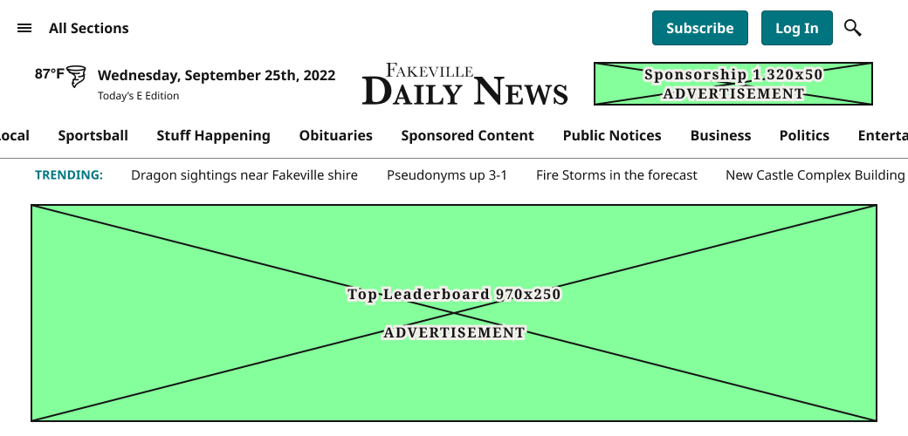
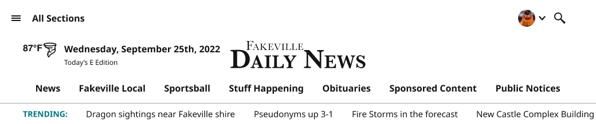
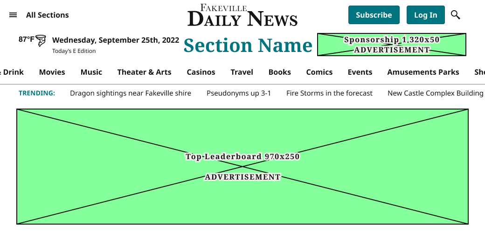
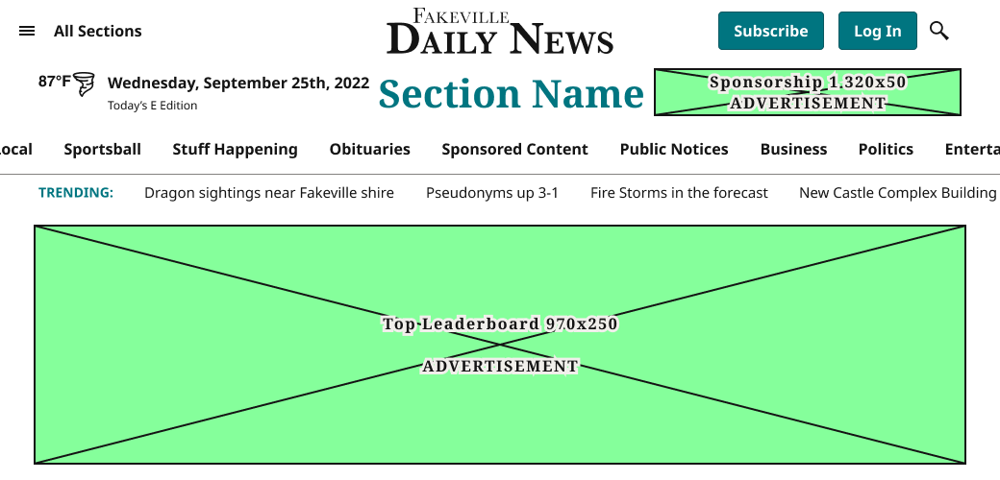
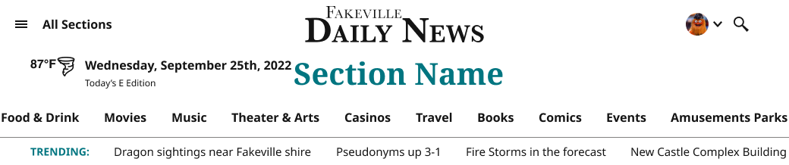
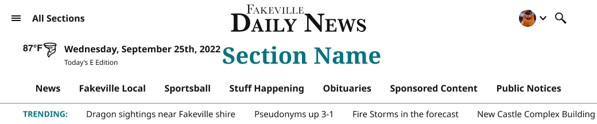
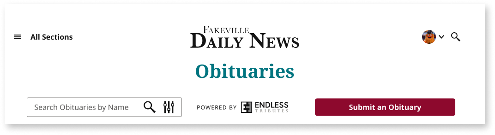
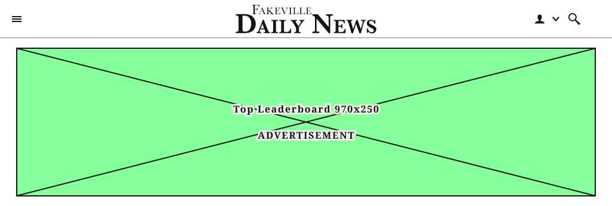
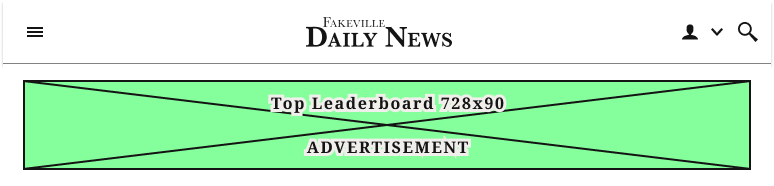

# Masthead

**Assembly · 75 variants** · Menus and Parts · source: WordPress Elements ▸ Menus and Parts

## Figma references

- File: WordPress Elements (`b1iZxkFwtAYq9rElmnCAzd`) · Page: Menus and Parts · Frame path: Frame 12800 ▸ Frame 416 ▸ Frame 11820 ▸ Frame 12759 ▸ Frame 12634 ▸ Mastheads ▸ Frame 12727
- Main: [Masthead](https://www.figma.com/design/b1iZxkFwtAYq9rElmnCAzd/?node-id=456-2572) · node `456:2572` · key `5cf04e3021e4ccd5357b9d77f3d03e02ed41dc28`

| Variant | Node | Key | Size | Preview |
|---|---|---|---|---|
| Device=XL-Desktop (≥1040px), State=Default, Page=Home | [456:2573](https://www.figma.com/design/b1iZxkFwtAYq9rElmnCAzd/?node-id=456-2573) | ed800047f100d0f1903d69ab85541bf3f0a15aec | 1040×500 |  |
| Device=XL-Desktop (≥1040px), State=AdFree, Page=Home | [819:1845](https://www.figma.com/design/b1iZxkFwtAYq9rElmnCAzd/?node-id=819-1845) | 3041d5a4a7262637b97b2a9a37abedd915d54516 | 1040×218 |  |
| Device=XL-Desktop (≥1040px), State=Default, Page=SectionFront | [456:2653](https://www.figma.com/design/b1iZxkFwtAYq9rElmnCAzd/?node-id=456-2653) | 5da3a1e6f7ba080a072e1a209369b5b8a988b336 | 1040×500 |  |
| Device=XL-Desktop (≥1040px), State=Default, Page=Article | [824:4526](https://www.figma.com/design/b1iZxkFwtAYq9rElmnCAzd/?node-id=824-4526) | 8748e995923253cf562eb3fa7056452b8adaacfc | 1040×500 |  |
| Device=XL-Desktop (≥1040px), State=AdFree, Page=SectionFront | [822:3434](https://www.figma.com/design/b1iZxkFwtAYq9rElmnCAzd/?node-id=822-3434) | 9d6f0d988b3c1ec18609cf84a78b6fb6a46ed1fa | 1040×218 |  |
| Device=XL-Desktop (≥1040px), State=AdFree, Page=Article | [824:4625](https://www.figma.com/design/b1iZxkFwtAYq9rElmnCAzd/?node-id=824-4625) | 4e82559397c81ae40d15d905fa4800bc77495ab0 | 1040×218 |  |
| Device=XL-Desktop (≥1040px), State=Default, Page=Dashboard | [456:2715](https://www.figma.com/design/b1iZxkFwtAYq9rElmnCAzd/?node-id=456-2715) | 79dc19ad9a2a8bcbac61d6408bb57560097a2541 | 1280×144 |  |
| Device=XL-Desktop (≥1040px), State=Scrolled, Page=Home | [456:2776](https://www.figma.com/design/b1iZxkFwtAYq9rElmnCAzd/?node-id=456-2776) | d7fda157cb00e9f0f8ff3e42125c2e1a94b25319 | 1040×64 |  |
| Device=XL-Desktop (≥1040px), State=Scrolled, Page=SectionFront | [822:3585](https://www.figma.com/design/b1iZxkFwtAYq9rElmnCAzd/?node-id=822-3585) | 74cac7419baf9566c232c40e1473e1d7f81cf25f | 1040×64 |  |
| Device=XL-Desktop (≥1040px), State=Scrolled, Page=Article | [456:2800](https://www.figma.com/design/b1iZxkFwtAYq9rElmnCAzd/?node-id=456-2800) | c8380fb5884092091a59021ef29e9ca69600d8e2 | 1040×64 |  |
| Device=XL-Desktop (≥1040px), State=Scrolled, Page=Dashboard | [456:2840](https://www.figma.com/design/b1iZxkFwtAYq9rElmnCAzd/?node-id=456-2840) | 270eee3dee371a43b76d5a679e8ea9f4f0392b44 | 1280×64 |  |
| Device=XL-Desktop (≥1040px), State=Default, Page=Obituaries | [456:3394](https://www.figma.com/design/b1iZxkFwtAYq9rElmnCAzd/?node-id=456-3394) | f59ba9e2f05141244d2e1092ced5338de2119b35 | 1040×261 |  |
| Device=XL-Desktop (≥1040px), State=AdFree, Page=Obituaries | [827:6067](https://www.figma.com/design/b1iZxkFwtAYq9rElmnCAzd/?node-id=827-6067) | 2907878bc3e208ce6e2d67070d282e6715fda6e5 | 1040×261 |  |
| Device=XL-Desktop (≥1040px), State=Scrolled, Page=Obituaries | [456:3468](https://www.figma.com/design/b1iZxkFwtAYq9rElmnCAzd/?node-id=456-3468) | 7b176a3c87734677e5c9bfac1acaa264bb170bd2 | 1040×145 |  |
| Device=LG-TabletH (800–1039px), State=Default, Page=Home | [819:2854](https://www.figma.com/design/b1iZxkFwtAYq9rElmnCAzd/?node-id=819-2854) | 30710a5e8ee6de2129a84cd22176d810e1e8a04d | 1024×346 |  |
| Device=LG-TabletH (800–1039px), State=Default, Page=SectionFront | [456:2896](https://www.figma.com/design/b1iZxkFwtAYq9rElmnCAzd/?node-id=456-2896) | 00fa606e7d0727cb99be026fe976007e846213b6 | 1024×346 |  |
| Device=LG-TabletH (800–1039px), State=Default, Page=Article | [824:5088](https://www.figma.com/design/b1iZxkFwtAYq9rElmnCAzd/?node-id=824-5088) | c27e2b363555a1dce264a4170c395b44dd62d3ec | 1024×346 |  |
| Device=MD-TabletV (640–799px), State=Scrolled, Page=Article | [456:2971](https://www.figma.com/design/b1iZxkFwtAYq9rElmnCAzd/?node-id=456-2971) | 39a3eb332c9550514fae32c92818bd2d976b333d | 768×64 |  |
| Device=LG-TabletH (800–1039px), State=Default, Page=Dashboard | [456:2996](https://www.figma.com/design/b1iZxkFwtAYq9rElmnCAzd/?node-id=456-2996) | 7c16dfe670e190ed48173dc913d44e596cb924ce | 1024×64 |  |
| Device=LG-TabletH (800–1039px), State=Scrolled, Page=Home | [456:3023](https://www.figma.com/design/b1iZxkFwtAYq9rElmnCAzd/?node-id=456-3023) | 16e2e3e0d36d3af833ef17d45a53eba70bd93f99 | 1024×64 |  |
| Device=LG-TabletH (800–1039px), State=AdFree, Page=Home | [823:3758](https://www.figma.com/design/b1iZxkFwtAYq9rElmnCAzd/?node-id=823-3758) | f86ae8442aa73a100940db618832bc1b58251973 | 1024×64 |  |
| Device=LG-TabletH (800–1039px), State=AdFree, Page=SectionFront | [823:3812](https://www.figma.com/design/b1iZxkFwtAYq9rElmnCAzd/?node-id=823-3812) | cc6052be242163d22fcffed76c1199e982cb8ff9 | 1024×64 |  |
| Device=LG-TabletH (800–1039px), State=AdFree, Page=Article | [824:4780](https://www.figma.com/design/b1iZxkFwtAYq9rElmnCAzd/?node-id=824-4780) | be77bfa0d2996a91e81e4181d8a0f28a5e43118b | 1024×64 |  |
| Device=LG-TabletH (800–1039px), State=Scrolled, Page=Dashboard | [456:3047](https://www.figma.com/design/b1iZxkFwtAYq9rElmnCAzd/?node-id=456-3047) | c12444b2dacc8d589e9c7f1f3d2786c12d50bdd5 | 1024×64 |  |
| Device=LG-TabletH (800–1039px), State=Scrolled, Page=SectionFront | [823:3917](https://www.figma.com/design/b1iZxkFwtAYq9rElmnCAzd/?node-id=823-3917) | 1802da0de6c0ea62f868386f2fe5bbf64d069265 | 1024×64 |  |
| Device=LG-TabletH (800–1039px), State=Scrolled, Page=Article | [824:4806](https://www.figma.com/design/b1iZxkFwtAYq9rElmnCAzd/?node-id=824-4806) | 58ba9a16f51bc9d56bc0283bb00b86d6b43939bc | 1024×64 |  |
| Device=MD-TabletV (640–799px), State=Default, Page=Home | [456:3071](https://www.figma.com/design/b1iZxkFwtAYq9rElmnCAzd/?node-id=456-3071) | fe8efd0ea22a4d290e49be14e7e66ba65b95d10c | 768×186 |  |
| Device=MD-TabletV (640–799px), State=AdFree, Page=Home | [819:1940](https://www.figma.com/design/b1iZxkFwtAYq9rElmnCAzd/?node-id=819-1940) | 00f306504cf4188aea97148d7e8cb6b00182fc92 | 768×64 |  |
| Device=MD-TabletV (640–799px), State=AdFree, Page=SectionFront | [823:3969](https://www.figma.com/design/b1iZxkFwtAYq9rElmnCAzd/?node-id=823-3969) | 882c956e22f38782b4c4d64cef8c92fd8313ac1d | 768×64 |  |
| Device=MD-TabletV (640–799px), State=AdFree, Page=Article | [824:4885](https://www.figma.com/design/b1iZxkFwtAYq9rElmnCAzd/?node-id=824-4885) | 50b0463a883335addc8dc0c23e7a327ca62d33d7 | 768×64 |  |
| Device=MD-TabletV (640–799px), State=Default, Page=SectionFront | [456:3100](https://www.figma.com/design/b1iZxkFwtAYq9rElmnCAzd/?node-id=456-3100) | 1a241a32f28c96b7d9cb90aaa1bb86f5acac2f0c | 768×186 |  |
| Device=MD-TabletV (640–799px), State=Default, Page=Article | [824:5147](https://www.figma.com/design/b1iZxkFwtAYq9rElmnCAzd/?node-id=824-5147) | 40c743a06fca1f9187686268ce9f1fafa53386a0 | 768×186 |  |
| Device=MD-TabletV (640–799px), State=Scrolled, Page=Home | [456:3129](https://www.figma.com/design/b1iZxkFwtAYq9rElmnCAzd/?node-id=456-3129) | 6541d25f37fb8d6d1340fc503568a66f2739ff34 | 768×64 |  |
| Device=MD-TabletV (640–799px), State=Scrolled, Page=SectionFront | [823:4019](https://www.figma.com/design/b1iZxkFwtAYq9rElmnCAzd/?node-id=823-4019) | 1aacffbf407a0474abf9bb781e829ff39f774cda | 768×64 |  |
| Device=MD-TabletV (640–799px), State=Default, Page=Dashboard | [456:3152](https://www.figma.com/design/b1iZxkFwtAYq9rElmnCAzd/?node-id=456-3152) | ad71a5ce1e539302ae12a20ba64aad2542d43357 | 768×104 |  |
| Device=MD-TabletV (640–799px), State=Scrolled, Page=Dashboard | [456:3177](https://www.figma.com/design/b1iZxkFwtAYq9rElmnCAzd/?node-id=456-3177) | dfbfbf9fdc651d8601367cc7b3ca9cf7a4434eb8 | 768×104 |  |
| Device=SM-Mobile (≤639px · built 360px), State=Default, Page=Home | [456:3201](https://www.figma.com/design/b1iZxkFwtAYq9rElmnCAzd/?node-id=456-3201) | e9180529622dc71ee95d2901c87396a7d6643f4b | 360×130 |  |
| Device=SM-Mobile (≤639px · built 360px), State=AdFree, Page=Home | [819:1966](https://www.figma.com/design/b1iZxkFwtAYq9rElmnCAzd/?node-id=819-1966) | 8f0ede29b6a7a50323d3e8193d08c0f00acac736 | 360×64 |  |
| Device=XS-Fold (≤639px · built 340px), State=Default, Page=Home | [736:2450](https://www.figma.com/design/b1iZxkFwtAYq9rElmnCAzd/?node-id=736-2450) | eb4ea11ecad50d17593776d24fedf484f5d83347 | 340×180 |  |
| Device=XS-Fold (≤639px · built 340px), State=AdFree, Page=Home | [819:1992](https://www.figma.com/design/b1iZxkFwtAYq9rElmnCAzd/?node-id=819-1992) | 2cabca0ee2c4417801de0b4eb8cbb9ebca9cb6e0 | 340×64 |  |
| Device=XS-Fold (≤639px · built 340px), State=AdFree, Page=SectionFront | [823:4190](https://www.figma.com/design/b1iZxkFwtAYq9rElmnCAzd/?node-id=823-4190) | d1b0c5b0dec4de6c49c8fb9624fc00b0417a7e85 | 340×64 |  |
| Device=XS-Fold (≤639px · built 340px), State=AdFree, Page=Article | [824:4933](https://www.figma.com/design/b1iZxkFwtAYq9rElmnCAzd/?node-id=824-4933) | eeac86368c1981ae9961f9d494bdb0cee4f568c9 | 340×64 |  |
| Device=SM-Mobile (≤639px · built 360px), State=Default, Page=SectionFront | [456:3230](https://www.figma.com/design/b1iZxkFwtAYq9rElmnCAzd/?node-id=456-3230) | 57bbdee573f2170eb500e1adb78c00f38fdddd90 | 360×130 |  |
| Device=SM-Mobile (≤639px · built 360px), State=Default, Page=Article | [824:5173](https://www.figma.com/design/b1iZxkFwtAYq9rElmnCAzd/?node-id=824-5173) | ca2073d8215dc22cf0bd32cbdd28d82a08b4dfc1 | 360×130 |  |
| Device=SM-Mobile (≤639px · built 360px), State=AdFree, Page=SectionFront | [823:4068](https://www.figma.com/design/b1iZxkFwtAYq9rElmnCAzd/?node-id=823-4068) | dc9dcafc7e4872b35c3424cc41e675656d263fc7 | 360×64 |  |
| Device=SM-Mobile (≤639px · built 360px), State=AdFree, Page=Article | [824:4909](https://www.figma.com/design/b1iZxkFwtAYq9rElmnCAzd/?node-id=824-4909) | 01a5cbb19f28a4af888d19d434e39a9a9fe27e18 | 360×64 |  |
| Device=XS-Fold (≤639px · built 340px), State=Default, Page=SectionFront | [736:1647](https://www.figma.com/design/b1iZxkFwtAYq9rElmnCAzd/?node-id=736-1647) | 0d511227a8b50f20aeb3680c95afdb40e3d2fbc9 | 340×180 |  |
| Device=XS-Fold (≤639px · built 340px), State=Default, Page=Article | [824:5197](https://www.figma.com/design/b1iZxkFwtAYq9rElmnCAzd/?node-id=824-5197) | 8074e24db43a1e3aedc0eeee18b102b7bb7ca8bc | 340×180 |  |
| Device=SM-Mobile (≤639px · built 360px), State=Scrolled, Page=Home | [456:3254](https://www.figma.com/design/b1iZxkFwtAYq9rElmnCAzd/?node-id=456-3254) | 58a820261c38a10b7f8a7839c8724410dcba4368 | 360×64 |  |
| Device=SM-Mobile (≤639px · built 360px), State=Scrolled, Page=SectionFront | [823:4092](https://www.figma.com/design/b1iZxkFwtAYq9rElmnCAzd/?node-id=823-4092) | e8a86ce5156d7a3004aec9f6493cd4065be57609 | 360×64 |  |
| Device=XS-Fold (≤639px · built 340px), State=Scrolled, Page=Home | [736:2476](https://www.figma.com/design/b1iZxkFwtAYq9rElmnCAzd/?node-id=736-2476) | 66b9d0da4839c0e5e7e2b23f329e7e58f1e3d09a | 340×64 |  |
| Device=XS-Fold (≤639px · built 340px), State=Scrolled, Page=SectionFront | [823:4167](https://www.figma.com/design/b1iZxkFwtAYq9rElmnCAzd/?node-id=823-4167) | 33f6a4ab32e21690ee82236c3714afe389e024dd | 340×64 |  |
| Device=SM-Mobile (≤639px · built 360px), State=Scrolled, Page=Article | [456:3277](https://www.figma.com/design/b1iZxkFwtAYq9rElmnCAzd/?node-id=456-3277) | 3b05fc8646ef105d48c816d2de43cc099c1a76e7 | 360×64 |  |
| Device=XS-Fold (≤639px · built 340px), State=Scrolled, Page=Article | [736:1671](https://www.figma.com/design/b1iZxkFwtAYq9rElmnCAzd/?node-id=736-1671) | 7097e5b4ad88552bafff3805945a921a72d97673 | 340×64 |  |
| Device=SM-Mobile (≤639px · built 360px), State=Default, Page=Dashboard | [456:3300](https://www.figma.com/design/b1iZxkFwtAYq9rElmnCAzd/?node-id=456-3300) | cc5c2645081eddfc69198b5f5d503f2e226cc557 | 360×104 |  |
| Device=XS-Fold (≤639px · built 340px), State=Default, Page=Dashboard | [456:3324](https://www.figma.com/design/b1iZxkFwtAYq9rElmnCAzd/?node-id=456-3324) | 2c29afe7fa50bfbfce117cfba20e1765b7b0e5af | 340×104 |  |
| Device=SM-Mobile (≤639px · built 360px), State=Scrolled, Page=Dashboard | [456:3348](https://www.figma.com/design/b1iZxkFwtAYq9rElmnCAzd/?node-id=456-3348) | 581477884329d4b2fc1356b30492fd26e4476207 | 360×104 |  |
| Device=XS-Fold (≤639px · built 340px), State=Scrolled, Page=Dashboard | [456:3371](https://www.figma.com/design/b1iZxkFwtAYq9rElmnCAzd/?node-id=456-3371) | 67602fc5a1e4210b45796f533c0a57f6a874a633 | 340×104 |  |
| Device=SM-Mobile (≤639px · built 360px), State=Default, Page=Obituaries | [456:3531](https://www.figma.com/design/b1iZxkFwtAYq9rElmnCAzd/?node-id=456-3531) | c66d192c530b2990b9e84246f753a05851b53b46 | 360×295 |  |
| Device=SM-Mobile (≤639px · built 360px), State=AdFree, Page=Obituaries | [827:5440](https://www.figma.com/design/b1iZxkFwtAYq9rElmnCAzd/?node-id=827-5440) | adf85ebb671e27381503cc86d22896d138832c1d | 360×295 |  |
| Device=XS-Fold (≤639px · built 340px), State=Default, Page=Obituaries | [456:3592](https://www.figma.com/design/b1iZxkFwtAYq9rElmnCAzd/?node-id=456-3592) | 10b01979ad4091a40d6d7d3b7087c0f5cb99ab36 | 340×295 |  |
| Device=XS-Fold (≤639px · built 340px), State=AdFree, Page=Obituaries | [827:5968](https://www.figma.com/design/b1iZxkFwtAYq9rElmnCAzd/?node-id=827-5968) | 243c528feae5e1ce9694394a9ffa94dabc0794f3 | 340×295 |  |
| Device=LG-TabletH (800–1039px), State=Default, Page=Obituaries | [456:3653](https://www.figma.com/design/b1iZxkFwtAYq9rElmnCAzd/?node-id=456-3653) | dc9e727962e941745227a12945a9489a28660572 | 1024×324 |  |
| Device=LG-TabletH (800–1039px), State=AdFree, Page=Obituaries | [827:5676](https://www.figma.com/design/b1iZxkFwtAYq9rElmnCAzd/?node-id=827-5676) | d4648021839cf29a416857ba7066238041c9eda8 | 1024×324 |  |
| Device=MD-TabletV (640–799px), State=Default, Page=Obituaries | [456:3726](https://www.figma.com/design/b1iZxkFwtAYq9rElmnCAzd/?node-id=456-3726) | 8095a058c0a8bde1cd971bdb3789376f1801d302 | 768×300 |  |
| Device=MD-TabletV (640–799px), State=AdFree, Page=Obituaries | [827:5573](https://www.figma.com/design/b1iZxkFwtAYq9rElmnCAzd/?node-id=827-5573) | ac715be4aab785bb8eb90e1661e770c5b522fd7b | 768×300 |  |
| Device=SM-Mobile (≤639px · built 360px), State=Scrolled, Page=Obituaries | [456:3799](https://www.figma.com/design/b1iZxkFwtAYq9rElmnCAzd/?node-id=456-3799) | c96a63eddd1140121af43a3305e93b8c837d4c20 | 360×215 |  |
| Device=XS-Fold (≤639px · built 340px), State=Scrolled, Page=Obituaries | [456:3857](https://www.figma.com/design/b1iZxkFwtAYq9rElmnCAzd/?node-id=456-3857) | ab5889fce83caa4830c04a177ee0d4d01524f3c1 | 340×215 |  |
| Device=MD-TabletV (640–799px), State=Scrolled, Page=Obituaries | [456:3915](https://www.figma.com/design/b1iZxkFwtAYq9rElmnCAzd/?node-id=456-3915) | b5eb7261d5420b1463aebdd2b09c17d785bc9c11 | 768×212 |  |
| Device=LG-TabletH (800–1039px), State=Scrolled, Page=Obituaries | [456:3977](https://www.figma.com/design/b1iZxkFwtAYq9rElmnCAzd/?node-id=456-3977) | 24071fdea098e8fd19b9c38d0b7fc3e77fac0788 | 1024×244 |  |
| Device=XL-Desktop (≥1040px), State=AdFree-Scrolled, Page=Obituaries | [3415:52128](https://www.figma.com/design/b1iZxkFwtAYq9rElmnCAzd/?node-id=3415-52128) | 15e1cfe3842d616b2e08ab097d9d0320b18868a6 | 1040×145 |  |
| Device=SM-Mobile (≤639px · built 360px), State=AdFree-Scrolled, Page=Obituaries | [3415:52247](https://www.figma.com/design/b1iZxkFwtAYq9rElmnCAzd/?node-id=3415-52247) | e6febf6952381dd88b13ad6557573d4a5d0c7e56 | 360×215 |  |
| Device=XS-Fold (≤639px · built 340px), State=AdFree-Scrolled, Page=Obituaries | [3415:52351](https://www.figma.com/design/b1iZxkFwtAYq9rElmnCAzd/?node-id=3415-52351) | 5b2d4deb18fe956b00bb05946e02006fe4ab0739 | 340×215 |  |
| Device=MD-TabletV (640–799px), State=AdFree-Scrolled, Page=Obituaries | [3415:52455](https://www.figma.com/design/b1iZxkFwtAYq9rElmnCAzd/?node-id=3415-52455) | 50b0b19836b0ce875886f7b3bfd6b2a4ea3268b6 | 768×212 |  |
| Device=LG-TabletH (800–1039px), State=AdFree-Scrolled, Page=Obituaries | [3415:52563](https://www.figma.com/design/b1iZxkFwtAYq9rElmnCAzd/?node-id=3415-52563) | 1a0621b4c49d082616a2af0379c45f2546adeb82 | 1024×244 |  |

## Properties

| Property | Type | Default | Options |
|---|---|---|---|
| Device | VARIANT | XS-Fold (≤639px · built 340px) | XL-Desktop (≥1040px), LG-TabletH (800–1039px), MD-TabletV (640–799px), SM-Mobile (≤639px · built 360px), XS-Fold (≤639px · built 340px) |
| State | VARIANT | Default | Default, AdFree, Scrolled, AdFree-Scrolled |
| Page | VARIANT | Home | SectionFront, Obituaries, Dashboard, Home, Article |

## Where it is used

- **Device=XL-Desktop (≥1040px), State=Default, Page=Home** — breakpoints: 1100, 1280; templates (direct): Desktop HomePage ×1, 1100 HomePage ×1; other pages: Menus and Parts ▸ Frame 12800 ×6
- **Device=XL-Desktop (≥1040px), State=AdFree, Page=Home** — breakpoints: 1100, 1280; no instances in this file
- **Device=XL-Desktop (≥1040px), State=Default, Page=SectionFront** — breakpoints: 1100, 1280; other pages: Article Page ▸ Frame 11672 ×2, Section Front ▸ Frame 11639 ×1
- **Device=XL-Desktop (≥1040px), State=Default, Page=Article** — breakpoints: 1100, 1280; no instances in this file
- **Device=XL-Desktop (≥1040px), State=AdFree, Page=SectionFront** — breakpoints: 1100, 1280; no instances in this file
- **Device=XL-Desktop (≥1040px), State=AdFree, Page=Article** — breakpoints: 1100, 1280; no instances in this file
- **Device=XL-Desktop (≥1040px), State=Default, Page=Dashboard** — breakpoints: 1100, 1280; other pages: Menus and Parts ▸ Frame 12800 ×7
- **Device=XL-Desktop (≥1040px), State=Scrolled, Page=Home** — breakpoints: 1100, 1280; no instances in this file
- **Device=XL-Desktop (≥1040px), State=Scrolled, Page=SectionFront** — breakpoints: 1100, 1280; no instances in this file
- **Device=XL-Desktop (≥1040px), State=Scrolled, Page=Article** — breakpoints: 1100, 1280; no instances in this file
- **Device=XL-Desktop (≥1040px), State=Scrolled, Page=Dashboard** — breakpoints: 1100, 1280; no instances in this file
- **Device=XL-Desktop (≥1040px), State=Default, Page=Obituaries** — breakpoints: 1100, 1280; no instances in this file
- **Device=XL-Desktop (≥1040px), State=AdFree, Page=Obituaries** — breakpoints: 1100, 1280; no instances in this file
- **Device=XL-Desktop (≥1040px), State=Scrolled, Page=Obituaries** — breakpoints: 1100, 1280; no instances in this file
- **Device=LG-TabletH (800–1039px), State=Default, Page=Home** — breakpoints: 1024; templates (direct): 1024 HomePage ×1
- **Device=LG-TabletH (800–1039px), State=Default, Page=SectionFront** — breakpoints: 1024; no instances in this file
- **Device=LG-TabletH (800–1039px), State=Default, Page=Article** — breakpoints: 1024; no instances in this file
- **Device=MD-TabletV (640–799px), State=Scrolled, Page=Article** — breakpoints: 768; no instances in this file
- **Device=LG-TabletH (800–1039px), State=Default, Page=Dashboard** — breakpoints: 1024; other pages: Menus and Parts ▸ Frame 12800 ×6
- **Device=LG-TabletH (800–1039px), State=Scrolled, Page=Home** — breakpoints: 1024; no instances in this file
- **Device=LG-TabletH (800–1039px), State=AdFree, Page=Home** — breakpoints: 1024; no instances in this file
- **Device=LG-TabletH (800–1039px), State=AdFree, Page=SectionFront** — breakpoints: 1024; no instances in this file
- **Device=LG-TabletH (800–1039px), State=AdFree, Page=Article** — breakpoints: 1024; no instances in this file
- **Device=LG-TabletH (800–1039px), State=Scrolled, Page=Dashboard** — breakpoints: 1024; no instances in this file
- **Device=LG-TabletH (800–1039px), State=Scrolled, Page=SectionFront** — breakpoints: 1024; no instances in this file
- **Device=LG-TabletH (800–1039px), State=Scrolled, Page=Article** — breakpoints: 1024; no instances in this file
- **Device=MD-TabletV (640–799px), State=Default, Page=Home** — breakpoints: 768; templates (direct): 768 HomePage ×1; other pages: Menus and Parts ▸ Frame 12800 ×8
- **Device=MD-TabletV (640–799px), State=AdFree, Page=Home** — breakpoints: 768; no instances in this file
- **Device=MD-TabletV (640–799px), State=AdFree, Page=SectionFront** — breakpoints: 768; no instances in this file
- **Device=MD-TabletV (640–799px), State=AdFree, Page=Article** — breakpoints: 768; no instances in this file
- **Device=MD-TabletV (640–799px), State=Default, Page=SectionFront** — breakpoints: 768; no instances in this file
- **Device=MD-TabletV (640–799px), State=Default, Page=Article** — breakpoints: 768; no instances in this file
- **Device=MD-TabletV (640–799px), State=Scrolled, Page=Home** — breakpoints: 768; no instances in this file
- **Device=MD-TabletV (640–799px), State=Scrolled, Page=SectionFront** — breakpoints: 768; no instances in this file
- **Device=MD-TabletV (640–799px), State=Default, Page=Dashboard** — breakpoints: 768; other pages: Menus and Parts ▸ Frame 12800 ×8
- **Device=MD-TabletV (640–799px), State=Scrolled, Page=Dashboard** — breakpoints: 768; no instances in this file
- **Device=SM-Mobile (≤639px · built 360px), State=Default, Page=Home** — breakpoints: 360; templates (direct): Mobile HomePage ×1; other pages: Menus and Parts ▸ Frame 12800 ×8, Article Page ▸ Frame 11672 ×2
- **Device=SM-Mobile (≤639px · built 360px), State=AdFree, Page=Home** — breakpoints: 360; no instances in this file
- **Device=XS-Fold (≤639px · built 340px), State=Default, Page=Home** — breakpoints: 340; templates (direct): 340 HomePage ×1
- **Device=XS-Fold (≤639px · built 340px), State=AdFree, Page=Home** — breakpoints: 340; no instances in this file
- **Device=XS-Fold (≤639px · built 340px), State=AdFree, Page=SectionFront** — breakpoints: 340; no instances in this file
- **Device=XS-Fold (≤639px · built 340px), State=AdFree, Page=Article** — breakpoints: 340; no instances in this file
- **Device=SM-Mobile (≤639px · built 360px), State=Default, Page=SectionFront** — breakpoints: 360; other pages: Section Front ▸ Frame 11639 ×1
- **Device=SM-Mobile (≤639px · built 360px), State=Default, Page=Article** — breakpoints: 360; no instances in this file
- **Device=SM-Mobile (≤639px · built 360px), State=AdFree, Page=SectionFront** — breakpoints: 360; no instances in this file
- **Device=SM-Mobile (≤639px · built 360px), State=AdFree, Page=Article** — breakpoints: 360; no instances in this file
- **Device=XS-Fold (≤639px · built 340px), State=Default, Page=SectionFront** — breakpoints: 340; no instances in this file
- **Device=XS-Fold (≤639px · built 340px), State=Default, Page=Article** — breakpoints: 340; no instances in this file
- **Device=SM-Mobile (≤639px · built 360px), State=Scrolled, Page=Home** — breakpoints: 360; no instances in this file
- **Device=SM-Mobile (≤639px · built 360px), State=Scrolled, Page=SectionFront** — breakpoints: 360; no instances in this file
- **Device=XS-Fold (≤639px · built 340px), State=Scrolled, Page=Home** — breakpoints: 340; no instances in this file
- **Device=XS-Fold (≤639px · built 340px), State=Scrolled, Page=SectionFront** — breakpoints: 340; no instances in this file
- **Device=SM-Mobile (≤639px · built 360px), State=Scrolled, Page=Article** — breakpoints: 360; no instances in this file
- **Device=XS-Fold (≤639px · built 340px), State=Scrolled, Page=Article** — breakpoints: 340; no instances in this file
- **Device=SM-Mobile (≤639px · built 360px), State=Default, Page=Dashboard** — breakpoints: 360; other pages: Menus and Parts ▸ Frame 12800 ×12
- **Device=XS-Fold (≤639px · built 340px), State=Default, Page=Dashboard** — breakpoints: 340; no instances in this file
- **Device=SM-Mobile (≤639px · built 360px), State=Scrolled, Page=Dashboard** — breakpoints: 360; no instances in this file
- **Device=XS-Fold (≤639px · built 340px), State=Scrolled, Page=Dashboard** — breakpoints: 340; no instances in this file
- **Device=SM-Mobile (≤639px · built 360px), State=Default, Page=Obituaries** — breakpoints: 360; no instances in this file
- **Device=SM-Mobile (≤639px · built 360px), State=AdFree, Page=Obituaries** — breakpoints: 360; no instances in this file
- **Device=XS-Fold (≤639px · built 340px), State=Default, Page=Obituaries** — breakpoints: 340; no instances in this file
- **Device=XS-Fold (≤639px · built 340px), State=AdFree, Page=Obituaries** — breakpoints: 340; no instances in this file
- **Device=LG-TabletH (800–1039px), State=Default, Page=Obituaries** — breakpoints: 1024; no instances in this file
- **Device=LG-TabletH (800–1039px), State=AdFree, Page=Obituaries** — breakpoints: 1024; no instances in this file
- **Device=MD-TabletV (640–799px), State=Default, Page=Obituaries** — breakpoints: 768; no instances in this file
- **Device=MD-TabletV (640–799px), State=AdFree, Page=Obituaries** — breakpoints: 768; no instances in this file
- **Device=SM-Mobile (≤639px · built 360px), State=Scrolled, Page=Obituaries** — breakpoints: 360; no instances in this file
- **Device=XS-Fold (≤639px · built 340px), State=Scrolled, Page=Obituaries** — breakpoints: 340; no instances in this file
- **Device=MD-TabletV (640–799px), State=Scrolled, Page=Obituaries** — breakpoints: 768; no instances in this file
- **Device=LG-TabletH (800–1039px), State=Scrolled, Page=Obituaries** — breakpoints: 1024; no instances in this file
- **Device=XL-Desktop (≥1040px), State=AdFree-Scrolled, Page=Obituaries** — breakpoints: 1100, 1280; no instances in this file
- **Device=SM-Mobile (≤639px · built 360px), State=AdFree-Scrolled, Page=Obituaries** — breakpoints: 360; no instances in this file
- **Device=XS-Fold (≤639px · built 340px), State=AdFree-Scrolled, Page=Obituaries** — breakpoints: 340; no instances in this file
- **Device=MD-TabletV (640–799px), State=AdFree-Scrolled, Page=Obituaries** — breakpoints: 768; no instances in this file
- **Device=LG-TabletH (800–1039px), State=AdFree-Scrolled, Page=Obituaries** — breakpoints: 1024; no instances in this file

## Breakpoints

| Key | Viewport | Variant(s) |
|---|---|---|
| 340 | ≤639px (XS-Fold, built 340) | Device=XS-Fold (≤639px · built 340px), State=Default, Page=Home, Device=XS-Fold (≤639px · built 340px), State=AdFree, Page=Home, Device=XS-Fold (≤639px · built 340px), State=AdFree, Page=SectionFront, Device=XS-Fold (≤639px · built 340px), State=AdFree, Page=Article, Device=XS-Fold (≤639px · built 340px), State=Default, Page=SectionFront, Device=XS-Fold (≤639px · built 340px), State=Default, Page=Article, Device=XS-Fold (≤639px · built 340px), State=Scrolled, Page=Home, Device=XS-Fold (≤639px · built 340px), State=Scrolled, Page=SectionFront, Device=XS-Fold (≤639px · built 340px), State=Scrolled, Page=Article, Device=XS-Fold (≤639px · built 340px), State=Default, Page=Dashboard, Device=XS-Fold (≤639px · built 340px), State=Scrolled, Page=Dashboard, Device=XS-Fold (≤639px · built 340px), State=Default, Page=Obituaries, Device=XS-Fold (≤639px · built 340px), State=AdFree, Page=Obituaries, Device=XS-Fold (≤639px · built 340px), State=Scrolled, Page=Obituaries, Device=XS-Fold (≤639px · built 340px), State=AdFree-Scrolled, Page=Obituaries |
| 360 | ≤639px (SM-Mobile, built 360) | Device=SM-Mobile (≤639px · built 360px), State=Default, Page=Home, Device=SM-Mobile (≤639px · built 360px), State=AdFree, Page=Home, Device=SM-Mobile (≤639px · built 360px), State=Default, Page=SectionFront, Device=SM-Mobile (≤639px · built 360px), State=Default, Page=Article, Device=SM-Mobile (≤639px · built 360px), State=AdFree, Page=SectionFront, Device=SM-Mobile (≤639px · built 360px), State=AdFree, Page=Article, Device=SM-Mobile (≤639px · built 360px), State=Scrolled, Page=Home, Device=SM-Mobile (≤639px · built 360px), State=Scrolled, Page=SectionFront, Device=SM-Mobile (≤639px · built 360px), State=Scrolled, Page=Article, Device=SM-Mobile (≤639px · built 360px), State=Default, Page=Dashboard, Device=SM-Mobile (≤639px · built 360px), State=Scrolled, Page=Dashboard, Device=SM-Mobile (≤639px · built 360px), State=Default, Page=Obituaries, Device=SM-Mobile (≤639px · built 360px), State=AdFree, Page=Obituaries, Device=SM-Mobile (≤639px · built 360px), State=Scrolled, Page=Obituaries, Device=SM-Mobile (≤639px · built 360px), State=AdFree-Scrolled, Page=Obituaries |
| 768 | 640–799px (MD-TabletV) | Device=MD-TabletV (640–799px), State=Scrolled, Page=Article, Device=MD-TabletV (640–799px), State=Default, Page=Home, Device=MD-TabletV (640–799px), State=AdFree, Page=Home, Device=MD-TabletV (640–799px), State=AdFree, Page=SectionFront, Device=MD-TabletV (640–799px), State=AdFree, Page=Article, Device=MD-TabletV (640–799px), State=Default, Page=SectionFront, Device=MD-TabletV (640–799px), State=Default, Page=Article, Device=MD-TabletV (640–799px), State=Scrolled, Page=Home, Device=MD-TabletV (640–799px), State=Scrolled, Page=SectionFront, Device=MD-TabletV (640–799px), State=Default, Page=Dashboard, Device=MD-TabletV (640–799px), State=Scrolled, Page=Dashboard, Device=MD-TabletV (640–799px), State=Default, Page=Obituaries, Device=MD-TabletV (640–799px), State=AdFree, Page=Obituaries, Device=MD-TabletV (640–799px), State=Scrolled, Page=Obituaries, Device=MD-TabletV (640–799px), State=AdFree-Scrolled, Page=Obituaries |
| 1024 | 800–1039px (LG-TabletH, built 1009) | Device=LG-TabletH (800–1039px), State=Default, Page=Home, Device=LG-TabletH (800–1039px), State=Default, Page=SectionFront, Device=LG-TabletH (800–1039px), State=Default, Page=Article, Device=LG-TabletH (800–1039px), State=Default, Page=Dashboard, Device=LG-TabletH (800–1039px), State=Scrolled, Page=Home, Device=LG-TabletH (800–1039px), State=AdFree, Page=Home, Device=LG-TabletH (800–1039px), State=AdFree, Page=SectionFront, Device=LG-TabletH (800–1039px), State=AdFree, Page=Article, Device=LG-TabletH (800–1039px), State=Scrolled, Page=Dashboard, Device=LG-TabletH (800–1039px), State=Scrolled, Page=SectionFront, Device=LG-TabletH (800–1039px), State=Scrolled, Page=Article, Device=LG-TabletH (800–1039px), State=Default, Page=Obituaries, Device=LG-TabletH (800–1039px), State=AdFree, Page=Obituaries, Device=LG-TabletH (800–1039px), State=Scrolled, Page=Obituaries, Device=LG-TabletH (800–1039px), State=AdFree-Scrolled, Page=Obituaries |
| 1100 | ≥1040px (XL-Desktop, built 1085) | Device=XL-Desktop (≥1040px), State=Default, Page=Home, Device=XL-Desktop (≥1040px), State=AdFree, Page=Home, Device=XL-Desktop (≥1040px), State=Default, Page=SectionFront, Device=XL-Desktop (≥1040px), State=Default, Page=Article, Device=XL-Desktop (≥1040px), State=AdFree, Page=SectionFront, Device=XL-Desktop (≥1040px), State=AdFree, Page=Article, Device=XL-Desktop (≥1040px), State=Default, Page=Dashboard, Device=XL-Desktop (≥1040px), State=Scrolled, Page=Home, Device=XL-Desktop (≥1040px), State=Scrolled, Page=SectionFront, Device=XL-Desktop (≥1040px), State=Scrolled, Page=Article, Device=XL-Desktop (≥1040px), State=Scrolled, Page=Dashboard, Device=XL-Desktop (≥1040px), State=Default, Page=Obituaries, Device=XL-Desktop (≥1040px), State=AdFree, Page=Obituaries, Device=XL-Desktop (≥1040px), State=Scrolled, Page=Obituaries, Device=XL-Desktop (≥1040px), State=AdFree-Scrolled, Page=Obituaries |
| 1280 | ≥1040px (XL-Desktop, built 1280) | Device=XL-Desktop (≥1040px), State=Default, Page=Home, Device=XL-Desktop (≥1040px), State=AdFree, Page=Home, Device=XL-Desktop (≥1040px), State=Default, Page=SectionFront, Device=XL-Desktop (≥1040px), State=Default, Page=Article, Device=XL-Desktop (≥1040px), State=AdFree, Page=SectionFront, Device=XL-Desktop (≥1040px), State=AdFree, Page=Article, Device=XL-Desktop (≥1040px), State=Default, Page=Dashboard, Device=XL-Desktop (≥1040px), State=Scrolled, Page=Home, Device=XL-Desktop (≥1040px), State=Scrolled, Page=SectionFront, Device=XL-Desktop (≥1040px), State=Scrolled, Page=Article, Device=XL-Desktop (≥1040px), State=Scrolled, Page=Dashboard, Device=XL-Desktop (≥1040px), State=Default, Page=Obituaries, Device=XL-Desktop (≥1040px), State=AdFree, Page=Obituaries, Device=XL-Desktop (≥1040px), State=Scrolled, Page=Obituaries, Device=XL-Desktop (≥1040px), State=AdFree-Scrolled, Page=Obituaries |

## Responsive rules

- Device=XL-Desktop (≥1040px), State=Default, Page=Home: 1040×500, vertical gap 0 pad 0/0/0/0 main MIN cross MIN — renders at 1100, 1280
- Device=XL-Desktop (≥1040px), State=AdFree, Page=Home: 1040×218, vertical gap 0 pad 0/0/0/0 main MIN cross MIN — renders at 1100, 1280
- Device=XL-Desktop (≥1040px), State=Default, Page=SectionFront: 1040×500, vertical gap 0 pad 0/0/0/0 main MIN cross MIN — renders at 1100, 1280
- Device=XL-Desktop (≥1040px), State=Default, Page=Article: 1040×500, vertical gap 0 pad 0/0/0/0 main MIN cross MIN — renders at 1100, 1280
- Device=XL-Desktop (≥1040px), State=AdFree, Page=SectionFront: 1040×218, vertical gap 0 pad 0/0/0/0 main MIN cross MIN — renders at 1100, 1280
- Device=XL-Desktop (≥1040px), State=AdFree, Page=Article: 1040×218, vertical gap 0 pad 0/0/0/0 main MIN cross MIN — renders at 1100, 1280
- Device=XL-Desktop (≥1040px), State=Default, Page=Dashboard: 1280×144, vertical gap 0 pad 0/0/0/0 main MIN cross MIN — renders at 1100, 1280
- Device=XL-Desktop (≥1040px), State=Scrolled, Page=Home: 1040×64, vertical gap 8 pad 0/0/0/0 main MIN cross MIN — renders at 1100, 1280
- Device=XL-Desktop (≥1040px), State=Scrolled, Page=SectionFront: 1040×64, vertical gap 8 pad 0/0/0/0 main MIN cross MIN — renders at 1100, 1280
- Device=XL-Desktop (≥1040px), State=Scrolled, Page=Article: 1040×64, vertical gap 8 pad 0/0/0/0 main CENTER cross MIN — renders at 1100, 1280
- Device=XL-Desktop (≥1040px), State=Scrolled, Page=Dashboard: 1280×64, vertical gap 8 pad 0/0/0/0 main MIN cross MIN — renders at 1100, 1280
- Device=XL-Desktop (≥1040px), State=Default, Page=Obituaries: 1040×261, vertical gap 8 pad 0/0/0/0 main MIN cross MIN — renders at 1100, 1280
- Device=XL-Desktop (≥1040px), State=AdFree, Page=Obituaries: 1040×261, vertical gap 8 pad 0/0/0/0 main MIN cross MIN — renders at 1100, 1280
- Device=XL-Desktop (≥1040px), State=Scrolled, Page=Obituaries: 1040×145, vertical gap 8 pad 0/0/0/0 main MIN cross MIN — renders at 1100, 1280
- Device=LG-TabletH (800–1039px), State=Default, Page=Home: 1024×346, vertical gap 0 pad 0/0/0/0 main MIN cross MIN — renders at 1024
- Device=LG-TabletH (800–1039px), State=Default, Page=SectionFront: 1024×346, vertical gap 0 pad 0/0/0/0 main MIN cross MIN — renders at 1024
- Device=LG-TabletH (800–1039px), State=Default, Page=Article: 1024×346, vertical gap 0 pad 0/0/0/0 main MIN cross MIN — renders at 1024
- Device=MD-TabletV (640–799px), State=Scrolled, Page=Article: 768×64, vertical gap 0 pad 0/0/0/0 main MIN cross MIN — renders at 768
- Device=LG-TabletH (800–1039px), State=Default, Page=Dashboard: 1024×64, vertical gap 0 pad 0/0/0/0 main MIN cross MIN — renders at 1024
- Device=LG-TabletH (800–1039px), State=Scrolled, Page=Home: 1024×64, vertical gap 8 pad 0/0/0/0 main MIN cross MIN — renders at 1024
- Device=LG-TabletH (800–1039px), State=AdFree, Page=Home: 1024×64, vertical gap 0 pad 0/0/0/0 main MIN cross MIN — renders at 1024
- Device=LG-TabletH (800–1039px), State=AdFree, Page=SectionFront: 1024×64, vertical gap 0 pad 0/0/0/0 main MIN cross MIN — renders at 1024
- Device=LG-TabletH (800–1039px), State=AdFree, Page=Article: 1024×64, vertical gap 0 pad 0/0/0/0 main MIN cross MIN — renders at 1024
- Device=LG-TabletH (800–1039px), State=Scrolled, Page=Dashboard: 1024×64, vertical gap 8 pad 0/0/0/0 main MIN cross MIN — renders at 1024
- Device=LG-TabletH (800–1039px), State=Scrolled, Page=SectionFront: 1024×64, vertical gap 8 pad 0/0/0/0 main MIN cross MIN — renders at 1024
- Device=LG-TabletH (800–1039px), State=Scrolled, Page=Article: 1024×64, vertical gap 8 pad 0/0/0/0 main MIN cross MIN — renders at 1024
- Device=MD-TabletV (640–799px), State=Default, Page=Home: 768×186, vertical gap 0 pad 0/0/0/0 main MIN cross MIN — renders at 768
- Device=MD-TabletV (640–799px), State=AdFree, Page=Home: 768×64, vertical gap 0 pad 0/0/0/0 main MIN cross MIN — renders at 768
- Device=MD-TabletV (640–799px), State=AdFree, Page=SectionFront: 768×64, vertical gap 0 pad 0/0/0/0 main MIN cross MIN — renders at 768
- Device=MD-TabletV (640–799px), State=AdFree, Page=Article: 768×64, vertical gap 0 pad 0/0/0/0 main MIN cross MIN — renders at 768
- Device=MD-TabletV (640–799px), State=Default, Page=SectionFront: 768×186, vertical gap 0 pad 0/0/0/0 main MIN cross MIN — renders at 768
- Device=MD-TabletV (640–799px), State=Default, Page=Article: 768×186, vertical gap 0 pad 0/0/0/0 main MIN cross MIN — renders at 768
- Device=MD-TabletV (640–799px), State=Scrolled, Page=Home: 768×64, vertical gap 0 pad 0/0/0/0 main MIN cross MIN — renders at 768
- Device=MD-TabletV (640–799px), State=Scrolled, Page=SectionFront: 768×64, vertical gap 0 pad 0/0/0/0 main MIN cross MIN — renders at 768
- Device=MD-TabletV (640–799px), State=Default, Page=Dashboard: 768×104, vertical gap 0 pad 0/0/0/0 main MIN cross MIN — renders at 768
- Device=MD-TabletV (640–799px), State=Scrolled, Page=Dashboard: 768×104, vertical gap 0 pad 0/0/0/0 main MIN cross MIN — renders at 768
- Device=SM-Mobile (≤639px · built 360px), State=Default, Page=Home: 360×130, vertical gap 0 pad 0/0/0/0 main MIN cross MIN — renders at 360
- Device=SM-Mobile (≤639px · built 360px), State=AdFree, Page=Home: 360×64, vertical gap 0 pad 0/0/0/0 main MIN cross MIN — renders at 360
- Device=XS-Fold (≤639px · built 340px), State=Default, Page=Home: 340×180, vertical gap 0 pad 0/0/0/0 main MIN cross MIN — renders at 340
- Device=XS-Fold (≤639px · built 340px), State=AdFree, Page=Home: 340×64, vertical gap 0 pad 0/0/0/0 main MIN cross MIN — renders at 340
- Device=XS-Fold (≤639px · built 340px), State=AdFree, Page=SectionFront: 340×64, vertical gap 0 pad 0/0/0/0 main MIN cross MIN — renders at 340
- Device=XS-Fold (≤639px · built 340px), State=AdFree, Page=Article: 340×64, vertical gap 0 pad 0/0/0/0 main MIN cross MIN — renders at 340
- Device=SM-Mobile (≤639px · built 360px), State=Default, Page=SectionFront: 360×130, vertical gap 0 pad 0/0/0/0 main MIN cross MIN — renders at 360
- Device=SM-Mobile (≤639px · built 360px), State=Default, Page=Article: 360×130, vertical gap 0 pad 0/0/0/0 main MIN cross MIN — renders at 360
- Device=SM-Mobile (≤639px · built 360px), State=AdFree, Page=SectionFront: 360×64, vertical gap 0 pad 0/0/0/0 main MIN cross MIN — renders at 360
- Device=SM-Mobile (≤639px · built 360px), State=AdFree, Page=Article: 360×64, vertical gap 0 pad 0/0/0/0 main MIN cross MIN — renders at 360
- Device=XS-Fold (≤639px · built 340px), State=Default, Page=SectionFront: 340×180, vertical gap 0 pad 0/0/0/0 main MIN cross MIN — renders at 340
- Device=XS-Fold (≤639px · built 340px), State=Default, Page=Article: 340×180, vertical gap 0 pad 0/0/0/0 main MIN cross MIN — renders at 340
- Device=SM-Mobile (≤639px · built 360px), State=Scrolled, Page=Home: 360×64, vertical gap 0 pad 0/0/0/0 main MIN cross MIN — renders at 360
- Device=SM-Mobile (≤639px · built 360px), State=Scrolled, Page=SectionFront: 360×64, vertical gap 0 pad 0/0/0/0 main MIN cross MIN — renders at 360
- Device=XS-Fold (≤639px · built 340px), State=Scrolled, Page=Home: 340×64, vertical gap 0 pad 0/0/0/0 main MIN cross MIN — renders at 340
- Device=XS-Fold (≤639px · built 340px), State=Scrolled, Page=SectionFront: 340×64, vertical gap 0 pad 0/0/0/0 main MIN cross MIN — renders at 340
- Device=SM-Mobile (≤639px · built 360px), State=Scrolled, Page=Article: 360×64, vertical gap 0 pad 0/0/0/0 main MIN cross MIN — renders at 360
- Device=XS-Fold (≤639px · built 340px), State=Scrolled, Page=Article: 340×64, vertical gap 0 pad 0/0/0/0 main MIN cross MIN — renders at 340
- Device=SM-Mobile (≤639px · built 360px), State=Default, Page=Dashboard: 360×104, vertical gap 0 pad 0/0/0/0 main MIN cross MIN — renders at 360
- Device=XS-Fold (≤639px · built 340px), State=Default, Page=Dashboard: 340×104, vertical gap 0 pad 0/0/0/0 main MIN cross MIN — renders at 340
- Device=SM-Mobile (≤639px · built 360px), State=Scrolled, Page=Dashboard: 360×104, vertical gap 0 pad 0/0/0/0 main MIN cross MIN — renders at 360
- Device=XS-Fold (≤639px · built 340px), State=Scrolled, Page=Dashboard: 340×104, vertical gap 0 pad 0/0/0/0 main MIN cross MIN — renders at 340
- Device=SM-Mobile (≤639px · built 360px), State=Default, Page=Obituaries: 360×295, vertical gap 0 pad 0/0/0/0 main MIN cross CENTER — renders at 360
- Device=SM-Mobile (≤639px · built 360px), State=AdFree, Page=Obituaries: 360×295, vertical gap 0 pad 0/0/0/0 main MIN cross CENTER — renders at 360
- Device=XS-Fold (≤639px · built 340px), State=Default, Page=Obituaries: 340×295, vertical gap 0 pad 0/0/0/0 main MIN cross CENTER — renders at 340
- Device=XS-Fold (≤639px · built 340px), State=AdFree, Page=Obituaries: 340×295, vertical gap 0 pad 0/0/0/0 main MIN cross CENTER — renders at 340
- Device=LG-TabletH (800–1039px), State=Default, Page=Obituaries: 1024×324, vertical gap 0 pad 0/0/0/0 main MIN cross MIN — renders at 1024
- Device=LG-TabletH (800–1039px), State=AdFree, Page=Obituaries: 1024×324, vertical gap 0 pad 0/0/0/0 main MIN cross MIN — renders at 1024
- Device=MD-TabletV (640–799px), State=Default, Page=Obituaries: 768×300, vertical gap 8 pad 0/0/0/0 main MIN cross MIN — renders at 768
- Device=MD-TabletV (640–799px), State=AdFree, Page=Obituaries: 768×300, vertical gap 8 pad 0/0/0/0 main MIN cross MIN — renders at 768
- Device=SM-Mobile (≤639px · built 360px), State=Scrolled, Page=Obituaries: 360×215, vertical gap 0 pad 0/0/0/0 main MIN cross CENTER — renders at 360
- Device=XS-Fold (≤639px · built 340px), State=Scrolled, Page=Obituaries: 340×215, vertical gap 0 pad 0/0/0/0 main MIN cross CENTER — renders at 340
- Device=MD-TabletV (640–799px), State=Scrolled, Page=Obituaries: 768×212, vertical gap 8 pad 0/0/0/0 main MIN cross MIN — renders at 768
- Device=LG-TabletH (800–1039px), State=Scrolled, Page=Obituaries: 1024×244, vertical gap 8 pad 0/0/0/0 main MIN cross MIN — renders at 1024
- Device=XL-Desktop (≥1040px), State=AdFree-Scrolled, Page=Obituaries: 1040×145, vertical gap 8 pad 0/0/0/0 main MIN cross MIN — renders at 1100, 1280
- Device=SM-Mobile (≤639px · built 360px), State=AdFree-Scrolled, Page=Obituaries: 360×215, vertical gap 0 pad 0/0/0/0 main MIN cross CENTER — renders at 360
- Device=XS-Fold (≤639px · built 340px), State=AdFree-Scrolled, Page=Obituaries: 340×215, vertical gap 0 pad 0/0/0/0 main MIN cross CENTER — renders at 340
- Device=MD-TabletV (640–799px), State=AdFree-Scrolled, Page=Obituaries: 768×212, vertical gap 8 pad 0/0/0/0 main MIN cross MIN — renders at 768
- Device=LG-TabletH (800–1039px), State=AdFree-Scrolled, Page=Obituaries: 1024×244, vertical gap 8 pad 0/0/0/0 main MIN cross MIN — renders at 1024

## Dependencies

**Built from:**

- [SectionMenu](../40-sectionmenu/sectionmenu.md) ×1
- AccountMenu ×1 _(not in this export)_
- [Weather Bug](../../components/31-weather-bug/weather-bug.md) ×2
- Ad Blocks ×2 _(not in this export)_
- tornado ×1 _(not in this export)_
- SocialButtons ×1 _(not in this export)_
- Icons ×4 _(not in this export)_
- NavMenu ×1 _(not in this export)_

**Built into:**

_Not used inside another exported item._

## Anatomy

**Device=XL-Desktop (≥1040px), State=Default, Page=Home**

```
- Device=XL-Desktop (≥1040px), State=Default, Page=Home — component 1040×500 [vertical gap 0] (fixed/hug)
  - Masthead Container — frame 1040×500 [vertical gap 0] (fill/hug)
    - Menus Container — frame 1040×64 [horizontal gap 14] (fill/fixed)
      - SectionMenu — instance 300×64 [vertical gap 0] (hug/hug) → SectionMenu [View=Closed, Device=XL-Desktop, UserType=all]
      - Logo — frame 440×64 [vertical gap 8] (fill/fill)
      - AccountMenu Container — frame 300×64 [horizontal gap 16] (fixed/fixed)
    - Weather Ad Row — frame 1040×64 [horizontal gap 14] (fill/fixed)
      - Weather Bug — instance 345×42 [horizontal gap 12] (hug/hug) → Weather Bug [Location=Masthead]
      - Logo — frame 295×48 [vertical gap 8] (fill/hug)
      - Ad Blocks — instance 320×50 [vertical gap 8] (fixed/fixed) → Ad Blocks [Device=All, Name=Sponsorship 1 320x50]
    - Top Nav Container — frame 1040×90 [vertical gap 0] (fill/hug)
      - Top Nav — frame 1357×54 [horizontal gap 32] (hug/hug)
      - Divider — line 1040×0 (fill/fixed)
      - Trending — frame 1040×36 [horizontal gap 32] (fill/hug)
    - Ad Container — frame 1040×282 [vertical gap 8] (fill/hug)
      - Ad Blocks — instance 970×250 [vertical gap 8] (fixed/fixed) → Ad Blocks [Device=Desktop, Name=Top Leaderboard 970x250]
```

**Device=XL-Desktop (≥1040px), State=AdFree, Page=Home**

```
- Device=XL-Desktop (≥1040px), State=AdFree, Page=Home — component 1040×218 [vertical gap 0] (fixed/hug)
  - Masthead Container — frame 1040×218 [vertical gap 0] (fill/hug)
    - Menus Container — frame 1040×64 [horizontal gap 14] (fill/fixed)
      - SectionMenu — instance 300×64 [vertical gap 0] (hug/hug) → SectionMenu [View=Closed, Device=XL-Desktop, UserType=all]
      - Logo — frame 440×64 [vertical gap 8] (fill/fill)
      - AccountMenu Container — frame 300×64 [horizontal gap 16] (fixed/fixed)
    - Weather Ad Row — frame 1040×64 [horizontal gap 14] (fill/fixed)
      - Weather Bug — instance 345×42 [horizontal gap 12] (hug/hug) → Weather Bug [Location=Masthead]
      - Logo — frame 270×48 [vertical gap 8] (fill/hug)
      - Weather Bug — instance 345×42 [horizontal gap 12] (hug/hug) → Weather Bug [Location=Masthead]
    - Top Nav Container — frame 1040×90 [vertical gap 0] (fill/hug)
      - Top Nav — frame 1202×54 [horizontal gap 32] (fixed/hug)
      - Divider — line 1040×0 (fill/fixed)
      - Trending — frame 1040×36 [horizontal gap 32] (fill/hug)
```

**Device=XL-Desktop (≥1040px), State=Default, Page=SectionFront**

```
- Device=XL-Desktop (≥1040px), State=Default, Page=SectionFront — component 1040×500 [vertical gap 0] (fixed/hug)
  - Masthead Container — frame 1040×500 [vertical gap 0] (fill/hug)
    - MastheadTop — frame 1040×64 [vertical gap 8] (fill/hug)
      - Menus Container — frame 1040×64 [horizontal gap 14] (fill/fixed)
    - Container — frame 1040×64 [horizontal gap 14] (fill/fixed)
      - Weather Bug — instance 345×42 [horizontal gap 12] (hug/hug) → Weather Bug [Location=Masthead]
      - Section Name — text 278×54 (hug/hug) "Section Name"
      - Ad Blocks — instance 320×50 [vertical gap 8] (fixed/fixed) → Ad Blocks [Device=All, Name=Sponsorship 1 320x50]
    - Container — frame 1040×54 [vertical gap 0] (fill/hug)
      - Menu — frame 1145×54 [horizontal gap 32] (hug/hug)
      - Divider — line 1040×0 (fill/fixed)
    - Trending — frame 1040×36 [horizontal gap 32] (fill/hug)
      - Trending Label — text 78×19 (hug/hug) "Trending:"
      - Trending Item — text 261×20 (hug/hug) "Dragon sightings near Fakeville shire"
      - Trending Item — text 139×20 (hug/hug) "Pseudonyms up 3-1"
      - Trending Item — text 185×20 (hug/hug) "Fire Storms in the forecast"
      - Trending Item — text 258×20 (hug/hug) "New Castle Complex Building Stalled"
    - Ad Container — frame 1040×282 [vertical gap 8] (fill/hug)
      - Ad Blocks — instance 970×250 [vertical gap 8] (fixed/fixed) → Ad Blocks [Device=Desktop, Name=Top Leaderboard 970x250]
```

**Device=XL-Desktop (≥1040px), State=Default, Page=Article**

```
- Device=XL-Desktop (≥1040px), State=Default, Page=Article — component 1040×500 [vertical gap 0] (fixed/hug)
  - Masthead Container — frame 1040×500 [vertical gap 0] (fill/hug)
    - MastheadTop — frame 1040×64 [vertical gap 8] (fill/hug)
      - Menus Container — frame 1040×64 [horizontal gap 14] (fill/fixed)
    - Container — frame 1040×64 [horizontal gap 14] (fill/fixed)
      - Weather Bug — instance 345×42 [horizontal gap 12] (hug/hug) → Weather Bug [Location=Masthead]
      - Section Name — text 278×54 (hug/hug) "Section Name"
      - Ad Blocks — instance 320×50 [vertical gap 8] (fixed/fixed) → Ad Blocks [Device=All, Name=Sponsorship 1 320x50]
    - Container — frame 1040×54 [vertical gap 0] (fill/hug)
      - Container — frame 1357×54 [horizontal gap 32] (hug/hug)
      - Divider — line 1040×0 (fill/fixed)
    - Trending — frame 1040×36 [horizontal gap 32] (fill/hug)
      - Trending — text 78×19 (hug/hug) "Trending:"
      - Dragon sightings near Fakeville shire — text 261×20 (hug/hug) "Dragon sightings near Fakeville shire"
      - Pseudonyms up 3-1 — text 139×20 (hug/hug) "Pseudonyms up 3-1"
      - Fire Storms in the forecast — text 185×20 (hug/hug) "Fire Storms in the forecast"
      - New Castle Complex Building Stalled — text 258×20 (hug/hug) "New Castle Complex Building Stalled"
    - Container — frame 1040×282 [vertical gap 8] (fill/hug)
      - Ad Blocks — instance 970×250 [vertical gap 8] (fixed/fixed) → Ad Blocks [Device=Desktop, Name=Top Leaderboard 970x250]
```

**Device=XL-Desktop (≥1040px), State=AdFree, Page=SectionFront**

```
- Device=XL-Desktop (≥1040px), State=AdFree, Page=SectionFront — component 1040×218 [vertical gap 0] (fixed/hug)
  - Masthead Container — frame 1040×218 [vertical gap 0] (fill/hug)
    - MastheadTop — frame 1040×64 [vertical gap 8] (fill/hug)
      - Menus Container — frame 1040×64 [horizontal gap 14] (fill/fixed)
    - Container — frame 1040×64 [horizontal gap 14] (fill/fixed)
      - Weather Bug — instance 345×42 [horizontal gap 12] (hug/hug) → Weather Bug [Location=Masthead]
      - Section Title — text 278×54 (hug/hug) "Section Name"
      - Weather Bug — instance 333×42 [horizontal gap 12] (fixed/hug) → Weather Bug [Location=Masthead]
    - Container — frame 1040×54 [vertical gap 0] (fill/hug)
      - Menu — frame 1202×54 [horizontal gap 32] (fixed/hug)
      - Divider — line 1040×0 (fill/fixed)
    - Trending — frame 1040×36 [horizontal gap 32] (fill/hug)
      - Trending Label — text 78×19 (hug/hug) "Trending:"
      - Trending Item — text 261×20 (hug/hug) "Dragon sightings near Fakeville shire"
      - Trending Item — text 139×20 (hug/hug) "Pseudonyms up 3-1"
      - Trending Item — text 185×20 (hug/hug) "Fire Storms in the forecast"
      - Trending Item — text 258×20 (hug/hug) "New Castle Complex Building Stalled"
```

**Device=XL-Desktop (≥1040px), State=AdFree, Page=Article**

```
- Device=XL-Desktop (≥1040px), State=AdFree, Page=Article — component 1040×218 [vertical gap 0] (fixed/hug)
  - Masthead Container — frame 1040×218 [vertical gap 0] (fill/hug)
    - MastheadTop — frame 1040×64 [vertical gap 8] (fill/hug)
      - Menus Container — frame 1040×64 [horizontal gap 14] (fill/fixed)
    - Container — frame 1040×64 [horizontal gap 14] (fill/fixed)
      - Weather Bug — instance 345×42 [horizontal gap 12] (hug/hug) → Weather Bug [Location=Masthead]
      - Section Name — text 278×54 (hug/hug) "Section Name"
      - Weather Bug — instance 333×42 [horizontal gap 12] (fixed/hug) → Weather Bug [Location=Masthead]
    - Container — frame 1040×54 [vertical gap 0] (fill/hug)
      - Container — frame 1202×54 [horizontal gap 32] (fixed/hug)
      - Divider — line 1040×0 (fill/fixed)
    - Trending — frame 1040×36 [horizontal gap 32] (fill/hug)
      - Trending Label — text 78×19 (hug/hug) "Trending:"
      - Trending Item — text 261×20 (hug/hug) "Dragon sightings near Fakeville shire"
      - Trending Item — text 139×20 (hug/hug) "Pseudonyms up 3-1"
      - Trending Item — text 185×20 (hug/hug) "Fire Storms in the forecast"
      - Trending Item — text 258×20 (hug/hug) "New Castle Complex Building Stalled"
```

**Device=XL-Desktop (≥1040px), State=Default, Page=Dashboard**

```
- Device=XL-Desktop (≥1040px), State=Default, Page=Dashboard — component 1280×144 [vertical gap 0] (fixed/hug)
  - Masthead Container — frame 1280×144 [vertical gap 0] (fill/hug)
    - MastheadTop — frame 1280×64 [vertical gap 8] (fill/hug)
      - Menus Container — frame 1280×64 [horizontal gap 14] (fill/fixed)
    - Container — frame 1280×80 [horizontal gap 14] (fill/fixed)
      - Weather Bug — instance 345×42 [horizontal gap 12] (hug/hug) → Weather Bug [Location=Masthead]
      - Container — group 235.2×48 (fixed/fixed)
      - Weather and Date — frame 340×42 [horizontal gap 12] (hug/hug)
    - Divider — line 1280×0 (fill/fixed)
```

**Device=XL-Desktop (≥1040px), State=Scrolled, Page=Home**

```
- Device=XL-Desktop (≥1040px), State=Scrolled, Page=Home — component 1040×64 [vertical gap 8] (fixed/hug)
  - MastheadTop — frame 1040×64 [vertical gap 8] (fill/hug)
    - Menus Container — frame 1040×64 [horizontal gap 14] (fill/fixed)
      - SectionMenu — instance 300×64 [vertical gap 0] (hug/hug) → SectionMenu [View=Closed, Device=XL-Desktop, UserType=all]
      - Logo — frame 440×64 [vertical gap 8] (fill/fill)
      - AccountMenu Container — frame 300×64 [horizontal gap 16] (fixed/fixed)
```

**Device=XL-Desktop (≥1040px), State=Scrolled, Page=SectionFront**

```
- Device=XL-Desktop (≥1040px), State=Scrolled, Page=SectionFront — component 1040×64 [vertical gap 8] (fixed/hug)
  - MastheadTop — frame 1040×64 [vertical gap 8] (fill/hug)
    - Menus Container — frame 1040×64 [horizontal gap 14] (fill/fixed)
      - SectionMenu — instance 300×64 [vertical gap 0] (hug/hug) → SectionMenu [View=Closed, Device=XL-Desktop, UserType=all]
      - Logo — frame 440×64 [vertical gap 8] (fill/fill)
      - AccountMenu Container — frame 300×64 [horizontal gap 16] (fixed/fixed)
```

**Device=XL-Desktop (≥1040px), State=Scrolled, Page=Article**

```
- Device=XL-Desktop (≥1040px), State=Scrolled, Page=Article — component 1040×64 [vertical gap 8] (fixed/hug)
  - Masthead Container — frame 1040×64 [horizontal gap 14] (fill/fixed)
    - SectionMenu — instance 64×64 [vertical gap 0] (hug/hug) → SectionMenu [View=Closed, Device=SM-Mobile, UserType=all]
    - Logo — group 176.4×36 (fixed/fixed)
      - Vector — vector 9.3×11.8
      - Vector — vector 8.6×8.4
      - Vector — vector 9.5×8.3
      - Vector — vector 7.1×8.3
      - Vector — vector 9.1×8.5
      - Vector — vector 3.8×8.3
      - Vector — vector 7.1×8.3
      - Vector — vector 7.1×8.3
      - Vector — vector 7.1×8.3
      - Vector — vector 25.1×24
      - Vector — vector 16.8×16.9
      - Vector — vector 8.4×16.6
      - Vector — vector 14.9×16.6
      - Vector — vector 16.9×16.6
      - Vector — vector 26×23.9
      - Vector — vector 15×16.6
      - Vector — vector 23.9×16.9
      - Vector — vector 11.8×17.2
    - Section Title — text 463×22 (hug/hug) "Section Name | Roughly forty characters "
    - Section Menu desktop — frame 300×64 [horizontal gap 16] (fixed/fixed) (hidden)
      - AccountMenu — instance 261×64 [horizontal gap 8] (hug/fixed) → AccountMenu [Status=loggedOut, View=Closed, Device=XL-Desktop, UserType=loggedOut]
    - SocialButtons — instance 328×40 [horizontal gap 8] (hug/hug) → SocialButtons [Theme=Bold Coastal]
```

**Device=XL-Desktop (≥1040px), State=Scrolled, Page=Dashboard**

```
- Device=XL-Desktop (≥1040px), State=Scrolled, Page=Dashboard — component 1280×64 [vertical gap 8] (fixed/hug)
  - Masthead Container — frame 1280×64 [horizontal gap 14] (fill/fixed)
    - SectionMenu — instance 300×64 [vertical gap 0] (hug/hug) → SectionMenu [View=Closed, Device=XL-Desktop, UserType=all]
    - Logo — frame 680×64 [vertical gap 8] (fill/fill)
      - Logo Vectors — group 235.2×48 (fixed/fixed)
    - AccountMenu Container — frame 300×64 [horizontal gap 16] (fixed/fixed)
      - AccountMenu — instance 104×64 [horizontal gap 8] (hug/fixed) → AccountMenu [Status=loggedIn, View=Closed, Device=XL-Desktop, UserType=loggedIn]
```

**Device=XL-Desktop (≥1040px), State=Default, Page=Obituaries**

```
- Device=XL-Desktop (≥1040px), State=Default, Page=Obituaries — component 1040×261 [vertical gap 8] (fixed/hug)
  - Masthead Container — frame 1040×180 [vertical gap 14] (fill/hug)
    - Menus Container — frame 1040×64 [horizontal gap 14] (fill/fixed)
      - SectionMenu — instance 300×64 [vertical gap 0] (hug/hug) → SectionMenu [View=Closed, Device=XL-Desktop, UserType=all]
      - Logo — frame 440×64 [vertical gap 8] (fill/fill)
      - AccountMenu Container — frame 300×64 [horizontal gap 16] (fixed/fixed)
    - Navigation — frame 1040×54 [horizontal gap 14] (fill/hug)
      - Ad Blocks — instance 300×50 [vertical gap 8] (fixed/fixed) → Ad Blocks [Device=All, Name=Sponsorship 1 300x50]
      - Title — text 216×54 (hug/hug) "Obituaries"
      - Ad Blocks — instance 320×50 [vertical gap 8] (fixed/fixed) → Ad Blocks [Device=All, Name=Sponsorship 1 320x50]
  - Obits Nav — frame 1040×73 [horizontal gap 16] (fill/fixed)
    - Search Container — frame 368×57 [horizontal gap 16] (fill/fill)
      - Search Field — frame 336×42 [horizontal gap 8] (fill/hug)
    - ET Logo — frame 208×44 [horizontal gap 0] (hug/hug)
      - Powered by — text 86×16 (hug/hug) "Powered by"
      - Endless Tributes Logo — frame 122×44 [vertical gap 8] (hug/hug)
    - button frame — frame 368×57 [vertical gap 8] (fill/fill)
      - BUTTON — frame 304×38 [horizontal gap 8] (fill/hug)
```

_63 more variants — see `variants[].layerTree` in masthead.json._

## Size & layout

| Variant | Size | Width | Height | Auto-layout | Radius | Clip |
|---|---|---|---|---|---|---|
| Device=XL-Desktop (≥1040px), State=Default, Page=Home | 1040×500 | FIXED | HUG | vertical gap 0 pad 0/0/0/0 main MIN cross MIN |  |  |
| Device=XL-Desktop (≥1040px), State=AdFree, Page=Home | 1040×218 | FIXED | HUG | vertical gap 0 pad 0/0/0/0 main MIN cross MIN |  |  |
| Device=XL-Desktop (≥1040px), State=Default, Page=SectionFront | 1040×500 | FIXED | HUG | vertical gap 0 pad 0/0/0/0 main MIN cross MIN |  |  |
| Device=XL-Desktop (≥1040px), State=Default, Page=Article | 1040×500 | FIXED | HUG | vertical gap 0 pad 0/0/0/0 main MIN cross MIN |  |  |
| Device=XL-Desktop (≥1040px), State=AdFree, Page=SectionFront | 1040×218 | FIXED | HUG | vertical gap 0 pad 0/0/0/0 main MIN cross MIN |  |  |
| Device=XL-Desktop (≥1040px), State=AdFree, Page=Article | 1040×218 | FIXED | HUG | vertical gap 0 pad 0/0/0/0 main MIN cross MIN |  |  |
| Device=XL-Desktop (≥1040px), State=Default, Page=Dashboard | 1280×144 | FIXED | HUG | vertical gap 0 pad 0/0/0/0 main MIN cross MIN |  |  |
| Device=XL-Desktop (≥1040px), State=Scrolled, Page=Home | 1040×64 | FIXED | HUG | vertical gap 8 pad 0/0/0/0 main MIN cross MIN |  |  |
| Device=XL-Desktop (≥1040px), State=Scrolled, Page=SectionFront | 1040×64 | FIXED | HUG | vertical gap 8 pad 0/0/0/0 main MIN cross MIN |  |  |
| Device=XL-Desktop (≥1040px), State=Scrolled, Page=Article | 1040×64 | FIXED | HUG | vertical gap 8 pad 0/0/0/0 main CENTER cross MIN |  |  |
| Device=XL-Desktop (≥1040px), State=Scrolled, Page=Dashboard | 1280×64 | FIXED | HUG | vertical gap 8 pad 0/0/0/0 main MIN cross MIN |  |  |
| Device=XL-Desktop (≥1040px), State=Default, Page=Obituaries | 1040×261 | FIXED | HUG | vertical gap 8 pad 0/0/0/0 main MIN cross MIN |  |  |
| Device=XL-Desktop (≥1040px), State=AdFree, Page=Obituaries | 1040×261 | FIXED | HUG | vertical gap 8 pad 0/0/0/0 main MIN cross MIN |  |  |
| Device=XL-Desktop (≥1040px), State=Scrolled, Page=Obituaries | 1040×145 | FIXED | HUG | vertical gap 8 pad 0/0/0/0 main MIN cross MIN |  |  |
| Device=LG-TabletH (800–1039px), State=Default, Page=Home | 1024×346 | FIXED | HUG | vertical gap 0 pad 0/0/0/0 main MIN cross MIN |  |  |
| Device=LG-TabletH (800–1039px), State=Default, Page=SectionFront | 1024×346 | FIXED | HUG | vertical gap 0 pad 0/0/0/0 main MIN cross MIN |  |  |
| Device=LG-TabletH (800–1039px), State=Default, Page=Article | 1024×346 | FIXED | HUG | vertical gap 0 pad 0/0/0/0 main MIN cross MIN |  |  |
| Device=MD-TabletV (640–799px), State=Scrolled, Page=Article | 768×64 | FIXED | HUG | vertical gap 0 pad 0/0/0/0 main MIN cross MIN |  |  |
| Device=LG-TabletH (800–1039px), State=Default, Page=Dashboard | 1024×64 | FIXED | HUG | vertical gap 0 pad 0/0/0/0 main MIN cross MIN |  |  |
| Device=LG-TabletH (800–1039px), State=Scrolled, Page=Home | 1024×64 | FIXED | HUG | vertical gap 8 pad 0/0/0/0 main MIN cross MIN |  |  |
| Device=LG-TabletH (800–1039px), State=AdFree, Page=Home | 1024×64 | FIXED | HUG | vertical gap 0 pad 0/0/0/0 main MIN cross MIN |  |  |
| Device=LG-TabletH (800–1039px), State=AdFree, Page=SectionFront | 1024×64 | FIXED | HUG | vertical gap 0 pad 0/0/0/0 main MIN cross MIN |  |  |
| Device=LG-TabletH (800–1039px), State=AdFree, Page=Article | 1024×64 | FIXED | HUG | vertical gap 0 pad 0/0/0/0 main MIN cross MIN |  |  |
| Device=LG-TabletH (800–1039px), State=Scrolled, Page=Dashboard | 1024×64 | FIXED | HUG | vertical gap 8 pad 0/0/0/0 main MIN cross MIN |  |  |
| Device=LG-TabletH (800–1039px), State=Scrolled, Page=SectionFront | 1024×64 | FIXED | HUG | vertical gap 8 pad 0/0/0/0 main MIN cross MIN |  |  |
| Device=LG-TabletH (800–1039px), State=Scrolled, Page=Article | 1024×64 | FIXED | HUG | vertical gap 8 pad 0/0/0/0 main MIN cross MIN |  |  |
| Device=MD-TabletV (640–799px), State=Default, Page=Home | 768×186 | FIXED | HUG | vertical gap 0 pad 0/0/0/0 main MIN cross MIN |  |  |
| Device=MD-TabletV (640–799px), State=AdFree, Page=Home | 768×64 | FIXED | HUG | vertical gap 0 pad 0/0/0/0 main MIN cross MIN |  |  |
| Device=MD-TabletV (640–799px), State=AdFree, Page=SectionFront | 768×64 | FIXED | HUG | vertical gap 0 pad 0/0/0/0 main MIN cross MIN |  |  |
| Device=MD-TabletV (640–799px), State=AdFree, Page=Article | 768×64 | FIXED | HUG | vertical gap 0 pad 0/0/0/0 main MIN cross MIN |  |  |
| Device=MD-TabletV (640–799px), State=Default, Page=SectionFront | 768×186 | FIXED | HUG | vertical gap 0 pad 0/0/0/0 main MIN cross MIN |  |  |
| Device=MD-TabletV (640–799px), State=Default, Page=Article | 768×186 | FIXED | HUG | vertical gap 0 pad 0/0/0/0 main MIN cross MIN |  |  |
| Device=MD-TabletV (640–799px), State=Scrolled, Page=Home | 768×64 | FIXED | HUG | vertical gap 0 pad 0/0/0/0 main MIN cross MIN |  |  |
| Device=MD-TabletV (640–799px), State=Scrolled, Page=SectionFront | 768×64 | FIXED | HUG | vertical gap 0 pad 0/0/0/0 main MIN cross MIN |  |  |
| Device=MD-TabletV (640–799px), State=Default, Page=Dashboard | 768×104 | FIXED | HUG | vertical gap 0 pad 0/0/0/0 main MIN cross MIN |  |  |
| Device=MD-TabletV (640–799px), State=Scrolled, Page=Dashboard | 768×104 | FIXED | HUG | vertical gap 0 pad 0/0/0/0 main MIN cross MIN |  |  |
| Device=SM-Mobile (≤639px · built 360px), State=Default, Page=Home | 360×130 | HUG | HUG | vertical gap 0 pad 0/0/0/0 main MIN cross MIN |  |  |
| Device=SM-Mobile (≤639px · built 360px), State=AdFree, Page=Home | 360×64 | HUG | HUG | vertical gap 0 pad 0/0/0/0 main MIN cross MIN |  |  |
| Device=XS-Fold (≤639px · built 340px), State=Default, Page=Home | 340×180 | FIXED | HUG | vertical gap 0 pad 0/0/0/0 main MIN cross MIN |  |  |
| Device=XS-Fold (≤639px · built 340px), State=AdFree, Page=Home | 340×64 | FIXED | HUG | vertical gap 0 pad 0/0/0/0 main MIN cross MIN |  |  |
| Device=XS-Fold (≤639px · built 340px), State=AdFree, Page=SectionFront | 340×64 | FIXED | HUG | vertical gap 0 pad 0/0/0/0 main MIN cross MIN |  |  |
| Device=XS-Fold (≤639px · built 340px), State=AdFree, Page=Article | 340×64 | FIXED | HUG | vertical gap 0 pad 0/0/0/0 main MIN cross MIN |  |  |
| Device=SM-Mobile (≤639px · built 360px), State=Default, Page=SectionFront | 360×130 | HUG | HUG | vertical gap 0 pad 0/0/0/0 main MIN cross MIN |  |  |
| Device=SM-Mobile (≤639px · built 360px), State=Default, Page=Article | 360×130 | HUG | HUG | vertical gap 0 pad 0/0/0/0 main MIN cross MIN |  |  |
| Device=SM-Mobile (≤639px · built 360px), State=AdFree, Page=SectionFront | 360×64 | HUG | HUG | vertical gap 0 pad 0/0/0/0 main MIN cross MIN |  |  |
| Device=SM-Mobile (≤639px · built 360px), State=AdFree, Page=Article | 360×64 | HUG | HUG | vertical gap 0 pad 0/0/0/0 main MIN cross MIN |  |  |
| Device=XS-Fold (≤639px · built 340px), State=Default, Page=SectionFront | 340×180 | FIXED | HUG | vertical gap 0 pad 0/0/0/0 main MIN cross MIN |  |  |
| Device=XS-Fold (≤639px · built 340px), State=Default, Page=Article | 340×180 | FIXED | HUG | vertical gap 0 pad 0/0/0/0 main MIN cross MIN |  |  |
| Device=SM-Mobile (≤639px · built 360px), State=Scrolled, Page=Home | 360×64 | HUG | HUG | vertical gap 0 pad 0/0/0/0 main MIN cross MIN |  |  |
| Device=SM-Mobile (≤639px · built 360px), State=Scrolled, Page=SectionFront | 360×64 | HUG | HUG | vertical gap 0 pad 0/0/0/0 main MIN cross MIN |  |  |
| Device=XS-Fold (≤639px · built 340px), State=Scrolled, Page=Home | 340×64 | FIXED | HUG | vertical gap 0 pad 0/0/0/0 main MIN cross MIN |  |  |
| Device=XS-Fold (≤639px · built 340px), State=Scrolled, Page=SectionFront | 340×64 | FIXED | HUG | vertical gap 0 pad 0/0/0/0 main MIN cross MIN |  |  |
| Device=SM-Mobile (≤639px · built 360px), State=Scrolled, Page=Article | 360×64 | HUG | HUG | vertical gap 0 pad 0/0/0/0 main MIN cross MIN |  |  |
| Device=XS-Fold (≤639px · built 340px), State=Scrolled, Page=Article | 340×64 | FIXED | HUG | vertical gap 0 pad 0/0/0/0 main MIN cross MIN |  |  |
| Device=SM-Mobile (≤639px · built 360px), State=Default, Page=Dashboard | 360×104 | HUG | HUG | vertical gap 0 pad 0/0/0/0 main MIN cross MIN |  |  |
| Device=XS-Fold (≤639px · built 340px), State=Default, Page=Dashboard | 340×104 | FIXED | HUG | vertical gap 0 pad 0/0/0/0 main MIN cross MIN |  |  |
| Device=SM-Mobile (≤639px · built 360px), State=Scrolled, Page=Dashboard | 360×104 | HUG | HUG | vertical gap 0 pad 0/0/0/0 main MIN cross MIN |  |  |
| Device=XS-Fold (≤639px · built 340px), State=Scrolled, Page=Dashboard | 340×104 | FIXED | HUG | vertical gap 0 pad 0/0/0/0 main MIN cross MIN |  |  |
| Device=SM-Mobile (≤639px · built 360px), State=Default, Page=Obituaries | 360×295 | FIXED | HUG | vertical gap 0 pad 0/0/0/0 main MIN cross CENTER |  |  |
| Device=SM-Mobile (≤639px · built 360px), State=AdFree, Page=Obituaries | 360×295 | FIXED | HUG | vertical gap 0 pad 0/0/0/0 main MIN cross CENTER |  |  |
| Device=XS-Fold (≤639px · built 340px), State=Default, Page=Obituaries | 340×295 | FIXED | HUG | vertical gap 0 pad 0/0/0/0 main MIN cross CENTER |  |  |
| Device=XS-Fold (≤639px · built 340px), State=AdFree, Page=Obituaries | 340×295 | FIXED | HUG | vertical gap 0 pad 0/0/0/0 main MIN cross CENTER |  |  |
| Device=LG-TabletH (800–1039px), State=Default, Page=Obituaries | 1024×324 | FIXED | HUG | vertical gap 0 pad 0/0/0/0 main MIN cross MIN |  |  |
| Device=LG-TabletH (800–1039px), State=AdFree, Page=Obituaries | 1024×324 | FIXED | HUG | vertical gap 0 pad 0/0/0/0 main MIN cross MIN |  |  |
| Device=MD-TabletV (640–799px), State=Default, Page=Obituaries | 768×300 | FIXED | HUG | vertical gap 8 pad 0/0/0/0 main MIN cross MIN |  |  |
| Device=MD-TabletV (640–799px), State=AdFree, Page=Obituaries | 768×300 | FIXED | HUG | vertical gap 8 pad 0/0/0/0 main MIN cross MIN |  |  |
| Device=SM-Mobile (≤639px · built 360px), State=Scrolled, Page=Obituaries | 360×215 | FIXED | HUG | vertical gap 0 pad 0/0/0/0 main MIN cross CENTER |  |  |
| Device=XS-Fold (≤639px · built 340px), State=Scrolled, Page=Obituaries | 340×215 | FIXED | HUG | vertical gap 0 pad 0/0/0/0 main MIN cross CENTER |  |  |
| Device=MD-TabletV (640–799px), State=Scrolled, Page=Obituaries | 768×212 | FIXED | HUG | vertical gap 8 pad 0/0/0/0 main MIN cross MIN |  |  |
| Device=LG-TabletH (800–1039px), State=Scrolled, Page=Obituaries | 1024×244 | FIXED | HUG | vertical gap 8 pad 0/0/0/0 main MIN cross MIN |  |  |
| Device=XL-Desktop (≥1040px), State=AdFree-Scrolled, Page=Obituaries | 1040×145 | FIXED | HUG | vertical gap 8 pad 0/0/0/0 main MIN cross MIN |  |  |
| Device=SM-Mobile (≤639px · built 360px), State=AdFree-Scrolled, Page=Obituaries | 360×215 | FIXED | HUG | vertical gap 0 pad 0/0/0/0 main MIN cross CENTER |  |  |
| Device=XS-Fold (≤639px · built 340px), State=AdFree-Scrolled, Page=Obituaries | 340×215 | FIXED | HUG | vertical gap 0 pad 0/0/0/0 main MIN cross CENTER |  |  |
| Device=MD-TabletV (640–799px), State=AdFree-Scrolled, Page=Obituaries | 768×212 | FIXED | HUG | vertical gap 8 pad 0/0/0/0 main MIN cross MIN |  |  |
| Device=LG-TabletH (800–1039px), State=AdFree-Scrolled, Page=Obituaries | 1024×244 | FIXED | HUG | vertical gap 8 pad 0/0/0/0 main MIN cross MIN |  |  |

## Typography

| Layer | Font | Weight | Size | Line height | Letter sp. | Case | Color | Color token | Type token | Truncate | Sample | Variants |
|---|---|---|---|---|---|---|---|---|---|---|---|---|
| News | Noto Sans | Bold | 16 | auto |  | TITLE | #141414 | Colors/color/gray/min | font/size/16 |  | News | Device=XL-Desktop (≥1040px), State=Default, Page=Home, Device=XL-Desktop (≥1040px), State=AdFree, Page=Home, Device=XL-Desktop (≥1040px), State=Default, Page=Article, Device=XL-Desktop (≥1040px), State=AdFree, Page=Article |
| Fakeville Local | Noto Sans | Bold | 16 | auto |  | TITLE | #141414 | Colors/color/gray/min | font/size/16 |  | Fakeville Local | Device=XL-Desktop (≥1040px), State=Default, Page=Home, Device=XL-Desktop (≥1040px), State=AdFree, Page=Home, Device=XL-Desktop (≥1040px), State=Default, Page=Article, Device=XL-Desktop (≥1040px), State=AdFree, Page=Article |
| Sportsball | Noto Sans | Bold | 16 | auto |  | TITLE | #141414 | Colors/color/gray/min | font/size/16 |  | Sportsball | Device=XL-Desktop (≥1040px), State=Default, Page=Home, Device=XL-Desktop (≥1040px), State=AdFree, Page=Home, Device=XL-Desktop (≥1040px), State=Default, Page=Article, Device=XL-Desktop (≥1040px), State=AdFree, Page=Article |
| Stuff Happening | Noto Sans | Bold | 16 | auto |  | TITLE | #141414 | Colors/color/gray/min | font/size/16 |  | Stuff Happening | Device=XL-Desktop (≥1040px), State=Default, Page=Home, Device=XL-Desktop (≥1040px), State=AdFree, Page=Home, Device=XL-Desktop (≥1040px), State=Default, Page=Article, Device=XL-Desktop (≥1040px), State=AdFree, Page=Article |
| Obituaries | Noto Sans | Bold | 16 | auto |  | TITLE | #141414 | Colors/color/gray/min | font/size/16 |  | Obituaries | Device=XL-Desktop (≥1040px), State=Default, Page=Home, Device=XL-Desktop (≥1040px), State=AdFree, Page=Home, Device=XL-Desktop (≥1040px), State=Default, Page=Article, Device=XL-Desktop (≥1040px), State=AdFree, Page=Article |
| Sponsored Content | Noto Sans | Bold | 16 | auto |  | TITLE | #141414 | Colors/color/gray/min | font/size/16 |  | Sponsored Content | Device=XL-Desktop (≥1040px), State=Default, Page=Home, Device=XL-Desktop (≥1040px), State=AdFree, Page=Home, Device=XL-Desktop (≥1040px), State=Default, Page=Article, Device=XL-Desktop (≥1040px), State=AdFree, Page=Article |
| Public Notices | Noto Sans | Bold | 16 | auto |  | TITLE | #141414 | Colors/color/gray/min | font/size/16 |  | Public Notices | Device=XL-Desktop (≥1040px), State=Default, Page=Home, Device=XL-Desktop (≥1040px), State=AdFree, Page=Home, Device=XL-Desktop (≥1040px), State=Default, Page=Article, Device=XL-Desktop (≥1040px), State=AdFree, Page=Article |
| Business | Noto Sans | Bold | 16 | auto |  | TITLE | #141414 | Colors/color/gray/min | font/size/16 |  | Business | Device=XL-Desktop (≥1040px), State=Default, Page=Home, Device=XL-Desktop (≥1040px), State=Default, Page=Article |
| Politics | Noto Sans | Bold | 16 | auto |  | TITLE | #141414 | Colors/color/gray/min | font/size/16 |  | Politics | Device=XL-Desktop (≥1040px), State=Default, Page=Home, Device=XL-Desktop (≥1040px), State=Default, Page=Article |
| Entertainment | Noto Sans | Bold | 16 | auto |  | TITLE | #141414 | Colors/color/gray/min | font/size/16 |  | Entertainment | Device=XL-Desktop (≥1040px), State=Default, Page=Home, Device=XL-Desktop (≥1040px), State=Default, Page=Article |
| Suburbs | Noto Sans | Bold | 16 | auto |  | TITLE | #141414 | Colors/color/gray/min | font/size/16 |  | Suburbs | Device=XL-Desktop (≥1040px), State=Default, Page=Home, Device=XL-Desktop (≥1040px), State=Default, Page=Article |
| Trending Label | Noto Sans | Bold | 14 | auto |  | UPPER | #007580 | Colors/color/theme/primary | font/size/14 |  | Trending: | Device=XL-Desktop (≥1040px), State=Default, Page=Home, Device=XL-Desktop (≥1040px), State=AdFree, Page=Home, Device=XL-Desktop (≥1040px), State=Default, Page=SectionFront, Device=XL-Desktop (≥1040px), State=AdFree, Page=SectionFront, Device=XL-Desktop (≥1040px), State=AdFree, Page=Article |
| Trending Item | Noto Sans | Regular | 15 | auto |  |  | #141414 | Colors/color/gray/min | font/size/15 |  | Dragon sightings near Fakeville shire | Device=XL-Desktop (≥1040px), State=Default, Page=Home, Device=XL-Desktop (≥1040px), State=AdFree, Page=Home, Device=XL-Desktop (≥1040px), State=Default, Page=SectionFront, Device=XL-Desktop (≥1040px), State=AdFree, Page=SectionFront, Device=XL-Desktop (≥1040px), State=AdFree, Page=Article |
| Section Name | Noto Serif | Bold | 40 | auto |  | TITLE | #007580 | Colors/color/theme/primary | font/size/40 |  | Section Name | Device=XL-Desktop (≥1040px), State=Default, Page=SectionFront, Device=XL-Desktop (≥1040px), State=Default, Page=Article, Device=XL-Desktop (≥1040px), State=AdFree, Page=Article |
| Menu Item | Noto Sans | Bold | 16 | auto |  | TITLE | #141414 | Colors/color/gray/min | font/size/16 |  | Food & Drink | Device=XL-Desktop (≥1040px), State=Default, Page=SectionFront, Device=XL-Desktop (≥1040px), State=AdFree, Page=SectionFront |
| Trending | Noto Sans | Bold | 14 | auto |  | UPPER | #007580 | Colors/color/theme/primary | font/size/14 |  | Trending: | Device=XL-Desktop (≥1040px), State=Default, Page=Article |
| Dragon sightings near Fakeville shire | Noto Sans | Regular | 15 | auto |  |  | #141414 | Colors/color/gray/min | font/size/15 |  | Dragon sightings near Fakeville shire | Device=XL-Desktop (≥1040px), State=Default, Page=Article |
| Pseudonyms up 3-1 | Noto Sans | Regular | 15 | auto |  |  | #141414 | Colors/color/gray/min | font/size/15 |  | Pseudonyms up 3-1 | Device=XL-Desktop (≥1040px), State=Default, Page=Article |
| Fire Storms in the forecast | Noto Sans | Regular | 15 | auto |  |  | #141414 | Colors/color/gray/min | font/size/15 |  | Fire Storms in the forecast | Device=XL-Desktop (≥1040px), State=Default, Page=Article |
| New Castle Complex Building Stalled | Noto Sans | Regular | 15 | auto |  |  | #141414 | Colors/color/gray/min | font/size/15 |  | New Castle Complex Building Stalled | Device=XL-Desktop (≥1040px), State=Default, Page=Article |
| Section Title | Noto Serif | Bold | 40 | auto |  | TITLE | #007580 | Colors/color/theme/primary | font/size/40 |  | Section Name | Device=XL-Desktop (≥1040px), State=AdFree, Page=SectionFront |
| 87°F | Noto Sans | Bold | 16 | auto |  | TITLE | #141414 | Colors/color/gray/min | font/size/16 |  | 87°F | Device=XL-Desktop (≥1040px), State=Default, Page=Dashboard |
| Wednesday, September 25th 2022 | Noto Sans | Bold | 16 | auto |  | TITLE | #141414 | Colors/color/gray/min | font/size/16 |  | Wednesday, September 25th 2022 | Device=XL-Desktop (≥1040px), State=Default, Page=Dashboard |
| Today’s E Edition | Noto Sans | Regular | 12 | auto |  | TITLE | #141414 | Colors/color/gray/min | font/size/12 |  | Today’s E Edition | Device=XL-Desktop (≥1040px), State=Default, Page=Dashboard |
| Section Title | Noto Serif | Bold | 16 | auto |  |  | #0A5962 | Colors/color/theme/primary-dark | font/size/16 |  | Section Name | Device=XL-Desktop (≥1040px), State=Scrolled, Page=Article |
| Section Title | Noto Serif | Bold | 16 | auto |  |  | #141414 | Colors/color/gray/min | font/size/16 |  |  \| Roughly forty characters of the artic | Device=XL-Desktop (≥1040px), State=Scrolled, Page=Article |
| Title | Noto Serif | Bold | 40 | auto |  | TITLE | #007580 | Colors/color/theme/primary | font/size/40 |  | Obituaries | Device=XL-Desktop (≥1040px), State=Default, Page=Obituaries, Device=XL-Desktop (≥1040px), State=AdFree, Page=Obituaries |
| Placeholder Text | Noto Sans | Regular | 16 | auto |  |  | #5E5D5C | Colors/color/gray/200 | font/size/16 |  | Search Obituaries by Name | Device=XL-Desktop (≥1040px), State=Default, Page=Obituaries, Device=XL-Desktop (≥1040px), State=AdFree, Page=Obituaries, Device=XL-Desktop (≥1040px), State=Scrolled, Page=Obituaries, Device=XL-Desktop (≥1040px), State=AdFree-Scrolled, Page=Obituaries |
| Powered by | Noto Sans | Regular | 12 | auto | 10% | UPPER | #141414 | Colors/color/gray/min | font/size/12 |  | Powered by | Device=XL-Desktop (≥1040px), State=Default, Page=Obituaries, Device=XL-Desktop (≥1040px), State=AdFree, Page=Obituaries, Device=LG-TabletH (800–1039px), State=Default, Page=Obituaries, Device=LG-TabletH (800–1039px), State=AdFree, Page=Obituaries, Device=LG-TabletH (800–1039px), State=Scrolled, Page=Obituaries, Device=LG-TabletH (800–1039px), State=AdFree-Scrolled, Page=Obituaries |
| About | Noto Sans | Bold | 16 | auto |  |  | #FFFFFF | Colors/color/gray/max | font/size/16 |  | Submit an Obituary | Device=XL-Desktop (≥1040px), State=Default, Page=Obituaries, Device=XL-Desktop (≥1040px), State=AdFree, Page=Obituaries, Device=XL-Desktop (≥1040px), State=Scrolled, Page=Obituaries, Device=SM-Mobile (≤639px · built 360px), State=Default, Page=Obituaries, Device=SM-Mobile (≤639px · built 360px), State=AdFree, Page=Obituaries, Device=XS-Fold (≤639px · built 340px), State=Default, Page=Obituaries, Device=XS-Fold (≤639px · built 340px), State=AdFree, Page=Obituaries, Device=LG-TabletH (800–1039px), State=Default, Page=Obituaries, Device=LG-TabletH (800–1039px), State=AdFree, Page=Obituaries, Device=MD-TabletV (640–799px), State=Default, Page=Obituaries, Device=MD-TabletV (640–799px), State=AdFree, Page=Obituaries, Device=SM-Mobile (≤639px · built 360px), State=Scrolled, Page=Obituaries, Device=XS-Fold (≤639px · built 340px), State=Scrolled, Page=Obituaries, Device=MD-TabletV (640–799px), State=Scrolled, Page=Obituaries, Device=LG-TabletH (800–1039px), State=Scrolled, Page=Obituaries, Device=XL-Desktop (≥1040px), State=AdFree-Scrolled, Page=Obituaries, Device=SM-Mobile (≤639px · built 360px), State=AdFree-Scrolled, Page=Obituaries, Device=XS-Fold (≤639px · built 340px), State=AdFree-Scrolled, Page=Obituaries, Device=MD-TabletV (640–799px), State=AdFree-Scrolled, Page=Obituaries, Device=LG-TabletH (800–1039px), State=AdFree-Scrolled, Page=Obituaries |
| Powered By Text | Noto Sans | Regular | 12 | auto | 10% | UPPER | #141414 | Colors/color/gray/min | font/size/12 |  | Powered by | Device=XL-Desktop (≥1040px), State=Scrolled, Page=Obituaries, Device=LG-TabletH (800–1039px), State=Default, Page=Obituaries, Device=MD-TabletV (640–799px), State=Default, Page=Obituaries, Device=MD-TabletV (640–799px), State=AdFree, Page=Obituaries, Device=XL-Desktop (≥1040px), State=AdFree-Scrolled, Page=Obituaries |
| Section Title | Noto Serif | Bold | 26 | auto |  | TITLE | #007580 | Colors/color/theme/primary | font/size/26 |  | Obituaries | Device=SM-Mobile (≤639px · built 360px), State=Default, Page=Obituaries, Device=SM-Mobile (≤639px · built 360px), State=AdFree, Page=Obituaries, Device=XS-Fold (≤639px · built 340px), State=Default, Page=Obituaries, Device=XS-Fold (≤639px · built 340px), State=AdFree, Page=Obituaries |
| About | Noto Sans | Regular | 14 | auto |  |  | #5E5D5C | Colors/color/gray/200 | font/size/14 |  | Search Obituaries by Name | Device=SM-Mobile (≤639px · built 360px), State=Default, Page=Obituaries, Device=SM-Mobile (≤639px · built 360px), State=AdFree, Page=Obituaries, Device=XS-Fold (≤639px · built 340px), State=Default, Page=Obituaries, Device=XS-Fold (≤639px · built 340px), State=AdFree, Page=Obituaries, Device=SM-Mobile (≤639px · built 360px), State=Scrolled, Page=Obituaries, Device=XS-Fold (≤639px · built 340px), State=Scrolled, Page=Obituaries, Device=SM-Mobile (≤639px · built 360px), State=AdFree-Scrolled, Page=Obituaries, Device=XS-Fold (≤639px · built 340px), State=AdFree-Scrolled, Page=Obituaries |
| Powered By Text | Noto Sans | Regular | 12 | auto |  |  | #141414 | Colors/color/gray/min | font/size/12 |  | Powered by | Device=SM-Mobile (≤639px · built 360px), State=Default, Page=Obituaries, Device=SM-Mobile (≤639px · built 360px), State=AdFree, Page=Obituaries, Device=XS-Fold (≤639px · built 340px), State=Default, Page=Obituaries, Device=XS-Fold (≤639px · built 340px), State=AdFree, Page=Obituaries, Device=SM-Mobile (≤639px · built 360px), State=Scrolled, Page=Obituaries, Device=XS-Fold (≤639px · built 340px), State=Scrolled, Page=Obituaries, Device=SM-Mobile (≤639px · built 360px), State=AdFree-Scrolled, Page=Obituaries, Device=XS-Fold (≤639px · built 340px), State=AdFree-Scrolled, Page=Obituaries |
| Title | Noto Serif | Bold | 26 | auto |  | TITLE | #007580 | Colors/color/theme/primary | font/size/26 |  | Obituaries | Device=LG-TabletH (800–1039px), State=Default, Page=Obituaries, Device=LG-TabletH (800–1039px), State=AdFree, Page=Obituaries, Device=MD-TabletV (640–799px), State=Default, Page=Obituaries, Device=MD-TabletV (640–799px), State=AdFree, Page=Obituaries |
| About | Noto Sans | Regular | 16 | auto |  |  | #5E5D5C | Colors/color/gray/200 | font/size/16 |  | Search Obituaries by Name | Device=LG-TabletH (800–1039px), State=Default, Page=Obituaries, Device=LG-TabletH (800–1039px), State=AdFree, Page=Obituaries, Device=MD-TabletV (640–799px), State=Default, Page=Obituaries, Device=MD-TabletV (640–799px), State=AdFree, Page=Obituaries, Device=MD-TabletV (640–799px), State=Scrolled, Page=Obituaries, Device=LG-TabletH (800–1039px), State=Scrolled, Page=Obituaries, Device=MD-TabletV (640–799px), State=AdFree-Scrolled, Page=Obituaries, Device=LG-TabletH (800–1039px), State=AdFree-Scrolled, Page=Obituaries |
| Subtitle | Noto Sans | Regular | 12 | auto | 10% | UPPER | #141414 | Colors/color/gray/min | font/size/12 |  | Powered by | Device=LG-TabletH (800–1039px), State=AdFree, Page=Obituaries |
| Powered by Text | Noto Sans | Regular | 12 | auto | 10% | UPPER | #141414 | Colors/color/gray/min | font/size/12 |  | Powered by | Device=MD-TabletV (640–799px), State=Scrolled, Page=Obituaries, Device=LG-TabletH (800–1039px), State=Scrolled, Page=Obituaries, Device=MD-TabletV (640–799px), State=AdFree-Scrolled, Page=Obituaries, Device=LG-TabletH (800–1039px), State=AdFree-Scrolled, Page=Obituaries |

## Color & effects

| Layer | Role | Type | Hex | Token | Opacity | Note |
|---|---|---|---|---|---|---|
| Menus Container | fill | SOLID | #FFFFFF | Colors/color/gray/max |  |  |
| Logo | fill | SOLID | #FFFFFF | Colors/color/gray/max |  |  |
| Vector | fill | SOLID | #141414 | Colors/color/gray/min |  |  |
| AccountMenu Container | fill | SOLID | #FFFFFF | Colors/color/gray/max |  |  |
| AccountMenu | fill | SOLID | #FFFFFF | Colors/color/gray/max |  |  |
| Weather Ad Row | fill | SOLID | #FFFFFF | Colors/color/gray/max |  |  |
| Weather Bug | fill | SOLID | #FFFFFF | Colors/color/gray/max |  |  |
| Ad Blocks | fill | SOLID | #85FF9B |  |  |  |
| Ad Blocks | stroke | SOLID | #141414 | Colors/color/gray/min |  |  |
| Top Nav Container | fill | SOLID | #FFFFFF | Colors/color/gray/max |  |  |
| Top Nav | fill | SOLID | #FFFFFF | Colors/color/gray/max |  |  |
| Divider | stroke | SOLID | #838280 | Colors/color/gray/300 |  |  |
| Trending | fill | SOLID | #FFFFFF | Colors/color/gray/max |  |  |
| Ad Container | fill | SOLID | #FFFFFF | Colors/color/gray/max |  |  |
| Divider | stroke | SOLID | #A7A6A3 | Colors/color/gray/400 |  |  |
| Masthead Container | fill | SOLID | #FFFFFF | Colors/color/gray/max |  |  |
| MastheadTop | fill | SOLID | #FFFFFF | Colors/color/gray/max |  |  |
| Weather and Date | fill | SOLID | #FFFFFF | Colors/color/gray/max |  |  |
| Device=XL-Desktop (≥1040px), State=Scrolled, Page=Home | fill | SOLID | #FFFFFF | Colors/color/gray/max |  |  |
| Device=XL-Desktop (≥1040px), State=Scrolled, Page=SectionFro | fill | SOLID | #FFFFFF | Colors/color/gray/max |  |  |
| Device=XL-Desktop (≥1040px), State=Scrolled, Page=Article | fill | SOLID | #FFFFFF | Colors/color/gray/max |  |  |
| Section Menu desktop | fill | SOLID | #FFFFFF | Colors/color/gray/max |  |  |
| Section Menu desktop | stroke | SOLID | #000000 | Colors/color/gray/black |  |  |
| Device=XL-Desktop (≥1040px), State=Scrolled, Page=Dashboard | fill | SOLID | #FFFFFF | Colors/color/gray/max |  |  |
| Device=XL-Desktop (≥1040px), State=Default, Page=Obituaries | fill | SOLID | #FFFFFF | Colors/color/gray/max |  |  |
| Search Container | fill | SOLID | #FFFFFF | Colors/color/gray/max |  |  |
| Search Field | fill | SOLID | #FFFFFF | Colors/color/gray/max |  |  |
| Search Field | stroke | SOLID | #838280 | Colors/color/gray/300 |  |  |
| Vector | fill | SOLID | #A7A6A3 | Colors/color/gray/400 |  |  |
| Vector | fill | SOLID | #FFFFFF | Colors/color/gray/max |  |  |
| button frame | fill | SOLID | #FFFFFF | Colors/color/gray/max |  |  |
| BUTTON | fill | SOLID | #8D092D | Colors/color/theme/primary |  |  |
| Device=XL-Desktop (≥1040px), State=AdFree, Page=Obituaries | fill | SOLID | #FFFFFF | Colors/color/gray/max |  |  |
| Device=XL-Desktop (≥1040px), State=Scrolled, Page=Obituaries | fill | SOLID | #FFFFFF | Colors/color/gray/max |  |  |
| Masthead Container | stroke | SOLID | #838280 | Colors/color/gray/300 |  |  |
| Section Menu | fill | SOLID | #FFFFFF | Colors/color/gray/max |  |  |
| NavMenu | fill | SOLID | #FFFFFF | Colors/color/gray/max |  |  |
| NavMenu | stroke | SOLID | #141414 | Colors/color/gray/min |  |  |
| Page Title | fill | SOLID | #FFFFFF | Colors/color/gray/max |  |  |
| Subtitle | fill | SOLID | #FFFFFF | Colors/color/gray/max |  |  |
| Section Title Row | fill | SOLID | #FFFFFF | Colors/color/gray/max |  |  |
| button frame | stroke | SOLID | #141414 | Colors/color/gray/min |  |  |
| Search Field | stroke | SOLID | #141414 | Colors/color/gray/min |  |  |
| BUTTON | fill | SOLID | #8D092D | Colors/color/tributes/primary |  |  |
| Device=LG-TabletH (800–1039px), State=Default, Page=Obituari | fill | SOLID | #FFFFFF | Colors/color/gray/max |  |  |
| Search Field Wrapper | fill | SOLID | #FFFFFF | Colors/color/gray/max |  |  |
| Device=LG-TabletH (800–1039px), State=AdFree, Page=Obituarie | fill | SOLID | #FFFFFF | Colors/color/gray/max |  |  |
| Container | fill | SOLID | #FFFFFF | Colors/color/gray/max |  |  |
| Device=MD-TabletV (640–799px), State=Default, Page=Obituarie | fill | SOLID | #FFFFFF | Colors/color/gray/max |  |  |
| Search Row | fill | SOLID | #FFFFFF | Colors/color/gray/max |  |  |
| Device=MD-TabletV (640–799px), State=AdFree, Page=Obituaries | fill | SOLID | #FFFFFF | Colors/color/gray/max |  |  |
| Device=MD-TabletV (640–799px), State=Scrolled, Page=Obituari | fill | SOLID | #FFFFFF | Colors/color/gray/max |  |  |
| Device=LG-TabletH (800–1039px), State=Scrolled, Page=Obituar | fill | SOLID | #FFFFFF | Colors/color/gray/max |  |  |
| Device=XL-Desktop (≥1040px), State=AdFree-Scrolled, Page=Obi | fill | SOLID | #FFFFFF | Colors/color/gray/max |  |  |
| Device=MD-TabletV (640–799px), State=AdFree-Scrolled, Page=O | fill | SOLID | #FFFFFF | Colors/color/gray/max |  |  |
| Device=LG-TabletH (800–1039px), State=AdFree-Scrolled, Page= | fill | SOLID | #FFFFFF | Colors/color/gray/max |  |  |

## Image ratios

_None._

## Ad slots

| Variant | Layer | Unit | Size |
|---|---|---|---|
| Device=XL-Desktop (≥1040px), State=Default, Page=Home | Weather Ad Row |  | 1040×64 |
| Device=XL-Desktop (≥1040px), State=Default, Page=Home | Ad Blocks | Sponsorship 1 320x50 | 320×50 |
| Device=XL-Desktop (≥1040px), State=Default, Page=Home | Ad Container |  | 1040×282 |
| Device=XL-Desktop (≥1040px), State=Default, Page=Home | Ad Blocks | Top Leaderboard 970x250 | 970×250 |
| Device=XL-Desktop (≥1040px), State=AdFree, Page=Home | Weather Ad Row |  | 1040×64 |
| Device=XL-Desktop (≥1040px), State=Default, Page=SectionFront | Ad Blocks | Sponsorship 1 320x50 | 320×50 |
| Device=XL-Desktop (≥1040px), State=Default, Page=SectionFront | Ad Container |  | 1040×282 |
| Device=XL-Desktop (≥1040px), State=Default, Page=SectionFront | Ad Blocks | Top Leaderboard 970x250 | 970×250 |
| Device=XL-Desktop (≥1040px), State=Default, Page=Article | Ad Blocks | Sponsorship 1 320x50 | 320×50 |
| Device=XL-Desktop (≥1040px), State=Default, Page=Article | Ad Blocks | Top Leaderboard 970x250 | 970×250 |
| Device=XL-Desktop (≥1040px), State=Default, Page=Obituaries | Ad Blocks | Sponsorship 1 300x50 | 300×50 |
| Device=XL-Desktop (≥1040px), State=Default, Page=Obituaries | Ad Blocks | Sponsorship 1 320x50 | 320×50 |
| Device=XL-Desktop (≥1040px), State=AdFree, Page=Obituaries | Ad Blocks | Sponsorship 1 300x50 | 300×50 |
| Device=XL-Desktop (≥1040px), State=AdFree, Page=Obituaries | Ad Blocks | Sponsorship 1 300x50 | 300×50 |
| Device=LG-TabletH (800–1039px), State=Default, Page=Home | Ad Container |  | 1024×282 |
| Device=LG-TabletH (800–1039px), State=Default, Page=Home | Ad Blocks | Top Leaderboard 970x250 | 970×250 |
| Device=LG-TabletH (800–1039px), State=Default, Page=SectionFront | Ad Container |  | 1024×282 |
| Device=LG-TabletH (800–1039px), State=Default, Page=SectionFront | Ad Blocks | Top Leaderboard 970x250 | 970×250 |
| Device=LG-TabletH (800–1039px), State=Default, Page=Article | Ad Container |  | 1024×282 |
| Device=LG-TabletH (800–1039px), State=Default, Page=Article | Ad Blocks | Top Leaderboard 970x250 | 970×250 |
| Device=MD-TabletV (640–799px), State=Default, Page=Home | Ad Container |  | 768×122 |
| Device=MD-TabletV (640–799px), State=Default, Page=Home | Ad Blocks | Top Leaderboard 728x90 | 728×90 |
| Device=MD-TabletV (640–799px), State=Default, Page=SectionFront | Ad Container |  | 768×122 |
| Device=MD-TabletV (640–799px), State=Default, Page=SectionFront | Ad Blocks | Top Leaderboard 728x90 | 728×90 |
| Device=MD-TabletV (640–799px), State=Default, Page=Article | Ad Container |  | 768×122 |
| Device=MD-TabletV (640–799px), State=Default, Page=Article | Ad Blocks | Top Leaderboard 728x90 | 728×90 |
| Device=SM-Mobile (≤639px · built 360px), State=Default, Page=Home | Ad Container |  | 360×66 |
| Device=SM-Mobile (≤639px · built 360px), State=Default, Page=Home | Ad Blocks | Top Leaderboard 320x50 | 320×50 |
| Device=XS-Fold (≤639px · built 340px), State=Default, Page=Home | Ad Container |  | 340×116 |
| Device=XS-Fold (≤639px · built 340px), State=Default, Page=Home | Ad Blocks | Top Leaderboard 320x100 | 320×100 |
| Device=SM-Mobile (≤639px · built 360px), State=Default, Page=SectionFront | Ad Container |  | 360×66 |
| Device=SM-Mobile (≤639px · built 360px), State=Default, Page=SectionFront | Ad Blocks | Top Leaderboard 320x50 | 320×50 |
| Device=SM-Mobile (≤639px · built 360px), State=Default, Page=Article | Ad Container |  | 360×66 |
| Device=SM-Mobile (≤639px · built 360px), State=Default, Page=Article | Ad Blocks | Top Leaderboard 320x50 | 320×50 |
| Device=XS-Fold (≤639px · built 340px), State=Default, Page=SectionFront | Ad Container |  | 340×116 |
| Device=XS-Fold (≤639px · built 340px), State=Default, Page=SectionFront | Ad Blocks | Top Leaderboard 320x100 | 320×100 |
| Device=XS-Fold (≤639px · built 340px), State=Default, Page=Article | Ad Container |  | 340×116 |
| Device=XS-Fold (≤639px · built 340px), State=Default, Page=Article | Ad Blocks | Top Leaderboard 320x100 | 320×100 |
| Device=SM-Mobile (≤639px · built 360px), State=Default, Page=Obituaries | Ad Blocks | Sponsorship 1 300x50 | 300×50 |
| Device=SM-Mobile (≤639px · built 360px), State=Default, Page=Obituaries | Ad Blocks | Sponsorship 1 300x50 | 300×50 |
| Device=SM-Mobile (≤639px · built 360px), State=AdFree, Page=Obituaries | Ad Blocks | Sponsorship 1 300x50 | 300×50 |
| Device=SM-Mobile (≤639px · built 360px), State=AdFree, Page=Obituaries | Ad Blocks | Sponsorship 1 300x50 | 300×50 |
| Device=XS-Fold (≤639px · built 340px), State=Default, Page=Obituaries | Ad Blocks | Sponsorship 1 300x50 | 300×50 |
| Device=XS-Fold (≤639px · built 340px), State=Default, Page=Obituaries | Ad Blocks | Sponsorship 1 300x50 | 300×50 |
| Device=XS-Fold (≤639px · built 340px), State=AdFree, Page=Obituaries | Ad Blocks | Sponsorship 1 300x50 | 300×50 |
| Device=XS-Fold (≤639px · built 340px), State=AdFree, Page=Obituaries | Ad Blocks | Sponsorship 1 300x50 | 300×50 |
| Device=LG-TabletH (800–1039px), State=Default, Page=Obituaries | Ad Blocks | Sponsorship 1 300x50 | 300×50 |
| Device=LG-TabletH (800–1039px), State=Default, Page=Obituaries | Ad Blocks | Sponsorship 1 300x50 | 300×50 |
| Device=LG-TabletH (800–1039px), State=AdFree, Page=Obituaries | Ad Blocks | Sponsorship 1 300x50 | 300×50 |
| Device=LG-TabletH (800–1039px), State=AdFree, Page=Obituaries | Ad Blocks | Sponsorship 1 300x50 | 300×50 |
| Device=MD-TabletV (640–799px), State=Default, Page=Obituaries | Ad Blocks | Sponsorship 1 300x50 | 300×50 |
| Device=MD-TabletV (640–799px), State=Default, Page=Obituaries | Ad Blocks | Sponsorship 1 300x50 | 300×50 |
| Device=MD-TabletV (640–799px), State=AdFree, Page=Obituaries | Ad Blocks | Sponsorship 1 300x50 | 300×50 |
| Device=MD-TabletV (640–799px), State=AdFree, Page=Obituaries | Ad Blocks | Sponsorship 1 300x50 | 300×50 |

## Production references

_None found in descriptions or layer names._

## Known issues

- 64 of 75 variants have no instances anywhere in WordPress Elements (unused, or used only from another file): `Device=XL-Desktop (≥1040px), State=AdFree, Page=Home`, `Device=XL-Desktop (≥1040px), State=Default, Page=Article`, `Device=XL-Desktop (≥1040px), State=AdFree, Page=SectionFront`, `Device=XL-Desktop (≥1040px), State=AdFree, Page=Article`, `Device=XL-Desktop (≥1040px), State=Scrolled, Page=Home`, `Device=XL-Desktop (≥1040px), State=Scrolled, Page=SectionFront`, `Device=XL-Desktop (≥1040px), State=Scrolled, Page=Article`, `Device=XL-Desktop (≥1040px), State=Scrolled, Page=Dashboard`, `Device=XL-Desktop (≥1040px), State=Default, Page=Obituaries`, `Device=XL-Desktop (≥1040px), State=AdFree, Page=Obituaries`, `Device=XL-Desktop (≥1040px), State=Scrolled, Page=Obituaries`, `Device=LG-TabletH (800–1039px), State=Default, Page=SectionFront`, `Device=LG-TabletH (800–1039px), State=Default, Page=Article`, `Device=MD-TabletV (640–799px), State=Scrolled, Page=Article`, `Device=LG-TabletH (800–1039px), State=Scrolled, Page=Home`, `Device=LG-TabletH (800–1039px), State=AdFree, Page=Home`, `Device=LG-TabletH (800–1039px), State=AdFree, Page=SectionFront`, `Device=LG-TabletH (800–1039px), State=AdFree, Page=Article`, `Device=LG-TabletH (800–1039px), State=Scrolled, Page=Dashboard`, `Device=LG-TabletH (800–1039px), State=Scrolled, Page=SectionFront`, `Device=LG-TabletH (800–1039px), State=Scrolled, Page=Article`, `Device=MD-TabletV (640–799px), State=AdFree, Page=Home`, `Device=MD-TabletV (640–799px), State=AdFree, Page=SectionFront`, `Device=MD-TabletV (640–799px), State=AdFree, Page=Article`, `Device=MD-TabletV (640–799px), State=Default, Page=SectionFront`, `Device=MD-TabletV (640–799px), State=Default, Page=Article`, `Device=MD-TabletV (640–799px), State=Scrolled, Page=Home`, `Device=MD-TabletV (640–799px), State=Scrolled, Page=SectionFront`, `Device=MD-TabletV (640–799px), State=Scrolled, Page=Dashboard`, `Device=SM-Mobile (≤639px · built 360px), State=AdFree, Page=Home`, `Device=XS-Fold (≤639px · built 340px), State=AdFree, Page=Home`, `Device=XS-Fold (≤639px · built 340px), State=AdFree, Page=SectionFront`, `Device=XS-Fold (≤639px · built 340px), State=AdFree, Page=Article`, `Device=SM-Mobile (≤639px · built 360px), State=Default, Page=Article`, `Device=SM-Mobile (≤639px · built 360px), State=AdFree, Page=SectionFront`, `Device=SM-Mobile (≤639px · built 360px), State=AdFree, Page=Article`, `Device=XS-Fold (≤639px · built 340px), State=Default, Page=SectionFront`, `Device=XS-Fold (≤639px · built 340px), State=Default, Page=Article`, `Device=SM-Mobile (≤639px · built 360px), State=Scrolled, Page=Home`, `Device=SM-Mobile (≤639px · built 360px), State=Scrolled, Page=SectionFront`, `Device=XS-Fold (≤639px · built 340px), State=Scrolled, Page=Home`, `Device=XS-Fold (≤639px · built 340px), State=Scrolled, Page=SectionFront`, `Device=SM-Mobile (≤639px · built 360px), State=Scrolled, Page=Article`, `Device=XS-Fold (≤639px · built 340px), State=Scrolled, Page=Article`, `Device=XS-Fold (≤639px · built 340px), State=Default, Page=Dashboard`, `Device=SM-Mobile (≤639px · built 360px), State=Scrolled, Page=Dashboard`, `Device=XS-Fold (≤639px · built 340px), State=Scrolled, Page=Dashboard`, `Device=SM-Mobile (≤639px · built 360px), State=Default, Page=Obituaries`, `Device=SM-Mobile (≤639px · built 360px), State=AdFree, Page=Obituaries`, `Device=XS-Fold (≤639px · built 340px), State=Default, Page=Obituaries`, `Device=XS-Fold (≤639px · built 340px), State=AdFree, Page=Obituaries`, `Device=LG-TabletH (800–1039px), State=Default, Page=Obituaries`, `Device=LG-TabletH (800–1039px), State=AdFree, Page=Obituaries`, `Device=MD-TabletV (640–799px), State=Default, Page=Obituaries`, `Device=MD-TabletV (640–799px), State=AdFree, Page=Obituaries`, `Device=SM-Mobile (≤639px · built 360px), State=Scrolled, Page=Obituaries`, `Device=XS-Fold (≤639px · built 340px), State=Scrolled, Page=Obituaries`, `Device=MD-TabletV (640–799px), State=Scrolled, Page=Obituaries`, `Device=LG-TabletH (800–1039px), State=Scrolled, Page=Obituaries`, `Device=XL-Desktop (≥1040px), State=AdFree-Scrolled, Page=Obituaries`, `Device=SM-Mobile (≤639px · built 360px), State=AdFree-Scrolled, Page=Obituaries`, `Device=XS-Fold (≤639px · built 340px), State=AdFree-Scrolled, Page=Obituaries`, `Device=MD-TabletV (640–799px), State=AdFree-Scrolled, Page=Obituaries`, `Device=LG-TabletH (800–1039px), State=AdFree-Scrolled, Page=Obituaries`.

## Rendering steps

1. Pick the variant for the target breakpoint from the Breakpoints table (property values in `masthead.json` → `variants[].variantProperties`).
2. Start from `masthead.html` — each `<section>` is one variant; auto-layout is already mapped to flexbox and colors use `tokens.css` variables.
3. Replace every dashed `data-component` box with the referenced component's own skeleton (links under Dependencies); leave `data-component` on the wrapper.
4. Fill image slots at the ratio listed in Image ratios; fill text using the Typography table (truncate where a line clamp is listed).
5. Check against the preview PNG, then against the production references.
