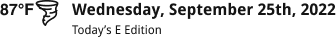

# Weather Bug

**Component · 2 variants** · Menus and Parts · source: WordPress Elements ▸ Menus and Parts

**Designer notes on the canvas:**

- Weather Bug Mobile (Section Menu),    Desktop (Masthead)

## Figma references

- File: WordPress Elements (`b1iZxkFwtAYq9rElmnCAzd`) · Page: Menus and Parts · Frame path: Frame 12800 ▸ Frame 416 ▸ Frame 11820 ▸ Main Container ▸ Push Nav Section Menu ▸ Frame 12802 ▸ Frame 12803
- Main: [Weather Bug](https://www.figma.com/design/b1iZxkFwtAYq9rElmnCAzd/?node-id=654-10020) · node `654:10020` · key `edece4e844bea8a8dd7526e6e39df1d00a56ad72`

| Variant | Node | Key | Size | Preview |
|---|---|---|---|---|
| Location=SectionMenu | [654:10019](https://www.figma.com/design/b1iZxkFwtAYq9rElmnCAzd/?node-id=654-10019) | e370385ba0c9a90d739a7f5bffa9cf83bceed0b0 | 300×80 |  |
| Location=Masthead | [653:5076](https://www.figma.com/design/b1iZxkFwtAYq9rElmnCAzd/?node-id=653-5076) | 66512bfbd9aae46b5ef77a75ab72cfd0e23305fd | 336×37 |  |

## Properties

| Property | Type | Default | Options |
|---|---|---|---|
| Location | VARIANT | SectionMenu | SectionMenu, Masthead |

## Where it is used

- **Location=SectionMenu** — breakpoints: —; nested inside: SectionMenuItem / leftIcon=no, withSubItems=no, View=default, kind=Weather ×1
- **Location=Masthead** — breakpoints: 1100, 1280; templates (direct): Desktop HomePage ×1, 1100 HomePage ×1; templates (via assembly): Desktop HomePage (via Masthead), 1100 HomePage (via Masthead); nested inside: Masthead/desktop/DefaultAdFree/SectionFront ×4, Masthead / Device=XL-Desktop (≥1040px), State=AdFree, Page=SectionFront ×2, Masthead / Device=XL-Desktop (≥1040px), State=Default, Page=Dashboard ×1, Masthead/desktop/default/article ×1, Masthead / Device=XL-Desktop (≥1040px), State=Default, Page=Article ×1, Masthead/tabletH/DefaultAdFree/home ×2, Masthead / Device=XL-Desktop (≥1040px), State=Default, Page=SectionFront ×1, Masthead / Device=XL-Desktop (≥1040px), State=AdFree, Page=Article ×2, Masthead / Device=XL-Desktop (≥1040px), State=AdFree, Page=Home ×2, Masthead/tabletH/default/home ×1, Masthead / Device=XL-Desktop (≥1040px), State=Default, Page=Home ×1; other pages: Menus and Parts ▸ Frame 12800 ×13

## Breakpoints

| Key | Viewport | Variant(s) |
|---|---|---|
| 340 | ≤639px (XS-Fold, built 340) | — |
| 360 | ≤639px (SM-Mobile, built 360) | — |
| 768 | 640–799px (MD-TabletV) | — |
| 1024 | 800–1039px (LG-TabletH, built 1009) | — |
| 1100 | ≥1040px (XL-Desktop, built 1085) | Location=Masthead |
| 1280 | ≥1040px (XL-Desktop, built 1280) | Location=Masthead |

## Responsive rules

- Location=SectionMenu: 300×80, horizontal gap 12 pad 8/16/8/16 main MIN cross CENTER — renders at (no breakpoint evidence)
- Location=Masthead: 336×37, horizontal gap 12 pad 0/0/0/0 main MIN cross MIN — renders at 1100, 1280

## Dependencies

**Built from:**

- tornado ×2 _(not in this export)_

**Built into:**

- [SectionMenuItem](../../assemblies/32-sectionmenuitem/sectionmenuitem.md)
- [Masthead](../../assemblies/36-masthead/masthead.md)

## Anatomy

**Location=SectionMenu**

```
- Location=SectionMenu — component 300×80 [horizontal gap 12] (fixed/fixed)
  - Frame 75 — frame 60×26 [horizontal gap 0] (hug/hug)
    - 87°F — text 34×18 (hug/hug) "87°F"
    - tornado — instance 26×26 (fixed/fixed) → tornado
  - Frame 37 — frame 196×64 [vertical gap 8] (fill/hug)
    - Wednesday, September 25th, 2025 — text 196×40 (fill/hug) "Wednesday, September 25th, 2025"
    - Today’s E Edition — text 94×16 (hug/hug) "Today’s E Edition"
```

**Location=Masthead**

```
- Location=Masthead — component 336×37 [horizontal gap 12] (hug/hug)
  - Frame 75 — frame 60×26 [horizontal gap 0] (hug/hug)
    - 87°F — text 34×18 (hug/hug) "87°F"
    - tornado — instance 26×26 (fixed/fixed) → tornado
  - Frame 37 — frame 264×37 [vertical gap 4] (hug/hug)
    - Wednesday, September 25th, 2022 — text 264×19 (hug/hug) "Wednesday, September 25th, 2022"
    - Today’s E Edition — text 90×14 (hug/hug) "Today’s E Edition"
```

## Size & layout

| Variant | Size | Width | Height | Auto-layout | Radius | Clip |
|---|---|---|---|---|---|---|
| Location=SectionMenu | 300×80 | FIXED | FIXED | horizontal gap 12 pad 8/16/8/16 main MIN cross CENTER |  |  |
| Location=Masthead | 336×37 | HUG | HUG | horizontal gap 12 pad 0/0/0/0 main MIN cross MIN |  |  |

## Typography

| Layer | Font | Weight | Size | Line height | Letter sp. | Case | Color | Token | Truncate | Sample |
|---|---|---|---|---|---|---|---|---|---|---|
| 87°F | Helvetica | Bold | 16 | auto |  | TITLE | #141414 | Colors/color/gray/min |  | 87°F |
| Wednesday, September 25th, 2025 | Noto Sans | Bold | 15 | auto |  | TITLE | #141414 | Colors/color/gray/min |  | Wednesday, September 25th, 2025 |
| Today’s E Edition | Noto Sans | Regular | 12 | auto |  | TITLE | #141414 | Colors/color/gray/min |  | Today’s E Edition |
| Wednesday, September 25th, 2022 | Droid Sans | Bold | 16 | auto |  | TITLE | #141414 | Colors/color/gray/min |  | Wednesday, September 25th, 2022 |
| Today’s E Edition | Droid Sans | Regular | 12 | auto |  | TITLE | #141414 | Colors/color/gray/min |  | Today’s E Edition |

## Color & effects

| Layer | Role | Type | Hex | Token | Opacity | Note |
|---|---|---|---|---|---|---|
| Location=SectionMenu | fill | SOLID | #FFFFFF | Colors/color/gray/max |  |  |
| Location=Masthead | fill | SOLID | #FFFFFF | Colors/color/gray/max |  |  |

## Image ratios

_None._

## Ad slots

_None._

## Production references

_None found in descriptions or layer names._

## Known issues

- `Location=SectionMenu`: fonts outside the production pair (Noto Sans / Noto Serif): Helvetica Bold ×1.
- `Location=Masthead`: fonts outside the production pair (Noto Sans / Noto Serif): Helvetica Bold ×1, Droid Sans Bold ×1, Droid Sans Regular ×1.

## Rendering steps

1. Pick the variant for the target breakpoint from the Breakpoints table (property values in `weather-bug.json` → `variants[].variantProperties`).
2. Start from `weather-bug.html` — each `<section>` is one variant; auto-layout is already mapped to flexbox and colors use `tokens.css` variables.
3. Replace every dashed `data-component` box with the referenced component's own skeleton (links under Dependencies); leave `data-component` on the wrapper.
4. Fill image slots at the ratio listed in Image ratios; fill text using the Typography table (truncate where a line clamp is listed).
5. Check against the preview PNG, then against the production references.
