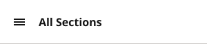
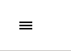
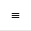
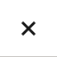

# SectionMenuHeader

**Component · 6 variants** · Menus and Parts · source: WordPress Elements ▸ Menus and Parts

**Designer notes on the canvas:**

- Section Menu Header
- Section Menu Items
- Push Nav Menu (Left side)

## Figma references

- File: WordPress Elements (`b1iZxkFwtAYq9rElmnCAzd`) · Page: Menus and Parts · Frame path: Frame 12800 ▸ Frame 416 ▸ Frame 11820 ▸ Main Container ▸ Push Nav Section Menu ▸ Container
- Main: [SectionMenuHeader](https://www.figma.com/design/b1iZxkFwtAYq9rElmnCAzd/?node-id=456-5745) · node `456:5745` · key `ad45b9c389008fe7779922f2aba36ad0a34bb070`

| Variant | Node | Key | Size | Preview |
|---|---|---|---|---|
| View=Closed, Device=Desktop | [456:5746](https://www.figma.com/design/b1iZxkFwtAYq9rElmnCAzd/?node-id=456-5746) | e47d32e793db27396cd048d87cd12ca17f9b9259 | 300×64 |  |
| View=Open, Device=Desktop | [456:5752](https://www.figma.com/design/b1iZxkFwtAYq9rElmnCAzd/?node-id=456-5752) | a2b7065130555a8c34b11d4099231e87e2369a43 | 300×64 |  |
| View=Closed, Device=TabletV | [456:5759](https://www.figma.com/design/b1iZxkFwtAYq9rElmnCAzd/?node-id=456-5759) | acdecabfa67a729c645c51c898019bd08c001d1e | 88×64 |  |
| View=Open, Device=TabletV | [456:5764](https://www.figma.com/design/b1iZxkFwtAYq9rElmnCAzd/?node-id=456-5764) | d97053538448a3a3a0b8029baf0468e13790d396 | 88×64 |  |
| View=Closed, Device=Mobile | [456:5769](https://www.figma.com/design/b1iZxkFwtAYq9rElmnCAzd/?node-id=456-5769) | d98d2fdd52df8b973eadcbc4a765960c6398159c | 64×64 |  |
| View=Open, Device=Mobile | [456:5774](https://www.figma.com/design/b1iZxkFwtAYq9rElmnCAzd/?node-id=456-5774) | 262f2dadb4af7bbb8d6d8859b6898a884b9ad372 | 64×64 |  |

## Properties

| Property | Type | Default | Options |
|---|---|---|---|
| View | VARIANT | Closed | Closed, Open |
| Device | VARIANT | Desktop | Desktop, Mobile, TabletV |

## Where it is used

- **View=Closed, Device=Desktop** — breakpoints: 1024, 1100, 1280; templates (via assembly): 1024 HomePage (via SectionMenu), 1100 HomePage (via SectionMenu), Desktop HomePage (via SectionMenu); nested inside: SectionMenu / View=Closed, Device=XL-Desktop, UserType=all ×1, SectionMenu / View=Closed, Device=LG-TabletH, UserType=all ×1
- **View=Open, Device=Desktop** — breakpoints: 1024, 1100, 1280; nested inside: SectionMenu / View=Open, Device=LG-TabletH, UserType=subscriber ×1, SectionMenu / View=Open, Device=XL-Desktop, UserType=nonSub ×1, SectionMenu / View=Open, Device=LG-TabletH, UserType=nonSub ×1, SectionMenu / View=Open, Device=XL-Desktop, UserType=subscriber ×1
- **View=Closed, Device=TabletV** — breakpoints: 340, 360, 768; templates (via assembly): 340 HomePage (via SectionMenu), Mobile HomePage (via SectionMenu), 768 HomePage (via SectionMenu); nested inside: SectionMenu / View=Closed, Device=SM-Mobile, UserType=all ×1, SectionMenu / View=Closed, Device=MD-TabletV, UserType=all ×1, SectionMenu / View=Closed, Device=XS-Fold, UserType=all ×1
- **View=Open, Device=TabletV** — breakpoints: 768; no instances found
- **View=Closed, Device=Mobile** — breakpoints: 340, 360; no instances found
- **View=Open, Device=Mobile** — breakpoints: 340, 360; nested inside: SectionMenu/Open/MD-TabletV/subscriber ×1, SectionMenu / View=Open, Device=MD-TabletV, UserType=subscriber ×1, SectionMenu/Open/MD-TabletV/nonSub ×1, SectionMenu / View=Open, Device=XS-Fold, UserType=subscriber ×1, SectionMenu / View=Open, Device=XS-Fold, UserType=nonSub ×1, SectionMenu / View=Open, Device=MD-TabletV, UserType=nonSub ×1, SectionMenu / View=Open, Device=SM-Mobile, UserType=nonSub ×1, SectionMenu / View=Open, Device=SM-Mobile, UserType=subscriber ×1

## Breakpoints

| Key | Viewport | Variant(s) |
|---|---|---|
| 340 | ≤639px (XS-Fold, built 340) | View=Closed, Device=TabletV, View=Closed, Device=Mobile, View=Open, Device=Mobile |
| 360 | ≤639px (SM-Mobile, built 360) | View=Closed, Device=TabletV, View=Closed, Device=Mobile, View=Open, Device=Mobile |
| 768 | 640–799px (MD-TabletV) | View=Closed, Device=TabletV, View=Open, Device=TabletV |
| 1024 | 800–1039px (LG-TabletH, built 1009) | View=Closed, Device=Desktop, View=Open, Device=Desktop |
| 1100 | ≥1040px (XL-Desktop, built 1085) | View=Closed, Device=Desktop, View=Open, Device=Desktop |
| 1280 | ≥1040px (XL-Desktop, built 1280) | View=Closed, Device=Desktop, View=Open, Device=Desktop |

## Responsive rules

- View=Closed, Device=Desktop: 300×64, vertical gap 0 pad 0/0/0/0 main MIN cross MIN — renders at 1024, 1100, 1280
- View=Open, Device=Desktop: 300×64, vertical gap 0 pad 0/0/0/0 main MIN cross MIN — renders at 1024, 1100, 1280
- View=Closed, Device=TabletV: 88×64, vertical gap 0 pad 0/0/0/0 main CENTER cross MIN — renders at 340, 360, 768
- View=Open, Device=TabletV: 88×64, vertical gap 0 pad 0/0/0/0 main CENTER cross MIN — renders at 768
- View=Closed, Device=Mobile: 64×64, vertical gap 0 pad 0/0/0/0 main CENTER cross MIN — renders at 340, 360
- View=Open, Device=Mobile: 64×64, vertical gap 0 pad 0/0/0/0 main CENTER cross MIN — renders at 340, 360

## Dependencies

**Built from:**

- Icons ×6 _(not in this export)_

**Built into:**

- [SectionMenu](../../assemblies/34-sectionmenu/sectionmenu.md)

## Anatomy

**View=Closed, Device=Desktop**

```
- View=Closed, Device=Desktop — component 300×64 [vertical gap 0] (fixed/fixed)
  - Container — frame 300×64 [horizontal gap 8] (fill/fixed)
    - Container — frame 40×40 [horizontal gap 8] (fixed/fixed)
      - Icons — instance 16×16 [vertical gap 8] (fixed/fixed) → Icons [Name=menu7]
    - Title — text 92×22 (hug/hug) "All Sections"
  - Line 10 — line 300×0 (fill/fixed)
```

**View=Open, Device=Desktop**

```
- View=Open, Device=Desktop — component 300×64 [vertical gap 0] (fixed/fixed)
  - Container — frame 300×64 [horizontal gap 8] (fill/fixed)
    - Container — frame 40×40 [horizontal gap 8] (fixed/fixed)
      - Container — frame 40×40 [horizontal gap 8] (fixed/fixed)
        - Icons — instance 16×16 [horizontal gap 8] (fixed/fixed) → Icons [Name=close]
    - Title — text 92×22 (hug/hug) "All Sections"
  - Line 10 — line 300×0 (fill/fixed)
```

**View=Closed, Device=TabletV**

```
- View=Closed, Device=TabletV — component 88×64 [vertical gap 0] (fixed/fixed)
  - Container — frame 64×64 [horizontal gap 8] (fixed/fill)
    - Container — frame 40×40 [horizontal gap 8] (fixed/fixed)
      - Icons — instance 16×16 [vertical gap 8] (fixed/fixed) → Icons [Name=menu7]
  - Line 10 — line 88×0 (fill/fixed)
```

**View=Open, Device=TabletV**

```
- View=Open, Device=TabletV — component 88×64 [vertical gap 0] (fixed/fixed)
  - Container — frame 64×64 [horizontal gap 8] (fixed/fill)
    - Container — frame 40×40 [horizontal gap 8] (fixed/fixed)
      - Icons — instance 16×16 [horizontal gap 8] (fixed/fixed) → Icons [Name=close]
  - Line 10 — line 88×0 (fill/fixed)
```

**View=Closed, Device=Mobile**

```
- View=Closed, Device=Mobile — component 64×64 [vertical gap 0] (fixed/fixed)
  - Container — frame 64×64 [horizontal gap 8] (fill/fill)
    - Container — frame 40×40 [horizontal gap 8] (fixed/fixed)
      - Icons — instance 16×16 [vertical gap 8] (fixed/fixed) → Icons [Name=menu7]
  - Line 10 — line 64×0 (fill/fixed)
```

**View=Open, Device=Mobile**

```
- View=Open, Device=Mobile — component 64×64 [vertical gap 0] (fixed/fixed)
  - Container — frame 64×64 [horizontal gap 8] (fill/fill)
    - Container — frame 40×40 [horizontal gap 8] (fixed/fixed)
      - Icons — instance 16×16 [horizontal gap 8] (fixed/fixed) → Icons [Name=close]
  - Line 10 — line 64×0 (fill/fixed)
```

## Size & layout

| Variant | Size | Width | Height | Auto-layout | Radius | Clip |
|---|---|---|---|---|---|---|
| View=Closed, Device=Desktop | 300×64 | FIXED | FIXED | vertical gap 0 pad 0/0/0/0 main MIN cross MIN |  |  |
| View=Open, Device=Desktop | 300×64 | FIXED | FIXED | vertical gap 0 pad 0/0/0/0 main MIN cross MIN |  |  |
| View=Closed, Device=TabletV | 88×64 | FIXED | FIXED | vertical gap 0 pad 0/0/0/0 main CENTER cross MIN |  |  |
| View=Open, Device=TabletV | 88×64 | FIXED | FIXED | vertical gap 0 pad 0/0/0/0 main CENTER cross MIN |  |  |
| View=Closed, Device=Mobile | 64×64 | FIXED | FIXED | vertical gap 0 pad 0/0/0/0 main CENTER cross MIN |  |  |
| View=Open, Device=Mobile | 64×64 | FIXED | FIXED | vertical gap 0 pad 0/0/0/0 main CENTER cross MIN |  |  |

## Typography

| Layer | Font | Weight | Size | Line height | Letter sp. | Case | Color | Token | Truncate | Sample |
|---|---|---|---|---|---|---|---|---|---|---|
| Title | Noto Sans | Bold | 16 | auto |  | TITLE | #141414 | Colors/color/gray/min |  | All Sections |

## Color & effects

| Layer | Role | Type | Hex | Token | Opacity | Note |
|---|---|---|---|---|---|---|
| View=Closed, Device=Desktop | fill | SOLID | #FFFFFF | Colors/color/gray/max |  |  |
| Line 10 | stroke | SOLID | #CCCAC7 | Colors/color/gray/500 |  |  |
| View=Open, Device=Desktop | fill | SOLID | #FFFFFF | Colors/color/gray/max |  |  |
| View=Closed, Device=TabletV | fill | SOLID | #FFFFFF | Colors/color/gray/max |  |  |
| View=Open, Device=TabletV | fill | SOLID | #FFFFFF | Colors/color/gray/max |  |  |
| View=Closed, Device=Mobile | fill | SOLID | #FFFFFF | Colors/color/gray/max |  |  |
| View=Open, Device=Mobile | fill | SOLID | #FFFFFF | Colors/color/gray/max |  |  |

## Image ratios

_None._

## Ad slots

_None._

## Production references

_None found in descriptions or layer names._

## Known issues

- 2 of 6 variants have no instances anywhere in WordPress Elements (unused, or used only from another file): `View=Open, Device=TabletV`, `View=Closed, Device=Mobile`.
- `View=Closed, Device=TabletV` is declared for 768 but is placed in template(s) at 340, 360 — check the variant choice.

## Rendering steps

1. Pick the variant for the target breakpoint from the Breakpoints table (property values in `sectionmenuheader.json` → `variants[].variantProperties`).
2. Start from `sectionmenuheader.html` — each `<section>` is one variant; auto-layout is already mapped to flexbox and colors use `tokens.css` variables.
3. Replace every dashed `data-component` box with the referenced component's own skeleton (links under Dependencies); leave `data-component` on the wrapper.
4. Fill image slots at the ratio listed in Image ratios; fill text using the Typography table (truncate where a line clamp is listed).
5. Check against the preview PNG, then against the production references.
