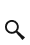
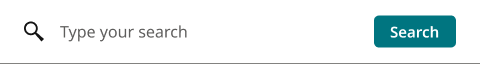

# SearchBar

**Component · 2 variants** · Menus and Parts · source: WordPress Elements ▸ Menus and Parts

**Designer notes on the canvas:**

- Search Button/Bar

## Figma references

- File: WordPress Elements (`b1iZxkFwtAYq9rElmnCAzd`) · Page: Menus and Parts · Frame path: Frame 12800 ▸ Frame 416 ▸ Frame 11820 ▸ Frame 12776 ▸ Container ▸ Container ▸ Search Bar
- Main: [SearchBar](https://www.figma.com/design/b1iZxkFwtAYq9rElmnCAzd/?node-id=456-5910) · node `456:5910` · key `408765eef4ffc037695dd7789e51f02a61120df8`

| Variant | Node | Key | Size | Preview |
|---|---|---|---|---|
| Status=Default | [456:5911](https://www.figma.com/design/b1iZxkFwtAYq9rElmnCAzd/?node-id=456-5911) | 3d326c287e04d37f8c57edebde7de609a5d8bb61 | 30×45 |  |
| Status=Open | [456:5913](https://www.figma.com/design/b1iZxkFwtAYq9rElmnCAzd/?node-id=456-5913) | 64e93e7b5ff0580469dcf20dc11aff65ed33b30d | 480×64 |  |

## Properties

| Property | Type | Default | Options |
|---|---|---|---|
| Status | VARIANT | Default | Default, Open |

## Where it is used

- **Status=Default** — breakpoints: —; nested inside: AccountMenu / Status=loggedIn, View=Open, Device=SM-Mobile, UserType=PremSub ×1, AccountMenu / Status=alert, View=Open, Device=MD-TabletV, UserType=PremSub ×1, AccountMenu / Status=loggedIn, View=Open, Device=SM-Mobile, UserType=nonSub ×1, AccountMenu / Status=loggedIn, View=Open, Device=XL-Desktop, UserType=PremSub ×1, AccountMenu / Status=loggedIn, View=Open, Device=XL-Desktop, UserType=groupSub ×1, AccountMenu / Status=alert, View=Open, Device=XS-Fold, UserType=PremSub ×1, AccountMenu / Status=loggedIn, View=Closed, Device=XL-Desktop, UserType=loggedIn ×1, AccountMenu / Status=loggedIn, View=Open, Device=XL-Desktop, UserType=nonSub ×1, AccountMenu / Status=loggedIn, View=Open, Device=XL-Desktop, UserType=GroupAnon ×1, AccountMenu / Status=loggedIn, View=Open, Device=XL-Desktop, UserType=BasicSub ×1, AccountMenu / Status=loggedOut, View=Closed, Device=XL-Desktop, UserType=loggedOut ×1, AccountMenu / Status=loggedOut, View=Closed, Device=SM-Mobile, UserType=loggedOut ×1, AccountMenu / Status=loggedIn, View=Closed, Device=MD-TabletV, UserType=loggedIn ×1, AccountMenu / Status=alert, View=Open, Device=SM-Mobile, UserType=PremSub ×1, AccountMenu/loggedIn/Closed/MD-TabletV/loggedIn ×1, AccountMenu / Status=loggedIn, View=Closed, Device=SM-Mobile, UserType=loggedIn ×1, AccountMenu / Status=loggedOut, View=Closed, Device=MD-TabletV, UserType=loggedOut ×1, AccountMenu / Status=alert, View=Open, Device=XL-Desktop, UserType=PremSub ×1, AccountMenu / Status=loggedOut, View=Closed, Device=LG-TabletH, UserType=loggedOut ×1, AccountMenu / Status=loggedIn, View=Closed, Device=LG-TabletH, UserType=loggedIn ×1; other pages: null ▸ null ×88, Menus and Parts ▸ Frame 12800 ×12
- **Status=Open** — breakpoints: —; no instances in this file

## Breakpoints

| Key | Viewport | Variant(s) |
|---|---|---|
| — | not placed in any homepage template | — |

## Responsive rules

- Status=Default: 30×45, horizontal gap 8 pad 20/0/5/0 main CENTER cross CENTER — no breakpoint (not placed in a template)
- Status=Open: 480×64, horizontal gap 16 pad 16/24/16/24 main MIN cross CENTER — no breakpoint (not placed in a template)

## Dependencies

**Built from:**

- Icons ×1 _(not in this export)_

**Built into:**

_Not used inside another exported item._

## Anatomy

**Status=Default**

```
- Status=Default — component 30×45 [horizontal gap 8] (fixed/hug)
  - Icons — instance 20×20 [horizontal gap 8] (fixed/fixed) → Icons [Name=search]
```

**Status=Open**

```
- Status=Open — component 480×64 [horizontal gap 16] (fixed/fixed)
  - Icons — instance 20×20 [horizontal gap 8] (fixed/fixed) → Icons [Name=search]
  - Type your search — text 298×32 (fill/fixed) "Type your search"
  - Search Button — frame 82×32 [horizontal gap 0] (hug/hug)
    - Search — text 50×20 (hug/hug) "Search"
```

## Size & layout

| Variant | Size | Width | Height | Auto-layout | Radius | Clip |
|---|---|---|---|---|---|---|
| Status=Default | 30×45 | FIXED | HUG | horizontal gap 8 pad 20/0/5/0 main CENTER cross CENTER |  | yes |
| Status=Open | 480×64 | FIXED | FIXED | horizontal gap 16 pad 16/24/16/24 main MIN cross CENTER |  | yes |

## Typography

| Layer | Font | Weight | Size | Line height | Letter sp. | Case | Color | Color token | Type token | Truncate | Sample | Variants |
|---|---|---|---|---|---|---|---|---|---|---|---|---|
| Type your search | Noto Sans | Regular | 16 | auto |  |  | #5E5D5C | Colors/color/gray/200 |  |  | Type your search | Status=Open |
| Search | Noto Sans | SemiBold | 15 | auto |  |  | #FFFFFF | Colors/color/gray/max |  |  | Search | Status=Open |

## Color & effects

| Layer | Role | Type | Hex | Token | Opacity | Note |
|---|---|---|---|---|---|---|
| Status=Default | fill | SOLID | #FFFFFF | Colors/color/gray/max |  |  |
| Status=Open | fill | SOLID | #FFFFFF | Colors/color/gray/max |  |  |
| Status=Open | stroke | SOLID | #838280 | Colors/color/gray/300 |  |  |
| Search Button | fill | SOLID | #007580 | Colors/color/theme/primary |  |  |

## Image ratios

_None._

## Ad slots

_None._

## Production references

_None found in descriptions or layer names._

## Known issues

- 1 of 2 variants have no instances anywhere in WordPress Elements (unused, or used only from another file): `Status=Open`.

## Rendering steps

1. Pick the variant for the target breakpoint from the Breakpoints table (property values in `searchbar.json` → `variants[].variantProperties`).
2. Start from `searchbar.html` — each `<section>` is one variant; auto-layout is already mapped to flexbox and colors use `tokens.css` variables.
3. Replace every dashed `data-component` box with the referenced component's own skeleton (links under Dependencies); leave `data-component` on the wrapper.
4. Fill image slots at the ratio listed in Image ratios; fill text using the Typography table (truncate where a line clamp is listed).
5. Check against the preview PNG, then against the production references.
