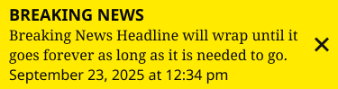

# Breaking News Banner

**Component · 3 variants** · Menus and Parts · source: WordPress Elements ▸ Menus and Parts

**Designer notes on the canvas:**

- Breaking News Banner — Responsive Breakpoints

## Figma references

- File: WordPress Elements (`b1iZxkFwtAYq9rElmnCAzd`) · Page: Menus and Parts · Frame path: Frame 12800 ▸ Frame 416 ▸ Frame 12804
- Main: [Breaking News Banner](https://www.figma.com/design/b1iZxkFwtAYq9rElmnCAzd/?node-id=506-5632) · node `506:5632` · key `fac66df253d4a1f179dbe7a4229be9f3dadd7a46`

| Variant | Node | Key | Size | Preview |
|---|---|---|---|---|
| Property 1=Mobile | [538:5932](https://www.figma.com/design/b1iZxkFwtAYq9rElmnCAzd/?node-id=538-5932) | d7086886f23704ca68569620e50dfad015544b54 | 375×99 |  |
| Property 1=Tablet | [3477:63041](https://www.figma.com/design/b1iZxkFwtAYq9rElmnCAzd/?node-id=3477-63041) | 47f13036170d46216df4ae6d653ea59d70e2fd2e | 768×77 |  |
| Property 1=Desktop | [506:5623](https://www.figma.com/design/b1iZxkFwtAYq9rElmnCAzd/?node-id=506-5623) | 1183d89f870acf2e091372d2da8a6323ce7a140f | 1200×33 |  |

## Properties

| Property | Type | Default | Options |
|---|---|---|---|
| Property 1 | VARIANT | Mobile | Desktop, Mobile, Tablet |

## Where it is used

- **Property 1=Mobile** — breakpoints: 340, 360; templates (direct): Mobile HomePage ×1, 340 HomePage ×1; other pages: Section Front ▸ Frame 11639 ×2
- **Property 1=Tablet** — breakpoints: 768; templates (direct): 768 HomePage ×1
- **Property 1=Desktop** — breakpoints: 1024, 1100, 1280; templates (direct): Desktop HomePage ×1, 1024 HomePage ×1, 1100 HomePage ×1; other pages: Section Front ▸ Frame 11639 ×2, Article Page ▸ Frame 11672 ×2

## Breakpoints

| Key | Viewport | Variant(s) |
|---|---|---|
| 340 | ≤639px (XS-Fold, built 340) | Property 1=Mobile |
| 360 | ≤639px (SM-Mobile, built 360) | Property 1=Mobile |
| 768 | 640–799px (MD-TabletV) | Property 1=Tablet |
| 1024 | 800–1039px (LG-TabletH, built 1009) | Property 1=Desktop |
| 1100 | ≥1040px (XL-Desktop, built 1085) | Property 1=Desktop |
| 1280 | ≥1040px (XL-Desktop, built 1280) | Property 1=Desktop |

## Responsive rules

- Property 1=Mobile: 375×99, horizontal gap 12 pad 0/0/0/0 main MIN cross MIN — renders at 340, 360
- Property 1=Tablet: 768×77, horizontal gap 12 pad 0/0/0/0 main MIN cross MIN — renders at 768
- Property 1=Desktop: 1200×33, horizontal gap 0 pad 0/0/0/0 main CENTER cross MIN — renders at 1024, 1100, 1280

## Dependencies

**Built from:**

- Icons ×1 _(not in this export)_

**Built into:**

_Not used inside another exported item._

## Anatomy

**Property 1=Mobile**

```
- Property 1=Mobile — component 375×99 [horizontal gap 12] (fixed/hug)
  - Breaking News Banner — frame 375×99 [horizontal gap 12] (fill/hug)
    - Content — frame 327×89 [vertical gap 0] (fill/hug)
      - Title — frame 150×23 [horizontal gap 8] (hug/hug)
        - Breaking News — text 150×23 (hug/hug) "Breaking News"
      - Body — frame 327×44 [horizontal gap 8] (fill/hug)
        - Breaking News Headline will wrap until it goes forever as long as it is needed to go. — text 327×44 (fill/hug) "Breaking News Headline will wrap until i"
      - September 23, 2025 at 12:34 pm — text 244×22 (hug/hug) "September 23, 2025 at 12:34 pm"
    - Icons — instance 16×16 [horizontal gap 8] (fixed/fixed) → Icons [Name=close]
```

**Property 1=Tablet**

```
- Property 1=Tablet — component 768×77 [horizontal gap 12] (fixed/hug)
  - Breaking News Banner — frame 768×77 [horizontal gap 12] (fill/hug)
    - Content — frame 720×67 [vertical gap 0] (fill/hug)
      - Title — frame 150×23 [horizontal gap 8] (hug/hug)
        - Breaking News — text 150×23 (hug/hug) "Breaking News"
      - Body — frame 720×22 [horizontal gap 8] (fill/hug)
        - Breaking News Headline will wrap until it goes forever as long as it is needed to go. — text 720×22 (fill/hug) "Breaking News Headline will wrap until i"
      - September 23, 2025 at 12:34 pm — text 244×22 (hug/hug) "September 23, 2025 at 12:34 pm"
    - Icons — instance 16×16 [horizontal gap 8] (fixed/fixed) → Icons [Name=close]
```

**Property 1=Desktop**

```
- Property 1=Desktop — component 1200×33 [horizontal gap 0] (fill/hug)
  - Breaking News Banner — frame 1200×33 [horizontal gap 12] (fixed/hug)
    - Content — frame 615×23 [horizontal gap 16] (hug/hug)
      - Title — frame 150×23 [horizontal gap 8] (hug/hug)
        - Breaking News — text 150×23 (hug/hug) "Breaking News"
      - Body — frame 189×22 [horizontal gap 8] (hug/hug)
        - Breaking News Headline — text 189×22 (hug/hug) "Breaking News Headline"
      - Body — frame 244×22 [horizontal gap 8] (hug/hug)
        - September 23, 2025 at 12:34 pm — text 244×22 (hug/hug) "September 23, 2025 at 12:34 pm"
    - Icons — instance 16×16 [horizontal gap 8] (fixed/fixed) → Icons [Name=close]
```

## Size & layout

| Variant | Size | Width | Height | Auto-layout | Radius | Clip |
|---|---|---|---|---|---|---|
| Property 1=Mobile | 375×99 | FIXED | HUG | horizontal gap 12 pad 0/0/0/0 main MIN cross MIN |  |  |
| Property 1=Tablet | 768×77 | FIXED | HUG | horizontal gap 12 pad 0/0/0/0 main MIN cross MIN |  |  |
| Property 1=Desktop | 1200×33 | FILL | HUG | horizontal gap 0 pad 0/0/0/0 main CENTER cross MIN |  |  |

## Typography

| Layer | Font | Weight | Size | Line height | Letter sp. | Case | Color | Color token | Type token | Truncate | Sample | Variants |
|---|---|---|---|---|---|---|---|---|---|---|---|---|
| Breaking News | Noto Sans | Bold | 18 | 22.65px |  | UPPER | #0A0908 | Colors/color/theme/near-black |  |  | Breaking News | all |
| Breaking News Headline will wrap until it goes forever as lo | Noto Serif | Regular | 16 | auto |  |  | #0A0908 | Colors/color/theme/near-black |  |  | Breaking News Headline will wrap until it goes for | Property 1=Mobile, Property 1=Tablet |
| September 23, 2025 at 12:34 pm | Noto Sans | Regular | 16 | auto |  |  | #0A0908 | Colors/color/theme/near-black |  |  | September 23, 2025 at 12:34 pm | all |
| Breaking News Headline | Noto Serif | Regular | 16 | auto |  |  | #0A0908 | Colors/color/theme/near-black |  |  | Breaking News Headline | Property 1=Desktop |

## Color & effects

| Layer | Role | Type | Hex | Token | Opacity | Note |
|---|---|---|---|---|---|---|
| Breaking News Banner | fill | SOLID | #FFEA00 | Colors/color/theme/secondary |  |  |

## Image ratios

_None._

## Ad slots

_None._

## Production references

_None found in descriptions or layer names._

## Known issues

_None detected._

## Rendering steps

1. Pick the variant for the target breakpoint from the Breakpoints table (property values in `breaking-news-banner.json` → `variants[].variantProperties`).
2. Start from `breaking-news-banner.html` — each `<section>` is one variant; auto-layout is already mapped to flexbox and colors use `tokens.css` variables.
3. Replace every dashed `data-component` box with the referenced component's own skeleton (links under Dependencies); leave `data-component` on the wrapper.
4. Fill image slots at the ratio listed in Image ratios; fill text using the Typography table (truncate where a line clamp is listed).
5. Check against the preview PNG, then against the production references.
