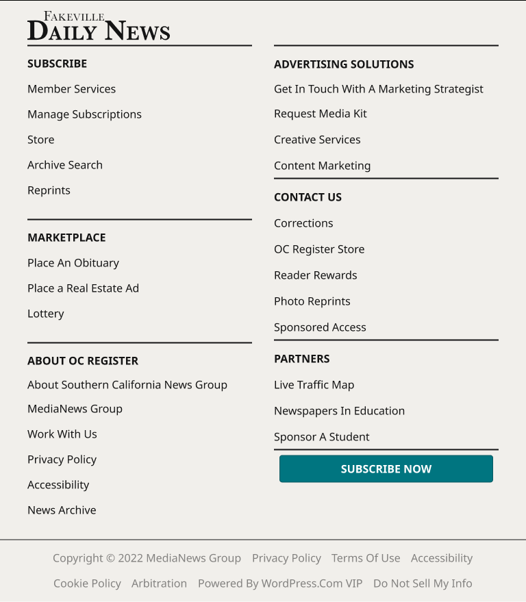
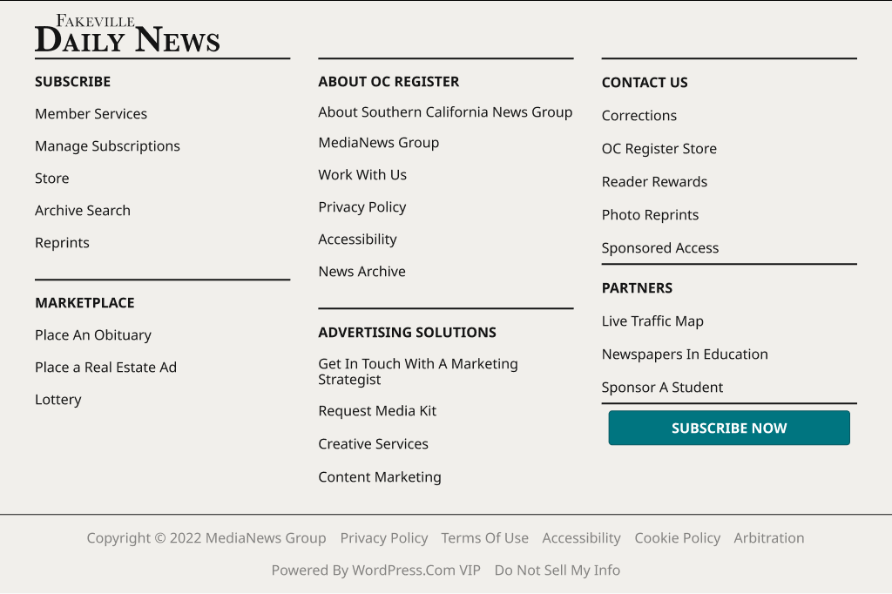
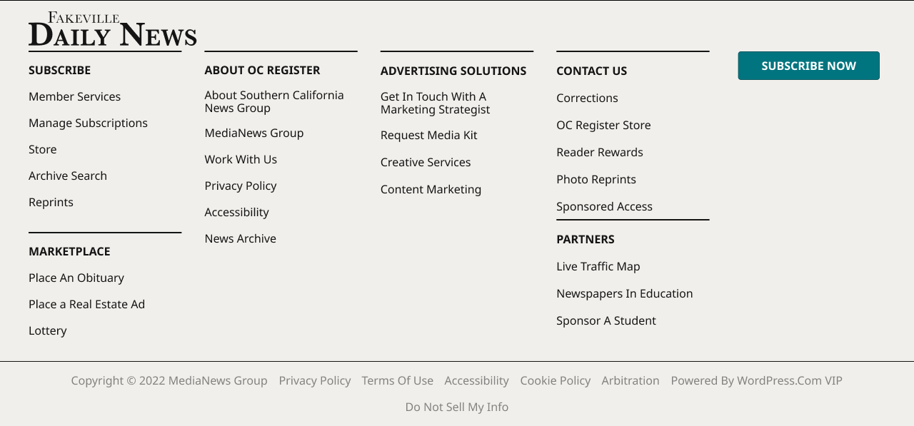

# Footer

**Component · 5 variants** · Menus and Parts · source: WordPress Elements ▸ Menus and Parts

> Footer — breakpoints audited against ocregister.com production CSS (2026-09-18). Real production has 4 responsive states at 640px, 800px, and 1040px; 340/360 are fixed minimum-width variants kept regardless of production per design-system requirement. Columns use a masonry fill (top-to-bottom, wrap when the next item would exceed the tier's max-height) matching the live site, not a simple row-wrap grid.

**Designer notes on the canvas:**

- Footer Menu (Bottom of page) CURRENT

## Figma references

- File: WordPress Elements (`b1iZxkFwtAYq9rElmnCAzd`) · Page: Menus and Parts · Frame path: Frame 12800 ▸ Frame 416 ▸ Frame 415 ▸ Frame 12774
- Main: [Footer](https://www.figma.com/design/b1iZxkFwtAYq9rElmnCAzd/?node-id=354-1282) · node `354:1282` · key `9d3371e98d00532989e69d29025b4d6193a60848`

| Variant | Node | Key | Size | Preview |
|---|---|---|---|---|
| Device=XS-Fold | [422:522](https://www.figma.com/design/b1iZxkFwtAYq9rElmnCAzd/?node-id=422-522) | fea894828d72d78f8b5a18726d67e9fa9ce1490a | 340×871 |  |
| Device=SM-Mobile | [354:1199](https://www.figma.com/design/b1iZxkFwtAYq9rElmnCAzd/?node-id=354-1199) | 8ee7676b56de9422e1007c69cf2a0f5b48971e1a | 360×871 |  |
| Device=MD-TabletV | [354:1106](https://www.figma.com/design/b1iZxkFwtAYq9rElmnCAzd/?node-id=354-1106) | 5fe466a9c91d51517b4644ef0737d219e0784b47 | 768×878.4 |  |
| Device=LG-TabletH | [354:1013](https://www.figma.com/design/b1iZxkFwtAYq9rElmnCAzd/?node-id=354-1013) | 92b644481e05ea569a2de2ff3f874c31d6d6a566 | 1024×681.3 |  |
| Device=XL-Desktop | [354:920](https://www.figma.com/design/b1iZxkFwtAYq9rElmnCAzd/?node-id=354-920) | 40573748f641529745a60f58ab7e9f665526bf9a | 1280×597 |  |

## Properties

| Property | Type | Default | Options |
|---|---|---|---|
| Device | VARIANT | XS-Fold | XS-Fold, SM-Mobile, MD-TabletV, LG-TabletH, XL-Desktop |

## Where it is used

- **Device=XS-Fold** — breakpoints: 340; templates (direct): 340 HomePage ×1
- **Device=SM-Mobile** — breakpoints: 360; templates (direct): Mobile HomePage ×1; other pages: Menus and Parts ▸ Frame 12800 ×12, Article Page ▸ Frame 11672 ×2, Section Front ▸ Frame 11639 ×1
- **Device=MD-TabletV** — breakpoints: 768; templates (direct): 768 HomePage ×1; other pages: Menus and Parts ▸ Frame 12800 ×4
- **Device=LG-TabletH** — breakpoints: 1024; templates (direct): 1024 HomePage ×1; other pages: Menus and Parts ▸ Frame 12800 ×6
- **Device=XL-Desktop** — breakpoints: 1100, 1280; templates (direct): Desktop HomePage ×1, 1100 HomePage ×1; other pages: Menus and Parts ▸ Frame 12800 ×7, Article Page ▸ Frame 11672 ×2, Section Front ▸ Frame 11639 ×1

## Breakpoints

| Key | Viewport | Variant(s) |
|---|---|---|
| 340 | ≤639px (XS-Fold, built 340) | Device=XS-Fold |
| 360 | ≤639px (SM-Mobile, built 360) | Device=SM-Mobile |
| 768 | 640–799px (MD-TabletV) | Device=MD-TabletV |
| 1024 | 800–1039px (LG-TabletH, built 1009) | Device=LG-TabletH |
| 1100 | ≥1040px (XL-Desktop, built 1085) | Device=XL-Desktop |
| 1280 | ≥1040px (XL-Desktop, built 1280) | Device=XL-Desktop |

## Responsive rules

- Device=XS-Fold: 340×871, vertical gap 16 pad 0/0/0/0 main MIN cross MIN — renders at 340
- Device=SM-Mobile: 360×871, vertical gap 16 pad 0/0/0/0 main MIN cross MIN — renders at 360
- Device=MD-TabletV: 768×878.4, vertical gap 16 pad 0/0/0/0 main MIN cross MIN — renders at 768
- Device=LG-TabletH: 1024×681.3, vertical gap 16 pad 0/0/0/0 main MIN cross MIN — renders at 1024
- Device=XL-Desktop: 1280×597, vertical gap 16 pad 0/0/0/0 main MIN cross MIN — renders at 1100, 1280

## Dependencies

**Built from:**

- Icons ×6 _(not in this export)_
- Button Primary ×1 _(not in this export)_

**Built into:**

_Not used inside another exported item._

## Anatomy

**Device=XS-Fold**

```
- Device=XS-Fold — component 340×871 [vertical gap 16] (fixed/hug)
  - Footer Content — frame 340×542 [vertical gap 8] (fill/hug)
    - Logo Artwork — group 235.2×48 (fixed/fixed)
      - Vector — vector 12.4×15.8
      - Vector — vector 11.5×11.2
      - Vector — vector 12.6×11.1
      - Vector — vector 9.4×11.1
      - Vector — vector 12.1×11.3
      - Vector — vector 5.1×11.1
      - Vector — vector 9.5×11.1
      - Vector — vector 9.5×11.1
      - Vector — vector 9.4×11.1
      - Vector — vector 33.5×32
      - Vector — vector 22.4×22.5
      - Vector — vector 11.3×22.1
      - Vector — vector 19.9×22.1
      - Vector — vector 22.6×22.1
      - Vector — vector 34.6×31.9
      - Vector — vector 20×22.1
      - Vector — vector 31.9×22.5
      - Vector — vector 15.8×22.9
    - Link List Wrapper — frame 320×454 [vertical gap 32] (fill/hug)
      - Link List — frame 320×454 [vertical gap 32] (fill/hug)
        - Link Row — frame 320×37 [vertical gap 15] (fill/hug)
          - Divider — vector 320×0 (fill/fixed)
          - SubScribe Link — frame 320×22 [horizontal gap 15] (fill/hug)
        - Link Row — frame 320×37 [vertical gap 15] (fill/hug)
          - Divider — vector 320×0 (fill/fixed)
          - Marketplace Link — frame 320×22 [horizontal gap 15] (fill/hug)
        - Link Row — frame 320×37 [vertical gap 15] (fill/hug)
          - Divider — vector 320×0 (fill/fixed)
          - About OC Register Link — frame 320×22 [horizontal gap 15] (fill/hug)
        - Link Row — frame 320×37 [vertical gap 15] (fill/hug)
          - Divider — vector 320×0 (fill/fixed)
          - Advertising Solutions Link — frame 320×22 [horizontal gap 15] (fill/hug)
        - Link Row — frame 320×37 [vertical gap 15] (fill/hug)
          - Divider — vector 320×0 (fill/fixed)
          - Contact us Link — frame 320×22 [horizontal gap 15] (fill/hug)
        - Link Row — frame 320×37 [vertical gap 15] (fill/hug)
          - Divider — vector 320×0 (fill/fixed)
          - Partners Link — frame 320×22 [horizontal gap 15] (fill/hug)
        - Button Primary — instance 320×40 [vertical gap 8] (fill/hug) → Button Primary [Icon=None, State=Default, Breakpoint=Desktop]
  - Footer Bottom — frame 340×313 [vertical gap 8] (fill/hug)
    - Legal Bar — frame 276×281 [vertical gap 24] (hug/hug)
      - Legal Links — frame 276×281 [vertical gap 15] (hug/hug)
        - Privacy policy — text 101×22 (hug/hug) "Privacy policy"
        - terms of use — text 101×22 (hug/hug) "terms of use"
        - accessibility — text 91×22 (hug/hug) "accessibility"
        - cookie policy — text 99×22 (hug/hug) "cookie policy"
        - Do not sell my info — text 145×22 (hug/hug) "Do not sell my info"
        - arbitration — text 82×22 (hug/hug) "arbitration"
        - powered by wordPress.com VIP — text 241×22 (hug/hug) "powered by wordPress.com VIP"
        - Copyright © 2022 MediaNews Group — text 276×22 (hug/hug) "Copyright © 2022 MediaNews Group"
```

**Device=SM-Mobile**

```
- Device=SM-Mobile — component 360×871 [vertical gap 16] (fixed/hug)
  - Footer Content — frame 360×542 [vertical gap 8] (fill/hug)
    - Logo Artwork — group 235.2×48 (fixed/fixed)
      - Vector — vector 12.4×15.8
      - Vector — vector 11.5×11.2
      - Vector — vector 12.6×11.1
      - Vector — vector 9.4×11.1
      - Vector — vector 12.1×11.3
      - Vector — vector 5.1×11.1
      - Vector — vector 9.5×11.1
      - Vector — vector 9.5×11.1
      - Vector — vector 9.4×11.1
      - Vector — vector 33.5×32
      - Vector — vector 22.4×22.5
      - Vector — vector 11.3×22.1
      - Vector — vector 19.9×22.1
      - Vector — vector 22.6×22.1
      - Vector — vector 34.6×31.9
      - Vector — vector 20×22.1
      - Vector — vector 31.9×22.5
      - Vector — vector 15.8×22.9
    - Link List Wrapper — frame 340×454 [vertical gap 32] (fill/hug)
      - Link List — frame 340×454 [vertical gap 32] (fill/hug)
        - Link Row — frame 340×37 [vertical gap 15] (fill/hug)
          - Divider — vector 340×0 (fill/fixed)
          - SubScribe Link — frame 340×22 [horizontal gap 15] (fill/hug)
        - Link Row — frame 340×37 [vertical gap 15] (fill/hug)
          - Divider — vector 340×0 (fill/fixed)
          - Marketplace Link — frame 340×22 [horizontal gap 15] (fill/hug)
        - Link Row — frame 340×37 [vertical gap 15] (fill/hug)
          - Divider — vector 340×0 (fill/fixed)
          - About OC Register Link — frame 340×22 [horizontal gap 15] (fill/hug)
        - Link Row — frame 340×37 [vertical gap 15] (fill/hug)
          - Divider — vector 340×0 (fill/fixed)
          - Advertising Solutions Link — frame 340×22 [horizontal gap 15] (fill/hug)
        - Link Row — frame 340×37 [vertical gap 15] (fill/hug)
          - Divider — vector 340×0 (fill/fixed)
          - Contact us Link — frame 340×22 [horizontal gap 15] (fill/hug)
        - Link Row — frame 340×37 [vertical gap 15] (fill/hug)
          - Divider — vector 340×0 (fill/fixed)
          - Partners Link — frame 340×22 [horizontal gap 15] (fill/hug)
        - Button Primary — instance 340×40 [vertical gap 8] (fill/hug) → Button Primary [Icon=None, State=Default, Breakpoint=Desktop]
  - Footer Bottom — frame 360×313 [vertical gap 8] (fill/hug)
    - Legal Bar — frame 276×281 [vertical gap 24] (hug/hug)
      - Legal Links — frame 276×281 [vertical gap 15] (hug/hug)
        - Privacy policy — text 101×22 (hug/hug) "Privacy policy"
        - terms of use — text 101×22 (hug/hug) "terms of use"
        - accessibility — text 91×22 (hug/hug) "accessibility"
        - cookie policy — text 99×22 (hug/hug) "cookie policy"
        - Do not sell my info — text 145×22 (hug/hug) "Do not sell my info"
        - arbitration — text 82×22 (hug/hug) "arbitration"
        - powered by wordPress.com VIP — text 241×22 (hug/hug) "powered by wordPress.com VIP"
        - Copyright © 2022 MediaNews Group — text 276×22 (hug/hug) "Copyright © 2022 MediaNews Group"
```

**Device=MD-TabletV**

```
- Device=MD-TabletV — component 768×878.4 [vertical gap 16] (fixed/hug)
  - Footer Content — frame 768×771.4 [vertical gap 8] (fill/hug)
    - Logo Artwork — group 208×42.4 (fixed/fixed)
      - Vector — vector 11×14
      - Vector — vector 10.1×9.9
      - Vector — vector 11.2×9.8
      - Vector — vector 8.3×9.8
      - Vector — vector 10.7×10
      - Vector — vector 4.5×9.8
      - Vector — vector 8.4×9.8
      - Vector — vector 8.4×9.8
      - Vector — vector 8.3×9.8
      - Vector — vector 29.6×28.3
      - Vector — vector 19.8×19.9
      - Vector — vector 10×19.5
      - Vector — vector 17.6×19.5
      - Vector — vector 20×19.6
      - Vector — vector 30.6×28.2
      - Vector — vector 17.7×19.5
      - Vector — vector 28.2×19.9
      - Vector — vector 14×20.2
    - Link Columns — frame 688×689 [horizontal gap 32] (fill/hug)
      - Col 1 — frame 328×689 [vertical gap 32] (fill/hug)
        - Group - SubScribe — frame 328×222 [vertical gap 15] (fill/hug)
          - Divider — vector 328×0 (fill/fixed)
          - SubScribe — text 88×22 (hug/hug) "SubScribe"
          - Member Services — text 130×22 (hug/hug) "Member Services"
          - Manage Subscriptions — text 167×22 (hug/hug) "Manage Subscriptions"
          - Store — text 40×22 (hug/hug) "Store"
          - Archive search — text 111×22 (hug/hug) "Archive search"
          - Reprints — text 63×22 (hug/hug) "Reprints"
        - Group - Marketplace — frame 328×148 [vertical gap 15] (fill/hug)
          - Divider — vector 328×0 (fill/fixed)
          - Marketplace — text 115×22 (hug/hug) "Marketplace"
          - Place an Obituary — text 134×22 (hug/hug) "Place an Obituary"
          - Place a Real Estate Ad — text 164×22 (hug/hug) "Place a Real Estate Ad"
          - Lottery — text 54×22 (hug/hug) "Lottery"
        - Group - About OC Register — frame 328×255 [vertical gap 15] (fill/hug)
          - Divider — vector 328×0 (fill/fixed)
          - About OC Register — text 163×22 (hug/hug) "About OC Register"
          - About Southern California News Group — text 328×18 (fill/hug) "About Southern California News Group"
          - MediaNews Group — text 140×22 (hug/hug) "MediaNews Group"
          - Work With Us — text 102×22 (hug/hug) "Work With Us"
          - Privacy Policy — text 101×22 (hug/hug) "Privacy Policy"
          - Accessibility — text 91×22 (hug/hug) "Accessibility"
          - News Archive — text 101×22 (hug/hug) "News Archive"
      - Col 2 — frame 328×646 [vertical gap 32] (fill/hug)
        - Link List — frame 328×646 [vertical gap 8] (fill/hug)
          - Group - Advertising Solutions — frame 328×186 [vertical gap 16] (fill/hug)
          - Group - Contact us — frame 328×228 [vertical gap 16] (fill/hug)
          - Group - Partners — frame 328×152 [vertical gap 16] (fill/hug)
          - Divider — vector 328×0 (fill/fixed)
          - Button Primary — instance 328×40 [vertical gap 8] (fill/hug) → Button Primary [Icon=None, State=Default, Breakpoint=Desktop]
  - Footer Bottom — frame 768×91 [vertical gap 8] (fill/hug)
    - Legal Bar — frame 688×59 [vertical gap 24] (fill/hug)
      - Legal Links — frame 688×59 [horizontal gap 15] (fill/hug)
        - Copyright © 2022 MediaNews Group — text 276×22 (hug/hug) "Copyright © 2022 MediaNews Group"
        - Privacy policy — text 101×22 (hug/hug) "Privacy policy"
        - terms of use — text 101×22 (hug/hug) "terms of use"
        - accessibility — text 91×22 (hug/hug) "accessibility"
        - cookie policy — text 99×22 (hug/hug) "cookie policy"
        - arbitration — text 82×22 (hug/hug) "arbitration"
        - powered by wordPress.com VIP — text 241×22 (hug/hug) "powered by wordPress.com VIP"
        - Do not sell my info — text 145×22 (hug/hug) "Do not sell my info"
```

**Device=LG-TabletH**

```
- Device=LG-TabletH — component 1024×681.3 [vertical gap 16] (fixed/hug)
  - Footer Content — frame 1024×574.3 [vertical gap 8] (fill/hug)
    - Logo Artwork — group 212×43.3 (fixed/fixed)
      - Vector — vector 11.2×14.2
      - Vector — vector 10.3×10.1
      - Vector — vector 11.4×10
      - Vector — vector 8.5×10
      - Vector — vector 10.9×10.2
      - Vector — vector 4.6×10
      - Vector — vector 8.6×10
      - Vector — vector 8.6×10
      - Vector — vector 8.5×10
      - Vector — vector 30.2×28.8
      - Vector — vector 20.2×20.3
      - Vector — vector 10.1×19.9
      - Vector — vector 17.9×19.9
      - Vector — vector 20.4×19.9
      - Vector — vector 31.2×28.7
      - Vector — vector 18×19.9
      - Vector — vector 28.8×20.3
      - Vector — vector 14.2×20.6
    - Link Columns — frame 944×491 [horizontal gap 32] (fill/hug)
      - Col 1 — frame 293.3×402 [vertical gap 32] (fill/hug)
        - Group - SubScribe — frame 293.3×222 [vertical gap 15] (fill/hug)
          - Divider — vector 293.3×0 (fill/fixed)
          - SubScribe — text 88×22 (hug/hug) "SubScribe"
          - Member Services — text 130×22 (hug/hug) "Member Services"
          - Manage Subscriptions — text 167×22 (hug/hug) "Manage Subscriptions"
          - Store — text 40×22 (hug/hug) "Store"
          - Archive search — text 111×22 (hug/hug) "Archive search"
          - Reprints — text 63×22 (hug/hug) "Reprints"
        - Group - Marketplace — frame 293.3×148 [vertical gap 15] (fill/hug)
          - Divider — vector 293.3×0 (fill/fixed)
          - Marketplace — text 115×22 (hug/hug) "Marketplace"
          - Place an Obituary — text 134×22 (hug/hug) "Place an Obituary"
          - Place a Real Estate Ad — text 164×22 (hug/hug) "Place a Real Estate Ad"
          - Lottery — text 54×22 (hug/hug) "Lottery"
      - Col 2 — frame 293.3×491 [vertical gap 32] (fill/hug)
        - Group - About OC Register — frame 293.3×255 [vertical gap 15] (fill/hug)
          - Divider — vector 293.3×0 (fill/fixed)
          - About OC Register — text 163×22 (hug/hug) "About OC Register"
          - About Southern California News Group — text 293.3×18 (fill/hug) "About Southern California News Group"
          - MediaNews Group — text 140×22 (hug/hug) "MediaNews Group"
          - Work With Us — text 102×22 (hug/hug) "Work With Us"
          - Privacy Policy — text 101×22 (hug/hug) "Privacy Policy"
          - Accessibility — text 91×22 (hug/hug) "Accessibility"
          - News Archive — text 101×22 (hug/hug) "News Archive"
        - Group - Advertising Solutions — frame 293.3×204 [vertical gap 16] (fill/hug)
          - Divider — vector 293.3×0 (fill/fixed)
          - Advertising Solutions — text 205×22 (hug/hug) "Advertising Solutions"
          - Get in Touch with a Marketing Strategist — text 293.3×36 (fill/hug) "Get in Touch with a Marketing Strategist"
          - Request Media Kit — text 136×22 (hug/hug) "Request Media Kit"
          - Creative Services — text 127×22 (hug/hug) "Creative Services"
          - Content Marketing — text 142×22 (hug/hug) "Content Marketing"
      - Col 3 — frame 293.3×452 [vertical gap 32] (fill/hug)
        - Link List — frame 293.3×452 [vertical gap 8] (fill/hug)
          - Group - Contact us — frame 293.3×228 [vertical gap 16] (fill/hug)
          - Group - Partners — frame 293.3×152 [vertical gap 16] (fill/hug)
          - Divider — vector 293.3×0 (fill/fixed)
          - Button Primary — instance 293.3×40 [vertical gap 8] (fill/hug) → Button Primary [Icon=None, State=Default, Breakpoint=Desktop]
  - Footer Bottom — frame 1024×91 [vertical gap 8] (fill/hug)
    - Legal Bar — frame 944×59 [vertical gap 24] (fill/hug)
      - Legal Links — frame 944×59 [horizontal gap 15] (fill/hug)
        - Copyright © 2022 MediaNews Group — text 276×22 (hug/hug) "Copyright © 2022 MediaNews Group"
        - Privacy policy — text 101×22 (hug/hug) "Privacy policy"
        - terms of use — text 101×22 (hug/hug) "terms of use"
        - accessibility — text 91×22 (hug/hug) "accessibility"
        - cookie policy — text 99×22 (hug/hug) "cookie policy"
        - arbitration — text 82×22 (hug/hug) "arbitration"
        - powered by wordPress.com VIP — text 241×22 (hug/hug) "powered by wordPress.com VIP"
        - Do not sell my info — text 145×22 (hug/hug) "Do not sell my info"
```

**Device=XL-Desktop**

```
- Device=XL-Desktop — component 1280×597 [vertical gap 16] (fixed/hug)
  - Footer Content — frame 1280×490 [vertical gap 8] (fill/hug)
    - Logo Artwork — group 235.2×48 (fixed/fixed)
      - Vector — vector 12.4×15.8
      - Vector — vector 11.5×11.2
      - Vector — vector 12.6×11.1
      - Vector — vector 9.4×11.1
      - Vector — vector 12.1×11.3
      - Vector — vector 5.1×11.1
      - Vector — vector 9.5×11.1
      - Vector — vector 9.5×11.1
      - Vector — vector 9.4×11.1
      - Vector — vector 33.5×32
      - Vector — vector 22.4×22.5
      - Vector — vector 11.3×22.1
      - Vector — vector 19.9×22.1
      - Vector — vector 22.6×22.1
      - Vector — vector 34.6×31.9
      - Vector — vector 20×22.1
      - Vector — vector 31.9×22.5
      - Vector — vector 15.8×22.9
    - Link Columns — frame 1200×402 [horizontal gap 32] (fill/hug)
      - Col 1 — frame 214.4×402 [vertical gap 32] (fill/hug)
        - Group - SubScribe — frame 214.4×222 [vertical gap 15] (fill/hug)
          - Divider — vector 214.4×0 (fill/fixed)
          - SubScribe — text 88×22 (hug/hug) "SubScribe"
          - Member Services — text 130×22 (hug/hug) "Member Services"
          - Manage Subscriptions — text 167×22 (hug/hug) "Manage Subscriptions"
          - Store — text 40×22 (hug/hug) "Store"
          - Archive search — text 111×22 (hug/hug) "Archive search"
          - Reprints — text 63×22 (hug/hug) "Reprints"
        - Group - Marketplace — frame 214.4×148 [vertical gap 15] (fill/hug)
          - Divider — vector 214.4×0 (fill/fixed)
          - Marketplace — text 115×22 (hug/hug) "Marketplace"
          - Place an Obituary — text 134×22 (hug/hug) "Place an Obituary"
          - Place a Real Estate Ad — text 164×22 (hug/hug) "Place a Real Estate Ad"
          - Lottery — text 54×22 (hug/hug) "Lottery"
      - Col 2 — frame 214.4×273 [vertical gap 32] (fill/hug)
        - Group - About OC Register — frame 214.4×273 [vertical gap 15] (fill/hug)
          - Divider — vector 214.4×0 (fill/fixed)
          - About OC Register — text 163×22 (hug/hug) "About OC Register"
          - About Southern California News Group — text 214.4×36 (fill/hug) "About Southern California News Group"
          - MediaNews Group — text 140×22 (hug/hug) "MediaNews Group"
          - Work With Us — text 102×22 (hug/hug) "Work With Us"
          - Privacy Policy — text 101×22 (hug/hug) "Privacy Policy"
          - Accessibility — text 91×22 (hug/hug) "Accessibility"
          - News Archive — text 101×22 (hug/hug) "News Archive"
      - Group - Advertising Solutions — frame 214.4×204 [vertical gap 16] (fill/hug)
        - Divider — vector 214.4×0 (fill/fixed)
        - Advertising Solutions — text 205×22 (hug/hug) "Advertising Solutions"
        - Get in Touch with a Marketing Strategist — text 214.4×36 (fill/hug) "Get in Touch with a Marketing Strategist"
        - Request Media Kit — text 136×22 (hug/hug) "Request Media Kit"
        - Creative Services — text 127×22 (hug/hug) "Creative Services"
        - Content Marketing — text 142×22 (hug/hug) "Content Marketing"
      - Col 4 — frame 214.4×396 [vertical gap 32] (fill/hug)
        - Link Group — frame 214.4×396 [vertical gap 8] (fill/hug)
          - Group - Contact us — frame 214.4×228 [vertical gap 16] (fill/hug)
          - Group - Partners — frame 214.4×152 [vertical gap 16] (fill/hug)
      - Col 5 — frame 214.4×40 [vertical gap 32] (fill/fixed)
        - Button Primary — instance 214.4×40 [vertical gap 8] (fill/hug) → Button Primary [Icon=None, State=Default, Breakpoint=Desktop]
  - Footer Bottom — frame 1280×91 [vertical gap 8] (fill/hug)
    - Legal Bar — frame 1200×59 [vertical gap 24] (fill/hug)
      - Legal Links — frame 1200×59 [horizontal gap 15] (fill/hug)
        - Copyright © 2022 MediaNews Group — text 276×22 (hug/hug) "Copyright © 2022 MediaNews Group"
        - Privacy policy — text 101×22 (hug/hug) "Privacy policy"
        - terms of use — text 101×22 (hug/hug) "terms of use"
        - accessibility — text 91×22 (hug/hug) "accessibility"
        - cookie policy — text 99×22 (hug/hug) "cookie policy"
        - arbitration — text 82×22 (hug/hug) "arbitration"
        - powered by wordPress.com VIP — text 241×22 (hug/hug) "powered by wordPress.com VIP"
        - Do not sell my info — text 145×22 (hug/hug) "Do not sell my info"
```

## Size & layout

| Variant | Size | Width | Height | Auto-layout | Radius | Clip |
|---|---|---|---|---|---|---|
| Device=XS-Fold | 340×871 | FIXED | HUG | vertical gap 16 pad 0/0/0/0 main MIN cross MIN |  |  |
| Device=SM-Mobile | 360×871 | FIXED | HUG | vertical gap 16 pad 0/0/0/0 main MIN cross MIN |  |  |
| Device=MD-TabletV | 768×878.4 | FIXED | HUG | vertical gap 16 pad 0/0/0/0 main MIN cross MIN |  |  |
| Device=LG-TabletH | 1024×681.3 | FIXED | HUG | vertical gap 16 pad 0/0/0/0 main MIN cross MIN |  |  |
| Device=XL-Desktop | 1280×597 | FIXED | HUG | vertical gap 16 pad 0/0/0/0 main MIN cross MIN |  |  |

## Typography

| Layer | Font | Weight | Size | Line height | Letter sp. | Case | Color | Color token | Type token | Truncate | Sample | Variants |
|---|---|---|---|---|---|---|---|---|---|---|---|---|
| SubScribe | Noto Sans | Bold | 16 | auto |  | UPPER | #141414 | Colors/color/gray/min |  |  | SubScribe | all |
| Marketplace | Noto Sans | Bold | 16 | auto |  | UPPER | #141414 | Colors/color/gray/min |  |  | Marketplace | all |
| About OC Register | Noto Sans | Bold | 16 | auto |  | UPPER | #141414 | Colors/color/gray/min |  |  | About OC Register | all |
| Advertising Solutions | Noto Sans | Bold | 16 | auto |  | UPPER | #141414 | Colors/color/gray/min |  |  | Advertising Solutions | all |
| Contact us | Noto Sans | Bold | 16 | auto |  | UPPER | #141414 | Colors/color/gray/min |  |  | Contact us | all |
| Partners | Noto Sans | Bold | 16 | auto |  | UPPER | #141414 | Colors/color/gray/min |  |  | Partners | all |
| Privacy policy | Noto Sans | Regular | 16 | auto |  | TITLE | #838280 | Colors/color/gray/300 |  |  | Privacy policy | all |
| terms of use | Noto Sans | Regular | 16 | auto |  | TITLE | #838280 | Colors/color/gray/300 |  |  | terms of use | all |
| accessibility | Noto Sans | Regular | 16 | auto |  | TITLE | #838280 | Colors/color/gray/300 |  |  | accessibility | all |
| cookie policy | Noto Sans | Regular | 16 | auto |  | TITLE | #838280 | Colors/color/gray/300 |  |  | cookie policy | all |
| Do not sell my info | Noto Sans | Regular | 16 | auto |  | TITLE | #838280 | Colors/color/gray/300 |  |  | Do not sell my info | all |
| arbitration | Noto Sans | Regular | 16 | auto |  | TITLE | #838280 | Colors/color/gray/300 |  |  | arbitration | all |
| powered by wordPress.com VIP | Noto Sans | Regular | 16 | auto |  | TITLE | #838280 | Colors/color/gray/300 |  |  | powered by wordPress.com VIP | all |
| Copyright © 2022 MediaNews Group | Noto Sans | Regular | 16 | auto |  | TITLE | #838280 | Colors/color/gray/300 |  |  | Copyright © 2022 MediaNews Group | all |
| Member Services | Noto Sans | Regular | 16 | auto |  | TITLE | #141414 | Colors/color/gray/min |  |  | Member Services | Device=MD-TabletV, Device=LG-TabletH, Device=XL-Desktop |
| Manage Subscriptions | Noto Sans | Regular | 16 | auto |  | TITLE | #141414 | Colors/color/gray/min |  |  | Manage Subscriptions | Device=MD-TabletV, Device=LG-TabletH, Device=XL-Desktop |
| Store | Noto Sans | Regular | 16 | auto |  | TITLE | #141414 | Colors/color/gray/min |  |  | Store | Device=MD-TabletV, Device=LG-TabletH, Device=XL-Desktop |
| Archive search | Noto Sans | Regular | 16 | auto |  | TITLE | #141414 | Colors/color/gray/min |  |  | Archive search | Device=MD-TabletV, Device=LG-TabletH, Device=XL-Desktop |
| Reprints | Noto Sans | Regular | 16 | auto |  | TITLE | #141414 | Colors/color/gray/min |  |  | Reprints | Device=MD-TabletV, Device=LG-TabletH, Device=XL-Desktop |
| Place an Obituary | Noto Sans | Regular | 16 | auto |  | TITLE | #141414 | Colors/color/gray/min |  |  | Place an Obituary | Device=MD-TabletV, Device=LG-TabletH, Device=XL-Desktop |
| Place a Real Estate Ad | Noto Sans | Regular | 16 | auto |  |  | #141414 | Colors/color/gray/min |  |  | Place a Real Estate Ad | Device=MD-TabletV, Device=LG-TabletH, Device=XL-Desktop |
| Lottery | Noto Sans | Regular | 16 | auto |  |  | #141414 | Colors/color/gray/min |  |  | Lottery | Device=MD-TabletV, Device=LG-TabletH, Device=XL-Desktop |
| About Southern California News Group | Noto Sans | Regular | 16 | 18px |  |  | #141414 | Colors/color/gray/min |  |  | About Southern California News Group | Device=MD-TabletV, Device=LG-TabletH, Device=XL-Desktop |
| MediaNews Group | Noto Sans | Regular | 16 | auto |  |  | #141414 | Colors/color/gray/min |  |  | MediaNews Group | Device=MD-TabletV, Device=LG-TabletH, Device=XL-Desktop |
| Work With Us | Noto Sans | Regular | 16 | auto |  |  | #141414 | Colors/color/gray/min |  |  | Work With Us | Device=MD-TabletV, Device=LG-TabletH, Device=XL-Desktop |
| Privacy Policy | Noto Sans | Regular | 16 | auto |  |  | #141414 | Colors/color/gray/min |  |  | Privacy Policy | Device=MD-TabletV, Device=LG-TabletH, Device=XL-Desktop |
| Accessibility | Noto Sans | Regular | 16 | auto |  |  | #141414 | Colors/color/gray/min |  |  | Accessibility | Device=MD-TabletV, Device=LG-TabletH, Device=XL-Desktop |
| News Archive | Noto Sans | Regular | 16 | auto |  |  | #141414 | Colors/color/gray/min |  |  | News Archive | Device=MD-TabletV, Device=LG-TabletH, Device=XL-Desktop |
| Get in Touch with a Marketing Strategist | Noto Sans | Regular | 16 | 18px |  | TITLE | #141414 | Colors/color/gray/min |  |  | Get in Touch with a Marketing Strategist | Device=MD-TabletV, Device=LG-TabletH, Device=XL-Desktop |
| Request Media Kit | Noto Sans | Regular | 16 | auto |  | TITLE | #141414 | Colors/color/gray/min |  |  | Request Media Kit | Device=MD-TabletV, Device=LG-TabletH, Device=XL-Desktop |
| Creative Services | Noto Sans | Regular | 16 | auto |  | TITLE | #141414 | Colors/color/gray/min |  |  | Creative Services | Device=MD-TabletV, Device=LG-TabletH, Device=XL-Desktop |
| Content Marketing | Noto Sans | Regular | 16 | auto |  | TITLE | #141414 | Colors/color/gray/min |  |  | Content Marketing | Device=MD-TabletV, Device=LG-TabletH, Device=XL-Desktop |
| Corrections | Noto Sans | Regular | 16 | auto |  | TITLE | #141414 | Colors/color/gray/min |  |  | Corrections | Device=MD-TabletV, Device=LG-TabletH, Device=XL-Desktop |
| OC Register Store | Noto Sans | Regular | 16 | auto |  | TITLE | #141414 | Colors/color/gray/min |  |  | OC Register Store | Device=MD-TabletV, Device=LG-TabletH, Device=XL-Desktop |
| Reader Rewards | Noto Sans | Regular | 16 | auto |  | TITLE | #141414 | Colors/color/gray/min |  |  | Reader Rewards | Device=MD-TabletV, Device=LG-TabletH, Device=XL-Desktop |
| Photo Reprints | Noto Sans | Regular | 16 | auto |  | TITLE | #141414 | Colors/color/gray/min |  |  | Photo Reprints | Device=MD-TabletV, Device=LG-TabletH, Device=XL-Desktop |
| Sponsored Access | Noto Sans | Regular | 16 | auto |  | TITLE | #141414 | Colors/color/gray/min |  |  | Sponsored Access | Device=MD-TabletV, Device=LG-TabletH, Device=XL-Desktop |
| Live Traffic Map | Noto Sans | Regular | 16 | auto |  | TITLE | #141414 | Colors/color/gray/min |  |  | Live Traffic Map | Device=MD-TabletV, Device=LG-TabletH, Device=XL-Desktop |
| Newspapers in Education | Noto Sans | Regular | 16 | auto |  | TITLE | #141414 | Colors/color/gray/min |  |  | Newspapers in Education | Device=MD-TabletV, Device=LG-TabletH, Device=XL-Desktop |
| Sponsor a Student | Noto Sans | Regular | 16 | auto |  | TITLE | #141414 | Colors/color/gray/min |  |  | Sponsor a Student | Device=MD-TabletV, Device=LG-TabletH, Device=XL-Desktop |

## Color & effects

| Layer | Role | Type | Hex | Token | Opacity | Note |
|---|---|---|---|---|---|---|
| Device=XS-Fold | fill | SOLID | #F1EFEB | Colors/color/gray/600 |  |  |
| Device=XS-Fold | stroke | SOLID | #000000 | Colors/color/gray/black |  |  |
| Vector | fill | SOLID | #141414 | Colors/color/gray/min |  |  |
| Divider | stroke | SOLID | #141414 | Colors/color/gray/min |  |  |
| Footer Bottom | stroke | SOLID | #141414 | Colors/color/gray/min |  |  |
| Device=SM-Mobile | fill | SOLID | #F1EFEB | Colors/color/gray/600 |  |  |
| Device=SM-Mobile | stroke | SOLID | #000000 | Colors/color/gray/black |  |  |
| Device=MD-TabletV | fill | SOLID | #F1EFEB | Colors/color/gray/600 |  |  |
| Device=MD-TabletV | stroke | SOLID | #000000 | Colors/color/gray/black |  |  |
| Device=LG-TabletH | fill | SOLID | #F1EFEB | Colors/color/gray/600 |  |  |
| Device=LG-TabletH | stroke | SOLID | #000000 | Colors/color/gray/black |  |  |
| Device=XL-Desktop | fill | SOLID | #F1EFEB | Colors/color/gray/600 |  |  |
| Device=XL-Desktop | stroke | SOLID | #000000 | Colors/color/gray/black |  |  |

## Image ratios

_None._

## Ad slots

_None._

## Production references

- `ocregister.com`
- `wordPress.com`

## Known issues

_None detected._

## Rendering steps

1. Pick the variant for the target breakpoint from the Breakpoints table (property values in `footer.json` → `variants[].variantProperties`).
2. Start from `footer.html` — each `<section>` is one variant; auto-layout is already mapped to flexbox and colors use `tokens.css` variables.
3. Replace every dashed `data-component` box with the referenced component's own skeleton (links under Dependencies); leave `data-component` on the wrapper.
4. Fill image slots at the ratio listed in Image ratios; fill text using the Typography table (truncate where a line clamp is listed).
5. Check against the preview PNG, then against the production references.
