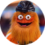
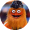

# UserImage

**Component · 12 variants** · Menus and Parts · source: WordPress Elements ▸ Menus and Parts

## Figma references

- File: WordPress Elements (`b1iZxkFwtAYq9rElmnCAzd`) · Page: Menus and Parts · Frame path: Frame 12800 ▸ Frame 416 ▸ Frame 11820 ▸ Frame 12776 ▸ Frame 12636 ▸ User Status ▸ Frame 12757 ▸ Frame 12691
- Main: [UserImage](https://www.figma.com/design/b1iZxkFwtAYq9rElmnCAzd/?node-id=456-5708) · node `456:5708` · key `72a3f7d5c88a366288aae1b0835999779027f8ea`

| Variant | Node | Key | Size | Preview |
|---|---|---|---|---|
| Size=large, Graphic=social | [456:5711](https://www.figma.com/design/b1iZxkFwtAYq9rElmnCAzd/?node-id=456-5711) | 3d72385abd858df72d16d097eeb024040b40988a | 64×64 |  |
| Size=large, Graphic=socialPhillip | [456:5713](https://www.figma.com/design/b1iZxkFwtAYq9rElmnCAzd/?node-id=456-5713) | a6bcb077278e5e84f82dfa5a315929957a4ceaf7 | 64×64 |  |
| Size=large, Graphic=unknown | [712:1495](https://www.figma.com/design/b1iZxkFwtAYq9rElmnCAzd/?node-id=712-1495) | d19aea8c4f9a9e53a38f9d7101acec361fd11111 | 64×64 |  |
| Size=large, Graphic=monogram | [456:5720](https://www.figma.com/design/b1iZxkFwtAYq9rElmnCAzd/?node-id=456-5720) | d9adf6f30bd1911f0cdda61c0d434b6fc1597ea2 | 64×64 |  |
| Size=large, Graphic=monogramPP | [456:5722](https://www.figma.com/design/b1iZxkFwtAYq9rElmnCAzd/?node-id=456-5722) | e1ce7d77cda0bff43d673ed99f5c4267ae38d152 | 64×64 |  |
| Size=medium, Graphic=social | [712:6288](https://www.figma.com/design/b1iZxkFwtAYq9rElmnCAzd/?node-id=712-6288) | b14bada0bf1b5b79c412988fa8663fd6d115586c | 40×40 |  |
| Size=medium, Graphic=socialPhillip | [712:6290](https://www.figma.com/design/b1iZxkFwtAYq9rElmnCAzd/?node-id=712-6290) | 369c3a59d2951205487726145bf1cc5b97517dbf | 40×40 |  |
| Size=medium, Graphic=unknown | [712:6283](https://www.figma.com/design/b1iZxkFwtAYq9rElmnCAzd/?node-id=712-6283) | 9034bd15d9c7e5085cd2493565afcdabe3f61ef5 | 40×40 |  |
| Size=medium, Graphic=monogram | [712:6286](https://www.figma.com/design/b1iZxkFwtAYq9rElmnCAzd/?node-id=712-6286) | 805ed4279fee9fdc5fbe8410498653f7c98ce561 | 40×40 |  |
| Size=small, Graphic=social | [456:5709](https://www.figma.com/design/b1iZxkFwtAYq9rElmnCAzd/?node-id=456-5709) | f8c7fd8cc75dc89eaac2484152c42ae5f5cfd5b4 | 30×30 |  |
| Size=small, Graphic=unknown | [456:5715](https://www.figma.com/design/b1iZxkFwtAYq9rElmnCAzd/?node-id=456-5715) | 12267cca8a9aacae278147bf2ecc80af0533e85e | 30×30 |  |
| Size=small, Graphic=monogram | [456:5718](https://www.figma.com/design/b1iZxkFwtAYq9rElmnCAzd/?node-id=456-5718) | b402979335b263158f2f12397d47a4c6e7176220 | 30×30 |  |

## Properties

| Property | Type | Default | Options |
|---|---|---|---|
| Size | VARIANT | small | small, large, medium |
| Graphic | VARIANT | unknown | unknown, monogram, monogramPP, social, socialPhillip |

## Where it is used

- **Size=large, Graphic=social** — breakpoints: —; nested inside: UserPic / Size=Large, Status=Active ×1, UserPic / Size=Large, Status=Default ×1
- **Size=large, Graphic=socialPhillip** — breakpoints: —; no instances in this file
- **Size=large, Graphic=unknown** — breakpoints: —; no instances in this file
- **Size=large, Graphic=monogram** — breakpoints: —; no instances in this file
- **Size=large, Graphic=monogramPP** — breakpoints: —; no instances in this file
- **Size=medium, Graphic=social** — breakpoints: —; nested inside: UserPic / Size=Medium, Status=Active ×1, UserPic / Size=Medium, Status=Default ×1
- **Size=medium, Graphic=socialPhillip** — breakpoints: —; no instances in this file
- **Size=medium, Graphic=unknown** — breakpoints: —; no instances in this file
- **Size=medium, Graphic=monogram** — breakpoints: —; no instances in this file
- **Size=small, Graphic=social** — breakpoints: —; nested inside: UserPic / Size=Small, Status=Default ×1, UserPic / Size=Small, Status=Active ×1
- **Size=small, Graphic=unknown** — breakpoints: —; no instances in this file
- **Size=small, Graphic=monogram** — breakpoints: —; no instances in this file

## Breakpoints

| Key | Viewport | Variant(s) |
|---|---|---|
| — | not placed in any homepage template | — |

## Responsive rules

- Size=large, Graphic=social: 64×64, horizontal gap 0 pad 0/0/0/0 main CENTER cross CENTER — no breakpoint (not placed in a template)
- Size=large, Graphic=socialPhillip: 64×64, horizontal gap 0 pad 0/0/0/0 main CENTER cross CENTER — no breakpoint (not placed in a template)
- Size=large, Graphic=unknown: 64×64, horizontal gap 0 pad 0/0/0/0 main CENTER cross CENTER — no breakpoint (not placed in a template)
- Size=large, Graphic=monogram: 64×64, horizontal gap 0 pad 0/0/0/0 main CENTER cross CENTER — no breakpoint (not placed in a template)
- Size=large, Graphic=monogramPP: 64×64, horizontal gap 0 pad 0/0/0/0 main CENTER cross CENTER — no breakpoint (not placed in a template)
- Size=medium, Graphic=social: 40×40, horizontal gap 0 pad 0/0/0/0 main CENTER cross CENTER — no breakpoint (not placed in a template)
- Size=medium, Graphic=socialPhillip: 40×40, horizontal gap 0 pad 0/0/0/0 main CENTER cross CENTER — no breakpoint (not placed in a template)
- Size=medium, Graphic=unknown: 40×40, horizontal gap 0 pad 0/0/0/0 main CENTER cross CENTER — no breakpoint (not placed in a template)
- Size=medium, Graphic=monogram: 40×40, horizontal gap 0 pad 0/0/0/0 main CENTER cross CENTER — no breakpoint (not placed in a template)
- Size=small, Graphic=social: 30×30, horizontal gap 0 pad 0/0/0/0 main CENTER cross CENTER — no breakpoint (not placed in a template)
- Size=small, Graphic=unknown: 30×30, horizontal gap 0 pad 0/0/0/0 main CENTER cross CENTER — no breakpoint (not placed in a template)
- Size=small, Graphic=monogram: 30×30, horizontal gap 0 pad 0/0/0/0 main CENTER cross CENTER — no breakpoint (not placed in a template)

## Dependencies

**Built from:**

- Icons ×1 _(not in this export)_

**Built into:**

- [UserPic](../../assemblies/39-userpic/userpic.md)

## Anatomy

**Size=large, Graphic=social**

```
- Size=large, Graphic=social — component 64×64 [horizontal gap 0] (fixed/fixed)
  - gritty 1 — rectangle 64×64 (fill/fill)
```

**Size=large, Graphic=socialPhillip**

```
- Size=large, Graphic=socialPhillip — component 64×64 [horizontal gap 0] (fixed/fixed)
  - phillie-phanatic-philadelphia-phillies — rectangle 64×64 (fill/fill)
```

**Size=large, Graphic=unknown**

```
- Size=large, Graphic=unknown — component 64×64 [horizontal gap 0] (fixed/fixed)
  - Icons — instance 24×24 [horizontal gap 8] (fixed/fixed) → Icons [Name=user]
```

**Size=large, Graphic=monogram**

```
- Size=large, Graphic=monogram — component 64×64 [horizontal gap 0] (fixed/fixed)
  - Initials — text 64×19 (fill/fixed) "GM"
```

**Size=large, Graphic=monogramPP**

```
- Size=large, Graphic=monogramPP — component 64×64 [horizontal gap 0] (fixed/fixed)
  - Initials — text 64×19 (fill/fixed) "PP"
```

**Size=medium, Graphic=social**

```
- Size=medium, Graphic=social — component 40×40 [horizontal gap 0] (fixed/fixed)
  - gritty 1 — rectangle 40×40 (fill/fixed)
```

**Size=medium, Graphic=socialPhillip**

```
- Size=medium, Graphic=socialPhillip — component 40×40 [horizontal gap 0] (fixed/fixed)
  - phillie-phanatic-philadelphia-phillies — rectangle 40×40 (fill/fill)
```

**Size=medium, Graphic=unknown**

```
- Size=medium, Graphic=unknown — component 40×40 [horizontal gap 0] (fixed/fixed)
  - Icons — instance 24×24 [horizontal gap 8] (fixed/fixed) → Icons [Name=user]
```

**Size=medium, Graphic=monogram**

```
- Size=medium, Graphic=monogram — component 40×40 [horizontal gap 0] (fixed/fixed)
  - Initials — text 40×19 (fill/fixed) "GM"
```

**Size=small, Graphic=social**

```
- Size=small, Graphic=social — component 30×30 [horizontal gap 0] (fixed/fixed)
  - gritty 1 — rectangle 30×30 (fill/fixed)
```

**Size=small, Graphic=unknown**

```
- Size=small, Graphic=unknown — component 30×30 [horizontal gap 0] (fixed/fixed)
  - Icons — instance 16×16 [horizontal gap 8] (fixed/fixed) → Icons [Name=user]
```

**Size=small, Graphic=monogram**

```
- Size=small, Graphic=monogram — component 30×30 [horizontal gap 0] (fixed/fixed)
  - Initials — text 30×19 (fill/fixed) "GM"
```

## Size & layout

| Variant | Size | Width | Height | Auto-layout | Radius | Clip |
|---|---|---|---|---|---|---|
| Size=large, Graphic=social | 64×64 | FIXED | FIXED | horizontal gap 0 pad 0/0/0/0 main CENTER cross CENTER | 80 | yes |
| Size=large, Graphic=socialPhillip | 64×64 | FIXED | FIXED | horizontal gap 0 pad 0/0/0/0 main CENTER cross CENTER | 80 | yes |
| Size=large, Graphic=unknown | 64×64 | FIXED | FIXED | horizontal gap 0 pad 0/0/0/0 main CENTER cross CENTER | 80 | yes |
| Size=large, Graphic=monogram | 64×64 | FIXED | FIXED | horizontal gap 0 pad 0/0/0/0 main CENTER cross CENTER | 80 | yes |
| Size=large, Graphic=monogramPP | 64×64 | FIXED | FIXED | horizontal gap 0 pad 0/0/0/0 main CENTER cross CENTER | 80 | yes |
| Size=medium, Graphic=social | 40×40 | FIXED | FIXED | horizontal gap 0 pad 0/0/0/0 main CENTER cross CENTER | 80 | yes |
| Size=medium, Graphic=socialPhillip | 40×40 | FIXED | FIXED | horizontal gap 0 pad 0/0/0/0 main CENTER cross CENTER | 80 | yes |
| Size=medium, Graphic=unknown | 40×40 | FIXED | FIXED | horizontal gap 0 pad 0/0/0/0 main CENTER cross CENTER | 80 | yes |
| Size=medium, Graphic=monogram | 40×40 | FIXED | FIXED | horizontal gap 0 pad 0/0/0/0 main CENTER cross CENTER | 80 | yes |
| Size=small, Graphic=social | 30×30 | FIXED | FIXED | horizontal gap 0 pad 0/0/0/0 main CENTER cross CENTER | 80 | yes |
| Size=small, Graphic=unknown | 30×30 | FIXED | FIXED | horizontal gap 0 pad 0/0/0/0 main CENTER cross CENTER | 80 | yes |
| Size=small, Graphic=monogram | 30×30 | FIXED | FIXED | horizontal gap 0 pad 0/0/0/0 main CENTER cross CENTER | 80 | yes |

## Typography

| Layer | Font | Weight | Size | Line height | Letter sp. | Case | Color | Color token | Type token | Truncate | Sample | Variants |
|---|---|---|---|---|---|---|---|---|---|---|---|---|
| Initials | Noto Sans | Regular | 27 | auto |  |  | #141414 | Colors/color/gray/min | font/family/noto-sans |  | GM | Size=large, Graphic=monogram, Size=large, Graphic=monogramPP |
| Initials | Noto Sans | Regular | 22 | auto |  |  | #141414 | Colors/color/gray/min | font/family/noto-sans |  | GM | Size=medium, Graphic=monogram |
| Initials | Noto Sans | Regular | 12 | auto |  |  | #141414 | Colors/color/gray/min | font/size/12 |  | GM | Size=small, Graphic=monogram |

## Color & effects

| Layer | Role | Type | Hex | Token | Opacity | Note |
|---|---|---|---|---|---|---|
| Size=large, Graphic=unknown | fill | SOLID | #FFFFFF | Colors/color/gray/max |  |  |
| Size=large, Graphic=monogram | fill | SOLID | #FF702C |  |  |  |
| Size=large, Graphic=monogramPP | fill | SOLID | #2E8000 | Colors/color/feedback/low-success |  |  |
| Size=medium, Graphic=unknown | fill | SOLID | #FFFFFF | Colors/color/gray/max |  |  |
| Size=medium, Graphic=monogram | fill | SOLID | #FF702C |  |  |  |
| Size=small, Graphic=unknown | fill | SOLID | #FFFFFF | Colors/color/gray/max |  |  |
| Size=small, Graphic=monogram | fill | SOLID | #FF702C |  |  |  |

## Image ratios

_None._

## Ad slots

_None._

## Production references

_None found in descriptions or layer names._

## Known issues

- 9 of 12 variants have no instances anywhere in WordPress Elements (unused, or used only from another file): `Size=large, Graphic=socialPhillip`, `Size=large, Graphic=unknown`, `Size=large, Graphic=monogram`, `Size=large, Graphic=monogramPP`, `Size=medium, Graphic=socialPhillip`, `Size=medium, Graphic=unknown`, `Size=medium, Graphic=monogram`, `Size=small, Graphic=unknown`, `Size=small, Graphic=monogram`.
- 3 solid paints are hard-coded (not bound to a color variable): #FF702C ×3.

## Rendering steps

1. Pick the variant for the target breakpoint from the Breakpoints table (property values in `userimage.json` → `variants[].variantProperties`).
2. Start from `userimage.html` — each `<section>` is one variant; auto-layout is already mapped to flexbox and colors use `tokens.css` variables.
3. Replace every dashed `data-component` box with the referenced component's own skeleton (links under Dependencies); leave `data-component` on the wrapper.
4. Fill image slots at the ratio listed in Image ratios; fill text using the Typography table (truncate where a line clamp is listed).
5. Check against the preview PNG, then against the production references.
